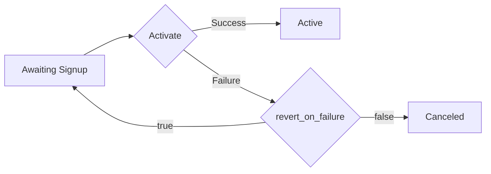

# Reference

> Source: [MaxioAdvancedBillingClient](MaxioAdvancedBillingClient.cs)

## ApiExports

> Source: [ApiExports](Api/ApiExports.cs)

<details>
<summary><code>Task&lt;BatchJobResponse&gt; ExportInvoices(CancellationToken ct = default);</code></summary>

<dl>
<dd>

### Description

<dl>
<dd>

Creates an invoices export and returns a batch job object.

</dd>
</dl>

### Usage

<dl>
<dd>

```csharp
try
{
    var response = await client.ApiExports.ExportInvoices();
    // TODO: Handle 'response' of type BatchJobResponse
}
catch (SdkException<ExportInvoicesError> ex)
{
    if (ex.Error.TryGetError(out var error))
    {
        // TODO: Handle 'error' of type ExportInvoicesError
    }
}
```

</dd>
</dl>

### Response

<dl>
<dd>

**OnSuccess**: <code>[BatchJobResponse](Models/BatchJobResponse.cs)</code>

**OnError**: <code>[SdkException](Core/Exceptions/SdkException.cs)&lt;[ExportInvoicesError](Errors/ExportInvoicesError.cs)&gt;</code>

</dd>
</dl>

</dd>
</dl>

</details>

<details>
<summary><code>Task&lt;BatchJobResponse&gt; ExportProformaInvoices(CancellationToken ct = default);</code></summary>

<dl>
<dd>

### Description

<dl>
<dd>

Creates a proforma invoices export and returns a batch job object.

It is only available for Relationship Invoicing architecture.

</dd>
</dl>

### Usage

<dl>
<dd>

```csharp
try
{
    var response = await client.ApiExports.ExportProformaInvoices();
    // TODO: Handle 'response' of type BatchJobResponse
}
catch (SdkException<ExportProformaInvoicesError> ex)
{
    if (ex.Error.TryGetError(out var error))
    {
        // TODO: Handle 'error' of type ExportProformaInvoicesError
    }
}
```

</dd>
</dl>

### Response

<dl>
<dd>

**OnSuccess**: <code>[BatchJobResponse](Models/BatchJobResponse.cs)</code>

**OnError**: <code>[SdkException](Core/Exceptions/SdkException.cs)&lt;[ExportProformaInvoicesError](Errors/ExportProformaInvoicesError.cs)&gt;</code>

</dd>
</dl>

</dd>
</dl>

</details>

<details>
<summary><code>Task&lt;BatchJobResponse&gt; ExportSubscriptions(CancellationToken ct = default);</code></summary>

<dl>
<dd>

### Description

<dl>
<dd>

Creates a subscriptions export and returns a batch job object.

</dd>
</dl>

### Usage

<dl>
<dd>

```csharp
try
{
    var response = await client.ApiExports.ExportSubscriptions();
    // TODO: Handle 'response' of type BatchJobResponse
}
catch (SdkException<ExportSubscriptionsError> ex)
{
    if (ex.Error.TryGetError(out var error))
    {
        // TODO: Handle 'error' of type ExportSubscriptionsError
    }
}
```

</dd>
</dl>

### Response

<dl>
<dd>

**OnSuccess**: <code>[BatchJobResponse](Models/BatchJobResponse.cs)</code>

**OnError**: <code>[SdkException](Core/Exceptions/SdkException.cs)&lt;[ExportSubscriptionsError](Errors/ExportSubscriptionsError.cs)&gt;</code>

</dd>
</dl>

</dd>
</dl>

</details>

<details>
<summary><code>Task&lt;IReadOnlyList&lt;Invoice&gt;&gt; ListExportedInvoices(string batchId, int? perPage = 100, int? page = 1, CancellationToken ct = default);</code></summary>

<dl>
<dd>

### Description

<dl>
<dd>

Lists exported invoices for a provided `batch_id`. Use pagination to control responses returned from the server.

Example: `GET https://{subdomain}.chargify.com/api_exports/invoices/123/rows?per_page=10000&page=1`.

</dd>
</dl>

### Usage

<dl>
<dd>

```csharp
try
{
    var response = await client.ApiExports.ListExportedInvoices(batchId);
    // TODO: Handle 'response' of type IReadOnlyList<Invoice>
}
catch (SdkException<ListExportedInvoicesError> ex)
{
    if (ex.Error.TryGetError(out var error))
    {
        // TODO: Handle 'error' of type ListExportedInvoicesError
    }
}
```

</dd>
</dl>

### Parameters

<dl>
<dd>

| Name | Type | Description |
| --- | --- | --- |
| <code>batchId</code> | <code>string</code> | Id of a Batch Job. |
| <code>perPage</code> | <code>int?</code> | This parameter indicates how many records to fetch in each request. <br>Default value is 100. <br>The maximum allowed values is 10000; any per_page value over 10000 will be changed to 10000.<br>**Default**: 100 |
| <code>page</code> | <code>int?</code> | Result records are organized in pages. By default, the first page of results is displayed. The page parameter specifies a page number of results to fetch. You can start navigating through the pages to consume the results. You do this by passing in a page parameter. Retrieve the next page by adding ?page=2 to the query string. If there are no results to return, then an empty result set will be returned.<br>Use in query `page=1`.<br>**Default**: 1 |

</dd>
</dl>

### Response

<dl>
<dd>

**OnSuccess**: <code>IReadOnlyList&lt;[Invoice](Models/Invoice.cs)&gt;</code>

**OnError**: <code>[SdkException](Core/Exceptions/SdkException.cs)&lt;[ListExportedInvoicesError](Errors/ListExportedInvoicesError.cs)&gt;</code>

</dd>
</dl>

</dd>
</dl>

</details>

<details>
<summary><code>Task&lt;IReadOnlyList&lt;ProformaInvoice&gt;&gt; ListExportedProformaInvoices(string batchId, int? perPage = 100, int? page = 1, CancellationToken ct = default);</code></summary>

<dl>
<dd>

### Description

<dl>
<dd>

Lists exported proforma invoices for a provided `batch_id`. Use pagination to control responses returned from the server.

Example: `GET https://{subdomain}.chargify.com/api_exports/proforma_invoices/123/rows?per_page=10000&page=1`.

</dd>
</dl>

### Usage

<dl>
<dd>

```csharp
try
{
    var response = await client.ApiExports.ListExportedProformaInvoices(batchId);
    // TODO: Handle 'response' of type IReadOnlyList<ProformaInvoice>
}
catch (SdkException<ListExportedProformaInvoicesError> ex)
{
    if (ex.Error.TryGetError(out var error))
    {
        // TODO: Handle 'error' of type ListExportedProformaInvoicesError
    }
}
```

</dd>
</dl>

### Parameters

<dl>
<dd>

| Name | Type | Description |
| --- | --- | --- |
| <code>batchId</code> | <code>string</code> | Id of a Batch Job. |
| <code>perPage</code> | <code>int?</code> | This parameter indicates how many records to fetch in each request. <br>Default value is 100. <br>The maximum allowed values is 10000; any per_page value over 10000 will be changed to 10000.<br>**Default**: 100 |
| <code>page</code> | <code>int?</code> | Result records are organized in pages. By default, the first page of results is displayed. The page parameter specifies a page number of results to fetch. You can start navigating through the pages to consume the results. You do this by passing in a page parameter. Retrieve the next page by adding ?page=2 to the query string. If there are no results to return, then an empty result set will be returned.<br>Use in query `page=1`.<br>**Default**: 1 |

</dd>
</dl>

### Response

<dl>
<dd>

**OnSuccess**: <code>IReadOnlyList&lt;[ProformaInvoice](Models/ProformaInvoice.cs)&gt;</code>

**OnError**: <code>[SdkException](Core/Exceptions/SdkException.cs)&lt;[ListExportedProformaInvoicesError](Errors/ListExportedProformaInvoicesError.cs)&gt;</code>

</dd>
</dl>

</dd>
</dl>

</details>

<details>
<summary><code>Task&lt;IReadOnlyList&lt;Subscription&gt;&gt; ListExportedSubscriptions(string batchId, int? perPage = 100, int? page = 1, CancellationToken ct = default);</code></summary>

<dl>
<dd>

### Description

<dl>
<dd>

Lists exported subscriptions for a provided `batch_id`. Use pagination to control responses returned from the server.

Example: `GET https://{subdomain}.chargify.com/api_exports/subscriptions/123/rows?per_page=200&page=1`.

</dd>
</dl>

### Usage

<dl>
<dd>

```csharp
try
{
    var response = await client.ApiExports.ListExportedSubscriptions(batchId);
    // TODO: Handle 'response' of type IReadOnlyList<Subscription>
}
catch (SdkException<ListExportedSubscriptionsError> ex)
{
    if (ex.Error.TryGetError(out var error))
    {
        // TODO: Handle 'error' of type ListExportedSubscriptionsError
    }
}
```

</dd>
</dl>

### Parameters

<dl>
<dd>

| Name | Type | Description |
| --- | --- | --- |
| <code>batchId</code> | <code>string</code> | Id of a Batch Job. |
| <code>perPage</code> | <code>int?</code> | This parameter indicates how many records to fetch in each request. <br>Default value is 100. <br>The maximum allowed values is 10000; any per_page value over 10000 will be changed to 10000.<br>**Default**: 100 |
| <code>page</code> | <code>int?</code> | Result records are organized in pages. By default, the first page of results is displayed. The page parameter specifies a page number of results to fetch. You can start navigating through the pages to consume the results. You do this by passing in a page parameter. Retrieve the next page by adding ?page=2 to the query string. If there are no results to return, then an empty result set will be returned.<br>Use in query `page=1`.<br>**Default**: 1 |

</dd>
</dl>

### Response

<dl>
<dd>

**OnSuccess**: <code>IReadOnlyList&lt;[Subscription](Models/Subscription.cs)&gt;</code>

**OnError**: <code>[SdkException](Core/Exceptions/SdkException.cs)&lt;[ListExportedSubscriptionsError](Errors/ListExportedSubscriptionsError.cs)&gt;</code>

</dd>
</dl>

</dd>
</dl>

</details>

<details>
<summary><code>Task&lt;BatchJobResponse&gt; ReadInvoicesExport(string batchId, CancellationToken ct = default);</code></summary>

<dl>
<dd>

### Description

<dl>
<dd>

Returns a batch job object for an invoices export.

</dd>
</dl>

### Usage

<dl>
<dd>

```csharp
try
{
    var response = await client.ApiExports.ReadInvoicesExport(batchId);
    // TODO: Handle 'response' of type BatchJobResponse
}
catch (SdkException<ReadInvoicesExportError> ex)
{
    if (ex.Error.TryGetError(out var error))
    {
        // TODO: Handle 'error' of type ReadInvoicesExportError
    }
}
```

</dd>
</dl>

### Parameters

<dl>
<dd>

| Name | Type | Description |
| --- | --- | --- |
| <code>batchId</code> | <code>string</code> | Id of a Batch Job. |

</dd>
</dl>

### Response

<dl>
<dd>

**OnSuccess**: <code>[BatchJobResponse](Models/BatchJobResponse.cs)</code>

**OnError**: <code>[SdkException](Core/Exceptions/SdkException.cs)&lt;[ReadInvoicesExportError](Errors/ReadInvoicesExportError.cs)&gt;</code>

</dd>
</dl>

</dd>
</dl>

</details>

<details>
<summary><code>Task&lt;BatchJobResponse&gt; ReadProformaInvoicesExport(string batchId, CancellationToken ct = default);</code></summary>

<dl>
<dd>

### Description

<dl>
<dd>

Returns a batch job object for a proforma invoices export.

</dd>
</dl>

### Usage

<dl>
<dd>

```csharp
try
{
    var response = await client.ApiExports.ReadProformaInvoicesExport(batchId);
    // TODO: Handle 'response' of type BatchJobResponse
}
catch (SdkException<ReadProformaInvoicesExportError> ex)
{
    if (ex.Error.TryGetError(out var error))
    {
        // TODO: Handle 'error' of type ReadProformaInvoicesExportError
    }
}
```

</dd>
</dl>

### Parameters

<dl>
<dd>

| Name | Type | Description |
| --- | --- | --- |
| <code>batchId</code> | <code>string</code> | Id of a Batch Job. |

</dd>
</dl>

### Response

<dl>
<dd>

**OnSuccess**: <code>[BatchJobResponse](Models/BatchJobResponse.cs)</code>

**OnError**: <code>[SdkException](Core/Exceptions/SdkException.cs)&lt;[ReadProformaInvoicesExportError](Errors/ReadProformaInvoicesExportError.cs)&gt;</code>

</dd>
</dl>

</dd>
</dl>

</details>

<details>
<summary><code>Task&lt;BatchJobResponse&gt; ReadSubscriptionsExport(string batchId, CancellationToken ct = default);</code></summary>

<dl>
<dd>

### Description

<dl>
<dd>

Returns a batch job object for a subscriptions export.

</dd>
</dl>

### Usage

<dl>
<dd>

```csharp
try
{
    var response = await client.ApiExports.ReadSubscriptionsExport(batchId);
    // TODO: Handle 'response' of type BatchJobResponse
}
catch (SdkException<ReadSubscriptionsExportError> ex)
{
    if (ex.Error.TryGetError(out var error))
    {
        // TODO: Handle 'error' of type ReadSubscriptionsExportError
    }
}
```

</dd>
</dl>

### Parameters

<dl>
<dd>

| Name | Type | Description |
| --- | --- | --- |
| <code>batchId</code> | <code>string</code> | Id of a Batch Job. |

</dd>
</dl>

### Response

<dl>
<dd>

**OnSuccess**: <code>[BatchJobResponse](Models/BatchJobResponse.cs)</code>

**OnError**: <code>[SdkException](Core/Exceptions/SdkException.cs)&lt;[ReadSubscriptionsExportError](Errors/ReadSubscriptionsExportError.cs)&gt;</code>

</dd>
</dl>

</dd>
</dl>

</details>

## AdvanceInvoice

> Source: [AdvanceInvoice](Api/AdvanceInvoice.cs)

<details>
<summary><code>Task&lt;Invoice&gt; IssueAdvanceInvoice(int subscriptionId, IssueAdvanceInvoiceRequest? body, CancellationToken ct = default);</code></summary>

<dl>
<dd>

### Description

<dl>
<dd>

Generate an invoice in advance for a subscription's next renewal date. [See our docs](https://maxio.zendesk.com/hc/en-us/articles/24252026404749-Issue-Invoice-In-Advance) for more information on advance invoices, including eligibility for generating one; for the most part, they function like any other invoice, except they are issued early and have special behavior upon being voided.
A subscription may only have one advance invoice per billing period. Attempting to issue an advance invoice when one already exists will return an error.
That said, regeneration of the invoice may be forced with the params `force: true`, which will void an advance invoice if one exists and generate a new one. If no advance invoice exists, a new one will be generated.
We recommend using either the create or preview endpoints for proforma invoices to preview this advance invoice before using this endpoint to generate it.


</dd>
</dl>

### Usage

<dl>
<dd>

```csharp
try
{
    var response = await client.AdvanceInvoice.IssueAdvanceInvoice(subscriptionId, body);
    // TODO: Handle 'response' of type Invoice
}
catch (SdkException<IssueAdvanceInvoiceError> ex)
{
    if (ex.Error.TryGetError(out var error))
    {
        // TODO: Handle 'error' of type IssueAdvanceInvoiceError
    }
}
```

</dd>
</dl>

### Parameters

<dl>
<dd>

| Name | Type | Description |
| --- | --- | --- |
| <code>subscriptionId</code> | <code>int</code> | The Chargify id of the subscription. |
| <code>body</code> | <code>[IssueAdvanceInvoiceRequest?](Models/IssueAdvanceInvoiceRequest.cs)</code> | - |

</dd>
</dl>

### Response

<dl>
<dd>

**OnSuccess**: <code>[Invoice](Models/Invoice.cs)</code>

**OnError**: <code>[SdkException](Core/Exceptions/SdkException.cs)&lt;[IssueAdvanceInvoiceError](Errors/IssueAdvanceInvoiceError.cs)&gt;</code>

</dd>
</dl>

</dd>
</dl>

</details>

<details>
<summary><code>Task&lt;Invoice&gt; ReadAdvanceInvoice(int subscriptionId, CancellationToken ct = default);</code></summary>

<dl>
<dd>

### Description

<dl>
<dd>

Returns the advance invoice generated for a subscription's upcoming renewal. There can only be one advance invoice per subscription per billing cycle.

</dd>
</dl>

### Usage

<dl>
<dd>

```csharp
try
{
    var response = await client.AdvanceInvoice.ReadAdvanceInvoice(subscriptionId);
    // TODO: Handle 'response' of type Invoice
}
catch (SdkException<ReadAdvanceInvoiceError> ex)
{
    if (ex.Error.TryGetError(out var error))
    {
        // TODO: Handle 'error' of type ReadAdvanceInvoiceError
    }
}
```

</dd>
</dl>

### Parameters

<dl>
<dd>

| Name | Type | Description |
| --- | --- | --- |
| <code>subscriptionId</code> | <code>int</code> | The Chargify id of the subscription. |

</dd>
</dl>

### Response

<dl>
<dd>

**OnSuccess**: <code>[Invoice](Models/Invoice.cs)</code>

**OnError**: <code>[SdkException](Core/Exceptions/SdkException.cs)&lt;[ReadAdvanceInvoiceError](Errors/ReadAdvanceInvoiceError.cs)&gt;</code>

</dd>
</dl>

</dd>
</dl>

</details>

<details>
<summary><code>Task&lt;Invoice&gt; VoidAdvanceInvoice(int subscriptionId, VoidInvoiceRequest? body, CancellationToken ct = default);</code></summary>

<dl>
<dd>

### Description

<dl>
<dd>

Void a subscription's existing advance invoice. Once voided, it can later be regenerated if desired.
A `reason` is required in order to void, and the invoice must have an open status. Voiding will cause any prepayments and credits that were applied to the invoice to be returned to the subscription. For a full overview of the impact of voiding, [see our help docs]($m/Invoice).

</dd>
</dl>

### Usage

<dl>
<dd>

```csharp
try
{
    var response = await client.AdvanceInvoice.VoidAdvanceInvoice(subscriptionId, body);
    // TODO: Handle 'response' of type Invoice
}
catch (SdkException<VoidAdvanceInvoiceError> ex)
{
    if (ex.Error.TryGetError(out var error))
    {
        // TODO: Handle 'error' of type VoidAdvanceInvoiceError
    }
}
```

</dd>
</dl>

### Parameters

<dl>
<dd>

| Name | Type | Description |
| --- | --- | --- |
| <code>subscriptionId</code> | <code>int</code> | The Chargify id of the subscription. |
| <code>body</code> | <code>[VoidInvoiceRequest?](Models/VoidInvoiceRequest.cs)</code> | - |

</dd>
</dl>

### Response

<dl>
<dd>

**OnSuccess**: <code>[Invoice](Models/Invoice.cs)</code>

**OnError**: <code>[SdkException](Core/Exceptions/SdkException.cs)&lt;[VoidAdvanceInvoiceError](Errors/VoidAdvanceInvoiceError.cs)&gt;</code>

</dd>
</dl>

</dd>
</dl>

</details>

## BillingPortal

> Source: [BillingPortal](Api/BillingPortal.cs)

<details>
<summary><code>Task&lt;CustomerResponse&gt; EnableBillingPortalForCustomer(int customerId, AutoInvite? autoInvite, CancellationToken ct = default);</code></summary>

<dl>
<dd>

### Description

<dl>
<dd>

Enables Billing Portal access for a customer, with an option to send an invitation email at the same time.

## Billing Portal Documentation

Full documentation on how the Billing Portal operates within the Advanced Billing UI can be located [here](https://maxio.zendesk.com/hc/en-us/articles/24252412965133-Billing-Portal-Overview).

This documentation is focused on how to configure the Billing Portal Settings, as well as Subscriber Interaction and Merchant Management of the Billing Portal.

You can use this endpoint to enable Billing Portal access for a Customer, with the option of sending the Customer an Invitation email at the same time.

## Billing Portal Security

If your customer has been invited to the Billing Portal, then they will receive a link to manage their subscription (the “Management URL”) automatically at the bottom of their statements, invoices, and receipts. **This link changes periodically for security and is only valid for 65 days.**

If you need to provide your customer their Management URL through other means, you can retrieve it via the API. Because the URL is cryptographically signed with a timestamp, it is not possible for merchants to generate the URL without requesting it from Advanced Billing.

In order to prevent abuse & overuse, we ask that you request a new URL only when absolutely necessary. Management URLs are good for 65 days, so you should re-use a previously generated one as much as possible. If you use the URL frequently (such as to display on your website), **do not** make an API request to Advanced Billing every time.

</dd>
</dl>

### Usage

<dl>
<dd>

```csharp
try
{
    var response = await client.BillingPortal.EnableBillingPortalForCustomer(customerId, autoInvite);
    // TODO: Handle 'response' of type CustomerResponse
}
catch (SdkException<EnableBillingPortalForCustomerError> ex)
{
    if (ex.Error.TryGetError(out var error))
    {
        // TODO: Handle 'error' of type EnableBillingPortalForCustomerError
    }
}
```

</dd>
</dl>

### Parameters

<dl>
<dd>

| Name | Type | Description |
| --- | --- | --- |
| <code>customerId</code> | <code>int</code> | The Chargify id of the customer |
| <code>autoInvite</code> | <code>[AutoInvite?](Models/Enums/AutoInvite.cs)</code> | When set to 1, an Invitation email will be sent to the Customer.<br>When set to 0, or not sent, an email will not be sent.<br>Use in query: `auto_invite=1`. |

</dd>
</dl>

### Response

<dl>
<dd>

**OnSuccess**: <code>[CustomerResponse](Models/CustomerResponse.cs)</code>

**OnError**: <code>[SdkException](Core/Exceptions/SdkException.cs)&lt;[EnableBillingPortalForCustomerError](Errors/EnableBillingPortalForCustomerError.cs)&gt;</code>

</dd>
</dl>

</dd>
</dl>

</details>

<details>
<summary><code>Task&lt;PortalManagementLink&gt; ReadBillingPortalLink(int customerId, CancellationToken ct = default);</code></summary>

<dl>
<dd>

### Description

<dl>
<dd>

Returns the exact URL required for a subscriber to access the Billing Portal.

## Rules for Management Link API

+ When retrieving a management URL, multiple requests for the same customer in a short period will return the **same** URL
+ We will not generate a new URL for 15 days
+ You must cache and remember this URL if you are going to need it again within 15 days
+ Only request a new URL after the `new_link_available_at` date
+ You are limited to 15 requests for the same URL. If you make more than 15 requests before `new_link_available_at`, you will be blocked from further Management URL requests (with a response code `429`)

</dd>
</dl>

### Usage

<dl>
<dd>

```csharp
try
{
    var response = await client.BillingPortal.ReadBillingPortalLink(customerId);
    // TODO: Handle 'response' of type PortalManagementLink
}
catch (SdkException<ReadBillingPortalLinkError> ex)
{
    if (ex.Error.TryGetError(out var error))
    {
        // TODO: Handle 'error' of type ReadBillingPortalLinkError
    }
}
```

</dd>
</dl>

### Parameters

<dl>
<dd>

| Name | Type | Description |
| --- | --- | --- |
| <code>customerId</code> | <code>int</code> | The Chargify id of the customer |

</dd>
</dl>

### Response

<dl>
<dd>

**OnSuccess**: <code>[PortalManagementLink](Models/PortalManagementLink.cs)</code>

**OnError**: <code>[SdkException](Core/Exceptions/SdkException.cs)&lt;[ReadBillingPortalLinkError](Errors/ReadBillingPortalLinkError.cs)&gt;</code>

</dd>
</dl>

</dd>
</dl>

</details>

<details>
<summary><code>Task&lt;ResentInvitation&gt; ResendBillingPortalInvitation(int customerId, CancellationToken ct = default);</code></summary>

<dl>
<dd>

### Description

<dl>
<dd>

Resends a customer's Billing Portal invitation.

If you attempt to resend an invitation 5 times within 30 minutes, you will receive a `422` response with an `error` message in the body.

If you attempt to resend an invitation when the Billing Portal is already disabled for a Customer, you will receive a `422` error response.

If you attempt to resend an invitation when the Customer does not exist, you will receive a `404` error response.

## Limitations

This endpoint will only return a JSON response.

</dd>
</dl>

### Usage

<dl>
<dd>

```csharp
try
{
    var response = await client.BillingPortal.ResendBillingPortalInvitation(customerId);
    // TODO: Handle 'response' of type ResentInvitation
}
catch (SdkException<ResendBillingPortalInvitationError> ex)
{
    if (ex.Error.TryGetError(out var error))
    {
        // TODO: Handle 'error' of type ResendBillingPortalInvitationError
    }
}
```

</dd>
</dl>

### Parameters

<dl>
<dd>

| Name | Type | Description |
| --- | --- | --- |
| <code>customerId</code> | <code>int</code> | The Chargify id of the customer |

</dd>
</dl>

### Response

<dl>
<dd>

**OnSuccess**: <code>[ResentInvitation](Models/ResentInvitation.cs)</code>

**OnError**: <code>[SdkException](Core/Exceptions/SdkException.cs)&lt;[ResendBillingPortalInvitationError](Errors/ResendBillingPortalInvitationError.cs)&gt;</code>

</dd>
</dl>

</dd>
</dl>

</details>

<details>
<summary><code>Task&lt;RevokedInvitation&gt; RevokeBillingPortalAccess(int customerId, CancellationToken ct = default);</code></summary>

<dl>
<dd>

### Description

<dl>
<dd>

Revokes a customer's Billing Portal invitation.

If you attempt to revoke an invitation when the Billing Portal is already disabled for a Customer, you will receive a 422 error response.

## Limitations

This endpoint will only return a JSON response.

</dd>
</dl>

### Usage

<dl>
<dd>

```csharp
try
{
    var response = await client.BillingPortal.RevokeBillingPortalAccess(customerId);
    // TODO: Handle 'response' of type RevokedInvitation
}
catch (SdkException<RawError> ex)
{
    // TODO: Handle 'ex.Error' of type RawError
}
```

</dd>
</dl>

### Parameters

<dl>
<dd>

| Name | Type | Description |
| --- | --- | --- |
| <code>customerId</code> | <code>int</code> | The Chargify id of the customer |

</dd>
</dl>

### Response

<dl>
<dd>

**OnSuccess**: <code>[RevokedInvitation](Models/RevokedInvitation.cs)</code>

**OnError**: <code>[SdkException](Core/Exceptions/SdkException.cs)&lt;[RawError](Core/ErrorResponse/RawError.cs)&gt;</code>

</dd>
</dl>

</dd>
</dl>

</details>

## ComponentPricePoints

> Source: [ComponentPricePoints](Api/ComponentPricePoints.cs)

<details>
<summary><code>Task&lt;ComponentPricePointResponse&gt; ArchiveComponentPricePoint(ComponentIdModel componentId, PricePointIdModel pricePointId, CancellationToken ct = default);</code></summary>

<dl>
<dd>

### Description

<dl>
<dd>

Archives a component price point. Subscriptions using a price point that has been archived will continue using it until they're moved to another price point.

</dd>
</dl>

### Usage

<dl>
<dd>

```csharp
try
{
    var response = await client.ComponentPricePoints.ArchiveComponentPricePoint(componentId, pricePointId);
    // TODO: Handle 'response' of type ComponentPricePointResponse
}
catch (SdkException<ArchiveComponentPricePointError> ex)
{
    if (ex.Error.TryGetError(out var error))
    {
        // TODO: Handle 'error' of type ArchiveComponentPricePointError
    }
}
```

</dd>
</dl>

### Parameters

<dl>
<dd>

| Name | Type | Description |
| --- | --- | --- |
| <code>componentId</code> | <code>[ComponentIdModel](Models/AnyOf/ComponentIdModel.cs)</code> | The id or handle of the component. When using the handle, it must be prefixed with `handle:`. Example: `123` for an integer ID, or `handle:example-product-handle` for a string handle. |
| <code>pricePointId</code> | <code>[PricePointIdModel](Models/AnyOf/PricePointIdModel.cs)</code> | The id or handle of the price point. When using the handle, it must be prefixed with `handle:`. Example: `123` for an integer ID, or `handle:example-price_point-handle` for a string handle. |

</dd>
</dl>

### Response

<dl>
<dd>

**OnSuccess**: <code>[ComponentPricePointResponse](Models/ComponentPricePointResponse.cs)</code>

**OnError**: <code>[SdkException](Core/Exceptions/SdkException.cs)&lt;[ArchiveComponentPricePointError](Errors/ArchiveComponentPricePointError.cs)&gt;</code>

</dd>
</dl>

</dd>
</dl>

</details>

<details>
<summary><code>Task&lt;ComponentPricePointsResponse&gt; BulkCreateComponentPricePoints(string componentId, CreateComponentPricePointsRequest? body, CancellationToken ct = default);</code></summary>

<dl>
<dd>

### Description

<dl>
<dd>

Creates multiple component price points in one request.

</dd>
</dl>

### Usage

<dl>
<dd>

```csharp
try
{
    var response = await client.ComponentPricePoints.BulkCreateComponentPricePoints(componentId, body);
    // TODO: Handle 'response' of type ComponentPricePointsResponse
}
catch (SdkException<BulkCreateComponentPricePointsError> ex)
{
    if (ex.Error.TryGetError(out var error))
    {
        // TODO: Handle 'error' of type BulkCreateComponentPricePointsError
    }
}
```

</dd>
</dl>

### Parameters

<dl>
<dd>

| Name | Type | Description |
| --- | --- | --- |
| <code>componentId</code> | <code>string</code> | The Advanced Billing id of the component for which you want to fetch price points. |
| <code>body</code> | <code>[CreateComponentPricePointsRequest?](Models/CreateComponentPricePointsRequest.cs)</code> | - |

</dd>
</dl>

### Response

<dl>
<dd>

**OnSuccess**: <code>[ComponentPricePointsResponse](Models/ComponentPricePointsResponse.cs)</code>

**OnError**: <code>[SdkException](Core/Exceptions/SdkException.cs)&lt;[BulkCreateComponentPricePointsError](Errors/BulkCreateComponentPricePointsError.cs)&gt;</code>

</dd>
</dl>

</dd>
</dl>

</details>

<details>
<summary><code>Task&lt;ComponentPricePointCurrencyOverageResponse&gt; CloneComponentPricePoint(ComponentIdModel componentId, PricePointIdModel pricePointId, CloneComponentPricePointRequest? body, CancellationToken ct = default);</code></summary>

<dl>
<dd>

### Description

<dl>
<dd>

Clones a component price point. Custom price points (tied to a specific subscription) cannot be cloned. The following attributes are copied from the source price point:
- Pricing scheme
- All price tiers (with starting/ending quantities and unit prices)
- Tax included setting
- Currency prices (if definitive pricing is set)
- Overage pricing (for prepaid usage components)
- Interval settings (if multi-frequency is enabled)
- Event-based billing segments (if applicable)

</dd>
</dl>

### Usage

<dl>
<dd>

```csharp
try
{
    var response = await client.ComponentPricePoints.CloneComponentPricePoint(componentId, pricePointId, body);
    // TODO: Handle 'response' of type ComponentPricePointCurrencyOverageResponse
}
catch (SdkException<CloneComponentPricePointError> ex)
{
    if (ex.Error.TryGetError(out var error))
    {
        // TODO: Handle 'error' of type CloneComponentPricePointError
    }
}
```

</dd>
</dl>

### Parameters

<dl>
<dd>

| Name | Type | Description |
| --- | --- | --- |
| <code>componentId</code> | <code>[ComponentIdModel](Models/AnyOf/ComponentIdModel.cs)</code> | The id or handle of the component. When using the handle, it must be prefixed with `handle:`. Example: `123` for an integer ID, or `handle:example-product-handle` for a string handle. |
| <code>pricePointId</code> | <code>[PricePointIdModel](Models/AnyOf/PricePointIdModel.cs)</code> | The id or handle of the price point. When using the handle, it must be prefixed with `handle:`. Example: `123` for an integer ID, or `handle:example-price_point-handle` for a string handle. |
| <code>body</code> | <code>[CloneComponentPricePointRequest?](Models/CloneComponentPricePointRequest.cs)</code> | - |

</dd>
</dl>

### Response

<dl>
<dd>

**OnSuccess**: <code>[ComponentPricePointCurrencyOverageResponse](Models/ComponentPricePointCurrencyOverageResponse.cs)</code>

**OnError**: <code>[SdkException](Core/Exceptions/SdkException.cs)&lt;[CloneComponentPricePointError](Errors/CloneComponentPricePointError.cs)&gt;</code>

</dd>
</dl>

</dd>
</dl>

</details>

<details>
<summary><code>Task&lt;ComponentPricePointResponse&gt; CreateComponentPricePoint(int componentId, CreateComponentPricePointRequest? body, CancellationToken ct = default);</code></summary>

<dl>
<dd>

### Description

<dl>
<dd>

Creates a price point for an existing component.

</dd>
</dl>

### Usage

<dl>
<dd>

```csharp
try
{
    var response = await client.ComponentPricePoints.CreateComponentPricePoint(componentId, body);
    // TODO: Handle 'response' of type ComponentPricePointResponse
}
catch (SdkException<CreateComponentPricePointError> ex)
{
    if (ex.Error.TryGetError(out var error))
    {
        // TODO: Handle 'error' of type CreateComponentPricePointError
    }
}
```

</dd>
</dl>

### Parameters

<dl>
<dd>

| Name | Type | Description |
| --- | --- | --- |
| <code>componentId</code> | <code>int</code> | The Advanced Billing id of the component |
| <code>body</code> | <code>[CreateComponentPricePointRequest?](Models/CreateComponentPricePointRequest.cs)</code> | - |

</dd>
</dl>

### Response

<dl>
<dd>

**OnSuccess**: <code>[ComponentPricePointResponse](Models/ComponentPricePointResponse.cs)</code>

**OnError**: <code>[SdkException](Core/Exceptions/SdkException.cs)&lt;[CreateComponentPricePointError](Errors/CreateComponentPricePointError.cs)&gt;</code>

</dd>
</dl>

</dd>
</dl>

</details>

<details>
<summary><code>Task&lt;ComponentCurrencyPricesResponse&gt; CreateCurrencyPrices(int pricePointId, CreateCurrencyPricesRequest? body, CancellationToken ct = default);</code></summary>

<dl>
<dd>

### Description

<dl>
<dd>

Creates currency prices for a given currency defined at the site level.

When creating currency prices, they need to mirror the structure of your primary pricing. For each price level defined on the component price point, there should be a matching price level created in the given currency.

Note: Currency Prices are not able to be created for custom price points.

</dd>
</dl>

### Usage

<dl>
<dd>

```csharp
try
{
    var response = await client.ComponentPricePoints.CreateCurrencyPrices(pricePointId, body);
    // TODO: Handle 'response' of type ComponentCurrencyPricesResponse
}
catch (SdkException<CreateCurrencyPricesError> ex)
{
    if (ex.Error.TryGetError(out var error))
    {
        // TODO: Handle 'error' of type CreateCurrencyPricesError
    }
}
```

</dd>
</dl>

### Parameters

<dl>
<dd>

| Name | Type | Description |
| --- | --- | --- |
| <code>pricePointId</code> | <code>int</code> | The Advanced Billing id of the price point |
| <code>body</code> | <code>[CreateCurrencyPricesRequest?](Models/CreateCurrencyPricesRequest.cs)</code> | - |

</dd>
</dl>

### Response

<dl>
<dd>

**OnSuccess**: <code>[ComponentCurrencyPricesResponse](Models/ComponentCurrencyPricesResponse.cs)</code>

**OnError**: <code>[SdkException](Core/Exceptions/SdkException.cs)&lt;[CreateCurrencyPricesError](Errors/CreateCurrencyPricesError.cs)&gt;</code>

</dd>
</dl>

</dd>
</dl>

</details>

<details>
<summary><code>Task&lt;ListComponentsPricePointsResponse&gt; ListAllComponentPricePoints(ListComponentsPricePointsInclude? include, SortingDirection? direction, ListPricePointsFilter? filter, int? page = 1, int? perPage = 20, CancellationToken ct = default);</code></summary>

<dl>
<dd>

### Description

<dl>
<dd>

Lists all component price points belonging to a site.

</dd>
</dl>

### Usage

<dl>
<dd>

```csharp
try
{
    var response = await client.ComponentPricePoints.ListAllComponentPricePoints(include, direction, filter);
    // TODO: Handle 'response' of type ListComponentsPricePointsResponse
}
catch (SdkException<ListAllComponentPricePointsError> ex)
{
    if (ex.Error.TryGetError(out var error))
    {
        // TODO: Handle 'error' of type ListAllComponentPricePointsError
    }
}
```

</dd>
</dl>

### Parameters

<dl>
<dd>

| Name | Type | Description |
| --- | --- | --- |
| <code>include</code> | <code>[ListComponentsPricePointsInclude?](Models/Enums/ListComponentsPricePointsInclude.cs)</code> | Allows including additional data in the response. Use in query: `include=currency_prices`. |
| <code>direction</code> | <code>[SortingDirection?](Models/Enums/SortingDirection.cs)</code> | Controls the order in which results are returned.<br>Use in query `direction=asc`. |
| <code>filter</code> | <code>[ListPricePointsFilter?](Models/ListPricePointsFilter.cs)</code> | Filter to use for List PricePoints operations |
| <code>page</code> | <code>int?</code> | Result records are organized in pages. By default, the first page of results is displayed. The page parameter specifies a page number of results to fetch. You can start navigating through the pages to consume the results. You do this by passing in a page parameter. Retrieve the next page by adding ?page=2 to the query string. If there are no results to return, then an empty result set will be returned.<br>Use in query `page=1`.<br>**Default**: 1 |
| <code>perPage</code> | <code>int?</code> | This parameter indicates how many records to fetch in each request. Default value is 20. The maximum allowed values is 200; any per_page value over 200 will be changed to 200.<br>Use in query `per_page=200`.<br>**Default**: 20 |

</dd>
</dl>

### Response

<dl>
<dd>

**OnSuccess**: <code>[ListComponentsPricePointsResponse](Models/ListComponentsPricePointsResponse.cs)</code>

**OnError**: <code>[SdkException](Core/Exceptions/SdkException.cs)&lt;[ListAllComponentPricePointsError](Errors/ListAllComponentPricePointsError.cs)&gt;</code>

</dd>
</dl>

</dd>
</dl>

</details>

<details>
<summary><code>Task&lt;ComponentPricePointsResponse&gt; ListComponentPricePoints(int componentId, bool? currencyPrices, IReadOnlyList&lt;PricePointType&gt;? filterType, int? page = 1, int? perPage = 20, CancellationToken ct = default);</code></summary>

<dl>
<dd>

### Description

<dl>
<dd>

Lists the price points associated with a component.

You may specify the component by using either the numeric id or the `handle:gold` syntax.

When fetching a component's price points, if you have defined multiple currencies at the site level, you can optionally pass the `?currency_prices=true` query param to include an array of currency price data in the response.

If the price point is set to `use_site_exchange_rate: true`, it will return pricing based on the current exchange rate. If the flag is set to false, it will return all of the defined prices for each currency.

</dd>
</dl>

### Usage

<dl>
<dd>

```csharp
try
{
    var response = await client.ComponentPricePoints.ListComponentPricePoints(componentId, currencyPrices, filterType);
    // TODO: Handle 'response' of type ComponentPricePointsResponse
}
catch (SdkException<RawError> ex)
{
    // TODO: Handle 'ex.Error' of type RawError
}
```

</dd>
</dl>

### Parameters

<dl>
<dd>

| Name | Type | Description |
| --- | --- | --- |
| <code>componentId</code> | <code>int</code> | The Advanced Billing id of the component |
| <code>currencyPrices</code> | <code>bool?</code> | Include an array of currency price data |
| <code>filterType</code> | <code>IReadOnlyList&lt;[PricePointType](Models/Enums/PricePointType.cs)&gt;?</code> | Use in query: `filter[type]=catalog,default`. |
| <code>page</code> | <code>int?</code> | Result records are organized in pages. By default, the first page of results is displayed. The page parameter specifies a page number of results to fetch. You can start navigating through the pages to consume the results. You do this by passing in a page parameter. Retrieve the next page by adding ?page=2 to the query string. If there are no results to return, then an empty result set will be returned.<br>Use in query `page=1`.<br>**Default**: 1 |
| <code>perPage</code> | <code>int?</code> | This parameter indicates how many records to fetch in each request. Default value is 20. The maximum allowed values is 200; any per_page value over 200 will be changed to 200.<br>Use in query `per_page=200`.<br>**Default**: 20 |

</dd>
</dl>

### Response

<dl>
<dd>

**OnSuccess**: <code>[ComponentPricePointsResponse](Models/ComponentPricePointsResponse.cs)</code>

**OnError**: <code>[SdkException](Core/Exceptions/SdkException.cs)&lt;[RawError](Core/ErrorResponse/RawError.cs)&gt;</code>

</dd>
</dl>

</dd>
</dl>

</details>

<details>
<summary><code>Task&lt;ComponentResponse&gt; PromoteComponentPricePointToDefault(int componentId, int pricePointId, CancellationToken ct = default);</code></summary>

<dl>
<dd>

### Description

<dl>
<dd>

Sets a new default price point for the component. This new default will apply to all new subscriptions going forward - existing subscriptions will remain on their current price point.

See [Price Points Documentation](https://maxio.zendesk.com/hc/en-us/articles/24261191737101-Price-Points-Components) for more information on price points and moving subscriptions between price points.

Note: Custom price points are not able to be set as the default for a component.

</dd>
</dl>

### Usage

<dl>
<dd>

```csharp
try
{
    var response = await client.ComponentPricePoints.PromoteComponentPricePointToDefault(componentId, pricePointId);
    // TODO: Handle 'response' of type ComponentResponse
}
catch (SdkException<RawError> ex)
{
    // TODO: Handle 'ex.Error' of type RawError
}
```

</dd>
</dl>

### Parameters

<dl>
<dd>

| Name | Type | Description |
| --- | --- | --- |
| <code>componentId</code> | <code>int</code> | The Advanced Billing id of the component to which the price point belongs |
| <code>pricePointId</code> | <code>int</code> | The Advanced Billing id of the price point |

</dd>
</dl>

### Response

<dl>
<dd>

**OnSuccess**: <code>[ComponentResponse](Models/ComponentResponse.cs)</code>

**OnError**: <code>[SdkException](Core/Exceptions/SdkException.cs)&lt;[RawError](Core/ErrorResponse/RawError.cs)&gt;</code>

</dd>
</dl>

</dd>
</dl>

</details>

<details>
<summary><code>Task&lt;ComponentPricePointCurrencyOverageResponse&gt; ReadComponentPricePoint(ComponentIdModel componentId, PricePointIdModel pricePointId, bool? currencyPrices, CancellationToken ct = default);</code></summary>

<dl>
<dd>

### Description

<dl>
<dd>

Returns details for a specific component price point. You can achieve this by using either the component price point ID or handle.

</dd>
</dl>

### Usage

<dl>
<dd>

```csharp
try
{
    var response = await client.ComponentPricePoints.ReadComponentPricePoint(componentId, pricePointId, currencyPrices);
    // TODO: Handle 'response' of type ComponentPricePointCurrencyOverageResponse
}
catch (SdkException<RawError> ex)
{
    // TODO: Handle 'ex.Error' of type RawError
}
```

</dd>
</dl>

### Parameters

<dl>
<dd>

| Name | Type | Description |
| --- | --- | --- |
| <code>componentId</code> | <code>[ComponentIdModel](Models/AnyOf/ComponentIdModel.cs)</code> | The id or handle of the component. When using the handle, it must be prefixed with `handle:`. Example: `123` for an integer ID, or `handle:example-product-handle` for a string handle. |
| <code>pricePointId</code> | <code>[PricePointIdModel](Models/AnyOf/PricePointIdModel.cs)</code> | The id or handle of the price point. When using the handle, it must be prefixed with `handle:`. Example: `123` for an integer ID, or `handle:example-price_point-handle` for a string handle. |
| <code>currencyPrices</code> | <code>bool?</code> | Include an array of currency price data |

</dd>
</dl>

### Response

<dl>
<dd>

**OnSuccess**: <code>[ComponentPricePointCurrencyOverageResponse](Models/ComponentPricePointCurrencyOverageResponse.cs)</code>

**OnError**: <code>[SdkException](Core/Exceptions/SdkException.cs)&lt;[RawError](Core/ErrorResponse/RawError.cs)&gt;</code>

</dd>
</dl>

</dd>
</dl>

</details>

<details>
<summary><code>Task&lt;ComponentPricePointResponse&gt; UnarchiveComponentPricePoint(int componentId, int pricePointId, CancellationToken ct = default);</code></summary>

<dl>
<dd>

### Description

<dl>
<dd>

Unarchives a component price point.

</dd>
</dl>

### Usage

<dl>
<dd>

```csharp
try
{
    var response = await client.ComponentPricePoints.UnarchiveComponentPricePoint(componentId, pricePointId);
    // TODO: Handle 'response' of type ComponentPricePointResponse
}
catch (SdkException<RawError> ex)
{
    // TODO: Handle 'ex.Error' of type RawError
}
```

</dd>
</dl>

### Parameters

<dl>
<dd>

| Name | Type | Description |
| --- | --- | --- |
| <code>componentId</code> | <code>int</code> | The Advanced Billing id of the component to which the price point belongs |
| <code>pricePointId</code> | <code>int</code> | The Advanced Billing id of the price point |

</dd>
</dl>

### Response

<dl>
<dd>

**OnSuccess**: <code>[ComponentPricePointResponse](Models/ComponentPricePointResponse.cs)</code>

**OnError**: <code>[SdkException](Core/Exceptions/SdkException.cs)&lt;[RawError](Core/ErrorResponse/RawError.cs)&gt;</code>

</dd>
</dl>

</dd>
</dl>

</details>

<details>
<summary><code>Task&lt;ComponentPricePointResponse&gt; UpdateComponentPricePoint(ComponentIdModel componentId, PricePointIdModel pricePointId, UpdateComponentPricePointRequest? body, CancellationToken ct = default);</code></summary>

<dl>
<dd>

### Description

<dl>
<dd>

Updates a component price point and its associated prices.

Passing in a price bracket without an `id` will attempt to create a new price.

Including an `id` will update the corresponding price, and including the `_destroy` flag set to true along with the `id` will remove that price.

Note: Custom price points cannot be updated directly. They must be edited through the Subscription.

</dd>
</dl>

### Usage

<dl>
<dd>

```csharp
try
{
    var response = await client.ComponentPricePoints.UpdateComponentPricePoint(componentId, pricePointId, body);
    // TODO: Handle 'response' of type ComponentPricePointResponse
}
catch (SdkException<UpdateComponentPricePointError> ex)
{
    if (ex.Error.TryGetError(out var error))
    {
        // TODO: Handle 'error' of type UpdateComponentPricePointError
    }
}
```

</dd>
</dl>

### Parameters

<dl>
<dd>

| Name | Type | Description |
| --- | --- | --- |
| <code>componentId</code> | <code>[ComponentIdModel](Models/AnyOf/ComponentIdModel.cs)</code> | The id or handle of the component. When using the handle, it must be prefixed with `handle:`. Example: `123` for an integer ID, or `handle:example-product-handle` for a string handle. |
| <code>pricePointId</code> | <code>[PricePointIdModel](Models/AnyOf/PricePointIdModel.cs)</code> | The id or handle of the price point. When using the handle, it must be prefixed with `handle:`. Example: `123` for an integer ID, or `handle:example-price_point-handle` for a string handle. |
| <code>body</code> | <code>[UpdateComponentPricePointRequest?](Models/UpdateComponentPricePointRequest.cs)</code> | - |

</dd>
</dl>

### Response

<dl>
<dd>

**OnSuccess**: <code>[ComponentPricePointResponse](Models/ComponentPricePointResponse.cs)</code>

**OnError**: <code>[SdkException](Core/Exceptions/SdkException.cs)&lt;[UpdateComponentPricePointError](Errors/UpdateComponentPricePointError.cs)&gt;</code>

</dd>
</dl>

</dd>
</dl>

</details>

<details>
<summary><code>Task&lt;ComponentCurrencyPricesResponse&gt; UpdateCurrencyPrices(int pricePointId, UpdateCurrencyPricesRequest? body, CancellationToken ct = default);</code></summary>

<dl>
<dd>

### Description

<dl>
<dd>

Updates currency prices for a given currency defined at the site level.

Note: Currency Prices are not able to be updated for custom price points.

</dd>
</dl>

### Usage

<dl>
<dd>

```csharp
try
{
    var response = await client.ComponentPricePoints.UpdateCurrencyPrices(pricePointId, body);
    // TODO: Handle 'response' of type ComponentCurrencyPricesResponse
}
catch (SdkException<UpdateCurrencyPricesError> ex)
{
    if (ex.Error.TryGetError(out var error))
    {
        // TODO: Handle 'error' of type UpdateCurrencyPricesError
    }
}
```

</dd>
</dl>

### Parameters

<dl>
<dd>

| Name | Type | Description |
| --- | --- | --- |
| <code>pricePointId</code> | <code>int</code> | The Advanced Billing id of the price point |
| <code>body</code> | <code>[UpdateCurrencyPricesRequest?](Models/UpdateCurrencyPricesRequest.cs)</code> | - |

</dd>
</dl>

### Response

<dl>
<dd>

**OnSuccess**: <code>[ComponentCurrencyPricesResponse](Models/ComponentCurrencyPricesResponse.cs)</code>

**OnError**: <code>[SdkException](Core/Exceptions/SdkException.cs)&lt;[UpdateCurrencyPricesError](Errors/UpdateCurrencyPricesError.cs)&gt;</code>

</dd>
</dl>

</dd>
</dl>

</details>

## Components

> Source: [Components](Api/Components.cs)

<details>
<summary><code>Task&lt;Component&gt; ArchiveComponent(int productFamilyId, string componentId, CancellationToken ct = default);</code></summary>

<dl>
<dd>

### Description

<dl>
<dd>

Archives the component; all current subscribers will continue to be charged as usual.

</dd>
</dl>

### Usage

<dl>
<dd>

```csharp
try
{
    var response = await client.Components.ArchiveComponent(productFamilyId, componentId);
    // TODO: Handle 'response' of type Component
}
catch (SdkException<ArchiveComponentError> ex)
{
    if (ex.Error.TryGetError(out var error))
    {
        // TODO: Handle 'error' of type ArchiveComponentError
    }
}
```

</dd>
</dl>

### Parameters

<dl>
<dd>

| Name | Type | Description |
| --- | --- | --- |
| <code>productFamilyId</code> | <code>int</code> | The Advanced Billing id of the product family to which the component belongs |
| <code>componentId</code> | <code>string</code> | Either the Advanced Billing id of the component or the handle for the component prefixed with `handle:` |

</dd>
</dl>

### Response

<dl>
<dd>

**OnSuccess**: <code>[Component](Models/Component.cs)</code>

**OnError**: <code>[SdkException](Core/Exceptions/SdkException.cs)&lt;[ArchiveComponentError](Errors/ArchiveComponentError.cs)&gt;</code>

</dd>
</dl>

</dd>
</dl>

</details>

<details>
<summary><code>Task&lt;ComponentResponse&gt; CreateEventBasedComponent(string productFamilyId, CreateEbbComponent? body, CancellationToken ct = default);</code></summary>

<dl>
<dd>

### Description

<dl>
<dd>

Creates an event-based component definition under the specified product family. An event-based component can then be added and “allocated” for a subscription.

Event-based components are similar to other component types, in that you define the component parameters (such as name and taxability) and the pricing. A key difference for the event-based component is that it must be attached to a metric. This is because the metric provides the component with the actual quantity used in computing what and how much will be billed each period for each subscription.

So, instead of reporting usage directly for each component (as you would with metered components), the usage is derived from analysis of your events.

For more information on components, see our documentation [here](https://maxio.zendesk.com/hc/en-us/articles/24261141522189-Components-Overview).

</dd>
</dl>

### Usage

<dl>
<dd>

```csharp
try
{
    var response = await client.Components.CreateEventBasedComponent(productFamilyId, body);
    // TODO: Handle 'response' of type ComponentResponse
}
catch (SdkException<CreateEventBasedComponentError> ex)
{
    if (ex.Error.TryGetError(out var error))
    {
        // TODO: Handle 'error' of type CreateEventBasedComponentError
    }
}
```

</dd>
</dl>

### Parameters

<dl>
<dd>

| Name | Type | Description |
| --- | --- | --- |
| <code>productFamilyId</code> | <code>string</code> | Either the product family's id or its handle prefixed with `handle:` |
| <code>body</code> | <code>[CreateEbbComponent?](Models/CreateEbbComponent.cs)</code> | - |

</dd>
</dl>

### Response

<dl>
<dd>

**OnSuccess**: <code>[ComponentResponse](Models/ComponentResponse.cs)</code>

**OnError**: <code>[SdkException](Core/Exceptions/SdkException.cs)&lt;[CreateEventBasedComponentError](Errors/CreateEventBasedComponentError.cs)&gt;</code>

</dd>
</dl>

</dd>
</dl>

</details>

<details>
<summary><code>Task&lt;ComponentResponse&gt; CreateMeteredComponent(string productFamilyId, CreateMeteredComponent? body, CancellationToken ct = default);</code></summary>

<dl>
<dd>

### Description

<dl>
<dd>

Creates a metered component definition under the specified product family. A metered component can then be added and “allocated” for a subscription.

Metered components are used to bill for any type of unit that resets to 0 at the end of the billing period (think daily Google Ads clicks or monthly cell phone minutes). This is most commonly associated with usage-based billing and many other pricing schemes.

Note that this is different from recurring quantity-based components, which DO NOT reset to zero at the start of every billing period. If you want to bill for a quantity of something that does not change unless you change it, then you want quantity components, instead.

For more information on components, see our documentation [here](https://maxio.zendesk.com/hc/en-us/articles/24261141522189-Components-Overview).

</dd>
</dl>

### Usage

<dl>
<dd>

```csharp
try
{
    var response = await client.Components.CreateMeteredComponent(productFamilyId, body);
    // TODO: Handle 'response' of type ComponentResponse
}
catch (SdkException<CreateMeteredComponentError> ex)
{
    if (ex.Error.TryGetError(out var error))
    {
        // TODO: Handle 'error' of type CreateMeteredComponentError
    }
}
```

</dd>
</dl>

### Parameters

<dl>
<dd>

| Name | Type | Description |
| --- | --- | --- |
| <code>productFamilyId</code> | <code>string</code> | Either the product family's id or its handle prefixed with `handle:` |
| <code>body</code> | <code>[CreateMeteredComponent?](Models/CreateMeteredComponent.cs)</code> | - |

</dd>
</dl>

### Response

<dl>
<dd>

**OnSuccess**: <code>[ComponentResponse](Models/ComponentResponse.cs)</code>

**OnError**: <code>[SdkException](Core/Exceptions/SdkException.cs)&lt;[CreateMeteredComponentError](Errors/CreateMeteredComponentError.cs)&gt;</code>

</dd>
</dl>

</dd>
</dl>

</details>

<details>
<summary><code>Task&lt;ComponentResponse&gt; CreateOnOffComponent(string productFamilyId, CreateOnOffComponent? body, CancellationToken ct = default);</code></summary>

<dl>
<dd>

### Description

<dl>
<dd>

Creates an On/Off component definition under the specified product family. An On/Off component can then be added and “allocated” for a subscription.

On/off components are used for any flat fee, recurring add on (think $99/month for tech support or a flat add on shipping fee).

For more information on components, see our documentation [here](https://maxio.zendesk.com/hc/en-us/articles/24261141522189-Components-Overview).

</dd>
</dl>

### Usage

<dl>
<dd>

```csharp
try
{
    var response = await client.Components.CreateOnOffComponent(productFamilyId, body);
    // TODO: Handle 'response' of type ComponentResponse
}
catch (SdkException<CreateOnOffComponentError> ex)
{
    if (ex.Error.TryGetError(out var error))
    {
        // TODO: Handle 'error' of type CreateOnOffComponentError
    }
}
```

</dd>
</dl>

### Parameters

<dl>
<dd>

| Name | Type | Description |
| --- | --- | --- |
| <code>productFamilyId</code> | <code>string</code> | Either the product family's id or its handle prefixed with `handle:` |
| <code>body</code> | <code>[CreateOnOffComponent?](Models/CreateOnOffComponent.cs)</code> | - |

</dd>
</dl>

### Response

<dl>
<dd>

**OnSuccess**: <code>[ComponentResponse](Models/ComponentResponse.cs)</code>

**OnError**: <code>[SdkException](Core/Exceptions/SdkException.cs)&lt;[CreateOnOffComponentError](Errors/CreateOnOffComponentError.cs)&gt;</code>

</dd>
</dl>

</dd>
</dl>

</details>

<details>
<summary><code>Task&lt;ComponentResponse&gt; CreatePrepaidUsageComponent(string productFamilyId, CreatePrepaidComponent? body, CancellationToken ct = default);</code></summary>

<dl>
<dd>

### Description

<dl>
<dd>

Creates a prepaid usage component definition under the specified product family. A prepaid component can then be added and “allocated” for a subscription.

Prepaid components allow customers to pre-purchase units that can be used up over time on their subscription. In a sense, they are the mirror image of metered components; while metered components charge at the end of the period for the amount of units used, prepaid components are charged for at the time of purchase, and we subsequently keep track of the usage against the amount purchased.

For more information on components, see our documentation [here](https://maxio.zendesk.com/hc/en-us/articles/24261141522189-Components-Overview).

</dd>
</dl>

### Usage

<dl>
<dd>

```csharp
try
{
    var response = await client.Components.CreatePrepaidUsageComponent(productFamilyId, body);
    // TODO: Handle 'response' of type ComponentResponse
}
catch (SdkException<CreatePrepaidUsageComponentError> ex)
{
    if (ex.Error.TryGetError(out var error))
    {
        // TODO: Handle 'error' of type CreatePrepaidUsageComponentError
    }
}
```

</dd>
</dl>

### Parameters

<dl>
<dd>

| Name | Type | Description |
| --- | --- | --- |
| <code>productFamilyId</code> | <code>string</code> | Either the product family's id or its handle prefixed with `handle:` |
| <code>body</code> | <code>[CreatePrepaidComponent?](Models/CreatePrepaidComponent.cs)</code> | - |

</dd>
</dl>

### Response

<dl>
<dd>

**OnSuccess**: <code>[ComponentResponse](Models/ComponentResponse.cs)</code>

**OnError**: <code>[SdkException](Core/Exceptions/SdkException.cs)&lt;[CreatePrepaidUsageComponentError](Errors/CreatePrepaidUsageComponentError.cs)&gt;</code>

</dd>
</dl>

</dd>
</dl>

</details>

<details>
<summary><code>Task&lt;ComponentResponse&gt; CreateQuantityBasedComponent(string productFamilyId, CreateQuantityBasedComponent? body, CancellationToken ct = default);</code></summary>

<dl>
<dd>

### Description

<dl>
<dd>

Creates a Quantity Based component definition under the specified product family. A Quantity Based component can then be added and “allocated” for a subscription.

When defining a Quantity Based component, you can choose one of 2 types:
#### Recurring
Recurring quantity-based components are used to bill for the number of some unit (think monthly software user licenses or the number of pairs of socks in a box-a-month club). This is most commonly associated with billing for user licenses, number of users, number of employees, etc.

#### One-time
One-time quantity-based components are used to create ad hoc usage charges that do not recur. For example, at the time of signup, you might want to charge your customer a one-time fee for onboarding or other services.

The allocated quantity for one-time quantity-based components immediately gets reset back to zero after the allocation is made.

For more information on components, see our documentation [here](https://maxio.zendesk.com/hc/en-us/articles/24261141522189-Components-Overview).

</dd>
</dl>

### Usage

<dl>
<dd>

```csharp
try
{
    var response = await client.Components.CreateQuantityBasedComponent(productFamilyId, body);
    // TODO: Handle 'response' of type ComponentResponse
}
catch (SdkException<CreateQuantityBasedComponentError> ex)
{
    if (ex.Error.TryGetError(out var error))
    {
        // TODO: Handle 'error' of type CreateQuantityBasedComponentError
    }
}
```

</dd>
</dl>

### Parameters

<dl>
<dd>

| Name | Type | Description |
| --- | --- | --- |
| <code>productFamilyId</code> | <code>string</code> | Either the product family's id or its handle prefixed with `handle:` |
| <code>body</code> | <code>[CreateQuantityBasedComponent?](Models/CreateQuantityBasedComponent.cs)</code> | - |

</dd>
</dl>

### Response

<dl>
<dd>

**OnSuccess**: <code>[ComponentResponse](Models/ComponentResponse.cs)</code>

**OnError**: <code>[SdkException](Core/Exceptions/SdkException.cs)&lt;[CreateQuantityBasedComponentError](Errors/CreateQuantityBasedComponentError.cs)&gt;</code>

</dd>
</dl>

</dd>
</dl>

</details>

<details>
<summary><code>Task&lt;ComponentResponse&gt; FindComponent(string handle, CancellationToken ct = default);</code></summary>

<dl>
<dd>

### Description

<dl>
<dd>

Returns information for a component matching the provided handle. You can identify your components with a handle so you don't have to save or reference the IDs we generate.

</dd>
</dl>

### Usage

<dl>
<dd>

```csharp
try
{
    var response = await client.Components.FindComponent(handle);
    // TODO: Handle 'response' of type ComponentResponse
}
catch (SdkException<RawError> ex)
{
    // TODO: Handle 'ex.Error' of type RawError
}
```

</dd>
</dl>

### Parameters

<dl>
<dd>

| Name | Type | Description |
| --- | --- | --- |
| <code>handle</code> | <code>string</code> | The handle of the component to find |

</dd>
</dl>

### Response

<dl>
<dd>

**OnSuccess**: <code>[ComponentResponse](Models/ComponentResponse.cs)</code>

**OnError**: <code>[SdkException](Core/Exceptions/SdkException.cs)&lt;[RawError](Core/ErrorResponse/RawError.cs)&gt;</code>

</dd>
</dl>

</dd>
</dl>

</details>

<details>
<summary><code>Task&lt;IReadOnlyList&lt;ComponentResponse&gt;&gt; ListComponents(BasicDateField? dateField, string? startDate, string? endDate, string? startDatetime, string? endDatetime, bool? includeArchived, ListComponentsFilter? filter, int? page = 1, int? perPage = 20, CancellationToken ct = default);</code></summary>

<dl>
<dd>

### Description

<dl>
<dd>

Lists components for a site.

</dd>
</dl>

### Usage

<dl>
<dd>

```csharp
try
{
    var response = await client.Components.ListComponents(dateField,
        startDate,
        endDate,
        startDatetime,
        endDatetime,
        includeArchived,
        filter);
    // TODO: Handle 'response' of type IReadOnlyList<ComponentResponse>
}
catch (SdkException<RawError> ex)
{
    // TODO: Handle 'ex.Error' of type RawError
}
```

</dd>
</dl>

### Parameters

<dl>
<dd>

| Name | Type | Description |
| --- | --- | --- |
| <code>dateField</code> | <code>[BasicDateField?](Models/Enums/BasicDateField.cs)</code> | The type of filter you would like to apply to your search. |
| <code>startDate</code> | <code>string?</code> | The start date (format YYYY-MM-DD) with which to filter the date_field. Returns components with a timestamp at or after midnight (12:00:00 AM) in your site’s time zone on the date specified. |
| <code>endDate</code> | <code>string?</code> | The end date (format YYYY-MM-DD) with which to filter the date_field. Returns components with a timestamp up to and including 11:59:59PM in your site’s time zone on the date specified. |
| <code>startDatetime</code> | <code>string?</code> | The start date and time (format YYYY-MM-DD HH:MM:SS) with which to filter the date_field. Returns components with a timestamp at or after exact time provided in query. You can specify timezone in query - otherwise your site's time zone will be used. If provided, this parameter will be used instead of start_date. |
| <code>endDatetime</code> | <code>string?</code> | The end date and time (format YYYY-MM-DD HH:MM:SS) with which to filter the date_field. Returns components with a timestamp at or before exact time provided in query. You can specify timezone in query - otherwise your site's time zone will be used. If provided, this parameter will be used instead of end_date.  optional |
| <code>includeArchived</code> | <code>bool?</code> | Include archived items |
| <code>filter</code> | <code>[ListComponentsFilter?](Models/ListComponentsFilter.cs)</code> | Filter to use for List Components operations |
| <code>page</code> | <code>int?</code> | Result records are organized in pages. By default, the first page of results is displayed. The page parameter specifies a page number of results to fetch. You can start navigating through the pages to consume the results. You do this by passing in a page parameter. Retrieve the next page by adding ?page=2 to the query string. If there are no results to return, then an empty result set will be returned.<br>Use in query `page=1`.<br>**Default**: 1 |
| <code>perPage</code> | <code>int?</code> | This parameter indicates how many records to fetch in each request. Default value is 20. The maximum allowed values is 200; any per_page value over 200 will be changed to 200.<br>Use in query `per_page=200`.<br>**Default**: 20 |

</dd>
</dl>

### Response

<dl>
<dd>

**OnSuccess**: <code>IReadOnlyList&lt;[ComponentResponse](Models/ComponentResponse.cs)&gt;</code>

**OnError**: <code>[SdkException](Core/Exceptions/SdkException.cs)&lt;[RawError](Core/ErrorResponse/RawError.cs)&gt;</code>

</dd>
</dl>

</dd>
</dl>

</details>

<details>
<summary><code>Task&lt;IReadOnlyList&lt;ComponentResponse&gt;&gt; ListComponentsForProductFamily(int productFamilyId, bool? includeArchived, ListComponentsFilter? filter, BasicDateField? dateField, string? endDate, string? endDatetime, string? startDate, string? startDatetime, int? page = 1, int? perPage = 20, CancellationToken ct = default);</code></summary>

<dl>
<dd>

### Description

<dl>
<dd>

Lists components for a particular product family.

</dd>
</dl>

### Usage

<dl>
<dd>

```csharp
try
{
    var response = await client.Components.ListComponentsForProductFamily(productFamilyId,
        includeArchived,
        filter,
        dateField,
        endDate,
        endDatetime,
        startDate,
        startDatetime);
    // TODO: Handle 'response' of type IReadOnlyList<ComponentResponse>
}
catch (SdkException<RawError> ex)
{
    // TODO: Handle 'ex.Error' of type RawError
}
```

</dd>
</dl>

### Parameters

<dl>
<dd>

| Name | Type | Description |
| --- | --- | --- |
| <code>productFamilyId</code> | <code>int</code> | The Advanced Billing id of the product family |
| <code>includeArchived</code> | <code>bool?</code> | Include archived items. |
| <code>filter</code> | <code>[ListComponentsFilter?](Models/ListComponentsFilter.cs)</code> | Filter to use for List Components operations |
| <code>dateField</code> | <code>[BasicDateField?](Models/Enums/BasicDateField.cs)</code> | The type of filter you would like to apply to your search. Use in query `date_field=created_at`. |
| <code>endDate</code> | <code>string?</code> | The end date (format YYYY-MM-DD) with which to filter the date_field. Returns components with a timestamp up to and including 11:59:59PM in your site’s time zone on the date specified. |
| <code>endDatetime</code> | <code>string?</code> | The end date and time (format YYYY-MM-DD HH:MM:SS) with which to filter the date_field. Returns components with a timestamp at or before exact time provided in query. You can specify timezone in query - otherwise your site's time zone will be used. If provided, this parameter will be used instead of end_date. optional. |
| <code>startDate</code> | <code>string?</code> | The start date (format YYYY-MM-DD) with which to filter the date_field. Returns components with a timestamp at or after midnight (12:00:00 AM) in your site’s time zone on the date specified. |
| <code>startDatetime</code> | <code>string?</code> | The start date and time (format YYYY-MM-DD HH:MM:SS) with which to filter the date_field. Returns components with a timestamp at or after exact time provided in query. You can specify timezone in query - otherwise your site's time zone will be used. If provided, this parameter will be used instead of start_date. |
| <code>page</code> | <code>int?</code> | Result records are organized in pages. By default, the first page of results is displayed. The page parameter specifies a page number of results to fetch. You can start navigating through the pages to consume the results. You do this by passing in a page parameter. Retrieve the next page by adding ?page=2 to the query string. If there are no results to return, then an empty result set will be returned.<br>Use in query `page=1`.<br>**Default**: 1 |
| <code>perPage</code> | <code>int?</code> | This parameter indicates how many records to fetch in each request. Default value is 20. The maximum allowed values is 200; any per_page value over 200 will be changed to 200.<br>Use in query `per_page=200`.<br>**Default**: 20 |

</dd>
</dl>

### Response

<dl>
<dd>

**OnSuccess**: <code>IReadOnlyList&lt;[ComponentResponse](Models/ComponentResponse.cs)&gt;</code>

**OnError**: <code>[SdkException](Core/Exceptions/SdkException.cs)&lt;[RawError](Core/ErrorResponse/RawError.cs)&gt;</code>

</dd>
</dl>

</dd>
</dl>

</details>

<details>
<summary><code>Task&lt;ComponentResponse&gt; ReadComponent(int productFamilyId, string componentId, CancellationToken ct = default);</code></summary>

<dl>
<dd>

### Description

<dl>
<dd>

Returns information regarding a component from a specific product family.

You can read the component by either the component's id or handle. When using the handle, it must be prefixed with `handle:`.

</dd>
</dl>

### Usage

<dl>
<dd>

```csharp
try
{
    var response = await client.Components.ReadComponent(productFamilyId, componentId);
    // TODO: Handle 'response' of type ComponentResponse
}
catch (SdkException<RawError> ex)
{
    // TODO: Handle 'ex.Error' of type RawError
}
```

</dd>
</dl>

### Parameters

<dl>
<dd>

| Name | Type | Description |
| --- | --- | --- |
| <code>productFamilyId</code> | <code>int</code> | The Advanced Billing id of the product family to which the component belongs |
| <code>componentId</code> | <code>string</code> | Either the Advanced Billing id of the component or the handle for the component prefixed with `handle:` |

</dd>
</dl>

### Response

<dl>
<dd>

**OnSuccess**: <code>[ComponentResponse](Models/ComponentResponse.cs)</code>

**OnError**: <code>[SdkException](Core/Exceptions/SdkException.cs)&lt;[RawError](Core/ErrorResponse/RawError.cs)&gt;</code>

</dd>
</dl>

</dd>
</dl>

</details>

<details>
<summary><code>Task&lt;ComponentResponse&gt; UpdateComponent(string componentId, UpdateComponentRequest? body, CancellationToken ct = default);</code></summary>

<dl>
<dd>

### Description

<dl>
<dd>

Updates a component.

You may read the component by either the component's id or handle. When using the handle, it must be prefixed with `handle:`.

</dd>
</dl>

### Usage

<dl>
<dd>

```csharp
try
{
    var response = await client.Components.UpdateComponent(componentId, body);
    // TODO: Handle 'response' of type ComponentResponse
}
catch (SdkException<UpdateComponentError> ex)
{
    if (ex.Error.TryGetError(out var error))
    {
        // TODO: Handle 'error' of type UpdateComponentError
    }
}
```

</dd>
</dl>

### Parameters

<dl>
<dd>

| Name | Type | Description |
| --- | --- | --- |
| <code>componentId</code> | <code>string</code> | The id or handle of the component |
| <code>body</code> | <code>[UpdateComponentRequest?](Models/UpdateComponentRequest.cs)</code> | - |

</dd>
</dl>

### Response

<dl>
<dd>

**OnSuccess**: <code>[ComponentResponse](Models/ComponentResponse.cs)</code>

**OnError**: <code>[SdkException](Core/Exceptions/SdkException.cs)&lt;[UpdateComponentError](Errors/UpdateComponentError.cs)&gt;</code>

</dd>
</dl>

</dd>
</dl>

</details>

<details>
<summary><code>Task&lt;ComponentResponse&gt; UpdateProductFamilyComponent(int productFamilyId, string componentId, UpdateComponentRequest? body, CancellationToken ct = default);</code></summary>

<dl>
<dd>

### Description

<dl>
<dd>

Updates a component from a specific product family.

You may read the component by either the component's id or handle. When using the handle, it must be prefixed with `handle:`.

</dd>
</dl>

### Usage

<dl>
<dd>

```csharp
try
{
    var response = await client.Components.UpdateProductFamilyComponent(productFamilyId, componentId, body);
    // TODO: Handle 'response' of type ComponentResponse
}
catch (SdkException<UpdateProductFamilyComponentError> ex)
{
    if (ex.Error.TryGetError(out var error))
    {
        // TODO: Handle 'error' of type UpdateProductFamilyComponentError
    }
}
```

</dd>
</dl>

### Parameters

<dl>
<dd>

| Name | Type | Description |
| --- | --- | --- |
| <code>productFamilyId</code> | <code>int</code> | The Advanced Billing id of the product family to which the component belongs |
| <code>componentId</code> | <code>string</code> | Either the Advanced Billing id of the component or the handle for the component prefixed with `handle:` |
| <code>body</code> | <code>[UpdateComponentRequest?](Models/UpdateComponentRequest.cs)</code> | - |

</dd>
</dl>

### Response

<dl>
<dd>

**OnSuccess**: <code>[ComponentResponse](Models/ComponentResponse.cs)</code>

**OnError**: <code>[SdkException](Core/Exceptions/SdkException.cs)&lt;[UpdateProductFamilyComponentError](Errors/UpdateProductFamilyComponentError.cs)&gt;</code>

</dd>
</dl>

</dd>
</dl>

</details>

## Coupons

> Source: [Coupons](Api/Coupons.cs)

<details>
<summary><code>Task&lt;CouponResponse&gt; ArchiveCoupon(int productFamilyId, int couponId, CancellationToken ct = default);</code></summary>

<dl>
<dd>

### Description

<dl>
<dd>

Archives a coupon, making it unavailable for future use while remaining active on existing subscriptions.
Archiving makes that Coupon unavailable for future use, but allows it to remain attached and functional on existing Subscriptions that are using it.
The `archived_at` date and time will be assigned.

</dd>
</dl>

### Usage

<dl>
<dd>

```csharp
try
{
    var response = await client.Coupons.ArchiveCoupon(productFamilyId, couponId);
    // TODO: Handle 'response' of type CouponResponse
}
catch (SdkException<RawError> ex)
{
    // TODO: Handle 'ex.Error' of type RawError
}
```

</dd>
</dl>

### Parameters

<dl>
<dd>

| Name | Type | Description |
| --- | --- | --- |
| <code>productFamilyId</code> | <code>int</code> | The Advanced Billing id of the product family to which the coupon belongs |
| <code>couponId</code> | <code>int</code> | The Advanced Billing id of the coupon |

</dd>
</dl>

### Response

<dl>
<dd>

**OnSuccess**: <code>[CouponResponse](Models/CouponResponse.cs)</code>

**OnError**: <code>[SdkException](Core/Exceptions/SdkException.cs)&lt;[RawError](Core/ErrorResponse/RawError.cs)&gt;</code>

</dd>
</dl>

</dd>
</dl>

</details>

<details>
<summary><code>Task&lt;CouponResponse&gt; CreateCoupon(int productFamilyId, CouponRequest? body, CancellationToken ct = default);</code></summary>

<dl>
<dd>

### Description

<dl>
<dd>

Creates a coupon under the specified product family.

You can create either a flat amount coupon by specifying amount_in_cents, or a percentage coupon by specifying percentage
You can restrict a coupon to only apply to specific products / components by optionally passing in `restricted_products` and/or `restricted_components` objects in the format:
`{ "<product_id/component_id>": boolean_value }` 

Coupons can be administered in the Advanced Billing application or created via API. See [creating coupons](https://maxio.zendesk.com/hc/en-us/articles/24261212433165-Creating-Editing-Deleting-Coupons) for more information.

See [Apply Coupons to Subscriptions](https://maxio.zendesk.com/hc/en-us/articles/24261259337101-Coupons-and-Subscriptions) for information on applying a coupon to a subscription in the Advanced Billing UI.

</dd>
</dl>

### Usage

<dl>
<dd>

```csharp
try
{
    var response = await client.Coupons.CreateCoupon(productFamilyId, body);
    // TODO: Handle 'response' of type CouponResponse
}
catch (SdkException<CreateCouponError> ex)
{
    if (ex.Error.TryGetError(out var error))
    {
        // TODO: Handle 'error' of type CreateCouponError
    }
}
```

</dd>
</dl>

### Parameters

<dl>
<dd>

| Name | Type | Description |
| --- | --- | --- |
| <code>productFamilyId</code> | <code>int</code> | The Advanced Billing id of the product family to which the coupon belongs |
| <code>body</code> | <code>[CouponRequest?](Models/CouponRequest.cs)</code> | - |

</dd>
</dl>

### Response

<dl>
<dd>

**OnSuccess**: <code>[CouponResponse](Models/CouponResponse.cs)</code>

**OnError**: <code>[SdkException](Core/Exceptions/SdkException.cs)&lt;[CreateCouponError](Errors/CreateCouponError.cs)&gt;</code>

</dd>
</dl>

</dd>
</dl>

</details>

<details>
<summary><code>Task&lt;CouponSubcodesResponse&gt; CreateCouponSubcodes(int couponId, CouponSubcodes? body, CancellationToken ct = default);</code></summary>

<dl>
<dd>

### Description

<dl>
<dd>

Creates subcodes for an existing coupon.

## Coupon Subcodes Intro

Coupon Subcodes allow you to create a set of unique codes that allow you to expand the use of one coupon.

For example:

Master Coupon Code:

+ SPRING2020

Coupon Subcodes:

+ SPRING90210
+ DP80302
+ SPRINGBALTIMORE

Coupon subcodes can be administered in the Admin Interface or via the API.

When creating a coupon subcode, you must specify a coupon to attach it to using the coupon_id. Valid coupon subcodes are all capital letters, contain only letters and numbers, and do not have any spaces. Lowercase letters will be capitalized before the subcode is created.

## Coupon Subcodes Documentation

Full documentation on how to create coupon subcodes in the Advanced Billing UI can be located [here](https://maxio.zendesk.com/hc/en-us/articles/24261208729229-Coupon-Codes).

Additionally, for documentation on how to apply a coupon to a Subscription within the Advanced Billing UI, see our documentation [here](https://maxio.zendesk.com/hc/en-us/articles/24261259337101-Coupons-and-Subscriptions).

## Create Coupon Subcode

This request allows you to create specific subcodes underneath an existing coupon code.

*Note*: If you are using any of the allowed special characters ("%", "@", "+", "-", "_", and "."), you must encode them for use in the URL.

    % to %25
    @ to %40
    + to %2B
    - to %2D
    _ to %5F
    . to %2E

So, if the coupon subcode is `20%OFF`, the URL to delete this coupon subcode would be: `https://<subdomain>.chargify.com/coupons/567/codes/20%25OFF.<format>`

</dd>
</dl>

### Usage

<dl>
<dd>

```csharp
try
{
    var response = await client.Coupons.CreateCouponSubcodes(couponId, body);
    // TODO: Handle 'response' of type CouponSubcodesResponse
}
catch (SdkException<RawError> ex)
{
    // TODO: Handle 'ex.Error' of type RawError
}
```

</dd>
</dl>

### Parameters

<dl>
<dd>

| Name | Type | Description |
| --- | --- | --- |
| <code>couponId</code> | <code>int</code> | The Advanced Billing id of the coupon |
| <code>body</code> | <code>[CouponSubcodes?](Models/CouponSubcodes.cs)</code> | - |

</dd>
</dl>

### Response

<dl>
<dd>

**OnSuccess**: <code>[CouponSubcodesResponse](Models/CouponSubcodesResponse.cs)</code>

**OnError**: <code>[SdkException](Core/Exceptions/SdkException.cs)&lt;[RawError](Core/ErrorResponse/RawError.cs)&gt;</code>

</dd>
</dl>

</dd>
</dl>

</details>

<details>
<summary><code>Task&lt;CouponCurrencyResponse&gt; CreateOrUpdateCouponCurrencyPrices(int couponId, CouponCurrencyRequest? body, CancellationToken ct = default);</code></summary>

<dl>
<dd>

### Description

<dl>
<dd>

Creates and/or updates currency prices for an existing coupon. Multiple prices can be created or updated in a single request but each of the currencies must be defined on the site level already and the coupon must be an amount-based coupon, not percentage.

Currency pricing for coupons must mirror the setup of the primary coupon pricing - if the primary coupon is percentage based, you will not be able to define pricing in non-primary currencies.

</dd>
</dl>

### Usage

<dl>
<dd>

```csharp
try
{
    var response = await client.Coupons.CreateOrUpdateCouponCurrencyPrices(couponId, body);
    // TODO: Handle 'response' of type CouponCurrencyResponse
}
catch (SdkException<CreateOrUpdateCouponCurrencyPricesError> ex)
{
    if (ex.Error.TryGetError(out var error))
    {
        // TODO: Handle 'error' of type CreateOrUpdateCouponCurrencyPricesError
    }
}
```

</dd>
</dl>

### Parameters

<dl>
<dd>

| Name | Type | Description |
| --- | --- | --- |
| <code>couponId</code> | <code>int</code> | The Advanced Billing id of the coupon |
| <code>body</code> | <code>[CouponCurrencyRequest?](Models/CouponCurrencyRequest.cs)</code> | - |

</dd>
</dl>

### Response

<dl>
<dd>

**OnSuccess**: <code>[CouponCurrencyResponse](Models/CouponCurrencyResponse.cs)</code>

**OnError**: <code>[SdkException](Core/Exceptions/SdkException.cs)&lt;[CreateOrUpdateCouponCurrencyPricesError](Errors/CreateOrUpdateCouponCurrencyPricesError.cs)&gt;</code>

</dd>
</dl>

</dd>
</dl>

</details>

<details>
<summary><code>Task DeleteCouponSubcode(int couponId, string subcode, CancellationToken ct = default);</code></summary>

<dl>
<dd>

### Description

<dl>
<dd>

Deletes a specific subcode from a coupon.

## Example

Given a coupon with an ID of 567, and a coupon subcode of 20OFF, the URL to `DELETE` this coupon subcode would be:

```
http://subdomain.chargify.com/coupons/567/codes/20OFF.<format>
```

Note: If you are using any of the allowed special characters (“%”, “@”, “+”, “-”, “_”, and “.”), you must encode them for use in the URL.

| Special character | Encoding |
|-------------------|----------|
| %                 | %25      |
| @                 | %40      |
| +                 | %2B      |
| –                 | %2D      |
| _                 | %5F      |
| .                 | %2E      |

## Percent Encoding Example

Or if the coupon subcode is 20%OFF, the URL to delete this coupon subcode would be: @https://<subdomain>.chargify.com/coupons/567/codes/20%25OFF.<format>

</dd>
</dl>

### Usage

<dl>
<dd>

```csharp
try
{
    await client.Coupons.DeleteCouponSubcode(couponId, subcode);
}
catch (SdkException<DeleteCouponSubcodeError> ex)
{
    if (ex.Error.TryGetError(out var error))
    {
        // TODO: Handle 'error' of type DeleteCouponSubcodeError
    }
}
```

</dd>
</dl>

### Parameters

<dl>
<dd>

| Name | Type | Description |
| --- | --- | --- |
| <code>couponId</code> | <code>int</code> | The Advanced Billing id of the coupon to which the subcode belongs |
| <code>subcode</code> | <code>string</code> | The subcode of the coupon |

</dd>
</dl>

### Response

<dl>
<dd>

**OnSuccess**: No content

**OnError**: <code>[SdkException](Core/Exceptions/SdkException.cs)&lt;[DeleteCouponSubcodeError](Errors/DeleteCouponSubcodeError.cs)&gt;</code>

</dd>
</dl>

</dd>
</dl>

</details>

<details>
<summary><code>Task&lt;CouponResponse&gt; FindCoupon(int? productFamilyId, string? code, bool? currencyPrices, CancellationToken ct = default);</code></summary>

<dl>
<dd>

### Description

<dl>
<dd>

Searches for a coupon by code, returning a 404 if no coupon is found. By passing a code parameter, the find will attempt to locate a coupon that matches that code.

If you have more than one product family and if the coupon you are trying to find does not belong to the default product family in your site, then you will need to specify (either in the url or as a query string param) the product family id.

</dd>
</dl>

### Usage

<dl>
<dd>

```csharp
try
{
    var response = await client.Coupons.FindCoupon(productFamilyId, code, currencyPrices);
    // TODO: Handle 'response' of type CouponResponse
}
catch (SdkException<RawError> ex)
{
    // TODO: Handle 'ex.Error' of type RawError
}
```

</dd>
</dl>

### Parameters

<dl>
<dd>

| Name | Type | Description |
| --- | --- | --- |
| <code>productFamilyId</code> | <code>int?</code> | The Advanced Billing id of the product family to which the coupon belongs |
| <code>code</code> | <code>string?</code> | The code of the coupon |
| <code>currencyPrices</code> | <code>bool?</code> | When fetching coupons, if you have defined multiple currencies at the site level, you can optionally pass the `?currency_prices=true` query param to include an array of currency price data in the response. |

</dd>
</dl>

### Response

<dl>
<dd>

**OnSuccess**: <code>[CouponResponse](Models/CouponResponse.cs)</code>

**OnError**: <code>[SdkException](Core/Exceptions/SdkException.cs)&lt;[RawError](Core/ErrorResponse/RawError.cs)&gt;</code>

</dd>
</dl>

</dd>
</dl>

</details>

<details>
<summary><code>Task&lt;CouponSubcodes&gt; ListCouponSubcodes(int couponId, int? page = 1, int? perPage = 20, CancellationToken ct = default);</code></summary>

<dl>
<dd>

### Description

<dl>
<dd>

Lists the subcodes attached to a coupon.

</dd>
</dl>

### Usage

<dl>
<dd>

```csharp
try
{
    var response = await client.Coupons.ListCouponSubcodes(couponId);
    // TODO: Handle 'response' of type CouponSubcodes
}
catch (SdkException<RawError> ex)
{
    // TODO: Handle 'ex.Error' of type RawError
}
```

</dd>
</dl>

### Parameters

<dl>
<dd>

| Name | Type | Description |
| --- | --- | --- |
| <code>couponId</code> | <code>int</code> | The Advanced Billing id of the coupon |
| <code>page</code> | <code>int?</code> | Result records are organized in pages. By default, the first page of results is displayed. The page parameter specifies a page number of results to fetch. You can start navigating through the pages to consume the results. You do this by passing in a page parameter. Retrieve the next page by adding ?page=2 to the query string. If there are no results to return, then an empty result set will be returned.<br>Use in query `page=1`.<br>**Default**: 1 |
| <code>perPage</code> | <code>int?</code> | This parameter indicates how many records to fetch in each request. Default value is 20. The maximum allowed values is 200; any per_page value over 200 will be changed to 200.<br>Use in query `per_page=200`.<br>**Default**: 20 |

</dd>
</dl>

### Response

<dl>
<dd>

**OnSuccess**: <code>[CouponSubcodes](Models/CouponSubcodes.cs)</code>

**OnError**: <code>[SdkException](Core/Exceptions/SdkException.cs)&lt;[RawError](Core/ErrorResponse/RawError.cs)&gt;</code>

</dd>
</dl>

</dd>
</dl>

</details>

<details>
<summary><code>Task&lt;IReadOnlyList&lt;CouponResponse&gt;&gt; ListCoupons(ListCouponsFilter? filter, bool? currencyPrices, int? page = 1, int? perPage = 30, CancellationToken ct = default);</code></summary>

<dl>
<dd>

### Description

<dl>
<dd>

Lists coupons for a site.

</dd>
</dl>

### Usage

<dl>
<dd>

```csharp
try
{
    var response = await client.Coupons.ListCoupons(filter, currencyPrices);
    // TODO: Handle 'response' of type IReadOnlyList<CouponResponse>
}
catch (SdkException<RawError> ex)
{
    // TODO: Handle 'ex.Error' of type RawError
}
```

</dd>
</dl>

### Parameters

<dl>
<dd>

| Name | Type | Description |
| --- | --- | --- |
| <code>filter</code> | <code>[ListCouponsFilter?](Models/ListCouponsFilter.cs)</code> | Filter to use for List Coupons operations |
| <code>currencyPrices</code> | <code>bool?</code> | When fetching coupons, if you have defined multiple currencies at the site level, you can optionally pass the `?currency_prices=true` query param to include an array of currency price data in the response. Use in query `currency_prices=true`. |
| <code>page</code> | <code>int?</code> | Result records are organized in pages. By default, the first page of results is displayed. The page parameter specifies a page number of results to fetch. You can start navigating through the pages to consume the results. You do this by passing in a page parameter. Retrieve the next page by adding ?page=2 to the query string. If there are no results to return, then an empty result set will be returned.<br>Use in query `page=1`.<br>**Default**: 1 |
| <code>perPage</code> | <code>int?</code> | This parameter indicates how many records to fetch in each request. Default value is 30. The maximum allowed values is 200; any per_page value over 200 will be changed to 200.<br>Use in query `per_page=200`.<br>**Default**: 30 |

</dd>
</dl>

### Response

<dl>
<dd>

**OnSuccess**: <code>IReadOnlyList&lt;[CouponResponse](Models/CouponResponse.cs)&gt;</code>

**OnError**: <code>[SdkException](Core/Exceptions/SdkException.cs)&lt;[RawError](Core/ErrorResponse/RawError.cs)&gt;</code>

</dd>
</dl>

</dd>
</dl>

</details>

<details>
<summary><code>Task&lt;IReadOnlyList&lt;CouponResponse&gt;&gt; ListCouponsForProductFamily(int productFamilyId, ListCouponsFilter? filter, bool? currencyPrices, int? page = 1, int? perPage = 30, CancellationToken ct = default);</code></summary>

<dl>
<dd>

### Description

<dl>
<dd>

Lists coupons for a specific product family in a site.

</dd>
</dl>

### Usage

<dl>
<dd>

```csharp
try
{
    var response = await client.Coupons.ListCouponsForProductFamily(productFamilyId, filter, currencyPrices);
    // TODO: Handle 'response' of type IReadOnlyList<CouponResponse>
}
catch (SdkException<RawError> ex)
{
    // TODO: Handle 'ex.Error' of type RawError
}
```

</dd>
</dl>

### Parameters

<dl>
<dd>

| Name | Type | Description |
| --- | --- | --- |
| <code>productFamilyId</code> | <code>int</code> | The Advanced Billing id of the product family to which the coupon belongs |
| <code>filter</code> | <code>[ListCouponsFilter?](Models/ListCouponsFilter.cs)</code> | Filter to use for List Coupons operations |
| <code>currencyPrices</code> | <code>bool?</code> | When fetching coupons, if you have defined multiple currencies at the site level, you can optionally pass the `?currency_prices=true` query param to include an array of currency price data in the response. Use in query `currency_prices=true`. |
| <code>page</code> | <code>int?</code> | Result records are organized in pages. By default, the first page of results is displayed. The page parameter specifies a page number of results to fetch. You can start navigating through the pages to consume the results. You do this by passing in a page parameter. Retrieve the next page by adding ?page=2 to the query string. If there are no results to return, then an empty result set will be returned.<br>Use in query `page=1`.<br>**Default**: 1 |
| <code>perPage</code> | <code>int?</code> | This parameter indicates how many records to fetch in each request. Default value is 30. The maximum allowed values is 200; any per_page value over 200 will be changed to 200.<br>Use in query `per_page=200`.<br>**Default**: 30 |

</dd>
</dl>

### Response

<dl>
<dd>

**OnSuccess**: <code>IReadOnlyList&lt;[CouponResponse](Models/CouponResponse.cs)&gt;</code>

**OnError**: <code>[SdkException](Core/Exceptions/SdkException.cs)&lt;[RawError](Core/ErrorResponse/RawError.cs)&gt;</code>

</dd>
</dl>

</dd>
</dl>

</details>

<details>
<summary><code>Task&lt;CouponResponse&gt; ReadCoupon(int productFamilyId, int couponId, bool? currencyPrices, CancellationToken ct = default);</code></summary>

<dl>
<dd>

### Description

<dl>
<dd>

Returns a coupon by its Advanced Billing-assigned ID. You must identify the Coupon in this call by the ID parameter that Advanced Billing assigns.
If instead you would like to find a Coupon using a Coupon code, see the Coupon Find method.

When fetching a coupon, if you have defined multiple currencies at the site level, you can optionally pass the `?currency_prices=true` query param to include an array of currency price data in the response.

If the coupon is set to `use_site_exchange_rate: true`, it will return pricing based on the current exchange rate. If the flag is set to false, it will return all of the defined prices for each currency.

</dd>
</dl>

### Usage

<dl>
<dd>

```csharp
try
{
    var response = await client.Coupons.ReadCoupon(productFamilyId, couponId, currencyPrices);
    // TODO: Handle 'response' of type CouponResponse
}
catch (SdkException<RawError> ex)
{
    // TODO: Handle 'ex.Error' of type RawError
}
```

</dd>
</dl>

### Parameters

<dl>
<dd>

| Name | Type | Description |
| --- | --- | --- |
| <code>productFamilyId</code> | <code>int</code> | The Advanced Billing id of the product family to which the coupon belongs |
| <code>couponId</code> | <code>int</code> | The Advanced Billing id of the coupon |
| <code>currencyPrices</code> | <code>bool?</code> | When fetching coupons, if you have defined multiple currencies at the site level, you can optionally pass the `?currency_prices=true` query param to include an array of currency price data in the response. |

</dd>
</dl>

### Response

<dl>
<dd>

**OnSuccess**: <code>[CouponResponse](Models/CouponResponse.cs)</code>

**OnError**: <code>[SdkException](Core/Exceptions/SdkException.cs)&lt;[RawError](Core/ErrorResponse/RawError.cs)&gt;</code>

</dd>
</dl>

</dd>
</dl>

</details>

<details>
<summary><code>Task&lt;IReadOnlyList&lt;CouponUsage&gt;&gt; ReadCouponUsage(int productFamilyId, int couponId, CancellationToken ct = default);</code></summary>

<dl>
<dd>

### Description

<dl>
<dd>

Lists coupon usage details, one entry per product.

</dd>
</dl>

### Usage

<dl>
<dd>

```csharp
try
{
    var response = await client.Coupons.ReadCouponUsage(productFamilyId, couponId);
    // TODO: Handle 'response' of type IReadOnlyList<CouponUsage>
}
catch (SdkException<RawError> ex)
{
    // TODO: Handle 'ex.Error' of type RawError
}
```

</dd>
</dl>

### Parameters

<dl>
<dd>

| Name | Type | Description |
| --- | --- | --- |
| <code>productFamilyId</code> | <code>int</code> | The Advanced Billing id of the product family to which the coupon belongs. |
| <code>couponId</code> | <code>int</code> | The Advanced Billing id of the coupon. |

</dd>
</dl>

### Response

<dl>
<dd>

**OnSuccess**: <code>IReadOnlyList&lt;[CouponUsage](Models/CouponUsage.cs)&gt;</code>

**OnError**: <code>[SdkException](Core/Exceptions/SdkException.cs)&lt;[RawError](Core/ErrorResponse/RawError.cs)&gt;</code>

</dd>
</dl>

</dd>
</dl>

</details>

<details>
<summary><code>Task&lt;CouponResponse&gt; UpdateCoupon(int productFamilyId, int couponId, CouponRequest? body, CancellationToken ct = default);</code></summary>

<dl>
<dd>

### Description

<dl>
<dd>

Updates a coupon. 

You can restrict a coupon to only apply to specific products / components by optionally passing in hashes of `restricted_products` and/or `restricted_components` in the format:
`{ "<product/component_id>": boolean_value }`

</dd>
</dl>

### Usage

<dl>
<dd>

```csharp
try
{
    var response = await client.Coupons.UpdateCoupon(productFamilyId, couponId, body);
    // TODO: Handle 'response' of type CouponResponse
}
catch (SdkException<UpdateCouponError> ex)
{
    if (ex.Error.TryGetError(out var error))
    {
        // TODO: Handle 'error' of type UpdateCouponError
    }
}
```

</dd>
</dl>

### Parameters

<dl>
<dd>

| Name | Type | Description |
| --- | --- | --- |
| <code>productFamilyId</code> | <code>int</code> | The Advanced Billing id of the product family to which the coupon belongs |
| <code>couponId</code> | <code>int</code> | The Advanced Billing id of the coupon |
| <code>body</code> | <code>[CouponRequest?](Models/CouponRequest.cs)</code> | - |

</dd>
</dl>

### Response

<dl>
<dd>

**OnSuccess**: <code>[CouponResponse](Models/CouponResponse.cs)</code>

**OnError**: <code>[SdkException](Core/Exceptions/SdkException.cs)&lt;[UpdateCouponError](Errors/UpdateCouponError.cs)&gt;</code>

</dd>
</dl>

</dd>
</dl>

</details>

<details>
<summary><code>Task&lt;CouponSubcodesResponse&gt; UpdateCouponSubcodes(int couponId, CouponSubcodes? body, CancellationToken ct = default);</code></summary>

<dl>
<dd>

### Description

<dl>
<dd>

Updates the subcodes for a coupon, replacing all existing subcodes with the new list.
Send an array of new coupon subcodes.

**Note**: All current subcodes for that Coupon will be deleted first, and replaced with the list of subcodes sent to this endpoint.
The response will contain:

+ The created subcodes,

+ Subcodes that were not created because they already exist,

+ Any subcodes not created because they are invalid.

</dd>
</dl>

### Usage

<dl>
<dd>

```csharp
try
{
    var response = await client.Coupons.UpdateCouponSubcodes(couponId, body);
    // TODO: Handle 'response' of type CouponSubcodesResponse
}
catch (SdkException<RawError> ex)
{
    // TODO: Handle 'ex.Error' of type RawError
}
```

</dd>
</dl>

### Parameters

<dl>
<dd>

| Name | Type | Description |
| --- | --- | --- |
| <code>couponId</code> | <code>int</code> | The Advanced Billing id of the coupon |
| <code>body</code> | <code>[CouponSubcodes?](Models/CouponSubcodes.cs)</code> | - |

</dd>
</dl>

### Response

<dl>
<dd>

**OnSuccess**: <code>[CouponSubcodesResponse](Models/CouponSubcodesResponse.cs)</code>

**OnError**: <code>[SdkException](Core/Exceptions/SdkException.cs)&lt;[RawError](Core/ErrorResponse/RawError.cs)&gt;</code>

</dd>
</dl>

</dd>
</dl>

</details>

<details>
<summary><code>Task&lt;CouponResponse&gt; ValidateCoupon(string code, int? productFamilyId, CancellationToken ct = default);</code></summary>

<dl>
<dd>

### Description

<dl>
<dd>

Verifies whether a specific coupon code is valid. This method is useful for validating coupon codes that are entered by a customer. If the coupon is found and is valid, the coupon will be returned with a 200 status code.

If the coupon is invalid, the status code will be 404 and the response will say why it is invalid. If the coupon is valid, the status code will be 200 and the coupon will be returned. The following reasons for invalidity are supported:

+ Coupon not found
+ Coupon is invalid
+ Coupon expired

If you have more than one product family and if the coupon you are validating does not belong to the first product family in your site, then you will need to specify the product family, either in the url or as a query string param. This can be done by supplying the id or the handle in the `handle:my-family` format.

Eg.

```
https://<subdomain>.chargify.com/product_families/handle:<product_family_handle>/coupons/validate.<format>?code=<coupon_code>
```

Or:

```
https://<subdomain>.chargify.com/coupons/validate.<format>?code=<coupon_code>&product_family_id=<id>
```

</dd>
</dl>

### Usage

<dl>
<dd>

```csharp
try
{
    var response = await client.Coupons.ValidateCoupon(code, productFamilyId);
    // TODO: Handle 'response' of type CouponResponse
}
catch (SdkException<ValidateCouponError> ex)
{
    if (ex.Error.TryGetError(out var error))
    {
        // TODO: Handle 'error' of type ValidateCouponError
    }
}
```

</dd>
</dl>

### Parameters

<dl>
<dd>

| Name | Type | Description |
| --- | --- | --- |
| <code>code</code> | <code>string</code> | The code of the coupon |
| <code>productFamilyId</code> | <code>int?</code> | The Advanced Billing id of the product family to which the coupon belongs |

</dd>
</dl>

### Response

<dl>
<dd>

**OnSuccess**: <code>[CouponResponse](Models/CouponResponse.cs)</code>

**OnError**: <code>[SdkException](Core/Exceptions/SdkException.cs)&lt;[ValidateCouponError](Errors/ValidateCouponError.cs)&gt;</code>

</dd>
</dl>

</dd>
</dl>

</details>

## CustomFields

> Source: [CustomFields](Api/CustomFields.cs)

<details>
<summary><code>Task&lt;IReadOnlyList&lt;Metadata&gt;&gt; CreateMetadata(ResourceType resourceType, int resourceId, CreateMetadataRequest? body, CancellationToken ct = default);</code></summary>

<dl>
<dd>

### Description

<dl>
<dd>

Creates metadata and metafields for a specific subscription or customer, or updates metadata values of existing metafields for a subscription or customer. Metadata values are limited to 2 KB in size.

If you create metadata on a subscription or customer with a metafield that does not already exist, the metafield is created with the metadata you specify and it is always added as a text field. You can update the input_type for the metafield with the [Update Metafield]($e/Custom%20Fields/updateMetafield) endpoint. 

>Note: Each site is limited to 100 unique metafields per resource. This means you can have 100 metafields for Subscriptions and another 100 for Customers.

</dd>
</dl>

### Usage

<dl>
<dd>

```csharp
try
{
    var response = await client.CustomFields.CreateMetadata(resourceType, resourceId, body);
    // TODO: Handle 'response' of type IReadOnlyList<Metadata>
}
catch (SdkException<CreateMetadataError> ex)
{
    if (ex.Error.TryGetError(out var error))
    {
        // TODO: Handle 'error' of type CreateMetadataError
    }
}
```

</dd>
</dl>

### Parameters

<dl>
<dd>

| Name | Type | Description |
| --- | --- | --- |
| <code>resourceType</code> | <code>[ResourceType](Models/Enums/ResourceType.cs)</code> | The resource type to which the metafields belong. |
| <code>resourceId</code> | <code>int</code> | The Advanced Billing id of the customer or the subscription for which the metadata applies |
| <code>body</code> | <code>[CreateMetadataRequest?](Models/CreateMetadataRequest.cs)</code> | - |

</dd>
</dl>

### Response

<dl>
<dd>

**OnSuccess**: <code>IReadOnlyList&lt;[Metadata](Models/Metadata.cs)&gt;</code>

**OnError**: <code>[SdkException](Core/Exceptions/SdkException.cs)&lt;[CreateMetadataError](Errors/CreateMetadataError.cs)&gt;</code>

</dd>
</dl>

</dd>
</dl>

</details>

<details>
<summary><code>Task&lt;IReadOnlyList&lt;Metafield&gt;&gt; CreateMetafields(ResourceType resourceType, CreateMetafieldsRequest? body, CancellationToken ct = default);</code></summary>

<dl>
<dd>

### Description

<dl>
<dd>

Creates metafields on a Site for either the Subscriptions or Customers resource. 

Metafields and their metadata are created in the Custom Fields configuration page on your Site. Metafields can be populated with metadata when you create them or later with the [Update Metafield]($e/Custom%20Fields/updateMetafield), [Create Metadata]($e/Custom%20Fields/createMetadata), or [Update Metadata]($e/Custom%20Fields/updateMetadata) endpoints. The Create Metadata and Update Metadata endpoints allow you to add metafields and metadata values to a specific subscription or customer.

Each site is limited to 100 unique metafields per resource. This means you can have 100 metafields for Subscriptions and another 100 for Customers.

> Note: After creating a metafield, the resource type cannot be modified.

In the UI and product documentation, metafields and metadata are called Custom Fields. 

- Metafield is the custom field
- Metadata is the data populating the custom field.

See [Custom Fields Reference](https://docs.maxio.com/hc/en-us/articles/24266140850573-Custom-Fields-Reference) and [Custom Fields Tab](https://maxio.zendesk.com/hc/en-us/articles/24251701302925-Subscription-Summary-Custom-Fields-Tab) for information on using Custom Fields in the Advanced Billing UI.

</dd>
</dl>

### Usage

<dl>
<dd>

```csharp
try
{
    var response = await client.CustomFields.CreateMetafields(resourceType, body);
    // TODO: Handle 'response' of type IReadOnlyList<Metafield>
}
catch (SdkException<CreateMetafieldsError> ex)
{
    if (ex.Error.TryGetError(out var error))
    {
        // TODO: Handle 'error' of type CreateMetafieldsError
    }
}
```

</dd>
</dl>

### Parameters

<dl>
<dd>

| Name | Type | Description |
| --- | --- | --- |
| <code>resourceType</code> | <code>[ResourceType](Models/Enums/ResourceType.cs)</code> | The resource type to which the metafields belong. |
| <code>body</code> | <code>[CreateMetafieldsRequest?](Models/CreateMetafieldsRequest.cs)</code> | - |

</dd>
</dl>

### Response

<dl>
<dd>

**OnSuccess**: <code>IReadOnlyList&lt;[Metafield](Models/Metafield.cs)&gt;</code>

**OnError**: <code>[SdkException](Core/Exceptions/SdkException.cs)&lt;[CreateMetafieldsError](Errors/CreateMetafieldsError.cs)&gt;</code>

</dd>
</dl>

</dd>
</dl>

</details>

<details>
<summary><code>Task DeleteMetadata(ResourceType resourceType, int resourceId, string? name, IReadOnlyList&lt;string&gt;? names, CancellationToken ct = default);</code></summary>

<dl>
<dd>

### Description

<dl>
<dd>

Deletes one or more metafields (and associated metadata) from the specified subscription or customer.

</dd>
</dl>

### Usage

<dl>
<dd>

```csharp
try
{
    await client.CustomFields.DeleteMetadata(resourceType, resourceId, name, names);
}
catch (SdkException<DeleteMetadataError> ex)
{
    if (ex.Error.TryGetError(out var error))
    {
        // TODO: Handle 'error' of type DeleteMetadataError
    }
}
```

</dd>
</dl>

### Parameters

<dl>
<dd>

| Name | Type | Description |
| --- | --- | --- |
| <code>resourceType</code> | <code>[ResourceType](Models/Enums/ResourceType.cs)</code> | The resource type to which the metafields belong. |
| <code>resourceId</code> | <code>int</code> | The Advanced Billing id of the customer or the subscription for which the metadata applies |
| <code>name</code> | <code>string?</code> | Name of field to be removed. |
| <code>names</code> | <code>IReadOnlyList&lt;string&gt;?</code> | Names of fields to be removed. Use in query: `names[]=field1&names[]=my-field&names[]=another-field`. |

</dd>
</dl>

### Response

<dl>
<dd>

**OnSuccess**: No content

**OnError**: <code>[SdkException](Core/Exceptions/SdkException.cs)&lt;[DeleteMetadataError](Errors/DeleteMetadataError.cs)&gt;</code>

</dd>
</dl>

</dd>
</dl>

</details>

<details>
<summary><code>Task DeleteMetafield(ResourceType resourceType, string? name, CancellationToken ct = default);</code></summary>

<dl>
<dd>

### Description

<dl>
<dd>

Deletes a metafield from your Site. Removes the metafield and associated metadata from all Subscriptions or Customers resources on the Site.

</dd>
</dl>

### Usage

<dl>
<dd>

```csharp
try
{
    await client.CustomFields.DeleteMetafield(resourceType, name);
}
catch (SdkException<DeleteMetafieldError> ex)
{
    if (ex.Error.TryGetError(out var error))
    {
        // TODO: Handle 'error' of type DeleteMetafieldError
    }
}
```

</dd>
</dl>

### Parameters

<dl>
<dd>

| Name | Type | Description |
| --- | --- | --- |
| <code>resourceType</code> | <code>[ResourceType](Models/Enums/ResourceType.cs)</code> | The resource type to which the metafields belong. |
| <code>name</code> | <code>string?</code> | The name of the metafield to be deleted |

</dd>
</dl>

### Response

<dl>
<dd>

**OnSuccess**: No content

**OnError**: <code>[SdkException](Core/Exceptions/SdkException.cs)&lt;[DeleteMetafieldError](Errors/DeleteMetafieldError.cs)&gt;</code>

</dd>
</dl>

</dd>
</dl>

</details>

<details>
<summary><code>Task&lt;PaginatedMetadata&gt; ListMetadata(ResourceType resourceType, int resourceId, int? page = 1, int? perPage = 20, CancellationToken ct = default);</code></summary>

<dl>
<dd>

### Description

<dl>
<dd>

Lists metadata and metafields for a specific customer or subscription.

</dd>
</dl>

### Usage

<dl>
<dd>

```csharp
try
{
    var response = await client.CustomFields.ListMetadata(resourceType, resourceId);
    // TODO: Handle 'response' of type PaginatedMetadata
}
catch (SdkException<RawError> ex)
{
    // TODO: Handle 'ex.Error' of type RawError
}
```

</dd>
</dl>

### Parameters

<dl>
<dd>

| Name | Type | Description |
| --- | --- | --- |
| <code>resourceType</code> | <code>[ResourceType](Models/Enums/ResourceType.cs)</code> | The resource type to which the metafields belong. |
| <code>resourceId</code> | <code>int</code> | The Advanced Billing id of the customer or the subscription for which the metadata applies |
| <code>page</code> | <code>int?</code> | Result records are organized in pages. By default, the first page of results is displayed. The page parameter specifies a page number of results to fetch. You can start navigating through the pages to consume the results. You do this by passing in a page parameter. Retrieve the next page by adding ?page=2 to the query string. If there are no results to return, then an empty result set will be returned.<br>Use in query `page=1`.<br>**Default**: 1 |
| <code>perPage</code> | <code>int?</code> | This parameter indicates how many records to fetch in each request. Default value is 20. The maximum allowed values is 200; any per_page value over 200 will be changed to 200.<br>Use in query `per_page=200`.<br>**Default**: 20 |

</dd>
</dl>

### Response

<dl>
<dd>

**OnSuccess**: <code>[PaginatedMetadata](Models/PaginatedMetadata.cs)</code>

**OnError**: <code>[SdkException](Core/Exceptions/SdkException.cs)&lt;[RawError](Core/ErrorResponse/RawError.cs)&gt;</code>

</dd>
</dl>

</dd>
</dl>

</details>

<details>
<summary><code>Task&lt;PaginatedMetadata&gt; ListMetadataForResourceType(ResourceType resourceType, BasicDateField? dateField, DateTimeOffset? startDate, DateTimeOffset? endDate, DateTimeOffset? startDatetime, DateTimeOffset? endDatetime, bool? withDeleted, IReadOnlyList&lt;int&gt;? resourceIds, SortingDirection? direction, int? page = 1, int? perPage = 20, CancellationToken ct = default);</code></summary>

<dl>
<dd>

### Description

<dl>
<dd>

Lists metadata for a specified array of subscriptions or customers.

</dd>
</dl>

### Usage

<dl>
<dd>

```csharp
try
{
    var response = await client.CustomFields.ListMetadataForResourceType(resourceType,
        dateField,
        startDate,
        endDate,
        startDatetime,
        endDatetime,
        withDeleted,
        resourceIds,
        direction);
    // TODO: Handle 'response' of type PaginatedMetadata
}
catch (SdkException<RawError> ex)
{
    // TODO: Handle 'ex.Error' of type RawError
}
```

</dd>
</dl>

### Parameters

<dl>
<dd>

| Name | Type | Description |
| --- | --- | --- |
| <code>resourceType</code> | <code>[ResourceType](Models/Enums/ResourceType.cs)</code> | The resource type to which the metafields belong. |
| <code>dateField</code> | <code>[BasicDateField?](Models/Enums/BasicDateField.cs)</code> | The type of filter you would like to apply to your search. |
| <code>startDate</code> | <code>DateTimeOffset?</code> | The start date (format YYYY-MM-DD) with which to filter the date_field. Returns metadata with a timestamp at or after midnight (12:00:00 AM) in your site’s time zone on the date specified. |
| <code>endDate</code> | <code>DateTimeOffset?</code> | The end date (format YYYY-MM-DD) with which to filter the date_field. Returns metadata with a timestamp up to and including 11:59:59PM in your site’s time zone on the date specified. |
| <code>startDatetime</code> | <code>DateTimeOffset?</code> | The start date and time (format YYYY-MM-DD HH:MM:SS) with which to filter the date_field. Returns metadata with a timestamp at or after exact time provided in query. You can specify timezone in query - otherwise your site's time zone will be used. If provided, this parameter will be used instead of start_date. |
| <code>endDatetime</code> | <code>DateTimeOffset?</code> | The end date and time (format YYYY-MM-DD HH:MM:SS) with which to filter the date_field. Returns metadata with a timestamp at or before exact time provided in query. You can specify timezone in query - otherwise your site's time zone will be used. If provided, this parameter will be used instead of end_date. |
| <code>withDeleted</code> | <code>bool?</code> | Allow to fetch deleted metadata. |
| <code>resourceIds</code> | <code>IReadOnlyList&lt;int&gt;?</code> | Allow to fetch metadata for multiple records based on provided ids. Use in query: `resource_ids[]=122&resource_ids[]=123&resource_ids[]=124`. |
| <code>direction</code> | <code>[SortingDirection?](Models/Enums/SortingDirection.cs)</code> | Controls the order in which results are returned.<br>Use in query `direction=asc`. |
| <code>page</code> | <code>int?</code> | Result records are organized in pages. By default, the first page of results is displayed. The page parameter specifies a page number of results to fetch. You can start navigating through the pages to consume the results. You do this by passing in a page parameter. Retrieve the next page by adding ?page=2 to the query string. If there are no results to return, then an empty result set will be returned.<br>Use in query `page=1`.<br>**Default**: 1 |
| <code>perPage</code> | <code>int?</code> | This parameter indicates how many records to fetch in each request. Default value is 20. The maximum allowed values is 200; any per_page value over 200 will be changed to 200.<br>Use in query `per_page=200`.<br>**Default**: 20 |

</dd>
</dl>

### Response

<dl>
<dd>

**OnSuccess**: <code>[PaginatedMetadata](Models/PaginatedMetadata.cs)</code>

**OnError**: <code>[SdkException](Core/Exceptions/SdkException.cs)&lt;[RawError](Core/ErrorResponse/RawError.cs)&gt;</code>

</dd>
</dl>

</dd>
</dl>

</details>

<details>
<summary><code>Task&lt;ListMetafieldsResponse&gt; ListMetafields(ResourceType resourceType, string? name, SortingDirection? direction, int? page = 1, int? perPage = 20, CancellationToken ct = default);</code></summary>

<dl>
<dd>

### Description

<dl>
<dd>

Lists the metafields and their associated details for a Site and resource type. You can filter the request to a specific metafield.

</dd>
</dl>

### Usage

<dl>
<dd>

```csharp
try
{
    var response = await client.CustomFields.ListMetafields(resourceType, name, direction);
    // TODO: Handle 'response' of type ListMetafieldsResponse
}
catch (SdkException<RawError> ex)
{
    // TODO: Handle 'ex.Error' of type RawError
}
```

</dd>
</dl>

### Parameters

<dl>
<dd>

| Name | Type | Description |
| --- | --- | --- |
| <code>resourceType</code> | <code>[ResourceType](Models/Enums/ResourceType.cs)</code> | The resource type to which the metafields belong. |
| <code>name</code> | <code>string?</code> | Filter by the name of the metafield. |
| <code>direction</code> | <code>[SortingDirection?](Models/Enums/SortingDirection.cs)</code> | Controls the order in which results are returned.<br>Use in query `direction=asc`. |
| <code>page</code> | <code>int?</code> | Result records are organized in pages. By default, the first page of results is displayed. The page parameter specifies a page number of results to fetch. You can start navigating through the pages to consume the results. You do this by passing in a page parameter. Retrieve the next page by adding ?page=2 to the query string. If there are no results to return, then an empty result set will be returned.<br>Use in query `page=1`.<br>**Default**: 1 |
| <code>perPage</code> | <code>int?</code> | This parameter indicates how many records to fetch in each request. Default value is 20. The maximum allowed values is 200; any per_page value over 200 will be changed to 200.<br>Use in query `per_page=200`.<br>**Default**: 20 |

</dd>
</dl>

### Response

<dl>
<dd>

**OnSuccess**: <code>[ListMetafieldsResponse](Models/ListMetafieldsResponse.cs)</code>

**OnError**: <code>[SdkException](Core/Exceptions/SdkException.cs)&lt;[RawError](Core/ErrorResponse/RawError.cs)&gt;</code>

</dd>
</dl>

</dd>
</dl>

</details>

<details>
<summary><code>Task&lt;IReadOnlyList&lt;Metadata&gt;&gt; UpdateMetadata(ResourceType resourceType, int resourceId, UpdateMetadataRequest? body, CancellationToken ct = default);</code></summary>

<dl>
<dd>

### Description

<dl>
<dd>

Updates metadata and metafields on the Site and the customer or subscription specified, and updates the metadata value on a subscription or customer.

If you update metadata on a subscription or customer with a metafield that does not already exist, the metafield is created with the metadata you specify and it is always added as a text field to the Site and to the subscription or customer you specify. You can update the input_type for the metafield with the Update Metafield endpoint. 

Each site is limited to 100 unique metafields per resource. This means you can have 100 metafields for the Subscription resource and another 100 for the Customer resource.

</dd>
</dl>

### Usage

<dl>
<dd>

```csharp
try
{
    var response = await client.CustomFields.UpdateMetadata(resourceType, resourceId, body);
    // TODO: Handle 'response' of type IReadOnlyList<Metadata>
}
catch (SdkException<UpdateMetadataError> ex)
{
    if (ex.Error.TryGetError(out var error))
    {
        // TODO: Handle 'error' of type UpdateMetadataError
    }
}
```

</dd>
</dl>

### Parameters

<dl>
<dd>

| Name | Type | Description |
| --- | --- | --- |
| <code>resourceType</code> | <code>[ResourceType](Models/Enums/ResourceType.cs)</code> | The resource type to which the metafields belong. |
| <code>resourceId</code> | <code>int</code> | The Advanced Billing id of the customer or the subscription for which the metadata applies |
| <code>body</code> | <code>[UpdateMetadataRequest?](Models/UpdateMetadataRequest.cs)</code> | - |

</dd>
</dl>

### Response

<dl>
<dd>

**OnSuccess**: <code>IReadOnlyList&lt;[Metadata](Models/Metadata.cs)&gt;</code>

**OnError**: <code>[SdkException](Core/Exceptions/SdkException.cs)&lt;[UpdateMetadataError](Errors/UpdateMetadataError.cs)&gt;</code>

</dd>
</dl>

</dd>
</dl>

</details>

<details>
<summary><code>Task&lt;IReadOnlyList&lt;Metafield&gt;&gt; UpdateMetafield(ResourceType resourceType, UpdateMetafieldsRequest? body, CancellationToken ct = default);</code></summary>

<dl>
<dd>

### Description

<dl>
<dd>

Updates metafields on your Site for a resource type.  Depending on the request structure, you can update or add metafields and metadata to the Subscriptions or Customers resource.

With this endpoint, you can: 

- Add metafields. If the metafield specified in current_name does not exist, a new metafield is added. 
  >Note: Each site is limited to 100 unique metafields per resource. This means you can have 100 metafields for Subscriptions and another 100 for Customers.

- Change the name of a metafield. 
  >Note: To keep the metafield name the same and only update the metadata for the metafield, you must use the current metafield name in both the `current_name` and `name` parameters.

- Change the input type for the metafield. For example, you can change a metafield input type from text to a dropdown. If you change the input type from text to a dropdown or radio, you must update the specific subscriptions or customers where the metafield was used to reflect the updated metafield and metadata. 

- Add metadata values to the existing metadata for a dropdown or radio metafield. 
  >Note: Updates to metadata overwrite. To add one or more values, you must specify all metadata values including the new value you want to add.

- Add new metadata to a dropdown or radio for a metafield that was created without metadata.

- Remove metadata for a dropdown or radio for a metafield.
  >Note: Updates to metadata overwrite existing values. To remove one or more values, specify all metadata values except those you want to remove.

- Add or update scope settings for a metafield.
  >Note: Scope changes overwrite existing settings. You must specify the complete scope, including the changes you want to make.

</dd>
</dl>

### Usage

<dl>
<dd>

```csharp
try
{
    var response = await client.CustomFields.UpdateMetafield(resourceType, body);
    // TODO: Handle 'response' of type IReadOnlyList<Metafield>
}
catch (SdkException<UpdateMetafieldError> ex)
{
    if (ex.Error.TryGetError(out var error))
    {
        // TODO: Handle 'error' of type UpdateMetafieldError
    }
}
```

</dd>
</dl>

### Parameters

<dl>
<dd>

| Name | Type | Description |
| --- | --- | --- |
| <code>resourceType</code> | <code>[ResourceType](Models/Enums/ResourceType.cs)</code> | The resource type to which the metafields belong. |
| <code>body</code> | <code>[UpdateMetafieldsRequest?](Models/UpdateMetafieldsRequest.cs)</code> | - |

</dd>
</dl>

### Response

<dl>
<dd>

**OnSuccess**: <code>IReadOnlyList&lt;[Metafield](Models/Metafield.cs)&gt;</code>

**OnError**: <code>[SdkException](Core/Exceptions/SdkException.cs)&lt;[UpdateMetafieldError](Errors/UpdateMetafieldError.cs)&gt;</code>

</dd>
</dl>

</dd>
</dl>

</details>

## Customers

> Source: [Customers](Api/Customers.cs)

<details>
<summary><code>Task&lt;CustomerResponse&gt; CreateCustomer(CreateCustomerRequest? body, CancellationToken ct = default);</code></summary>

<dl>
<dd>

### Description

<dl>
<dd>

Creates a new customer; can also be created alongside a new subscription. The only validation restriction is that you may only create one customer for a given reference value.

If provided, the `reference` value must be unique. It represents a unique identifier for the customer from your own app, i.e. the customer’s ID. This allows you to retrieve a given customer via a piece of shared information. Alternatively, you may choose to leave `reference` blank, and store Advanced Billing’s unique ID for the customer, which is in the `id` attribute.

Full documentation on how to locate, create and edit Customers in the Advanced Billing UI can be located [here](https://maxio.zendesk.com/hc/en-us/articles/24252190590093-Customer-Details).

## Required Country Format

Advanced Billing requires that you use the ISO Standard Country codes when formatting country attribute of the customer.

Countries should be formatted as 2 characters. For more information, see the following wikipedia article on [ISO_3166-1.](http://en.wikipedia.org/wiki/ISO_3166-1#Current_codes)

## Required State Format

Advanced Billing requires that you use the ISO Standard State codes when formatting state attribute of the customer.

+ US States (2 characters): [ISO_3166-2](https://en.wikipedia.org/wiki/ISO_3166-2:US)

+ States Outside the US (2-3 characters): To find the correct state codes outside of the US, go to [ISO_3166-1](http://en.wikipedia.org/wiki/ISO_3166-1#Current_codes) and click on the link in the “ISO 3166-2 codes” column next to country you wish to populate.

## Locale

Advanced Billing allows you to attribute a language/region to your customer to deliver invoices in any required language.
For more: [Customer Locale](https://maxio.zendesk.com/hc/en-us/articles/24286672013709-Customer-Locale)

</dd>
</dl>

### Usage

<dl>
<dd>

```csharp
try
{
    var response = await client.Customers.CreateCustomer(body);
    // TODO: Handle 'response' of type CustomerResponse
}
catch (SdkException<CreateCustomerError> ex)
{
    if (ex.Error.TryGetError(out var error))
    {
        // TODO: Handle 'error' of type CreateCustomerError
    }
}
```

</dd>
</dl>

### Parameters

<dl>
<dd>

| Name | Type | Description |
| --- | --- | --- |
| <code>body</code> | <code>[CreateCustomerRequest?](Models/CreateCustomerRequest.cs)</code> | - |

</dd>
</dl>

### Response

<dl>
<dd>

**OnSuccess**: <code>[CustomerResponse](Models/CustomerResponse.cs)</code>

**OnError**: <code>[SdkException](Core/Exceptions/SdkException.cs)&lt;[CreateCustomerError](Errors/CreateCustomerError.cs)&gt;</code>

</dd>
</dl>

</dd>
</dl>

</details>

<details>
<summary><code>Task DeleteCustomer(int id, CancellationToken ct = default);</code></summary>

<dl>
<dd>

### Description

<dl>
<dd>

Deletes the customer.

</dd>
</dl>

### Usage

<dl>
<dd>

```csharp
try
{
    await client.Customers.DeleteCustomer(id);
}
catch (SdkException<RawError> ex)
{
    // TODO: Handle 'ex.Error' of type RawError
}
```

</dd>
</dl>

### Parameters

<dl>
<dd>

| Name | Type | Description |
| --- | --- | --- |
| <code>id</code> | <code>int</code> | The Advanced Billing id of the customer |

</dd>
</dl>

### Response

<dl>
<dd>

**OnSuccess**: No content

**OnError**: <code>[SdkException](Core/Exceptions/SdkException.cs)&lt;[RawError](Core/ErrorResponse/RawError.cs)&gt;</code>

</dd>
</dl>

</dd>
</dl>

</details>

<details>
<summary><code>Task&lt;IReadOnlyList&lt;SubscriptionResponse&gt;&gt; ListCustomerSubscriptions(int customerId, CancellationToken ct = default);</code></summary>

<dl>
<dd>

### Description

<dl>
<dd>

Lists all subscriptions that belong to a customer.

</dd>
</dl>

### Usage

<dl>
<dd>

```csharp
try
{
    var response = await client.Customers.ListCustomerSubscriptions(customerId);
    // TODO: Handle 'response' of type IReadOnlyList<SubscriptionResponse>
}
catch (SdkException<RawError> ex)
{
    // TODO: Handle 'ex.Error' of type RawError
}
```

</dd>
</dl>

### Parameters

<dl>
<dd>

| Name | Type | Description |
| --- | --- | --- |
| <code>customerId</code> | <code>int</code> | The Chargify id of the customer |

</dd>
</dl>

### Response

<dl>
<dd>

**OnSuccess**: <code>IReadOnlyList&lt;[SubscriptionResponse](Models/SubscriptionResponse.cs)&gt;</code>

**OnError**: <code>[SdkException](Core/Exceptions/SdkException.cs)&lt;[RawError](Core/ErrorResponse/RawError.cs)&gt;</code>

</dd>
</dl>

</dd>
</dl>

</details>

<details>
<summary><code>Task&lt;IReadOnlyList&lt;CustomerResponse&gt;&gt; ListCustomers(SortingDirection? direction, BasicDateField? dateField, string? startDate, string? endDate, string? startDatetime, string? endDatetime, string? q, int? page = 1, int? perPage = 50, CancellationToken ct = default);</code></summary>

<dl>
<dd>

### Description

<dl>
<dd>

Lists all customers associated with your site, or filters results using the search parameter.

## Find Customer

Use the search feature with the `q` query parameter to retrieve an array of customers that matches the search query.

Common use cases are:

+ Search by an email
+ Search by an Advanced Billing ID
+ Search by an organization
+ Search by a reference value from your application
+ Search by a first or last name

To retrieve a single, exact match by reference, use the [lookup endpoint](https://developers.chargify.com/docs/api-docs/b710d8fbef104-read-customer-by-reference).

</dd>
</dl>

### Usage

<dl>
<dd>

```csharp
try
{
    var response = await client.Customers.ListCustomers(direction,
        dateField,
        startDate,
        endDate,
        startDatetime,
        endDatetime,
        q);
    // TODO: Handle 'response' of type IReadOnlyList<CustomerResponse>
}
catch (SdkException<RawError> ex)
{
    // TODO: Handle 'ex.Error' of type RawError
}
```

</dd>
</dl>

### Parameters

<dl>
<dd>

| Name | Type | Description |
| --- | --- | --- |
| <code>direction</code> | <code>[SortingDirection?](Models/Enums/SortingDirection.cs)</code> | Direction to sort customers by time of creation |
| <code>dateField</code> | <code>[BasicDateField?](Models/Enums/BasicDateField.cs)</code> | The type of filter you would like to apply to your search.<br>Use in query: `date_field=created_at`. |
| <code>startDate</code> | <code>string?</code> | The start date (format YYYY-MM-DD) with which to filter the date_field. Returns subscriptions with a timestamp at or after midnight (12:00:00 AM) in your site’s time zone on the date specified. |
| <code>endDate</code> | <code>string?</code> | The end date (format YYYY-MM-DD) with which to filter the date_field. Returns subscriptions with a timestamp up to and including 11:59:59PM in your site’s time zone on the date specified. |
| <code>startDatetime</code> | <code>string?</code> | The start date and time (format YYYY-MM-DD HH:MM:SS) with which to filter the date_field. Returns subscriptions with a timestamp at or after exact time provided in query. You can specify timezone in query - otherwise your site's time zone will be used. If provided, this parameter will be used instead of start_date. |
| <code>endDatetime</code> | <code>string?</code> | The end date and time (format YYYY-MM-DD HH:MM:SS) with which to filter the date_field. Returns subscriptions with a timestamp at or before exact time provided in query. You can specify timezone in query - otherwise your site's time zone will be used. If provided, this parameter will be used instead of end_date. |
| <code>q</code> | <code>string?</code> | A search query by which to filter customers (can be an email, an ID, a reference, organization) |
| <code>page</code> | <code>int?</code> | Result records are organized in pages. By default, the first page of results is displayed. The page parameter specifies a page number of results to fetch. You can start navigating through the pages to consume the results. You do this by passing in a page parameter. Retrieve the next page by adding ?page=2 to the query string. If there are no results to return, then an empty result set will be returned.<br>Use in query `page=1`.<br>**Default**: 1 |
| <code>perPage</code> | <code>int?</code> | This parameter indicates how many records to fetch in each request. Default value is 50. The maximum allowed values is 200; any per_page value over 200 will be changed to 200.<br>Use in query `per_page=200`.<br>**Default**: 50 |

</dd>
</dl>

### Response

<dl>
<dd>

**OnSuccess**: <code>IReadOnlyList&lt;[CustomerResponse](Models/CustomerResponse.cs)&gt;</code>

**OnError**: <code>[SdkException](Core/Exceptions/SdkException.cs)&lt;[RawError](Core/ErrorResponse/RawError.cs)&gt;</code>

</dd>
</dl>

</dd>
</dl>

</details>

<details>
<summary><code>Task&lt;CustomerResponse&gt; ReadCustomer(int id, CancellationToken ct = default);</code></summary>

<dl>
<dd>

### Description

<dl>
<dd>

Retrieves the Customer properties by Advanced Billing-generated Customer ID.

</dd>
</dl>

### Usage

<dl>
<dd>

```csharp
try
{
    var response = await client.Customers.ReadCustomer(id);
    // TODO: Handle 'response' of type CustomerResponse
}
catch (SdkException<RawError> ex)
{
    // TODO: Handle 'ex.Error' of type RawError
}
```

</dd>
</dl>

### Parameters

<dl>
<dd>

| Name | Type | Description |
| --- | --- | --- |
| <code>id</code> | <code>int</code> | The Advanced Billing id of the customer |

</dd>
</dl>

### Response

<dl>
<dd>

**OnSuccess**: <code>[CustomerResponse](Models/CustomerResponse.cs)</code>

**OnError**: <code>[SdkException](Core/Exceptions/SdkException.cs)&lt;[RawError](Core/ErrorResponse/RawError.cs)&gt;</code>

</dd>
</dl>

</dd>
</dl>

</details>

<details>
<summary><code>Task&lt;CustomerResponse&gt; ReadCustomerByReference(string reference, CancellationToken ct = default);</code></summary>

<dl>
<dd>

### Description

<dl>
<dd>

Returns a customer by their unique reference ID. It will return a single match.

</dd>
</dl>

### Usage

<dl>
<dd>

```csharp
try
{
    var response = await client.Customers.ReadCustomerByReference(reference);
    // TODO: Handle 'response' of type CustomerResponse
}
catch (SdkException<RawError> ex)
{
    // TODO: Handle 'ex.Error' of type RawError
}
```

</dd>
</dl>

### Parameters

<dl>
<dd>

| Name | Type | Description |
| --- | --- | --- |
| <code>reference</code> | <code>string</code> | Customer reference |

</dd>
</dl>

### Response

<dl>
<dd>

**OnSuccess**: <code>[CustomerResponse](Models/CustomerResponse.cs)</code>

**OnError**: <code>[SdkException](Core/Exceptions/SdkException.cs)&lt;[RawError](Core/ErrorResponse/RawError.cs)&gt;</code>

</dd>
</dl>

</dd>
</dl>

</details>

<details>
<summary><code>Task&lt;CustomerResponse&gt; UpdateCustomer(int id, UpdateCustomerRequest? body, CancellationToken ct = default);</code></summary>

<dl>
<dd>

### Description

<dl>
<dd>

Updates the customer.

</dd>
</dl>

### Usage

<dl>
<dd>

```csharp
try
{
    var response = await client.Customers.UpdateCustomer(id, body);
    // TODO: Handle 'response' of type CustomerResponse
}
catch (SdkException<UpdateCustomerError> ex)
{
    if (ex.Error.TryGetError(out var error))
    {
        // TODO: Handle 'error' of type UpdateCustomerError
    }
}
```

</dd>
</dl>

### Parameters

<dl>
<dd>

| Name | Type | Description |
| --- | --- | --- |
| <code>id</code> | <code>int</code> | The Advanced Billing id of the customer |
| <code>body</code> | <code>[UpdateCustomerRequest?](Models/UpdateCustomerRequest.cs)</code> | - |

</dd>
</dl>

### Response

<dl>
<dd>

**OnSuccess**: <code>[CustomerResponse](Models/CustomerResponse.cs)</code>

**OnError**: <code>[SdkException](Core/Exceptions/SdkException.cs)&lt;[UpdateCustomerError](Errors/UpdateCustomerError.cs)&gt;</code>

</dd>
</dl>

</dd>
</dl>

</details>

## Events

> Source: [Events](Api/Events.cs)

<details>
<summary><code>Task&lt;IReadOnlyList&lt;EventResponse&gt;&gt; ListEvents(long? sinceId, long? maxId, Direction? direction, IReadOnlyList&lt;EventKey&gt;? filter, ListEventsDateField? dateField, string? startDate, string? endDate, string? startDatetime, string? endDatetime, int? page = 1, int? perPage = 20, CancellationToken ct = default);</code></summary>

<dl>
<dd>

### Description

<dl>
<dd>

Lists events for a site.

## Events Intro

Advanced Billing Events include various activity that happens around a Site. This information is **especially** useful to track down issues that arise when subscriptions are not created due to errors.

Within the Advanced Billing UI, "Events" are referred to as "Site Activity".  Full documentation on how to view Events / Site Activity in the Advanced Billing UI can be located [here](https://maxio.zendesk.com/hc/en-us/articles/24250671733517-Site-Activity).

## List Events for a Site

This method will retrieve a list of events for a site. Use query string filters to narrow down results. You may use the `key` filter as part of your query string to narrow down results.

### Legacy Filters

The following keys are no longer supported.

+ `payment_failure_recreated`
+ `payment_success_recreated`
+ `renewal_failure_recreated`
+ `renewal_success_recreated`
+ `zferral_revenue_post_failure` - (Specific to the deprecated Zferral integration)
+ `zferral_revenue_post_success` - (Specific to the deprecated Zferral integration)

## Event Key
The event type is identified by the key property. You can check supported keys [here]($m/Event%20Key).

## Event Specific Data

Different event types may include additional data in `event_specific_data` property.
While some events share the same schema for `event_specific_data`, others may not include it at all.
For precise mappings from key to event_specific_data, refer to [Event]($m/Event).

### Example
Here’s an example event for the `subscription_product_change` event:

```
{
    "event": {
        "id": 351,
        "key": "subscription_product_change",
        "message": "Product changed on Marky Mark's subscription from 'Basic' to 'Pro'",
        "subscription_id": 205,
        "event_specific_data": {
            "new_product_id": 3,
            "previous_product_id": 2
        },
        "created_at": "2012-01-30T10:43:31-05:00"
    }
}
```

Here’s an example event for the `subscription_state_change` event:

```
 {
     "event": {
         "id": 353,
         "key": "subscription_state_change",
         "message": "State changed on Marky Mark's subscription to Pro from trialing to active",
         "subscription_id": 205,
         "event_specific_data": {
             "new_subscription_state": "active",
             "previous_subscription_state": "trialing"
         },
         "created_at": "2012-01-30T10:43:33-05:00"
     }
 }
```

</dd>
</dl>

### Usage

<dl>
<dd>

```csharp
try
{
    var response = await client.Events.ListEvents(sinceId,
        maxId,
        direction,
        filter,
        dateField,
        startDate,
        endDate,
        startDatetime,
        endDatetime);
    // TODO: Handle 'response' of type IReadOnlyList<EventResponse>
}
catch (SdkException<RawError> ex)
{
    // TODO: Handle 'ex.Error' of type RawError
}
```

</dd>
</dl>

### Parameters

<dl>
<dd>

| Name | Type | Description |
| --- | --- | --- |
| <code>sinceId</code> | <code>long?</code> | Returns events with an id greater than or equal to the one specified |
| <code>maxId</code> | <code>long?</code> | Returns events with an id less than or equal to the one specified |
| <code>direction</code> | <code>[Direction?](Models/Enums/Direction.cs)</code> | The sort direction of the returned events. |
| <code>filter</code> | <code>IReadOnlyList&lt;[EventKey](Models/Enums/EventKey.cs)&gt;?</code> | You can pass multiple event keys after comma.<br>Use in query `filter=signup_success,payment_success`. |
| <code>dateField</code> | <code>[ListEventsDateField?](Models/Enums/ListEventsDateField.cs)</code> | The type of filter you would like to apply to your search. |
| <code>startDate</code> | <code>string?</code> | The start date (format YYYY-MM-DD) with which to filter the date_field. Returns components with a timestamp at or after midnight (12:00:00 AM) in your site’s time zone on the date specified. |
| <code>endDate</code> | <code>string?</code> | The end date (format YYYY-MM-DD) with which to filter the date_field. Returns components with a timestamp up to and including 11:59:59PM in your site’s time zone on the date specified. |
| <code>startDatetime</code> | <code>string?</code> | The start date and time (format YYYY-MM-DD HH:MM:SS) with which to filter the date_field. Returns components with a timestamp at or after exact time provided in query. You can specify timezone in query - otherwise your site's time zone will be used. If provided, this parameter will be used instead of start_date. |
| <code>endDatetime</code> | <code>string?</code> | The end date and time (format YYYY-MM-DD HH:MM:SS) with which to filter the date_field. Returns components with a timestamp at or before exact time provided in query. You can specify timezone in query - otherwise your site's time zone will be used. If provided, this parameter will be used instead of end_date. |
| <code>page</code> | <code>int?</code> | Result records are organized in pages. By default, the first page of results is displayed. The page parameter specifies a page number of results to fetch. You can start navigating through the pages to consume the results. You do this by passing in a page parameter. Retrieve the next page by adding ?page=2 to the query string. If there are no results to return, then an empty result set will be returned.<br>Use in query `page=1`.<br>**Default**: 1 |
| <code>perPage</code> | <code>int?</code> | This parameter indicates how many records to fetch in each request. Default value is 20. The maximum allowed values is 200; any per_page value over 200 will be changed to 200.<br>Use in query `per_page=200`.<br>**Default**: 20 |

</dd>
</dl>

### Response

<dl>
<dd>

**OnSuccess**: <code>IReadOnlyList&lt;[EventResponse](Models/EventResponse.cs)&gt;</code>

**OnError**: <code>[SdkException](Core/Exceptions/SdkException.cs)&lt;[RawError](Core/ErrorResponse/RawError.cs)&gt;</code>

</dd>
</dl>

</dd>
</dl>

</details>

<details>
<summary><code>Task&lt;IReadOnlyList&lt;EventResponse&gt;&gt; ListSubscriptionEvents(int subscriptionId, long? sinceId, long? maxId, Direction? direction, IReadOnlyList&lt;EventKey&gt;? filter, int? page = 1, int? perPage = 20, CancellationToken ct = default);</code></summary>

<dl>
<dd>

### Description

<dl>
<dd>

Lists events for a subscription.

## Event Key
The event type is identified by the key property. You can check supported keys [here]($m/Event%20Key).

## Event Specific Data

Different event types may include additional data in `event_specific_data` property.
While some events share the same schema for `event_specific_data`, others may not include it at all.
For precise mappings from key to event_specific_data, refer to [Event]($m/Event).

</dd>
</dl>

### Usage

<dl>
<dd>

```csharp
try
{
    var response = await client.Events.ListSubscriptionEvents(subscriptionId, sinceId, maxId, direction, filter);
    // TODO: Handle 'response' of type IReadOnlyList<EventResponse>
}
catch (SdkException<RawError> ex)
{
    // TODO: Handle 'ex.Error' of type RawError
}
```

</dd>
</dl>

### Parameters

<dl>
<dd>

| Name | Type | Description |
| --- | --- | --- |
| <code>subscriptionId</code> | <code>int</code> | The Chargify id of the subscription. |
| <code>sinceId</code> | <code>long?</code> | Returns events with an id greater than or equal to the one specified |
| <code>maxId</code> | <code>long?</code> | Returns events with an id less than or equal to the one specified |
| <code>direction</code> | <code>[Direction?](Models/Enums/Direction.cs)</code> | The sort direction of the returned events. |
| <code>filter</code> | <code>IReadOnlyList&lt;[EventKey](Models/Enums/EventKey.cs)&gt;?</code> | You can pass multiple event keys after comma.<br>Use in query `filter=signup_success,payment_success`. |
| <code>page</code> | <code>int?</code> | Result records are organized in pages. By default, the first page of results is displayed. The page parameter specifies a page number of results to fetch. You can start navigating through the pages to consume the results. You do this by passing in a page parameter. Retrieve the next page by adding ?page=2 to the query string. If there are no results to return, then an empty result set will be returned.<br>Use in query `page=1`.<br>**Default**: 1 |
| <code>perPage</code> | <code>int?</code> | This parameter indicates how many records to fetch in each request. Default value is 20. The maximum allowed values is 200; any per_page value over 200 will be changed to 200.<br>Use in query `per_page=200`.<br>**Default**: 20 |

</dd>
</dl>

### Response

<dl>
<dd>

**OnSuccess**: <code>IReadOnlyList&lt;[EventResponse](Models/EventResponse.cs)&gt;</code>

**OnError**: <code>[SdkException](Core/Exceptions/SdkException.cs)&lt;[RawError](Core/ErrorResponse/RawError.cs)&gt;</code>

</dd>
</dl>

</dd>
</dl>

</details>

<details>
<summary><code>Task&lt;CountResponse&gt; ReadEventsCount(long? sinceId, long? maxId, Direction? direction, IReadOnlyList&lt;EventKey&gt;? filter, int? page = 1, int? perPage = 20, CancellationToken ct = default);</code></summary>

<dl>
<dd>

### Description

<dl>
<dd>

Returns the total count of events for a given site.

</dd>
</dl>

### Usage

<dl>
<dd>

```csharp
try
{
    var response = await client.Events.ReadEventsCount(sinceId, maxId, direction, filter);
    // TODO: Handle 'response' of type CountResponse
}
catch (SdkException<RawError> ex)
{
    // TODO: Handle 'ex.Error' of type RawError
}
```

</dd>
</dl>

### Parameters

<dl>
<dd>

| Name | Type | Description |
| --- | --- | --- |
| <code>sinceId</code> | <code>long?</code> | Returns events with an id greater than or equal to the one specified |
| <code>maxId</code> | <code>long?</code> | Returns events with an id less than or equal to the one specified |
| <code>direction</code> | <code>[Direction?](Models/Enums/Direction.cs)</code> | The sort direction of the returned events. |
| <code>filter</code> | <code>IReadOnlyList&lt;[EventKey](Models/Enums/EventKey.cs)&gt;?</code> | You can pass multiple event keys after comma.<br>Use in query `filter=signup_success,payment_success`. |
| <code>page</code> | <code>int?</code> | Result records are organized in pages. By default, the first page of results is displayed. The page parameter specifies a page number of results to fetch. You can start navigating through the pages to consume the results. You do this by passing in a page parameter. Retrieve the next page by adding ?page=2 to the query string. If there are no results to return, then an empty result set will be returned.<br>Use in query `page=1`.<br>**Default**: 1 |
| <code>perPage</code> | <code>int?</code> | This parameter indicates how many records to fetch in each request. Default value is 20. The maximum allowed values is 200; any per_page value over 200 will be changed to 200.<br>Use in query `per_page=200`.<br>**Default**: 20 |

</dd>
</dl>

### Response

<dl>
<dd>

**OnSuccess**: <code>[CountResponse](Models/CountResponse.cs)</code>

**OnError**: <code>[SdkException](Core/Exceptions/SdkException.cs)&lt;[RawError](Core/ErrorResponse/RawError.cs)&gt;</code>

</dd>
</dl>

</dd>
</dl>

</details>

## EventsBasedBillingSegments

> Source: [EventsBasedBillingSegments](Api/EventsBasedBillingSegments.cs)

<details>
<summary><code>Task&lt;ListSegmentsResponse&gt; BulkCreateSegments(string componentId, string pricePointId, BulkCreateSegments? body, CancellationToken ct = default);</code></summary>

<dl>
<dd>

### Description

<dl>
<dd>

Creates multiple segments in one request. The array of segments can contain up to `2000` records.

If any of the records contain an error the whole request would fail and none of the requested segments get created. The error response contains a message for only the one segment that failed validation, with the corresponding index in the array.

You may specify component and/or price point by using either the numeric ID or the `handle:gold` syntax.

</dd>
</dl>

### Usage

<dl>
<dd>

```csharp
try
{
    var response = await client.EventsBasedBillingSegments.BulkCreateSegments(componentId, pricePointId, body);
    // TODO: Handle 'response' of type ListSegmentsResponse
}
catch (SdkException<BulkCreateSegmentsError> ex)
{
    if (ex.Error.TryGetError(out var error))
    {
        // TODO: Handle 'error' of type BulkCreateSegmentsError
    }
}
```

</dd>
</dl>

### Parameters

<dl>
<dd>

| Name | Type | Description |
| --- | --- | --- |
| <code>componentId</code> | <code>string</code> | ID or Handle for the Component |
| <code>pricePointId</code> | <code>string</code> | ID or Handle for the Price Point belonging to the Component |
| <code>body</code> | <code>[BulkCreateSegments?](Models/BulkCreateSegments.cs)</code> | - |

</dd>
</dl>

### Response

<dl>
<dd>

**OnSuccess**: <code>[ListSegmentsResponse](Models/ListSegmentsResponse.cs)</code>

**OnError**: <code>[SdkException](Core/Exceptions/SdkException.cs)&lt;[BulkCreateSegmentsError](Errors/BulkCreateSegmentsError.cs)&gt;</code>

</dd>
</dl>

</dd>
</dl>

</details>

<details>
<summary><code>Task&lt;ListSegmentsResponse&gt; BulkUpdateSegments(string componentId, string pricePointId, BulkUpdateSegments? body, CancellationToken ct = default);</code></summary>

<dl>
<dd>

### Description

<dl>
<dd>

Updates multiple segments in one request. The array of segments can contain up to `1000` records.

If any of the records contain an error the whole request would fail and none of the requested segments get updated. The error response contains a message for only the one segment that failed validation, with the corresponding index in the array.

You may specify component and/or price point by using either the numeric ID or the `handle:gold` syntax.

</dd>
</dl>

### Usage

<dl>
<dd>

```csharp
try
{
    var response = await client.EventsBasedBillingSegments.BulkUpdateSegments(componentId, pricePointId, body);
    // TODO: Handle 'response' of type ListSegmentsResponse
}
catch (SdkException<BulkUpdateSegmentsError> ex)
{
    if (ex.Error.TryGetError(out var error))
    {
        // TODO: Handle 'error' of type BulkUpdateSegmentsError
    }
}
```

</dd>
</dl>

### Parameters

<dl>
<dd>

| Name | Type | Description |
| --- | --- | --- |
| <code>componentId</code> | <code>string</code> | ID or Handle for the Component |
| <code>pricePointId</code> | <code>string</code> | ID or Handle for the Price Point belonging to the Component |
| <code>body</code> | <code>[BulkUpdateSegments?](Models/BulkUpdateSegments.cs)</code> | - |

</dd>
</dl>

### Response

<dl>
<dd>

**OnSuccess**: <code>[ListSegmentsResponse](Models/ListSegmentsResponse.cs)</code>

**OnError**: <code>[SdkException](Core/Exceptions/SdkException.cs)&lt;[BulkUpdateSegmentsError](Errors/BulkUpdateSegmentsError.cs)&gt;</code>

</dd>
</dl>

</dd>
</dl>

</details>

<details>
<summary><code>Task&lt;SegmentResponse&gt; CreateSegment(string componentId, string pricePointId, CreateSegmentRequest? body, CancellationToken ct = default);</code></summary>

<dl>
<dd>

### Description

<dl>
<dd>

Creates a new segment for a component with a segmented metric. It allows you to specify properties to bill upon and prices for each Segment. You can only pass as many "property_values" as the related Metric has segmenting properties defined.

You may specify component and/or price point by using either the numeric ID or the `handle:gold` syntax.

</dd>
</dl>

### Usage

<dl>
<dd>

```csharp
try
{
    var response = await client.EventsBasedBillingSegments.CreateSegment(componentId, pricePointId, body);
    // TODO: Handle 'response' of type SegmentResponse
}
catch (SdkException<CreateSegmentError> ex)
{
    if (ex.Error.TryGetError(out var error))
    {
        // TODO: Handle 'error' of type CreateSegmentError
    }
}
```

</dd>
</dl>

### Parameters

<dl>
<dd>

| Name | Type | Description |
| --- | --- | --- |
| <code>componentId</code> | <code>string</code> | ID or Handle for the Component |
| <code>pricePointId</code> | <code>string</code> | ID or Handle for the Price Point belonging to the Component |
| <code>body</code> | <code>[CreateSegmentRequest?](Models/CreateSegmentRequest.cs)</code> | - |

</dd>
</dl>

### Response

<dl>
<dd>

**OnSuccess**: <code>[SegmentResponse](Models/SegmentResponse.cs)</code>

**OnError**: <code>[SdkException](Core/Exceptions/SdkException.cs)&lt;[CreateSegmentError](Errors/CreateSegmentError.cs)&gt;</code>

</dd>
</dl>

</dd>
</dl>

</details>

<details>
<summary><code>Task DeleteSegment(string componentId, string pricePointId, double id, CancellationToken ct = default);</code></summary>

<dl>
<dd>

### Description

<dl>
<dd>

Deletes a segment with the specified ID.

You may specify component and/or price point by using either the numeric ID or the `handle:gold` syntax.

</dd>
</dl>

### Usage

<dl>
<dd>

```csharp
try
{
    await client.EventsBasedBillingSegments.DeleteSegment(componentId, pricePointId, id);
}
catch (SdkException<DeleteSegmentError> ex)
{
    if (ex.Error.TryGetError(out var error))
    {
        // TODO: Handle 'error' of type DeleteSegmentError
    }
}
```

</dd>
</dl>

### Parameters

<dl>
<dd>

| Name | Type | Description |
| --- | --- | --- |
| <code>componentId</code> | <code>string</code> | ID or Handle of the Component |
| <code>pricePointId</code> | <code>string</code> | ID or Handle of the Price Point belonging to the Component |
| <code>id</code> | <code>double</code> | The ID of the Segment |

</dd>
</dl>

### Response

<dl>
<dd>

**OnSuccess**: No content

**OnError**: <code>[SdkException](Core/Exceptions/SdkException.cs)&lt;[DeleteSegmentError](Errors/DeleteSegmentError.cs)&gt;</code>

</dd>
</dl>

</dd>
</dl>

</details>

<details>
<summary><code>Task&lt;ListSegmentsResponse&gt; ListSegmentsForPricePoint(string componentId, string pricePointId, ListSegmentsFilter? filter, int? page = 1, int? perPage = 30, CancellationToken ct = default);</code></summary>

<dl>
<dd>

### Description

<dl>
<dd>

Lists segments created for a given price point, in order of creation.

You can pass `page` and `per_page` parameters in order to access all of the segments. By default it will return `30` records. You can set `per_page` to `200` at most.

You may specify component and/or price point by using either the numeric ID or the `handle:gold` syntax.

</dd>
</dl>

### Usage

<dl>
<dd>

```csharp
try
{
    var response = await client.EventsBasedBillingSegments.ListSegmentsForPricePoint(componentId, pricePointId, filter);
    // TODO: Handle 'response' of type ListSegmentsResponse
}
catch (SdkException<ListSegmentsForPricePointError> ex)
{
    if (ex.Error.TryGetError(out var error))
    {
        // TODO: Handle 'error' of type ListSegmentsForPricePointError
    }
}
```

</dd>
</dl>

### Parameters

<dl>
<dd>

| Name | Type | Description |
| --- | --- | --- |
| <code>componentId</code> | <code>string</code> | ID or Handle for the Component |
| <code>pricePointId</code> | <code>string</code> | ID or Handle for the Price Point belonging to the Component |
| <code>filter</code> | <code>[ListSegmentsFilter?](Models/ListSegmentsFilter.cs)</code> | Filter to use for List Segments for a Price Point operation |
| <code>page</code> | <code>int?</code> | Result records are organized in pages. By default, the first page of results is displayed. The page parameter specifies a page number of results to fetch. You can start navigating through the pages to consume the results. You do this by passing in a page parameter. Retrieve the next page by adding ?page=2 to the query string. If there are no results to return, then an empty result set will be returned.<br>Use in query `page=1`.<br>**Default**: 1 |
| <code>perPage</code> | <code>int?</code> | This parameter indicates how many records to fetch in each request. Default value is 30. The maximum allowed values is 200; any per_page value over 200 will be changed to 200.<br>Use in query `per_page=200`.<br>**Default**: 30 |

</dd>
</dl>

### Response

<dl>
<dd>

**OnSuccess**: <code>[ListSegmentsResponse](Models/ListSegmentsResponse.cs)</code>

**OnError**: <code>[SdkException](Core/Exceptions/SdkException.cs)&lt;[ListSegmentsForPricePointError](Errors/ListSegmentsForPricePointError.cs)&gt;</code>

</dd>
</dl>

</dd>
</dl>

</details>

<details>
<summary><code>Task&lt;SegmentResponse&gt; UpdateSegment(string componentId, string pricePointId, double id, UpdateSegmentRequest? body, CancellationToken ct = default);</code></summary>

<dl>
<dd>

### Description

<dl>
<dd>

Updates a single segment for a component with a segmented metric. It allows you to update the pricing for the segment.

You may specify component and/or price point by using either the numeric ID or the `handle:gold` syntax.

</dd>
</dl>

### Usage

<dl>
<dd>

```csharp
try
{
    var response = await client.EventsBasedBillingSegments.UpdateSegment(componentId, pricePointId, id, body);
    // TODO: Handle 'response' of type SegmentResponse
}
catch (SdkException<UpdateSegmentError> ex)
{
    if (ex.Error.TryGetError(out var error))
    {
        // TODO: Handle 'error' of type UpdateSegmentError
    }
}
```

</dd>
</dl>

### Parameters

<dl>
<dd>

| Name | Type | Description |
| --- | --- | --- |
| <code>componentId</code> | <code>string</code> | ID or Handle of the Component |
| <code>pricePointId</code> | <code>string</code> | ID or Handle of the Price Point belonging to the Component |
| <code>id</code> | <code>double</code> | The ID of the Segment |
| <code>body</code> | <code>[UpdateSegmentRequest?](Models/UpdateSegmentRequest.cs)</code> | - |

</dd>
</dl>

### Response

<dl>
<dd>

**OnSuccess**: <code>[SegmentResponse](Models/SegmentResponse.cs)</code>

**OnError**: <code>[SdkException](Core/Exceptions/SdkException.cs)&lt;[UpdateSegmentError](Errors/UpdateSegmentError.cs)&gt;</code>

</dd>
</dl>

</dd>
</dl>

</details>

## Insights

> Source: [Insights](Api/Insights.cs)

<details>
<summary><code>Task&lt;ListMrrResponse&gt; ListMrrMovements(int? subscriptionId, SortingDirection? direction, int? page = 1, int? perPage = 10, CancellationToken ct = default);</code></summary>

<dl>
<dd>

### Description

<dl>
<dd>

Lists your site's MRR movements.

## Understanding MRR movements

This endpoint will aid in accessing your site's [MRR Report](https://maxio.zendesk.com/hc/en-us/articles/24285894587021-MRR-Analytics) data.

Whenever a subscription event occurs that causes your site's MRR to change (such as a signup or upgrade), we record an MRR movement. These records are accessible via the MRR Movements endpoint.

Each MRR Movement belongs to a subscription and contains a timestamp, category, and an amount. `line_items` represent the subscription's product configuration at the time of the movement.

### Plan & Usage Breakouts

In the MRR Report UI, we support a setting to [include or exclude](https://maxio.zendesk.com/hc/en-us/articles/24285894587021-MRR-Analytics#displaying-component-based-metered-usage-in-mrr) usage revenue. In the MRR APIs, responses include `plan` and `usage` breakouts.

Plan includes revenue from:
* Products
* Quantity-Based Components
* On/Off Components

Usage includes revenue from:
* Metered Components
* Prepaid Usage Components

</dd>
</dl>

### Usage

<dl>
<dd>

```csharp
try
{
    var response = await client.Insights.ListMrrMovements(subscriptionId, direction);
    // TODO: Handle 'response' of type ListMrrResponse
}
catch (SdkException<RawError> ex)
{
    // TODO: Handle 'ex.Error' of type RawError
}
```

</dd>
</dl>

### Parameters

<dl>
<dd>

| Name | Type | Description |
| --- | --- | --- |
| <code>subscriptionId</code> | <code>int?</code> | optionally filter results by subscription |
| <code>direction</code> | <code>[SortingDirection?](Models/Enums/SortingDirection.cs)</code> | Controls the order in which results are returned.<br>Use in query `direction=asc`. |
| <code>page</code> | <code>int?</code> | Result records are organized in pages. By default, the first page of results is displayed. The page parameter specifies a page number of results to fetch. You can start navigating through the pages to consume the results. You do this by passing in a page parameter. Retrieve the next page by adding ?page=2 to the query string. If there are no results to return, then an empty result set will be returned.<br>Use in query `page=1`.<br>**Default**: 1 |
| <code>perPage</code> | <code>int?</code> | This parameter indicates how many records to fetch in each request. Default value is 10. The maximum allowed values is 50; any per_page value over 50 will be changed to 50.<br>Use in query `per_page=20`.<br>**Default**: 10 |

</dd>
</dl>

### Response

<dl>
<dd>

**OnSuccess**: <code>[ListMrrResponse](Models/ListMrrResponse.cs)</code>

**OnError**: <code>[SdkException](Core/Exceptions/SdkException.cs)&lt;[RawError](Core/ErrorResponse/RawError.cs)&gt;</code>

</dd>
</dl>

</dd>
</dl>

</details>

<details>
<summary><code>Task&lt;SubscriptionMrrResponse&gt; ListMrrPerSubscription(ListMrrFilter? filter, string? atTime, Direction? direction, int? page = 1, int? perPage = 20, CancellationToken ct = default);</code></summary>

<dl>
<dd>

### Description

<dl>
<dd>

This endpoint returns your site's current MRR, including plan and usage breakouts split per subscription.

</dd>
</dl>

### Usage

<dl>
<dd>

```csharp
try
{
    var response = await client.Insights.ListMrrPerSubscription(filter, atTime, direction);
    // TODO: Handle 'response' of type SubscriptionMrrResponse
}
catch (SdkException<ListMrrPerSubscriptionError> ex)
{
    if (ex.Error.TryGetError(out var error))
    {
        // TODO: Handle 'error' of type ListMrrPerSubscriptionError
    }
}
```

</dd>
</dl>

### Parameters

<dl>
<dd>

| Name | Type | Description |
| --- | --- | --- |
| <code>filter</code> | <code>[ListMrrFilter?](Models/ListMrrFilter.cs)</code> | Filter to use for List MRR per subscription operation |
| <code>atTime</code> | <code>string?</code> | Submit a timestamp in ISO8601 format to request MRR for a historic time. Use in query: `at_time=2022-01-10T10:00:00-05:00`. |
| <code>direction</code> | <code>[Direction?](Models/Enums/Direction.cs)</code> | Controls the order in which results are returned. Records are ordered by subscription_id in ascending order by default. Use in query `direction=desc`. |
| <code>page</code> | <code>int?</code> | Result records are organized in pages. By default, the first page of results is displayed. The page parameter specifies a page number of results to fetch. You can start navigating through the pages to consume the results. You do this by passing in a page parameter. Retrieve the next page by adding ?page=2 to the query string. If there are no results to return, then an empty result set will be returned.<br>Use in query `page=1`.<br>**Default**: 1 |
| <code>perPage</code> | <code>int?</code> | This parameter indicates how many records to fetch in each request. Default value is 20. The maximum allowed values is 200; any per_page value over 200 will be changed to 200.<br>Use in query `per_page=200`.<br>**Default**: 20 |

</dd>
</dl>

### Response

<dl>
<dd>

**OnSuccess**: <code>[SubscriptionMrrResponse](Models/SubscriptionMrrResponse.cs)</code>

**OnError**: <code>[SdkException](Core/Exceptions/SdkException.cs)&lt;[ListMrrPerSubscriptionError](Errors/ListMrrPerSubscriptionError.cs)&gt;</code>

</dd>
</dl>

</dd>
</dl>

</details>

<details>
<summary><code>Task&lt;MrrResponse&gt; ReadMrr(DateTimeOffset? atTime, int? subscriptionId, CancellationToken ct = default);</code></summary>

<dl>
<dd>

### Description

<dl>
<dd>

Returns your site's current MRR, including plan and usage breakouts.

</dd>
</dl>

### Usage

<dl>
<dd>

```csharp
try
{
    var response = await client.Insights.ReadMrr(atTime, subscriptionId);
    // TODO: Handle 'response' of type MrrResponse
}
catch (SdkException<RawError> ex)
{
    // TODO: Handle 'ex.Error' of type RawError
}
```

</dd>
</dl>

### Parameters

<dl>
<dd>

| Name | Type | Description |
| --- | --- | --- |
| <code>atTime</code> | <code>DateTimeOffset?</code> | submit a timestamp in ISO8601 format to request MRR for a historic time |
| <code>subscriptionId</code> | <code>int?</code> | submit the id of a subscription in order to limit results |

</dd>
</dl>

### Response

<dl>
<dd>

**OnSuccess**: <code>[MrrResponse](Models/MrrResponse.cs)</code>

**OnError**: <code>[SdkException](Core/Exceptions/SdkException.cs)&lt;[RawError](Core/ErrorResponse/RawError.cs)&gt;</code>

</dd>
</dl>

</dd>
</dl>

</details>

<details>
<summary><code>Task&lt;SiteSummary&gt; ReadSiteStats(CancellationToken ct = default);</code></summary>

<dl>
<dd>

### Description

<dl>
<dd>

Returns basic site-level stats. This API call only answers with JSON responses. An XML version is not provided.

## Stats Documentation

There currently is not a complimentary matching set of documentation that compliments this endpoint. However, each Site's dashboard will reflect the summary of information provided in the Stats response.

```
https://subdomain.chargify.com/dashboard
```

</dd>
</dl>

### Usage

<dl>
<dd>

```csharp
try
{
    var response = await client.Insights.ReadSiteStats();
    // TODO: Handle 'response' of type SiteSummary
}
catch (SdkException<RawError> ex)
{
    // TODO: Handle 'ex.Error' of type RawError
}
```

</dd>
</dl>

### Response

<dl>
<dd>

**OnSuccess**: <code>[SiteSummary](Models/SiteSummary.cs)</code>

**OnError**: <code>[SdkException](Core/Exceptions/SdkException.cs)&lt;[RawError](Core/ErrorResponse/RawError.cs)&gt;</code>

</dd>
</dl>

</dd>
</dl>

</details>

## Invoices

> Source: [Invoices](Api/Invoices.cs)

<details>
<summary><code>Task&lt;InvoiceResponse&gt; CreateInvoice(int subscriptionId, CreateInvoiceRequest? body, CancellationToken ct = default);</code></summary>

<dl>
<dd>

### Description

<dl>
<dd>

This endpoint will allow you to create an ad hoc invoice.

### Basic Behavior

You can create a basic invoice by sending an array of line items to this endpoint. Each line item, at a minimum, must include a title, a quantity and a unit price. Example:

```json
{
  "invoice": {
    "line_items": [
      {
        "title": "A Product",
        "quantity": 12,
        "unit_price": "150.00"
      }
    ]
  }
}
```

### Catalog items
Instead of creating custom products like in above example, You can pass existing items like products, components.

```json
{
  "invoice": {
    "line_items": [
      {
        "product_id": "handle:gold-product",
        "quantity": 2,
      }
    ]
  }
}
```


The price for each line item will be calculated as well as a total due amount for the invoice. Multiple line items can be sent.

### Line item types
When defining a line item, You can choose one of 3 types for a line item:
#### Custom item
As shown in the basic behavior example, You can pass `title` and `unit_price` for custom item.
#### Product id
Product handle (with handle: prefix) or id from the scope of current subscription's site can be provided with `product_id`. By default `unit_price` is taken from product's default price point, but can be overwritten by passing `unit_price` or `product_price_point_id`. If `product_id` is used, following fields cannot be used: `title`, `component_id`.
#### Component id
Component handle (with handle: prefix) or id from the scope of current subscription's site can be provided with `component_id`. If `component_id` is used, following fields cannot be used: `title`, `product_id`. By default `unit_price` is taken from product's default price point, but can be overwritten by passing `unit_price` or `price_point_id`. At this moment price points are supported only for quantity based, on/off and metered components. For prepaid and event based billing components `unit_price` is required.

### Coupons
When creating ad hoc invoice, new discounts can be applied in following way:

```json
{
  "invoice": {
    "line_items": [
      {
        "product_id": "handle:gold-product",
        "quantity": 1
      }
    ],
    "coupons": [
      {
        "code": "COUPONCODE",
        "percentage": 50.0
      }
    ]
  }
}
```
If You want to use existing coupon for discount creation, only `code` and optional `product_family_id` is needed

```json
...
 "coupons": [
      {
        "code": "FREESETUP",
        "product_family_id": 1
      }
  ]
...
```

#### Using Coupon Subcodes
You can also use coupon subcodes to apply existing coupons with specific subcodes:

```json
...
 "coupons": [
      {
        "subcode": "SUB1",
        "product_family_id": 1
      }
  ]
...
```
**Important:** You cannot specify both `code` and `subcode` for the same coupon. Use either:
- `code` to apply a main coupon
- `subcode` to apply a specific coupon subcode

The API response will include both the main coupon code and the subcode used:

```json
...
 "coupons": [
      {
        "code": "MAIN123",
        "subcode": "SUB1",
        "product_family_id": 1,
        "percentage": 10,
        "description": "Special discount"
      }
  ]
...
```

### Coupon options
#### Code
Coupon `code` will be displayed on invoice discount section.
Coupon code can only contain uppercase letters, numbers, and allowed special characters.
Lowercase letters will be converted to uppercase. It can be used to select an existing coupon from the catalog, or as an ad hoc coupon when passed with `percentage` or `amount`.
#### Subcode
Coupon `subcode` allows you to apply existing coupons using their subcodes. When a subcode is used, the API response will include both the main coupon code and the specific subcode that was applied. Subcodes are case-insensitive and will be converted to uppercase automatically.
#### Percentage
Coupon `percentage` can take values from 0 to 100 and up to 4 decimal places. It cannot be used with `amount`. Only for ad hoc coupons, will be ignored if `code` is used to select an existing coupon from the catalog.
#### Amount
Coupon `amount` takes number value. It cannot be used with `percentage`. Used only when not matching existing coupon by `code`.
#### Description
Optional `description` will be displayed with coupon `code`. Used only when not matching existing coupon by `code`.
#### Product Family id
Optional `product_family_id` handle (with handle: prefix) or id is used to match existing coupon within site, when codes are not unique.
#### Compounding Strategy
Optional `compounding_strategy` for percentage coupons, can take values `compound` or `full-price`.

For amount coupons, discounts will be always calculated against the original item price, before other discounts are applied.

`compound` strategy:
Percentage-based discounts will be calculated against the remaining price, after prior discounts have been calculated. It is set by default.

`full-price` strategy:
Percentage-based discounts will always be calculated against the original item price, before other discounts are applied.

### Line Item Options

#### Period Date Range

A custom period date range can be defined for each line item with the `period_range_start` and `period_range_end` parameters. Dates must be sent in the `YYYY-MM-DD` format.
`period_range_end` must be greater or equal `period_range_start`.

#### Taxes

The `taxable` parameter can be sent as `true` if taxes should be calculated for a specific line item. For this to work, the site should be configured to use and calculate taxes. Further, if the site uses Avalara for tax calculations, a `tax_code` parameter should also be sent. For existing catalog items: products/components taxes cannot be overwritten.

#### Price Point
Price point handle (with handle: prefix) or id from the scope of current subscription's site can be provided with `price_point_id` for components with `component_id` or `product_price_point_id` for products with `product_id` parameter. If price point is passed `unit_price` cannot be used. It can be used only with catalog items products and components.

#### Description
Optional `description` parameter, it will overwrite default generated description for line item.

### Invoice Options

#### Issue Date

By default, invoices will be created with a issue date set to today in your site's time zone. The `issue_date` parameter can be sent to alter the default. Only today or dates in the past are accepted. This date is interpreted and validated in your site's time zone. The format for `issue_date` is `YYYY-MM-DD`.

#### Net Terms

By default, invoices will be created with a due date matching the date of invoice creation. If a different due date is desired, the `net_terms` parameter can be sent indicating the number of days in advance the due date should be.

#### Addresses

The seller, shipping and billing addresses can be sent to override the site's defaults. Each address requires to send a `first_name` at a minimum in order to work. See below for the details on which parameters can be sent for each address object.

#### Memo and Payment Instructions

A custom memo can be sent with the `memo` parameter to override the site's default. Likewise, custom payment instructions can be sent with the `payment_instructions` parameter.

#### Status

By default, invoices will be created with open status. Possible alternative is `draft`.

</dd>
</dl>

### Usage

<dl>
<dd>

```csharp
try
{
    var response = await client.Invoices.CreateInvoice(subscriptionId, body);
    // TODO: Handle 'response' of type InvoiceResponse
}
catch (SdkException<CreateInvoiceError> ex)
{
    if (ex.Error.TryGetError(out var error))
    {
        // TODO: Handle 'error' of type CreateInvoiceError
    }
}
```

</dd>
</dl>

### Parameters

<dl>
<dd>

| Name | Type | Description |
| --- | --- | --- |
| <code>subscriptionId</code> | <code>int</code> | The Chargify id of the subscription. |
| <code>body</code> | <code>[CreateInvoiceRequest?](Models/CreateInvoiceRequest.cs)</code> | - |

</dd>
</dl>

### Response

<dl>
<dd>

**OnSuccess**: <code>[InvoiceResponse](Models/InvoiceResponse.cs)</code>

**OnError**: <code>[SdkException](Core/Exceptions/SdkException.cs)&lt;[CreateInvoiceError](Errors/CreateInvoiceError.cs)&gt;</code>

</dd>
</dl>

</dd>
</dl>

</details>

<details>
<summary><code>Task&lt;Invoice&gt; IssueInvoice(string uid, IssueInvoiceRequest? body, CancellationToken ct = default);</code></summary>

<dl>
<dd>

### Description

<dl>
<dd>

This endpoint allows you to issue an invoice that is in "pending" or "draft" status. For example, you can issue an invoice that was created when allocating new quantity on a component and using "accrue charges" option.

You cannot issue a pending child invoice that was created for a member subscription in a group.

For Remittance subscriptions, the invoice will go into "open" status and payment won't be attempted. The value for `on_failed_payment` would be rejected if sent. Any prepayments or service credits that exist on the subscription will be automatically applied. Additionally, if the setting is enabled, an email will be sent for the issued invoice.

For Automatic subscriptions, prepayments and service credits will apply to the invoice before payment is attempted. On successful payment, the invoice will go into "paid" status and email will be sent to the customer (if setting applies). When payment fails, the next event depends on the `on_failed_payment` value:
- `leave_open_invoice` - prepayments and credits applied to invoice; invoice status set to "open"; email sent to the customer for the issued invoice (if setting applies); payment failure recorded in the invoice history. This is the default option.
- `rollback_to_pending` - prepayments and credits not applied; invoice remains in "pending" status; no email sent to the customer; payment failure recorded in the invoice history.
- `initiate_dunning` - prepayments and credits applied to the invoice; invoice status set to "open"; email sent to the customer for the issued invoice (if setting applies); payment failure recorded in the invoice history; subscription will  most likely go into "past_due" or "canceled" state (depending upon net terms and dunning settings).

</dd>
</dl>

### Usage

<dl>
<dd>

```csharp
try
{
    var response = await client.Invoices.IssueInvoice(uid, body);
    // TODO: Handle 'response' of type Invoice
}
catch (SdkException<IssueInvoiceError> ex)
{
    if (ex.Error.TryGetError(out var error))
    {
        // TODO: Handle 'error' of type IssueInvoiceError
    }
}
```

</dd>
</dl>

### Parameters

<dl>
<dd>

| Name | Type | Description |
| --- | --- | --- |
| <code>uid</code> | <code>string</code> | The unique identifier for the invoice, this does not refer to the public facing invoice number. |
| <code>body</code> | <code>[IssueInvoiceRequest?](Models/IssueInvoiceRequest.cs)</code> | - |

</dd>
</dl>

### Response

<dl>
<dd>

**OnSuccess**: <code>[Invoice](Models/Invoice.cs)</code>

**OnError**: <code>[SdkException](Core/Exceptions/SdkException.cs)&lt;[IssueInvoiceError](Errors/IssueInvoiceError.cs)&gt;</code>

</dd>
</dl>

</dd>
</dl>

</details>

<details>
<summary><code>Task&lt;ConsolidatedInvoice&gt; ListConsolidatedInvoiceSegments(string invoiceUid, Direction? direction, int? page = 1, int? perPage = 20, CancellationToken ct = default);</code></summary>

<dl>
<dd>

### Description

<dl>
<dd>

Invoice segments returned on the index will only include totals, not detailed breakdowns for `line_items`, `discounts`, `taxes`, `credits`, `payments`, or `custom_fields`.

</dd>
</dl>

### Usage

<dl>
<dd>

```csharp
try
{
    var response = await client.Invoices.ListConsolidatedInvoiceSegments(invoiceUid, direction);
    // TODO: Handle 'response' of type ConsolidatedInvoice
}
catch (SdkException<RawError> ex)
{
    // TODO: Handle 'ex.Error' of type RawError
}
```

</dd>
</dl>

### Parameters

<dl>
<dd>

| Name | Type | Description |
| --- | --- | --- |
| <code>invoiceUid</code> | <code>string</code> | The unique identifier of the consolidated invoice |
| <code>direction</code> | <code>[Direction?](Models/Enums/Direction.cs)</code> | Sort direction of the returned segments. |
| <code>page</code> | <code>int?</code> | Result records are organized in pages. By default, the first page of results is displayed. The page parameter specifies a page number of results to fetch. You can start navigating through the pages to consume the results. You do this by passing in a page parameter. Retrieve the next page by adding ?page=2 to the query string. If there are no results to return, then an empty result set will be returned.<br>Use in query `page=1`.<br>**Default**: 1 |
| <code>perPage</code> | <code>int?</code> | This parameter indicates how many records to fetch in each request. Default value is 20. The maximum allowed values is 200; any per_page value over 200 will be changed to 200.<br>Use in query `per_page=200`.<br>**Default**: 20 |

</dd>
</dl>

### Response

<dl>
<dd>

**OnSuccess**: <code>[ConsolidatedInvoice](Models/ConsolidatedInvoice.cs)</code>

**OnError**: <code>[SdkException](Core/Exceptions/SdkException.cs)&lt;[RawError](Core/ErrorResponse/RawError.cs)&gt;</code>

</dd>
</dl>

</dd>
</dl>

</details>

<details>
<summary><code>Task&lt;ListCreditNotesResponse&gt; ListCreditNotes(int? subscriptionId, int? page = 1, int? perPage = 20, bool? lineItems = false, bool? discounts = false, bool? taxes = false, bool? refunds = false, bool? applications = false, CancellationToken ct = default);</code></summary>

<dl>
<dd>

### Description

<dl>
<dd>

Credit Notes are like inverse invoices. They reduce the amount a customer owes.

By default, the credit notes returned by this endpoint will exclude the arrays of `line_items`, `discounts`, `taxes`, `applications`, or `refunds`. To include these arrays, pass the specific field as a key in the query with a value set to `true`.

</dd>
</dl>

### Usage

<dl>
<dd>

```csharp
try
{
    var response = await client.Invoices.ListCreditNotes(subscriptionId);
    // TODO: Handle 'response' of type ListCreditNotesResponse
}
catch (SdkException<RawError> ex)
{
    // TODO: Handle 'ex.Error' of type RawError
}
```

</dd>
</dl>

### Parameters

<dl>
<dd>

| Name | Type | Description |
| --- | --- | --- |
| <code>subscriptionId</code> | <code>int?</code> | The subscription's Advanced Billing id |
| <code>page</code> | <code>int?</code> | Result records are organized in pages. By default, the first page of results is displayed. The page parameter specifies a page number of results to fetch. You can start navigating through the pages to consume the results. You do this by passing in a page parameter. Retrieve the next page by adding ?page=2 to the query string. If there are no results to return, then an empty result set will be returned.<br>Use in query `page=1`.<br>**Default**: 1 |
| <code>perPage</code> | <code>int?</code> | This parameter indicates how many records to fetch in each request. Default value is 20. The maximum allowed values is 200; any per_page value over 200 will be changed to 200.<br>Use in query `per_page=200`.<br>**Default**: 20 |
| <code>lineItems</code> | <code>bool?</code> | Include line items data<br>**Default**: false |
| <code>discounts</code> | <code>bool?</code> | Include discounts data<br>**Default**: false |
| <code>taxes</code> | <code>bool?</code> | Include taxes data<br>**Default**: false |
| <code>refunds</code> | <code>bool?</code> | Include refunds data<br>**Default**: false |
| <code>applications</code> | <code>bool?</code> | Include applications data<br>**Default**: false |

</dd>
</dl>

### Response

<dl>
<dd>

**OnSuccess**: <code>[ListCreditNotesResponse](Models/ListCreditNotesResponse.cs)</code>

**OnError**: <code>[SdkException](Core/Exceptions/SdkException.cs)&lt;[RawError](Core/ErrorResponse/RawError.cs)&gt;</code>

</dd>
</dl>

</dd>
</dl>

</details>

<details>
<summary><code>Task&lt;ListInvoiceEventsResponse&gt; ListInvoiceEvents(string? sinceDate, long? sinceId, string? invoiceUid, string? withChangeInvoiceStatus, IReadOnlyList&lt;InvoiceEventType&gt;? eventTypes, int? page = 1, int? perPage = 100, CancellationToken ct = default);</code></summary>

<dl>
<dd>

### Description

<dl>
<dd>

This endpoint returns a list of invoice events. Each event contains event "data" (such as an applied payment) as well as a snapshot of the `invoice` at the time of event completion.

Exposed event types are:

+ issue_invoice
+ apply_credit_note
+ apply_payment
+ refund_invoice
+ void_invoice
+ void_remainder
+ backport_invoice
+ change_invoice_status
+ change_invoice_collection_method
+ remove_payment
+ failed_payment
+ apply_debit_note
+ create_debit_note
+ change_chargeback_status

Invoice events are returned in ascending order.

If both a `since_date` and `since_id` are provided in request parameters, the `since_date` will be used.

Note - invoice events that occurred prior to 09/05/2018 __will not__ contain an `invoice` snapshot.

</dd>
</dl>

### Usage

<dl>
<dd>

```csharp
try
{
    var response = await client.Invoices.ListInvoiceEvents(sinceDate,
        sinceId,
        invoiceUid,
        withChangeInvoiceStatus,
        eventTypes);
    // TODO: Handle 'response' of type ListInvoiceEventsResponse
}
catch (SdkException<RawError> ex)
{
    // TODO: Handle 'ex.Error' of type RawError
}
```

</dd>
</dl>

### Parameters

<dl>
<dd>

| Name | Type | Description |
| --- | --- | --- |
| <code>sinceDate</code> | <code>string?</code> | The timestamp in a format `YYYY-MM-DD T HH:MM:SS Z`, or `YYYY-MM-DD`(in this case, it returns data from the beginning of the day). of the event from which you want to start the search. All the events before the `since_date` timestamp are not returned in the response. |
| <code>sinceId</code> | <code>long?</code> | The ID of the event from which you want to start the search(ID is not included. e.g. if ID is set to 2, then all events with ID 3 and more will be shown) This parameter is not used if since_date is defined. |
| <code>invoiceUid</code> | <code>string?</code> | Providing an invoice_uid allows for scoping of the invoice events to a single invoice or credit note. |
| <code>withChangeInvoiceStatus</code> | <code>string?</code> | Use this parameter if you want to fetch also invoice events with change_invoice_status type. |
| <code>eventTypes</code> | <code>IReadOnlyList&lt;[InvoiceEventType](Models/Enums/InvoiceEventType.cs)&gt;?</code> | Filter results by event_type. Supply a comma separated list of event types (listed above). Use in query: `event_types=void_invoice,void_remainder`. |
| <code>page</code> | <code>int?</code> | Result records are organized in pages. By default, the first page of results is displayed. The page parameter specifies a page number of results to fetch. You can start navigating through the pages to consume the results. You do this by passing in a page parameter. Retrieve the next page by adding ?page=2 to the query string. If there are no results to return, then an empty result set will be returned.<br>Use in query `page=1`.<br>**Default**: 1 |
| <code>perPage</code> | <code>int?</code> | This parameter indicates how many records to fetch in each request. Default value is 100. The maximum allowed values is 200; any per_page value over 200 will be changed to 200.<br>**Default**: 100 |

</dd>
</dl>

### Response

<dl>
<dd>

**OnSuccess**: <code>[ListInvoiceEventsResponse](Models/ListInvoiceEventsResponse.cs)</code>

**OnError**: <code>[SdkException](Core/Exceptions/SdkException.cs)&lt;[RawError](Core/ErrorResponse/RawError.cs)&gt;</code>

</dd>
</dl>

</dd>
</dl>

</details>

<details>
<summary><code>Task&lt;ListInvoicesResponse&gt; ListInvoices(string? startDate, string? endDate, InvoiceStatus? status, int? subscriptionId, string? subscriptionGroupUid, string? consolidationLevel, Direction? direction, InvoiceDateField? dateField, string? startDatetime, string? endDatetime, IReadOnlyList&lt;int&gt;? customerIds, IReadOnlyList&lt;string&gt;? number, IReadOnlyList&lt;int&gt;? productIds, InvoiceSortField? sort, int? page = 1, int? perPage = 20, bool? lineItems = false, bool? discounts = false, bool? taxes = false, bool? credits = false, bool? payments = false, bool? customFields = false, bool? refunds = false, CancellationToken ct = default);</code></summary>

<dl>
<dd>

### Description

<dl>
<dd>

By default, invoices returned on the index will only include totals, not detailed breakdowns for `line_items`, `discounts`, `taxes`, `credits`, `payments`, `custom_fields`, or `refunds`. To include breakdowns, pass the specific field as a key in the query with a value set to `true`.

</dd>
</dl>

### Usage

<dl>
<dd>

```csharp
try
{
    var response = await client.Invoices.ListInvoices(startDate,
        endDate,
        status,
        subscriptionId,
        subscriptionGroupUid,
        consolidationLevel,
        direction,
        dateField,
        startDatetime,
        endDatetime,
        customerIds,
        number,
        productIds,
        sort);
    // TODO: Handle 'response' of type ListInvoicesResponse
}
catch (SdkException<RawError> ex)
{
    // TODO: Handle 'ex.Error' of type RawError
}
```

</dd>
</dl>

### Parameters

<dl>
<dd>

| Name | Type | Description |
| --- | --- | --- |
| <code>startDate</code> | <code>string?</code> | The start date (format YYYY-MM-DD) with which to filter the date_field. Returns invoices with a timestamp at or after midnight (12:00:00 AM) in your site’s time zone on the date specified. |
| <code>endDate</code> | <code>string?</code> | The end date (format YYYY-MM-DD) with which to filter the date_field. Returns invoices with a timestamp up to and including 11:59:59PM in your site’s time zone on the date specified. |
| <code>status</code> | <code>[InvoiceStatus?](Models/Enums/InvoiceStatus.cs)</code> | The current status of the invoice.  Allowed Values: draft, open, paid, pending, voided |
| <code>subscriptionId</code> | <code>int?</code> | The subscription's ID. |
| <code>subscriptionGroupUid</code> | <code>string?</code> | The UID of the subscription group you want to fetch consolidated invoices for. This will return a paginated list of consolidated invoices for the specified group. |
| <code>consolidationLevel</code> | <code>string?</code> | The consolidation level of the invoice. Allowed Values: none, parent, child or comma-separated lists of thereof, e.g. none,parent. |
| <code>direction</code> | <code>[Direction?](Models/Enums/Direction.cs)</code> | The sort direction of the returned invoices. |
| <code>dateField</code> | <code>[InvoiceDateField?](Models/Enums/InvoiceDateField.cs)</code> | The type of filter you would like to apply to your search. Use in query `date_field=issue_date`. |
| <code>startDatetime</code> | <code>string?</code> | The start date and time (format YYYY-MM-DD HH:MM:SS) with which to filter the date_field. Returns invoices with a timestamp at or after exact time provided in query. You can specify timezone in query - otherwise your site's time zone will be used. If provided, this parameter will be used instead of start_date. Allowed to be used only along with date_field set to created_at or updated_at. |
| <code>endDatetime</code> | <code>string?</code> | The end date and time (format YYYY-MM-DD HH:MM:SS) with which to filter the date_field. Returns invoices with a timestamp at or before exact time provided in query. You can specify timezone in query - otherwise your site's time zone will be used. If provided, this parameter will be used instead of end_date. Allowed to be used only along with date_field set to created_at or updated_at. |
| <code>customerIds</code> | <code>IReadOnlyList&lt;int&gt;?</code> | Allows fetching invoices with matching customer id based on provided values. Use in query `customer_ids=1,2,3`. |
| <code>number</code> | <code>IReadOnlyList&lt;string&gt;?</code> | Allows fetching invoices with matching invoice number based on provided values. Use in query `number=1234,1235`. |
| <code>productIds</code> | <code>IReadOnlyList&lt;int&gt;?</code> | Allows fetching invoices with matching line items product ids based on provided values. Use in query `product_ids=23,34`. |
| <code>sort</code> | <code>[InvoiceSortField?](Models/Enums/InvoiceSortField.cs)</code> | Allows specification of the order of the returned list. Use in query `sort=total_amount`. |
| <code>page</code> | <code>int?</code> | Result records are organized in pages. By default, the first page of results is displayed. The page parameter specifies a page number of results to fetch. You can start navigating through the pages to consume the results. You do this by passing in a page parameter. Retrieve the next page by adding ?page=2 to the query string. If there are no results to return, then an empty result set will be returned.<br>Use in query `page=1`.<br>**Default**: 1 |
| <code>perPage</code> | <code>int?</code> | This parameter indicates how many records to fetch in each request. Default value is 20. The maximum allowed values is 200; any per_page value over 200 will be changed to 200.<br>Use in query `per_page=200`.<br>**Default**: 20 |
| <code>lineItems</code> | <code>bool?</code> | Include line items data<br>**Default**: false |
| <code>discounts</code> | <code>bool?</code> | Include discounts data<br>**Default**: false |
| <code>taxes</code> | <code>bool?</code> | Include taxes data<br>**Default**: false |
| <code>credits</code> | <code>bool?</code> | Include credits data<br>**Default**: false |
| <code>payments</code> | <code>bool?</code> | Include payments data<br>**Default**: false |
| <code>customFields</code> | <code>bool?</code> | Include custom fields data<br>**Default**: false |
| <code>refunds</code> | <code>bool?</code> | Include refunds data<br>**Default**: false |

</dd>
</dl>

### Response

<dl>
<dd>

**OnSuccess**: <code>[ListInvoicesResponse](Models/ListInvoicesResponse.cs)</code>

**OnError**: <code>[SdkException](Core/Exceptions/SdkException.cs)&lt;[RawError](Core/ErrorResponse/RawError.cs)&gt;</code>

</dd>
</dl>

</dd>
</dl>

</details>

<details>
<summary><code>Task&lt;CustomerChangesPreviewResponse&gt; PreviewCustomerInformationChanges(string uid, CancellationToken ct = default);</code></summary>

<dl>
<dd>

### Description

<dl>
<dd>

Customer information may change after an invoice is issued, which may lead to a mismatch between customer information that is present on an open invoice and actual customer information. This endpoint allows you to preview these differences, if any.

The endpoint doesn't accept a request body. Customer information differences are calculated on the application side.

</dd>
</dl>

### Usage

<dl>
<dd>

```csharp
try
{
    var response = await client.Invoices.PreviewCustomerInformationChanges(uid);
    // TODO: Handle 'response' of type CustomerChangesPreviewResponse
}
catch (SdkException<PreviewCustomerInformationChangesError> ex)
{
    if (ex.Error.TryGetError(out var error))
    {
        // TODO: Handle 'error' of type PreviewCustomerInformationChangesError
    }
}
```

</dd>
</dl>

### Parameters

<dl>
<dd>

| Name | Type | Description |
| --- | --- | --- |
| <code>uid</code> | <code>string</code> | The unique identifier for the invoice, this does not refer to the public facing invoice number. |

</dd>
</dl>

### Response

<dl>
<dd>

**OnSuccess**: <code>[CustomerChangesPreviewResponse](Models/CustomerChangesPreviewResponse.cs)</code>

**OnError**: <code>[SdkException](Core/Exceptions/SdkException.cs)&lt;[PreviewCustomerInformationChangesError](Errors/PreviewCustomerInformationChangesError.cs)&gt;</code>

</dd>
</dl>

</dd>
</dl>

</details>

<details>
<summary><code>Task&lt;CreditNote&gt; ReadCreditNote(string uid, CancellationToken ct = default);</code></summary>

<dl>
<dd>

### Description

<dl>
<dd>

Use this endpoint to retrieve the details for a credit note.

</dd>
</dl>

### Usage

<dl>
<dd>

```csharp
try
{
    var response = await client.Invoices.ReadCreditNote(uid);
    // TODO: Handle 'response' of type CreditNote
}
catch (SdkException<RawError> ex)
{
    // TODO: Handle 'ex.Error' of type RawError
}
```

</dd>
</dl>

### Parameters

<dl>
<dd>

| Name | Type | Description |
| --- | --- | --- |
| <code>uid</code> | <code>string</code> | The unique identifier of the credit note |

</dd>
</dl>

### Response

<dl>
<dd>

**OnSuccess**: <code>[CreditNote](Models/CreditNote.cs)</code>

**OnError**: <code>[SdkException](Core/Exceptions/SdkException.cs)&lt;[RawError](Core/ErrorResponse/RawError.cs)&gt;</code>

</dd>
</dl>

</dd>
</dl>

</details>

<details>
<summary><code>Task&lt;Invoice&gt; ReadInvoice(string uid, CancellationToken ct = default);</code></summary>

<dl>
<dd>

### Description

<dl>
<dd>

Use this endpoint to retrieve the details for an invoice.

## PDF Invoice retrieval

Individual PDF Invoices can be retrieved by using the "Accept" header application/pdf or appending .pdf as the format portion of the URL:
```curl -u <api_key>:x -H
Accept:application/pdf -H
https://acme.chargify.com/invoices/inv_8gd8tdhtd3hgr.pdf > output_file.pdf
URL: `https://<subdomain>.chargify.com/invoices/<uid>.<format>`
Method: GET
Required parameters: `uid`
Response: A single Invoice.
```

</dd>
</dl>

### Usage

<dl>
<dd>

```csharp
try
{
    var response = await client.Invoices.ReadInvoice(uid);
    // TODO: Handle 'response' of type Invoice
}
catch (SdkException<RawError> ex)
{
    // TODO: Handle 'ex.Error' of type RawError
}
```

</dd>
</dl>

### Parameters

<dl>
<dd>

| Name | Type | Description |
| --- | --- | --- |
| <code>uid</code> | <code>string</code> | The unique identifier for the invoice, this does not refer to the public facing invoice number. |

</dd>
</dl>

### Response

<dl>
<dd>

**OnSuccess**: <code>[Invoice](Models/Invoice.cs)</code>

**OnError**: <code>[SdkException](Core/Exceptions/SdkException.cs)&lt;[RawError](Core/ErrorResponse/RawError.cs)&gt;</code>

</dd>
</dl>

</dd>
</dl>

</details>

<details>
<summary><code>Task&lt;Invoice&gt; RecordPaymentForInvoice(string uid, CreateInvoicePaymentRequest? body, CancellationToken ct = default);</code></summary>

<dl>
<dd>

### Description

<dl>
<dd>

Applies a payment of a given type against a specific invoice. If you would like to apply a payment across multiple invoices, you can use the Bulk Payment endpoint.

</dd>
</dl>

### Usage

<dl>
<dd>

```csharp
try
{
    var response = await client.Invoices.RecordPaymentForInvoice(uid, body);
    // TODO: Handle 'response' of type Invoice
}
catch (SdkException<RecordPaymentForInvoiceError> ex)
{
    if (ex.Error.TryGetError(out var error))
    {
        // TODO: Handle 'error' of type RecordPaymentForInvoiceError
    }
}
```

</dd>
</dl>

### Parameters

<dl>
<dd>

| Name | Type | Description |
| --- | --- | --- |
| <code>uid</code> | <code>string</code> | The unique identifier for the invoice, this does not refer to the public facing invoice number. |
| <code>body</code> | <code>[CreateInvoicePaymentRequest?](Models/CreateInvoicePaymentRequest.cs)</code> | - |

</dd>
</dl>

### Response

<dl>
<dd>

**OnSuccess**: <code>[Invoice](Models/Invoice.cs)</code>

**OnError**: <code>[SdkException](Core/Exceptions/SdkException.cs)&lt;[RecordPaymentForInvoiceError](Errors/RecordPaymentForInvoiceError.cs)&gt;</code>

</dd>
</dl>

</dd>
</dl>

</details>

<details>
<summary><code>Task&lt;MultiInvoicePaymentResponse&gt; RecordPaymentForMultipleInvoices(CreateMultiInvoicePaymentRequest? body, CancellationToken ct = default);</code></summary>

<dl>
<dd>

### Description

<dl>
<dd>

This API call should be used when you want to record an external payment against multiple invoices.

 To apply a payment to multiple invoices, at minimum, specify the `amount` and `applications` (i.e., `invoice_uid` and `amount`) details.

```
{
  "payment": {
    "memo": "to pay the bills",
    "details": "check number 8675309",
    "method": "check",
    "amount": "250.00",
    "applications": [
      {
        "invoice_uid": "inv_8gk5bwkct3gqt",
        "amount": "100.00"
      },
      {
        "invoice_uid": "inv_7bc6bwkct3lyt",
        "amount": "150.00"
      }
    ]
  }
}
```

Note that the invoice payment amounts must be greater than 0. Total amount must be greater or equal to invoices payment amount sum.

</dd>
</dl>

### Usage

<dl>
<dd>

```csharp
try
{
    var response = await client.Invoices.RecordPaymentForMultipleInvoices(body);
    // TODO: Handle 'response' of type MultiInvoicePaymentResponse
}
catch (SdkException<RecordPaymentForMultipleInvoicesError> ex)
{
    if (ex.Error.TryGetError(out var error))
    {
        // TODO: Handle 'error' of type RecordPaymentForMultipleInvoicesError
    }
}
```

</dd>
</dl>

### Parameters

<dl>
<dd>

| Name | Type | Description |
| --- | --- | --- |
| <code>body</code> | <code>[CreateMultiInvoicePaymentRequest?](Models/CreateMultiInvoicePaymentRequest.cs)</code> | - |

</dd>
</dl>

### Response

<dl>
<dd>

**OnSuccess**: <code>[MultiInvoicePaymentResponse](Models/MultiInvoicePaymentResponse.cs)</code>

**OnError**: <code>[SdkException](Core/Exceptions/SdkException.cs)&lt;[RecordPaymentForMultipleInvoicesError](Errors/RecordPaymentForMultipleInvoicesError.cs)&gt;</code>

</dd>
</dl>

</dd>
</dl>

</details>

<details>
<summary><code>Task&lt;RecordPaymentResponse&gt; RecordPaymentForSubscription(int subscriptionId, RecordPaymentRequest? body, CancellationToken ct = default);</code></summary>

<dl>
<dd>

### Description

<dl>
<dd>

Record an external payment made against a subscription that will pay partially or in full one or more invoices.

Payment will be applied starting with the oldest open invoice and then next oldest, and so on until the amount of the payment is fully consumed.

Excess payment will result in the creation of a prepayment on the Invoice Account.

Only ungrouped or primary subscriptions may be paid using the "bulk" payment request.

</dd>
</dl>

### Usage

<dl>
<dd>

```csharp
try
{
    var response = await client.Invoices.RecordPaymentForSubscription(subscriptionId, body);
    // TODO: Handle 'response' of type RecordPaymentResponse
}
catch (SdkException<RecordPaymentForSubscriptionError> ex)
{
    if (ex.Error.TryGetError(out var error))
    {
        // TODO: Handle 'error' of type RecordPaymentForSubscriptionError
    }
}
```

</dd>
</dl>

### Parameters

<dl>
<dd>

| Name | Type | Description |
| --- | --- | --- |
| <code>subscriptionId</code> | <code>int</code> | The Chargify id of the subscription. |
| <code>body</code> | <code>[RecordPaymentRequest?](Models/RecordPaymentRequest.cs)</code> | - |

</dd>
</dl>

### Response

<dl>
<dd>

**OnSuccess**: <code>[RecordPaymentResponse](Models/RecordPaymentResponse.cs)</code>

**OnError**: <code>[SdkException](Core/Exceptions/SdkException.cs)&lt;[RecordPaymentForSubscriptionError](Errors/RecordPaymentForSubscriptionError.cs)&gt;</code>

</dd>
</dl>

</dd>
</dl>

</details>

<details>
<summary><code>Task&lt;Invoice&gt; RefundInvoice(string uid, RefundInvoiceRequest? body, CancellationToken ct = default);</code></summary>

<dl>
<dd>

### Description

<dl>
<dd>

Refund an invoice, segment, or consolidated invoice.

## Partial Refund for Consolidated Invoice

A refund less than the total of a consolidated invoice will be split across its segments.

For a $50.00 refund on a $100.00 consolidated invoice with one $60.00 segment and one $40.00 segment, the refunded amount will be applied as 50% of each ($30.00 and $20.00, respectively).

</dd>
</dl>

### Usage

<dl>
<dd>

```csharp
try
{
    var response = await client.Invoices.RefundInvoice(uid, body);
    // TODO: Handle 'response' of type Invoice
}
catch (SdkException<RefundInvoiceError> ex)
{
    if (ex.Error.TryGetError(out var error))
    {
        // TODO: Handle 'error' of type RefundInvoiceError
    }
}
```

</dd>
</dl>

### Parameters

<dl>
<dd>

| Name | Type | Description |
| --- | --- | --- |
| <code>uid</code> | <code>string</code> | The unique identifier for the invoice, this does not refer to the public facing invoice number. |
| <code>body</code> | <code>[RefundInvoiceRequest?](Models/RefundInvoiceRequest.cs)</code> | - |

</dd>
</dl>

### Response

<dl>
<dd>

**OnSuccess**: <code>[Invoice](Models/Invoice.cs)</code>

**OnError**: <code>[SdkException](Core/Exceptions/SdkException.cs)&lt;[RefundInvoiceError](Errors/RefundInvoiceError.cs)&gt;</code>

</dd>
</dl>

</dd>
</dl>

</details>

<details>
<summary><code>Task&lt;Invoice&gt; ReopenInvoice(string uid, CancellationToken ct = default);</code></summary>

<dl>
<dd>

### Description

<dl>
<dd>

This endpoint allows you to reopen any invoice with the "canceled" status. Invoices enter "canceled" status if they were open at the time the subscription was canceled (whether through dunning or an intentional cancellation).

Invoices with "canceled" status are no longer considered to be due. Once reopened, they are considered due for payment. Payment may then be captured in one of the following ways:

- Reactivating the subscription, which will capture all open invoices (See note below about automatic reopening of invoices.)
- Recording a payment directly against the invoice

A note about reactivations: any canceled invoices from the most recent active period are automatically opened as a part of the reactivation process. Reactivating via this endpoint prior to reactivation is only necessary when you wish to capture older invoices from previous periods during the reactivation.

### Reopening Consolidated Invoices

When reopening a consolidated invoice, all of its canceled segments will also be reopened.

</dd>
</dl>

### Usage

<dl>
<dd>

```csharp
try
{
    var response = await client.Invoices.ReopenInvoice(uid);
    // TODO: Handle 'response' of type Invoice
}
catch (SdkException<ReopenInvoiceError> ex)
{
    if (ex.Error.TryGetError(out var error))
    {
        // TODO: Handle 'error' of type ReopenInvoiceError
    }
}
```

</dd>
</dl>

### Parameters

<dl>
<dd>

| Name | Type | Description |
| --- | --- | --- |
| <code>uid</code> | <code>string</code> | The unique identifier for the invoice, this does not refer to the public facing invoice number. |

</dd>
</dl>

### Response

<dl>
<dd>

**OnSuccess**: <code>[Invoice](Models/Invoice.cs)</code>

**OnError**: <code>[SdkException](Core/Exceptions/SdkException.cs)&lt;[ReopenInvoiceError](Errors/ReopenInvoiceError.cs)&gt;</code>

</dd>
</dl>

</dd>
</dl>

</details>

<details>
<summary><code>Task SendInvoice(string uid, SendInvoiceRequest? body, CancellationToken ct = default);</code></summary>

<dl>
<dd>

### Description

<dl>
<dd>

This endpoint allows for invoices to be programmatically delivered via email. This endpoint supports the delivery of both ad-hoc and automatically generated invoices. Additionally, this endpoint supports email delivery to direct recipients, carbon-copy (cc) recipients, and blind carbon-copy (bcc) recipients.

**File Attachments**: You can attach files to invoice emails using `attachment_urls[]` parameter by providing URLs to the files you want to attach. When using attachments, the request must use `multipart/form-data` content type. Max 10 files, 10MB per file.

If no recipient email addresses are specified in the request, then the subscription's default email configuration will be used. For example, if `recipient_emails` is left blank, then the invoice will be delivered to the subscription's customer email address.

On success, a 204 no-content response will be returned. The response does not indicate that email(s) have been delivered, but instead indicates that emails have been successfully queued for delivery. If _any_ invalid or malformed email address is found in the request body, the entire request will be rejected and a 422 response will be returned.

</dd>
</dl>

### Usage

<dl>
<dd>

```csharp
try
{
    await client.Invoices.SendInvoice(uid, body);
}
catch (SdkException<SendInvoiceError> ex)
{
    if (ex.Error.TryGetError(out var error))
    {
        // TODO: Handle 'error' of type SendInvoiceError
    }
}
```

</dd>
</dl>

### Parameters

<dl>
<dd>

| Name | Type | Description |
| --- | --- | --- |
| <code>uid</code> | <code>string</code> | The unique identifier for the invoice, this does not refer to the public facing invoice number. |
| <code>body</code> | <code>[SendInvoiceRequest?](Models/SendInvoiceRequest.cs)</code> | - |

</dd>
</dl>

### Response

<dl>
<dd>

**OnSuccess**: No content

**OnError**: <code>[SdkException](Core/Exceptions/SdkException.cs)&lt;[SendInvoiceError](Errors/SendInvoiceError.cs)&gt;</code>

</dd>
</dl>

</dd>
</dl>

</details>

<details>
<summary><code>Task&lt;Invoice&gt; UpdateCustomerInformation(string uid, CancellationToken ct = default);</code></summary>

<dl>
<dd>

### Description

<dl>
<dd>

This endpoint updates customer information on an open invoice and returns the updated invoice. If you would like to preview changes that will be applied, use the `/invoices/{uid}/customer_information/preview.json` endpoint first.

The endpoint doesn't accept a request body. Customer information differences are calculated on the application side.

</dd>
</dl>

### Usage

<dl>
<dd>

```csharp
try
{
    var response = await client.Invoices.UpdateCustomerInformation(uid);
    // TODO: Handle 'response' of type Invoice
}
catch (SdkException<UpdateCustomerInformationError> ex)
{
    if (ex.Error.TryGetError(out var error))
    {
        // TODO: Handle 'error' of type UpdateCustomerInformationError
    }
}
```

</dd>
</dl>

### Parameters

<dl>
<dd>

| Name | Type | Description |
| --- | --- | --- |
| <code>uid</code> | <code>string</code> | The unique identifier for the invoice, this does not refer to the public facing invoice number. |

</dd>
</dl>

### Response

<dl>
<dd>

**OnSuccess**: <code>[Invoice](Models/Invoice.cs)</code>

**OnError**: <code>[SdkException](Core/Exceptions/SdkException.cs)&lt;[UpdateCustomerInformationError](Errors/UpdateCustomerInformationError.cs)&gt;</code>

</dd>
</dl>

</dd>
</dl>

</details>

<details>
<summary><code>Task&lt;Invoice&gt; VoidInvoice(string uid, VoidInvoiceRequest? body, CancellationToken ct = default);</code></summary>

<dl>
<dd>

### Description

<dl>
<dd>

This endpoint allows you to void any invoice with the "open" or "canceled" status.  It will also allow voiding of an invoice with the "pending" status if it is not a consolidated invoice.

</dd>
</dl>

### Usage

<dl>
<dd>

```csharp
try
{
    var response = await client.Invoices.VoidInvoice(uid, body);
    // TODO: Handle 'response' of type Invoice
}
catch (SdkException<VoidInvoiceError> ex)
{
    if (ex.Error.TryGetError(out var error))
    {
        // TODO: Handle 'error' of type VoidInvoiceError
    }
}
```

</dd>
</dl>

### Parameters

<dl>
<dd>

| Name | Type | Description |
| --- | --- | --- |
| <code>uid</code> | <code>string</code> | The unique identifier for the invoice, this does not refer to the public facing invoice number. |
| <code>body</code> | <code>[VoidInvoiceRequest?](Models/VoidInvoiceRequest.cs)</code> | - |

</dd>
</dl>

### Response

<dl>
<dd>

**OnSuccess**: <code>[Invoice](Models/Invoice.cs)</code>

**OnError**: <code>[SdkException](Core/Exceptions/SdkException.cs)&lt;[VoidInvoiceError](Errors/VoidInvoiceError.cs)&gt;</code>

</dd>
</dl>

</dd>
</dl>

</details>

## Offers

> Source: [Offers](Api/Offers.cs)

<details>
<summary><code>Task ArchiveOffer(int offerId, CancellationToken ct = default);</code></summary>

<dl>
<dd>

### Description

<dl>
<dd>

Archives an existing offer. Please provide an `offer_id` in order to archive the correct item.

</dd>
</dl>

### Usage

<dl>
<dd>

```csharp
try
{
    await client.Offers.ArchiveOffer(offerId);
}
catch (SdkException<RawError> ex)
{
    // TODO: Handle 'ex.Error' of type RawError
}
```

</dd>
</dl>

### Parameters

<dl>
<dd>

| Name | Type | Description |
| --- | --- | --- |
| <code>offerId</code> | <code>int</code> | The Chargify id of the offer |

</dd>
</dl>

### Response

<dl>
<dd>

**OnSuccess**: No content

**OnError**: <code>[SdkException](Core/Exceptions/SdkException.cs)&lt;[RawError](Core/ErrorResponse/RawError.cs)&gt;</code>

</dd>
</dl>

</dd>
</dl>

</details>

<details>
<summary><code>Task&lt;OfferResponse&gt; CreateOffer(CreateOfferRequest? body, CancellationToken ct = default);</code></summary>

<dl>
<dd>

### Description

<dl>
<dd>

Creates an offer within your Advanced Billing site.

## Documentation

Offers allow you to package complicated combinations of products, components and coupons into a convenient package which can then be subscribed to just like products.

Once an offer is defined it can be used as an alternative to the product when creating subscriptions.

Full documentation on how to use offers in the Advanced Billing UI can be located [here](https://maxio.zendesk.com/hc/en-us/articles/24261295098637-Offers-Overview).

## Using a Product Price Point

You can optionally pass in a `product_price_point_id` that corresponds with the `product_id` and the offer will use that price point. If a `product_price_point_id` is not passed in, the product's default price point will be used.

</dd>
</dl>

### Usage

<dl>
<dd>

```csharp
try
{
    var response = await client.Offers.CreateOffer(body);
    // TODO: Handle 'response' of type OfferResponse
}
catch (SdkException<CreateOfferError> ex)
{
    if (ex.Error.TryGetError(out var error))
    {
        // TODO: Handle 'error' of type CreateOfferError
    }
}
```

</dd>
</dl>

### Parameters

<dl>
<dd>

| Name | Type | Description |
| --- | --- | --- |
| <code>body</code> | <code>[CreateOfferRequest?](Models/CreateOfferRequest.cs)</code> | - |

</dd>
</dl>

### Response

<dl>
<dd>

**OnSuccess**: <code>[OfferResponse](Models/OfferResponse.cs)</code>

**OnError**: <code>[SdkException](Core/Exceptions/SdkException.cs)&lt;[CreateOfferError](Errors/CreateOfferError.cs)&gt;</code>

</dd>
</dl>

</dd>
</dl>

</details>

<details>
<summary><code>Task&lt;ListOffersResponse&gt; ListOffers(bool? includeArchived, int? page = 1, int? perPage = 20, CancellationToken ct = default);</code></summary>

<dl>
<dd>

### Description

<dl>
<dd>

Lists offers for a site.

</dd>
</dl>

### Usage

<dl>
<dd>

```csharp
try
{
    var response = await client.Offers.ListOffers(includeArchived);
    // TODO: Handle 'response' of type ListOffersResponse
}
catch (SdkException<ListOffersError> ex)
{
    if (ex.Error.TryGetError(out var error))
    {
        // TODO: Handle 'error' of type ListOffersError
    }
}
```

</dd>
</dl>

### Parameters

<dl>
<dd>

| Name | Type | Description |
| --- | --- | --- |
| <code>includeArchived</code> | <code>bool?</code> | Include archived products. Use in query: `include_archived=true`. |
| <code>page</code> | <code>int?</code> | Result records are organized in pages. By default, the first page of results is displayed. The page parameter specifies a page number of results to fetch. You can start navigating through the pages to consume the results. You do this by passing in a page parameter. Retrieve the next page by adding ?page=2 to the query string. If there are no results to return, then an empty result set will be returned.<br>Use in query `page=1`.<br>**Default**: 1 |
| <code>perPage</code> | <code>int?</code> | This parameter indicates how many records to fetch in each request. Default value is 20. The maximum allowed values is 200; any per_page value over 200 will be changed to 200.<br>Use in query `per_page=200`.<br>**Default**: 20 |

</dd>
</dl>

### Response

<dl>
<dd>

**OnSuccess**: <code>[ListOffersResponse](Models/ListOffersResponse.cs)</code>

**OnError**: <code>[SdkException](Core/Exceptions/SdkException.cs)&lt;[ListOffersError](Errors/ListOffersError.cs)&gt;</code>

</dd>
</dl>

</dd>
</dl>

</details>

<details>
<summary><code>Task&lt;OfferResponse&gt; ReadOffer(int offerId, CancellationToken ct = default);</code></summary>

<dl>
<dd>

### Description

<dl>
<dd>

Returns a specific offer's attributes. This is different from listing all offers for a site, as it requires an `offer_id`.

</dd>
</dl>

### Usage

<dl>
<dd>

```csharp
try
{
    var response = await client.Offers.ReadOffer(offerId);
    // TODO: Handle 'response' of type OfferResponse
}
catch (SdkException<RawError> ex)
{
    // TODO: Handle 'ex.Error' of type RawError
}
```

</dd>
</dl>

### Parameters

<dl>
<dd>

| Name | Type | Description |
| --- | --- | --- |
| <code>offerId</code> | <code>int</code> | The Chargify id of the offer |

</dd>
</dl>

### Response

<dl>
<dd>

**OnSuccess**: <code>[OfferResponse](Models/OfferResponse.cs)</code>

**OnError**: <code>[SdkException](Core/Exceptions/SdkException.cs)&lt;[RawError](Core/ErrorResponse/RawError.cs)&gt;</code>

</dd>
</dl>

</dd>
</dl>

</details>

<details>
<summary><code>Task UnarchiveOffer(int offerId, CancellationToken ct = default);</code></summary>

<dl>
<dd>

### Description

<dl>
<dd>

Unarchives a previously archived offer. Please provide an `offer_id` in order to unarchive the correct item.

</dd>
</dl>

### Usage

<dl>
<dd>

```csharp
try
{
    await client.Offers.UnarchiveOffer(offerId);
}
catch (SdkException<RawError> ex)
{
    // TODO: Handle 'ex.Error' of type RawError
}
```

</dd>
</dl>

### Parameters

<dl>
<dd>

| Name | Type | Description |
| --- | --- | --- |
| <code>offerId</code> | <code>int</code> | The Chargify id of the offer |

</dd>
</dl>

### Response

<dl>
<dd>

**OnSuccess**: No content

**OnError**: <code>[SdkException](Core/Exceptions/SdkException.cs)&lt;[RawError](Core/ErrorResponse/RawError.cs)&gt;</code>

</dd>
</dl>

</dd>
</dl>

</details>

## PaymentProfiles

> Source: [PaymentProfiles](Api/PaymentProfiles.cs)

<details>
<summary><code>Task&lt;PaymentProfileResponse&gt; ChangeSubscriptionDefaultPaymentProfile(int subscriptionId, int paymentProfileId, CancellationToken ct = default);</code></summary>

<dl>
<dd>

### Description

<dl>
<dd>

Changes the default payment profile on the subscription to the existing payment profile with the specified ID.

You must elect to change the existing payment profile to a new payment profile ID in order to receive a satisfactory response from this endpoint.

</dd>
</dl>

### Usage

<dl>
<dd>

```csharp
try
{
    var response = await client.PaymentProfiles.ChangeSubscriptionDefaultPaymentProfile(subscriptionId,
        paymentProfileId);
    // TODO: Handle 'response' of type PaymentProfileResponse
}
catch (SdkException<ChangeSubscriptionDefaultPaymentProfileError> ex)
{
    if (ex.Error.TryGetError(out var error))
    {
        // TODO: Handle 'error' of type ChangeSubscriptionDefaultPaymentProfileError
    }
}
```

</dd>
</dl>

### Parameters

<dl>
<dd>

| Name | Type | Description |
| --- | --- | --- |
| <code>subscriptionId</code> | <code>int</code> | The Chargify id of the subscription. |
| <code>paymentProfileId</code> | <code>int</code> | The Chargify id of the payment profile |

</dd>
</dl>

### Response

<dl>
<dd>

**OnSuccess**: <code>[PaymentProfileResponse](Models/PaymentProfileResponse.cs)</code>

**OnError**: <code>[SdkException](Core/Exceptions/SdkException.cs)&lt;[ChangeSubscriptionDefaultPaymentProfileError](Errors/ChangeSubscriptionDefaultPaymentProfileError.cs)&gt;</code>

</dd>
</dl>

</dd>
</dl>

</details>

<details>
<summary><code>Task&lt;PaymentProfileResponse&gt; ChangeSubscriptionGroupDefaultPaymentProfile(string uid, int paymentProfileId, CancellationToken ct = default);</code></summary>

<dl>
<dd>

### Description

<dl>
<dd>

This will change the default payment profile on the subscription group to the existing payment profile with the id specified.

You must elect to change the existing payment profile to a new payment profile ID in order to receive a satisfactory response from this endpoint.

The new payment profile must belong to the subscription group's customer, otherwise you will receive an error.

</dd>
</dl>

### Usage

<dl>
<dd>

```csharp
try
{
    var response = await client.PaymentProfiles.ChangeSubscriptionGroupDefaultPaymentProfile(uid, paymentProfileId);
    // TODO: Handle 'response' of type PaymentProfileResponse
}
catch (SdkException<ChangeSubscriptionGroupDefaultPaymentProfileError> ex)
{
    if (ex.Error.TryGetError(out var error))
    {
        // TODO: Handle 'error' of type ChangeSubscriptionGroupDefaultPaymentProfileError
    }
}
```

</dd>
</dl>

### Parameters

<dl>
<dd>

| Name | Type | Description |
| --- | --- | --- |
| <code>uid</code> | <code>string</code> | The uid of the subscription group |
| <code>paymentProfileId</code> | <code>int</code> | The Chargify id of the payment profile |

</dd>
</dl>

### Response

<dl>
<dd>

**OnSuccess**: <code>[PaymentProfileResponse](Models/PaymentProfileResponse.cs)</code>

**OnError**: <code>[SdkException](Core/Exceptions/SdkException.cs)&lt;[ChangeSubscriptionGroupDefaultPaymentProfileError](Errors/ChangeSubscriptionGroupDefaultPaymentProfileError.cs)&gt;</code>

</dd>
</dl>

</dd>
</dl>

</details>

<details>
<summary><code>Task&lt;PaymentProfileResponse&gt; CreatePaymentProfile(CreatePaymentProfileRequest? body, CancellationToken ct = default);</code></summary>

<dl>
<dd>

### Description

<dl>
<dd>

Creates a payment profile for a customer.

When you create a new payment profile for a customer via the API, it does not automatically make the profile current for any of the customer’s subscriptions. To use the payment profile as the default, you must set it explicitly for the subscription or subscription group.

Select an option from the **Request Examples** drop-down on the right side of the portal to see examples of common scenarios for creating payment profiles. 

Do not use real card information for testing. See the Sites articles that cover [testing your site setup](https://docs.maxio.com/hc/en-us/articles/24250712113165-Testing-Overview#testing-overview-0-0) for more details on testing in your sandbox.

Note that collecting and sending raw card details in production requires [PCI compliance](https://docs.maxio.com/hc/en-us/articles/24183956938381-PCI-Compliance#pci-compliance-0-0) on your end. If your business is not PCI compliant, use [Maxio.js (formerly Chargify.js)](https://docs.maxio.com/hc/en-us/articles/38163190843789-Chargify-js-Overview#chargify-js-overview-0-0) to collect credit card or bank account information.

See the following articles to learn more about subscriptions and payments:

+ [Subscriber Payment Details](https://maxio.zendesk.com/hc/en-us/articles/24251599929613-Subscription-Summary-Payment-Details-Tab)
+ [Self Service Pages](https://maxio.zendesk.com/hc/en-us/articles/24261425318541-Self-Service-Pages) (Allows credit card updates by Subscriber)
+ [Public Signup Pages payment settings](https://maxio.zendesk.com/hc/en-us/articles/24261368332557-Individual-Page-Settings)
+ [Taxes](https://developers.chargify.com/docs/developer-docs/d2e9e34db740e-signups#taxes)
+ [Maxio.js (formerly Chargify.js)](https://docs.maxio.com/hc/en-us/articles/38163190843789-Chargify-js-Overview)
    + [Maxio.js with GoCardless - minimal example](https://docs.maxio.com/hc/en-us/articles/38206331271693-Examples#h_01K0PJ15QQZKCER8CFK40MR6XJ)
    + [Maxio.js with GoCardless - full example](https://docs.maxio.com/hc/en-us/articles/38206331271693-Examples#h_01K0PJ15QR09JVHWW0MCA7HVJV)
    + [Maxio.js with Stripe Direct Debit - minimal example](https://docs.maxio.com/hc/en-us/articles/38206331271693-Examples#h_01K0PJ15QQFKKN8Z7B7DZ9AJS5)
    + [Maxio.js with Stripe Direct Debit - full example](https://docs.maxio.com/hc/en-us/articles/38206331271693-Examples#h_01K0PJ15QRECQQ4ECS3ZA55GY7)
    + [Maxio.js with Stripe BECS Direct Debit - minimal example](https://developers.chargify.com/docs/developer-docs/ZG9jOjE0NjAzNDIy-examples#minimal-example-with-sepa-or-becs-direct-debit-stripe-gateway)
    + [Maxio.js with Stripe BECS Direct Debit - full example](https://developers.chargify.com/docs/developer-docs/ZG9jOjE0NjAzNDIy-examples#full-example-with-sepa-direct-debit-stripe-gateway)
+ [Full documentation on GoCardless](https://maxio.zendesk.com/hc/en-us/articles/24176159136909-GoCardless)
+ [Full documentation on Stripe SEPA Direct Debit](https://maxio.zendesk.com/hc/en-us/articles/24176170430093-Stripe-SEPA-and-BECS-Direct-Debit)
+ [Full documentation on Stripe BECS Direct Debit](https://maxio.zendesk.com/hc/en-us/articles/24176170430093-Stripe-SEPA-and-BECS-Direct-Debit)
+ [Full documentation on Stripe BACS Direct Debit](https://maxio.zendesk.com/hc/en-us/articles/24176170430093-Stripe-SEPA-and-BECS-Direct-Debit)

## 3D Secure (3DS) Authentication post-authentication flow

When a payment requires 3DS Authentication to adhere to Strong Customer Authentication (SCA), the request enters a post-authentication flow where a 422 Unprocessable Entity status is returned with an action_link that will direct the customer through 3DS Authentication. 

See the [3D Secure Post-Authentication Flow](https://docs.maxio.com/hc/en-us/articles/44277749524365-3D-Secure-Post-Authentication-Flow) article in the product documentation to learn how to manage the redirect flow.

</dd>
</dl>

### Usage

<dl>
<dd>

```csharp
try
{
    var response = await client.PaymentProfiles.CreatePaymentProfile(body);
    // TODO: Handle 'response' of type PaymentProfileResponse
}
catch (SdkException<CreatePaymentProfileError> ex)
{
    if (ex.Error.TryGetError(out var error))
    {
        // TODO: Handle 'error' of type CreatePaymentProfileError
    }
}
```

</dd>
</dl>

### Parameters

<dl>
<dd>

| Name | Type | Description |
| --- | --- | --- |
| <code>body</code> | <code>[CreatePaymentProfileRequest?](Models/CreatePaymentProfileRequest.cs)</code> | - |

</dd>
</dl>

### Response

<dl>
<dd>

**OnSuccess**: <code>[PaymentProfileResponse](Models/PaymentProfileResponse.cs)</code>

**OnError**: <code>[SdkException](Core/Exceptions/SdkException.cs)&lt;[CreatePaymentProfileError](Errors/CreatePaymentProfileError.cs)&gt;</code>

</dd>
</dl>

</dd>
</dl>

</details>

<details>
<summary><code>Task DeleteSubscriptionGroupPaymentProfile(string uid, int paymentProfileId, CancellationToken ct = default);</code></summary>

<dl>
<dd>

### Description

<dl>
<dd>

Deletes a Payment Profile belonging to a Subscription Group.

**Note**: If the Payment Profile belongs to multiple Subscription Groups and/or Subscriptions, it will be removed from all of them.

</dd>
</dl>

### Usage

<dl>
<dd>

```csharp
try
{
    await client.PaymentProfiles.DeleteSubscriptionGroupPaymentProfile(uid, paymentProfileId);
}
catch (SdkException<RawError> ex)
{
    // TODO: Handle 'ex.Error' of type RawError
}
```

</dd>
</dl>

### Parameters

<dl>
<dd>

| Name | Type | Description |
| --- | --- | --- |
| <code>uid</code> | <code>string</code> | The uid of the subscription group |
| <code>paymentProfileId</code> | <code>int</code> | The Chargify id of the payment profile |

</dd>
</dl>

### Response

<dl>
<dd>

**OnSuccess**: No content

**OnError**: <code>[SdkException](Core/Exceptions/SdkException.cs)&lt;[RawError](Core/ErrorResponse/RawError.cs)&gt;</code>

</dd>
</dl>

</dd>
</dl>

</details>

<details>
<summary><code>Task DeleteSubscriptionsPaymentProfile(int subscriptionId, int paymentProfileId, CancellationToken ct = default);</code></summary>

<dl>
<dd>

### Description

<dl>
<dd>

Deletes a payment profile belonging to the customer on the subscription.

+ If the customer has multiple subscriptions, the payment profile will be removed from all of them.

+ If you delete the default payment profile for a subscription, you will need to specify another payment profile to be the default through the api, or either prompt the user to enter a card in the billing portal or on the self-service page, or visit the Payment Details tab on the subscription in the Admin UI and use the “Add New Credit Card” or “Make Active Payment Method” link, (depending on whether there are other cards present).

</dd>
</dl>

### Usage

<dl>
<dd>

```csharp
try
{
    await client.PaymentProfiles.DeleteSubscriptionsPaymentProfile(subscriptionId, paymentProfileId);
}
catch (SdkException<RawError> ex)
{
    // TODO: Handle 'ex.Error' of type RawError
}
```

</dd>
</dl>

### Parameters

<dl>
<dd>

| Name | Type | Description |
| --- | --- | --- |
| <code>subscriptionId</code> | <code>int</code> | The Chargify id of the subscription. |
| <code>paymentProfileId</code> | <code>int</code> | The Chargify id of the payment profile |

</dd>
</dl>

### Response

<dl>
<dd>

**OnSuccess**: No content

**OnError**: <code>[SdkException](Core/Exceptions/SdkException.cs)&lt;[RawError](Core/ErrorResponse/RawError.cs)&gt;</code>

</dd>
</dl>

</dd>
</dl>

</details>

<details>
<summary><code>Task DeleteUnusedPaymentProfile(int paymentProfileId, CancellationToken ct = default);</code></summary>

<dl>
<dd>

### Description

<dl>
<dd>

Deletes an unused payment profile.

If the payment profile is in use by one or more subscriptions or groups, a 422 and error message will be returned.

</dd>
</dl>

### Usage

<dl>
<dd>

```csharp
try
{
    await client.PaymentProfiles.DeleteUnusedPaymentProfile(paymentProfileId);
}
catch (SdkException<DeleteUnusedPaymentProfileError> ex)
{
    if (ex.Error.TryGetError(out var error))
    {
        // TODO: Handle 'error' of type DeleteUnusedPaymentProfileError
    }
}
```

</dd>
</dl>

### Parameters

<dl>
<dd>

| Name | Type | Description |
| --- | --- | --- |
| <code>paymentProfileId</code> | <code>int</code> | The Chargify id of the payment profile |

</dd>
</dl>

### Response

<dl>
<dd>

**OnSuccess**: No content

**OnError**: <code>[SdkException](Core/Exceptions/SdkException.cs)&lt;[DeleteUnusedPaymentProfileError](Errors/DeleteUnusedPaymentProfileError.cs)&gt;</code>

</dd>
</dl>

</dd>
</dl>

</details>

<details>
<summary><code>Task&lt;IReadOnlyList&lt;PaymentProfileResponse&gt;&gt; ListPaymentProfiles(int? customerId, int? page = 1, int? perPage = 20, CancellationToken ct = default);</code></summary>

<dl>
<dd>

### Description

<dl>
<dd>

Returns all active payment profiles for a site, or for one customer within a site. If no payment profiles are found, this endpoint will return an empty array, not a 404.

</dd>
</dl>

### Usage

<dl>
<dd>

```csharp
try
{
    var response = await client.PaymentProfiles.ListPaymentProfiles(customerId);
    // TODO: Handle 'response' of type IReadOnlyList<PaymentProfileResponse>
}
catch (SdkException<RawError> ex)
{
    // TODO: Handle 'ex.Error' of type RawError
}
```

</dd>
</dl>

### Parameters

<dl>
<dd>

| Name | Type | Description |
| --- | --- | --- |
| <code>customerId</code> | <code>int?</code> | The ID of the customer for which you wish to list payment profiles |
| <code>page</code> | <code>int?</code> | Result records are organized in pages. By default, the first page of results is displayed. The page parameter specifies a page number of results to fetch. You can start navigating through the pages to consume the results. You do this by passing in a page parameter. Retrieve the next page by adding ?page=2 to the query string. If there are no results to return, then an empty result set will be returned.<br>Use in query `page=1`.<br>**Default**: 1 |
| <code>perPage</code> | <code>int?</code> | This parameter indicates how many records to fetch in each request. Default value is 20. The maximum allowed values is 200; any per_page value over 200 will be changed to 200.<br>Use in query `per_page=200`.<br>**Default**: 20 |

</dd>
</dl>

### Response

<dl>
<dd>

**OnSuccess**: <code>IReadOnlyList&lt;[PaymentProfileResponse](Models/PaymentProfileResponse.cs)&gt;</code>

**OnError**: <code>[SdkException](Core/Exceptions/SdkException.cs)&lt;[RawError](Core/ErrorResponse/RawError.cs)&gt;</code>

</dd>
</dl>

</dd>
</dl>

</details>

<details>
<summary><code>Task&lt;GetOneTimeTokenRequest&gt; ReadOneTimeToken(string chargifyToken, CancellationToken ct = default);</code></summary>

<dl>
<dd>

### Description

<dl>
<dd>

One Time Tokens aka Advanced Billing Tokens house the credit card or ACH (Authorize.Net or Stripe only) data for a customer.

You can use One Time Tokens while creating a subscription or payment profile instead of passing all bank account or credit card data directly to a given API endpoint.

To obtain a One Time Token you have to use [Chargify.js](https://docs.maxio.com/hc/en-us/articles/38163190843789-Chargify-js-Overview#chargify-js-overview-0-0).

</dd>
</dl>

### Usage

<dl>
<dd>

```csharp
try
{
    var response = await client.PaymentProfiles.ReadOneTimeToken(chargifyToken);
    // TODO: Handle 'response' of type GetOneTimeTokenRequest
}
catch (SdkException<ReadOneTimeTokenError> ex)
{
    if (ex.Error.TryGetError(out var error))
    {
        // TODO: Handle 'error' of type ReadOneTimeTokenError
    }
}
```

</dd>
</dl>

### Parameters

<dl>
<dd>

| Name | Type | Description |
| --- | --- | --- |
| <code>chargifyToken</code> | <code>string</code> | Advanced Billing Token |

</dd>
</dl>

### Response

<dl>
<dd>

**OnSuccess**: <code>[GetOneTimeTokenRequest](Models/GetOneTimeTokenRequest.cs)</code>

**OnError**: <code>[SdkException](Core/Exceptions/SdkException.cs)&lt;[ReadOneTimeTokenError](Errors/ReadOneTimeTokenError.cs)&gt;</code>

</dd>
</dl>

</dd>
</dl>

</details>

<details>
<summary><code>Task&lt;PaymentProfileResponse&gt; ReadPaymentProfile(int paymentProfileId, CancellationToken ct = default);</code></summary>

<dl>
<dd>

### Description

<dl>
<dd>

Returns a payment profile identified by its unique ID.

Note that a different JSON object will be returned if the card method on file is a bank account.

### Response for Bank Account

Example response for Bank Account:

```
{
  "payment_profile": {
    "id": 10089892,
    "first_name": "Chester",
    "last_name": "Tester",
    "created_at": "2025-01-01T00:00:00-05:00",
    "updated_at": "2025-01-01T00:00:00-05:00",
    "customer_id": 14543792,
    "current_vault": "bogus",
    "vault_token": "0011223344",
    "billing_address": "456 Juniper Court",
    "billing_city": "Boulder",
    "billing_state": "CO",
    "billing_zip": "80302",
    "billing_country": "US",
    "customer_vault_token": null,
    "billing_address_2": "",
    "bank_name": "Bank of Kansas City",
    "masked_bank_routing_number": "XXXX6789",
    "masked_bank_account_number": "XXXX3344",
    "bank_account_type": "checking",
    "bank_account_holder_type": "personal",
    "payment_type": "bank_account",
    "site_gateway_setting_id": 1,
    "gateway_handle": null
  }
}
```

</dd>
</dl>

### Usage

<dl>
<dd>

```csharp
try
{
    var response = await client.PaymentProfiles.ReadPaymentProfile(paymentProfileId);
    // TODO: Handle 'response' of type PaymentProfileResponse
}
catch (SdkException<ReadPaymentProfileError> ex)
{
    if (ex.Error.TryGetError(out var error))
    {
        // TODO: Handle 'error' of type ReadPaymentProfileError
    }
}
```

</dd>
</dl>

### Parameters

<dl>
<dd>

| Name | Type | Description |
| --- | --- | --- |
| <code>paymentProfileId</code> | <code>int</code> | The Chargify id of the payment profile |

</dd>
</dl>

### Response

<dl>
<dd>

**OnSuccess**: <code>[PaymentProfileResponse](Models/PaymentProfileResponse.cs)</code>

**OnError**: <code>[SdkException](Core/Exceptions/SdkException.cs)&lt;[ReadPaymentProfileError](Errors/ReadPaymentProfileError.cs)&gt;</code>

</dd>
</dl>

</dd>
</dl>

</details>

<details>
<summary><code>Task SendRequestUpdatePaymentEmail(int subscriptionId, CancellationToken ct = default);</code></summary>

<dl>
<dd>

### Description

<dl>
<dd>

You can send a "request payment update" email to the customer associated with the subscription.

If you attempt to send a "request payment update" email more than five times within a 30-minute period, you will receive a `422` response with an error message in the body. This error message will indicate that the request has been rejected due to excessive attempts, and will provide instructions on how to resubmit the request.

Additionally, if you attempt to send a "request payment update" email for a subscription that does not exist, you will receive a `404` error response. This error message will indicate that the subscription could not be found, and will provide instructions on how to correct the error and resubmit the request.

These error responses are designed to prevent excessive or invalid requests, and to provide clear and helpful information to users who encounter errors during the request process.

</dd>
</dl>

### Usage

<dl>
<dd>

```csharp
try
{
    await client.PaymentProfiles.SendRequestUpdatePaymentEmail(subscriptionId);
}
catch (SdkException<SendRequestUpdatePaymentEmailError> ex)
{
    if (ex.Error.TryGetError(out var error))
    {
        // TODO: Handle 'error' of type SendRequestUpdatePaymentEmailError
    }
}
```

</dd>
</dl>

### Parameters

<dl>
<dd>

| Name | Type | Description |
| --- | --- | --- |
| <code>subscriptionId</code> | <code>int</code> | The Chargify id of the subscription. |

</dd>
</dl>

### Response

<dl>
<dd>

**OnSuccess**: No content

**OnError**: <code>[SdkException](Core/Exceptions/SdkException.cs)&lt;[SendRequestUpdatePaymentEmailError](Errors/SendRequestUpdatePaymentEmailError.cs)&gt;</code>

</dd>
</dl>

</dd>
</dl>

</details>

<details>
<summary><code>Task&lt;PaymentProfileResponse&gt; UpdatePaymentProfile(int paymentProfileId, UpdatePaymentProfileRequest? body, CancellationToken ct = default);</code></summary>

<dl>
<dd>

### Description

<dl>
<dd>

Updates a payment profile.

## Partial Card Updates

In the event that you are using the Authorize.net, Stripe, Cybersource, Forte or Braintree Blue payment gateways, you can update just the billing and contact information for a payment method. Note the lack of credit-card related data contained in the JSON payload.

In this case, the following JSON is acceptable:

```
{
  "payment_profile": {
    "first_name": "Kelly",
    "last_name": "Test",
    "billing_address": "789 Juniper Court",
    "billing_city": "Boulder",
    "billing_state": "CO",
    "billing_zip": "80302",
    "billing_country": "US",
    "billing_address_2": null
  }
}
```

The result will be that you have updated the billing information for the card, yet retained the original card number data.

## Specific notes on updating payment profiles

- Merchants with **Authorize.net**, **Cybersource**, **Forte**, **Braintree Blue** or **Stripe** as their payment gateway can update their Customer’s credit cards without passing in the full credit card number and CVV.

- If you are using **Authorize.net**, **Cybersource**, **Forte**, **Braintree Blue** or **Stripe**, Advanced Billing will ignore the credit card number and CVV when processing an update via the API, and attempt a partial update instead. If you wish to change the card number on a payment profile, you will need to create a new payment profile for the given customer.

- A Payment Profile cannot be updated with the attributes of another type of Payment Profile. For example, if the payment profile you are attempting to update is a credit card, you cannot pass in bank account attributes (like `bank_account_number`), and vice versa.

- Updating a payment profile directly will not trigger an attempt to capture a past-due balance. If this is the intent, update the card details via the Subscription instead.

- If you are using Authorize.net or Stripe, you may elect to manually trigger a retry for a past due subscription after a partial update.

</dd>
</dl>

### Usage

<dl>
<dd>

```csharp
try
{
    var response = await client.PaymentProfiles.UpdatePaymentProfile(paymentProfileId, body);
    // TODO: Handle 'response' of type PaymentProfileResponse
}
catch (SdkException<UpdatePaymentProfileError> ex)
{
    if (ex.Error.TryGetError(out var error))
    {
        // TODO: Handle 'error' of type UpdatePaymentProfileError
    }
}
```

</dd>
</dl>

### Parameters

<dl>
<dd>

| Name | Type | Description |
| --- | --- | --- |
| <code>paymentProfileId</code> | <code>int</code> | The Chargify id of the payment profile |
| <code>body</code> | <code>[UpdatePaymentProfileRequest?](Models/UpdatePaymentProfileRequest.cs)</code> | - |

</dd>
</dl>

### Response

<dl>
<dd>

**OnSuccess**: <code>[PaymentProfileResponse](Models/PaymentProfileResponse.cs)</code>

**OnError**: <code>[SdkException](Core/Exceptions/SdkException.cs)&lt;[UpdatePaymentProfileError](Errors/UpdatePaymentProfileError.cs)&gt;</code>

</dd>
</dl>

</dd>
</dl>

</details>

<details>
<summary><code>Task&lt;BankAccountResponse&gt; VerifyBankAccount(int bankAccountId, BankAccountVerificationRequest? body, CancellationToken ct = default);</code></summary>

<dl>
<dd>

### Description

<dl>
<dd>

Verifies a bank account. Submit the two small deposit amounts the customer received in their bank account to verify the bank account. (Stripe only)

</dd>
</dl>

### Usage

<dl>
<dd>

```csharp
try
{
    var response = await client.PaymentProfiles.VerifyBankAccount(bankAccountId, body);
    // TODO: Handle 'response' of type BankAccountResponse
}
catch (SdkException<VerifyBankAccountError> ex)
{
    if (ex.Error.TryGetError(out var error))
    {
        // TODO: Handle 'error' of type VerifyBankAccountError
    }
}
```

</dd>
</dl>

### Parameters

<dl>
<dd>

| Name | Type | Description |
| --- | --- | --- |
| <code>bankAccountId</code> | <code>int</code> | Identifier of the bank account in the system. |
| <code>body</code> | <code>[BankAccountVerificationRequest?](Models/BankAccountVerificationRequest.cs)</code> | - |

</dd>
</dl>

### Response

<dl>
<dd>

**OnSuccess**: <code>[BankAccountResponse](Models/BankAccountResponse.cs)</code>

**OnError**: <code>[SdkException](Core/Exceptions/SdkException.cs)&lt;[VerifyBankAccountError](Errors/VerifyBankAccountError.cs)&gt;</code>

</dd>
</dl>

</dd>
</dl>

</details>

## ProductFamilies

> Source: [ProductFamilies](Api/ProductFamilies.cs)

<details>
<summary><code>Task&lt;ProductFamilyResponse&gt; CreateProductFamily(CreateProductFamilyRequest? body, CancellationToken ct = default);</code></summary>

<dl>
<dd>

### Description

<dl>
<dd>

Creates a Product Family within your Advanced Billing site. Create a Product Family to act as a container for your products, components, and coupons.

Full documentation on how Product Families operate within the Advanced Billing UI can be located [here](https://maxio.zendesk.com/hc/en-us/articles/24261098936205-Product-Families).

</dd>
</dl>

### Usage

<dl>
<dd>

```csharp
try
{
    var response = await client.ProductFamilies.CreateProductFamily(body);
    // TODO: Handle 'response' of type ProductFamilyResponse
}
catch (SdkException<CreateProductFamilyError> ex)
{
    if (ex.Error.TryGetError(out var error))
    {
        // TODO: Handle 'error' of type CreateProductFamilyError
    }
}
```

</dd>
</dl>

### Parameters

<dl>
<dd>

| Name | Type | Description |
| --- | --- | --- |
| <code>body</code> | <code>[CreateProductFamilyRequest?](Models/CreateProductFamilyRequest.cs)</code> | - |

</dd>
</dl>

### Response

<dl>
<dd>

**OnSuccess**: <code>[ProductFamilyResponse](Models/ProductFamilyResponse.cs)</code>

**OnError**: <code>[SdkException](Core/Exceptions/SdkException.cs)&lt;[CreateProductFamilyError](Errors/CreateProductFamilyError.cs)&gt;</code>

</dd>
</dl>

</dd>
</dl>

</details>

<details>
<summary><code>Task&lt;IReadOnlyList&lt;ProductFamilyResponse&gt;&gt; ListProductFamilies(BasicDateField? dateField, DateTimeOffset? startDate, DateTimeOffset? endDate, DateTimeOffset? startDatetime, DateTimeOffset? endDatetime, CancellationToken ct = default);</code></summary>

<dl>
<dd>

### Description

<dl>
<dd>

Returns a list of Product Families for a site.

</dd>
</dl>

### Usage

<dl>
<dd>

```csharp
try
{
    var response = await client.ProductFamilies.ListProductFamilies(dateField,
        startDate,
        endDate,
        startDatetime,
        endDatetime);
    // TODO: Handle 'response' of type IReadOnlyList<ProductFamilyResponse>
}
catch (SdkException<RawError> ex)
{
    // TODO: Handle 'ex.Error' of type RawError
}
```

</dd>
</dl>

### Parameters

<dl>
<dd>

| Name | Type | Description |
| --- | --- | --- |
| <code>dateField</code> | <code>[BasicDateField?](Models/Enums/BasicDateField.cs)</code> | The type of filter you would like to apply to your search.<br>Use in query: `date_field=created_at`. |
| <code>startDate</code> | <code>DateTimeOffset?</code> | The start date (format YYYY-MM-DD) with which to filter the date_field. Returns products with a timestamp at or after midnight (12:00:00 AM) in your site’s time zone on the date specified. |
| <code>endDate</code> | <code>DateTimeOffset?</code> | The end date (format YYYY-MM-DD) with which to filter the date_field. Returns products with a timestamp up to and including 11:59:59PM in your site’s time zone on the date specified. |
| <code>startDatetime</code> | <code>DateTimeOffset?</code> | The start date and time (format YYYY-MM-DD HH:MM:SS) with which to filter the date_field. Returns products with a timestamp at or after exact time provided in query. You can specify timezone in query - otherwise your site's time zone will be used. If provided, this parameter will be used instead of start_date. |
| <code>endDatetime</code> | <code>DateTimeOffset?</code> | The end date and time (format YYYY-MM-DD HH:MM:SS) with which to filter the date_field. Returns products with a timestamp at or before exact time provided in query. You can specify timezone in query - otherwise your site's time zone will be used. If provided, this parameter will be used instead of end_date. |

</dd>
</dl>

### Response

<dl>
<dd>

**OnSuccess**: <code>IReadOnlyList&lt;[ProductFamilyResponse](Models/ProductFamilyResponse.cs)&gt;</code>

**OnError**: <code>[SdkException](Core/Exceptions/SdkException.cs)&lt;[RawError](Core/ErrorResponse/RawError.cs)&gt;</code>

</dd>
</dl>

</dd>
</dl>

</details>

<details>
<summary><code>Task&lt;IReadOnlyList&lt;ProductResponse&gt;&gt; ListProductsForProductFamily(string productFamilyId, BasicDateField? dateField, ListProductsFilter? filter, DateTimeOffset? startDate, DateTimeOffset? endDate, DateTimeOffset? startDatetime, DateTimeOffset? endDatetime, bool? includeArchived, ListProductsInclude? include, int? page = 1, int? perPage = 20, CancellationToken ct = default);</code></summary>

<dl>
<dd>

### Description

<dl>
<dd>

Retrieves a list of Products belonging to a Product Family.

</dd>
</dl>

### Usage

<dl>
<dd>

```csharp
try
{
    var response = await client.ProductFamilies.ListProductsForProductFamily(productFamilyId,
        dateField,
        filter,
        startDate,
        endDate,
        startDatetime,
        endDatetime,
        includeArchived,
        include);
    // TODO: Handle 'response' of type IReadOnlyList<ProductResponse>
}
catch (SdkException<ListProductsForProductFamilyError> ex)
{
    if (ex.Error.TryGetError(out var error))
    {
        // TODO: Handle 'error' of type ListProductsForProductFamilyError
    }
}
```

</dd>
</dl>

### Parameters

<dl>
<dd>

| Name | Type | Description |
| --- | --- | --- |
| <code>productFamilyId</code> | <code>string</code> | Either the product family's id or its handle prefixed with `handle:` |
| <code>dateField</code> | <code>[BasicDateField?](Models/Enums/BasicDateField.cs)</code> | The type of filter you would like to apply to your search.<br>Use in query: `date_field=created_at`. |
| <code>filter</code> | <code>[ListProductsFilter?](Models/ListProductsFilter.cs)</code> | Filter to use for List Products operations |
| <code>startDate</code> | <code>DateTimeOffset?</code> | The start date (format YYYY-MM-DD) with which to filter the date_field. Returns products with a timestamp at or after midnight (12:00:00 AM) in your site’s time zone on the date specified. |
| <code>endDate</code> | <code>DateTimeOffset?</code> | The end date (format YYYY-MM-DD) with which to filter the date_field. Returns products with a timestamp up to and including 11:59:59PM in your site’s time zone on the date specified. |
| <code>startDatetime</code> | <code>DateTimeOffset?</code> | The start date and time (format YYYY-MM-DD HH:MM:SS) with which to filter the date_field. Returns products with a timestamp at or after exact time provided in query. You can specify timezone in query - otherwise your site's time zone will be used. If provided, this parameter will be used instead of start_date. |
| <code>endDatetime</code> | <code>DateTimeOffset?</code> | The end date and time (format YYYY-MM-DD HH:MM:SS) with which to filter the date_field. Returns products with a timestamp at or before exact time provided in query. You can specify timezone in query - otherwise your site's time zone will be used. If provided, this parameter will be used instead of end_date. |
| <code>includeArchived</code> | <code>bool?</code> | Include archived products |
| <code>include</code> | <code>[ListProductsInclude?](Models/Enums/ListProductsInclude.cs)</code> | Allows including additional data in the response. Use in query `include=prepaid_product_price_point`. |
| <code>page</code> | <code>int?</code> | Result records are organized in pages. By default, the first page of results is displayed. The page parameter specifies a page number of results to fetch. You can start navigating through the pages to consume the results. You do this by passing in a page parameter. Retrieve the next page by adding ?page=2 to the query string. If there are no results to return, then an empty result set will be returned.<br>Use in query `page=1`.<br>**Default**: 1 |
| <code>perPage</code> | <code>int?</code> | This parameter indicates how many records to fetch in each request. Default value is 20. The maximum allowed values is 200; any per_page value over 200 will be changed to 200.<br>Use in query `per_page=200`.<br>**Default**: 20 |

</dd>
</dl>

### Response

<dl>
<dd>

**OnSuccess**: <code>IReadOnlyList&lt;[ProductResponse](Models/ProductResponse.cs)&gt;</code>

**OnError**: <code>[SdkException](Core/Exceptions/SdkException.cs)&lt;[ListProductsForProductFamilyError](Errors/ListProductsForProductFamilyError.cs)&gt;</code>

</dd>
</dl>

</dd>
</dl>

</details>

<details>
<summary><code>Task&lt;ProductFamilyResponse&gt; ReadProductFamily(int id, CancellationToken ct = default);</code></summary>

<dl>
<dd>

### Description

<dl>
<dd>

Retrieves a Product Family via the `product_family_id`. The response will contain a Product Family object.

The product family can be specified either with the id number, or with the `handle:my-family` format.

</dd>
</dl>

### Usage

<dl>
<dd>

```csharp
try
{
    var response = await client.ProductFamilies.ReadProductFamily(id);
    // TODO: Handle 'response' of type ProductFamilyResponse
}
catch (SdkException<RawError> ex)
{
    // TODO: Handle 'ex.Error' of type RawError
}
```

</dd>
</dl>

### Parameters

<dl>
<dd>

| Name | Type | Description |
| --- | --- | --- |
| <code>id</code> | <code>int</code> | The Advanced Billing id of the product family |

</dd>
</dl>

### Response

<dl>
<dd>

**OnSuccess**: <code>[ProductFamilyResponse](Models/ProductFamilyResponse.cs)</code>

**OnError**: <code>[SdkException](Core/Exceptions/SdkException.cs)&lt;[RawError](Core/ErrorResponse/RawError.cs)&gt;</code>

</dd>
</dl>

</dd>
</dl>

</details>

## ProductPricePoints

> Source: [ProductPricePoints](Api/ProductPricePoints.cs)

<details>
<summary><code>Task&lt;ProductPricePointResponse&gt; ArchiveProductPricePoint(ProductIdModel productId, PricePointIdModel pricePointId, CancellationToken ct = default);</code></summary>

<dl>
<dd>

### Description

<dl>
<dd>

Archives a product price point.

</dd>
</dl>

### Usage

<dl>
<dd>

```csharp
try
{
    var response = await client.ProductPricePoints.ArchiveProductPricePoint(productId, pricePointId);
    // TODO: Handle 'response' of type ProductPricePointResponse
}
catch (SdkException<ArchiveProductPricePointError> ex)
{
    if (ex.Error.TryGetError(out var error))
    {
        // TODO: Handle 'error' of type ArchiveProductPricePointError
    }
}
```

</dd>
</dl>

### Parameters

<dl>
<dd>

| Name | Type | Description |
| --- | --- | --- |
| <code>productId</code> | <code>[ProductIdModel](Models/AnyOf/ProductIdModel.cs)</code> | The id or handle of the product. When using the handle, it must be prefixed with `handle:`. Example: `123` for an integer ID, or `handle:example-product-handle` for a string handle. |
| <code>pricePointId</code> | <code>[PricePointIdModel](Models/AnyOf/PricePointIdModel.cs)</code> | The id or handle of the price point. When using the handle, it must be prefixed with `handle:`. Example: `123` for an integer ID, or `handle:example-product-price-point-handle` for a string handle. |

</dd>
</dl>

### Response

<dl>
<dd>

**OnSuccess**: <code>[ProductPricePointResponse](Models/ProductPricePointResponse.cs)</code>

**OnError**: <code>[SdkException](Core/Exceptions/SdkException.cs)&lt;[ArchiveProductPricePointError](Errors/ArchiveProductPricePointError.cs)&gt;</code>

</dd>
</dl>

</dd>
</dl>

</details>

<details>
<summary><code>Task&lt;BulkCreateProductPricePointsResponse&gt; BulkCreateProductPricePoints(int productId, BulkCreateProductPricePointsRequest? body, CancellationToken ct = default);</code></summary>

<dl>
<dd>

### Description

<dl>
<dd>

Creates multiple product price points in one request.

</dd>
</dl>

### Usage

<dl>
<dd>

```csharp
try
{
    var response = await client.ProductPricePoints.BulkCreateProductPricePoints(productId, body);
    // TODO: Handle 'response' of type BulkCreateProductPricePointsResponse
}
catch (SdkException<BulkCreateProductPricePointsError> ex)
{
    if (ex.Error.TryGetError(out var error))
    {
        // TODO: Handle 'error' of type BulkCreateProductPricePointsError
    }
}
```

</dd>
</dl>

### Parameters

<dl>
<dd>

| Name | Type | Description |
| --- | --- | --- |
| <code>productId</code> | <code>int</code> | The Advanced Billing id of the product to which the price points belong |
| <code>body</code> | <code>[BulkCreateProductPricePointsRequest?](Models/BulkCreateProductPricePointsRequest.cs)</code> | - |

</dd>
</dl>

### Response

<dl>
<dd>

**OnSuccess**: <code>[BulkCreateProductPricePointsResponse](Models/BulkCreateProductPricePointsResponse.cs)</code>

**OnError**: <code>[SdkException](Core/Exceptions/SdkException.cs)&lt;[BulkCreateProductPricePointsError](Errors/BulkCreateProductPricePointsError.cs)&gt;</code>

</dd>
</dl>

</dd>
</dl>

</details>

<details>
<summary><code>Task&lt;CurrencyPricesResponse&gt; CreateProductCurrencyPrices(int productPricePointId, CreateProductCurrencyPricesRequest? body, CancellationToken ct = default);</code></summary>

<dl>
<dd>

### Description

<dl>
<dd>

Creates currency prices for a given currency that has been defined on the site level in your settings.

When creating currency prices, they need to mirror the structure of your primary pricing. If the product price point defines a trial and/or setup fee, each currency must also define a trial and/or setup fee.

Note: Currency Prices are not able to be created for custom product price points.

</dd>
</dl>

### Usage

<dl>
<dd>

```csharp
try
{
    var response = await client.ProductPricePoints.CreateProductCurrencyPrices(productPricePointId, body);
    // TODO: Handle 'response' of type CurrencyPricesResponse
}
catch (SdkException<CreateProductCurrencyPricesError> ex)
{
    if (ex.Error.TryGetError(out var error))
    {
        // TODO: Handle 'error' of type CreateProductCurrencyPricesError
    }
}
```

</dd>
</dl>

### Parameters

<dl>
<dd>

| Name | Type | Description |
| --- | --- | --- |
| <code>productPricePointId</code> | <code>int</code> | The Advanced Billing id of the product price point |
| <code>body</code> | <code>[CreateProductCurrencyPricesRequest?](Models/CreateProductCurrencyPricesRequest.cs)</code> | - |

</dd>
</dl>

### Response

<dl>
<dd>

**OnSuccess**: <code>[CurrencyPricesResponse](Models/CurrencyPricesResponse.cs)</code>

**OnError**: <code>[SdkException](Core/Exceptions/SdkException.cs)&lt;[CreateProductCurrencyPricesError](Errors/CreateProductCurrencyPricesError.cs)&gt;</code>

</dd>
</dl>

</dd>
</dl>

</details>

<details>
<summary><code>Task&lt;ProductPricePointResponse&gt; CreateProductPricePoint(ProductIdModel productId, CreateProductPricePointRequest? body, CancellationToken ct = default);</code></summary>

<dl>
<dd>

### Description

<dl>
<dd>

Creates a Product Price Point. See the [Product Price Point](https://maxio.zendesk.com/hc/en-us/articles/24261111947789-Product-Price-Points) documentation for details.

</dd>
</dl>

### Usage

<dl>
<dd>

```csharp
try
{
    var response = await client.ProductPricePoints.CreateProductPricePoint(productId, body);
    // TODO: Handle 'response' of type ProductPricePointResponse
}
catch (SdkException<CreateProductPricePointError> ex)
{
    if (ex.Error.TryGetError(out var error))
    {
        // TODO: Handle 'error' of type CreateProductPricePointError
    }
}
```

</dd>
</dl>

### Parameters

<dl>
<dd>

| Name | Type | Description |
| --- | --- | --- |
| <code>productId</code> | <code>[ProductIdModel](Models/AnyOf/ProductIdModel.cs)</code> | The id or handle of the product. When using the handle, it must be prefixed with `handle:` |
| <code>body</code> | <code>[CreateProductPricePointRequest?](Models/CreateProductPricePointRequest.cs)</code> | - |

</dd>
</dl>

### Response

<dl>
<dd>

**OnSuccess**: <code>[ProductPricePointResponse](Models/ProductPricePointResponse.cs)</code>

**OnError**: <code>[SdkException](Core/Exceptions/SdkException.cs)&lt;[CreateProductPricePointError](Errors/CreateProductPricePointError.cs)&gt;</code>

</dd>
</dl>

</dd>
</dl>

</details>

<details>
<summary><code>Task&lt;ListProductPricePointsResponse&gt; ListAllProductPricePoints(SortingDirection? direction, ListPricePointsFilter? filter, ListProductsPricePointsInclude? include, int? page = 1, int? perPage = 20, CancellationToken ct = default);</code></summary>

<dl>
<dd>

### Description

<dl>
<dd>

Lists Product Price Points belonging to a site.

</dd>
</dl>

### Usage

<dl>
<dd>

```csharp
try
{
    var response = await client.ProductPricePoints.ListAllProductPricePoints(direction, filter, include);
    // TODO: Handle 'response' of type ListProductPricePointsResponse
}
catch (SdkException<ListAllProductPricePointsError> ex)
{
    if (ex.Error.TryGetError(out var error))
    {
        // TODO: Handle 'error' of type ListAllProductPricePointsError
    }
}
```

</dd>
</dl>

### Parameters

<dl>
<dd>

| Name | Type | Description |
| --- | --- | --- |
| <code>direction</code> | <code>[SortingDirection?](Models/Enums/SortingDirection.cs)</code> | Controls the order in which results are returned.<br>Use in query `direction=asc`. |
| <code>filter</code> | <code>[ListPricePointsFilter?](Models/ListPricePointsFilter.cs)</code> | Filter to use for List PricePoints operations |
| <code>include</code> | <code>[ListProductsPricePointsInclude?](Models/Enums/ListProductsPricePointsInclude.cs)</code> | Allows including additional data in the response. Use in query: `include=currency_prices`. |
| <code>page</code> | <code>int?</code> | Result records are organized in pages. By default, the first page of results is displayed. The page parameter specifies a page number of results to fetch. You can start navigating through the pages to consume the results. You do this by passing in a page parameter. Retrieve the next page by adding ?page=2 to the query string. If there are no results to return, then an empty result set will be returned.<br>Use in query `page=1`.<br>**Default**: 1 |
| <code>perPage</code> | <code>int?</code> | This parameter indicates how many records to fetch in each request. Default value is 20. The maximum allowed values is 200; any per_page value over 200 will be changed to 200.<br>Use in query `per_page=200`.<br>**Default**: 20 |

</dd>
</dl>

### Response

<dl>
<dd>

**OnSuccess**: <code>[ListProductPricePointsResponse](Models/ListProductPricePointsResponse.cs)</code>

**OnError**: <code>[SdkException](Core/Exceptions/SdkException.cs)&lt;[ListAllProductPricePointsError](Errors/ListAllProductPricePointsError.cs)&gt;</code>

</dd>
</dl>

</dd>
</dl>

</details>

<details>
<summary><code>Task&lt;ListProductPricePointsResponse&gt; ListProductPricePoints(ProductIdModel productId, bool? currencyPrices, IReadOnlyList&lt;PricePointType&gt;? filterType, bool? archived, int? page = 1, int? perPage = 10, CancellationToken ct = default);</code></summary>

<dl>
<dd>

### Description

<dl>
<dd>

Retrieves a list of product price points.

</dd>
</dl>

### Usage

<dl>
<dd>

```csharp
try
{
    var response = await client.ProductPricePoints.ListProductPricePoints(productId,
        currencyPrices,
        filterType,
        archived);
    // TODO: Handle 'response' of type ListProductPricePointsResponse
}
catch (SdkException<RawError> ex)
{
    // TODO: Handle 'ex.Error' of type RawError
}
```

</dd>
</dl>

### Parameters

<dl>
<dd>

| Name | Type | Description |
| --- | --- | --- |
| <code>productId</code> | <code>[ProductIdModel](Models/AnyOf/ProductIdModel.cs)</code> | The id or handle of the product. When using the handle, it must be prefixed with `handle:` |
| <code>currencyPrices</code> | <code>bool?</code> | When fetching a product's price points, if you have defined multiple currencies at the site level, you can optionally pass the ?currency_prices=true query param to include an array of currency price data in the response. If the product price point is set to use_site_exchange_rate: true, it will return pricing based on the current exchange rate. If the flag is set to false, it will return all of the defined prices for each currency. |
| <code>filterType</code> | <code>IReadOnlyList&lt;[PricePointType](Models/Enums/PricePointType.cs)&gt;?</code> | Use in query: `filter[type]=catalog,default`. |
| <code>archived</code> | <code>bool?</code> | Set to include archived price points in the response. |
| <code>page</code> | <code>int?</code> | Result records are organized in pages. By default, the first page of results is displayed. The page parameter specifies a page number of results to fetch. You can start navigating through the pages to consume the results. You do this by passing in a page parameter. Retrieve the next page by adding ?page=2 to the query string. If there are no results to return, then an empty result set will be returned.<br>Use in query `page=1`.<br>**Default**: 1 |
| <code>perPage</code> | <code>int?</code> | This parameter indicates how many records to fetch in each request. Default value is 10. The maximum allowed values is 200; any per_page value over 200 will be changed to 200.<br>**Default**: 10 |

</dd>
</dl>

### Response

<dl>
<dd>

**OnSuccess**: <code>[ListProductPricePointsResponse](Models/ListProductPricePointsResponse.cs)</code>

**OnError**: <code>[SdkException](Core/Exceptions/SdkException.cs)&lt;[RawError](Core/ErrorResponse/RawError.cs)&gt;</code>

</dd>
</dl>

</dd>
</dl>

</details>

<details>
<summary><code>Task&lt;ProductResponse&gt; PromoteProductPricePointToDefault(int productId, int pricePointId, CancellationToken ct = default);</code></summary>

<dl>
<dd>

### Description

<dl>
<dd>

Sets a product price point as the default for the product.

Note: Custom product price points cannot be set as the default for a product.

</dd>
</dl>

### Usage

<dl>
<dd>

```csharp
try
{
    var response = await client.ProductPricePoints.PromoteProductPricePointToDefault(productId, pricePointId);
    // TODO: Handle 'response' of type ProductResponse
}
catch (SdkException<RawError> ex)
{
    // TODO: Handle 'ex.Error' of type RawError
}
```

</dd>
</dl>

### Parameters

<dl>
<dd>

| Name | Type | Description |
| --- | --- | --- |
| <code>productId</code> | <code>int</code> | The Advanced Billing id of the product to which the price point belongs |
| <code>pricePointId</code> | <code>int</code> | The Advanced Billing id of the product price point |

</dd>
</dl>

### Response

<dl>
<dd>

**OnSuccess**: <code>[ProductResponse](Models/ProductResponse.cs)</code>

**OnError**: <code>[SdkException](Core/Exceptions/SdkException.cs)&lt;[RawError](Core/ErrorResponse/RawError.cs)&gt;</code>

</dd>
</dl>

</dd>
</dl>

</details>

<details>
<summary><code>Task&lt;ProductPricePointResponse&gt; ReadProductPricePoint(ProductIdModel productId, PricePointIdModel pricePointId, bool? currencyPrices, CancellationToken ct = default);</code></summary>

<dl>
<dd>

### Description

<dl>
<dd>

Returns details for a specific product price point. You can achieve this by using either the product price point ID or handle.

</dd>
</dl>

### Usage

<dl>
<dd>

```csharp
try
{
    var response = await client.ProductPricePoints.ReadProductPricePoint(productId, pricePointId, currencyPrices);
    // TODO: Handle 'response' of type ProductPricePointResponse
}
catch (SdkException<RawError> ex)
{
    // TODO: Handle 'ex.Error' of type RawError
}
```

</dd>
</dl>

### Parameters

<dl>
<dd>

| Name | Type | Description |
| --- | --- | --- |
| <code>productId</code> | <code>[ProductIdModel](Models/AnyOf/ProductIdModel.cs)</code> | The id or handle of the product. When using the handle, it must be prefixed with `handle:`. Example: `123` for an integer ID, or `handle:example-product-handle` for a string handle. |
| <code>pricePointId</code> | <code>[PricePointIdModel](Models/AnyOf/PricePointIdModel.cs)</code> | The id or handle of the price point. When using the handle, it must be prefixed with `handle:`. Example: `123` for an integer ID, or `handle:example-product-price-point-handle` for a string handle. |
| <code>currencyPrices</code> | <code>bool?</code> | When fetching a product's price points, if you have defined multiple currencies at the site level, you can optionally pass the ?currency_prices=true query param to include an array of currency price data in the response. If the product price point is set to use_site_exchange_rate: true, it will return pricing based on the current exchange rate. If the flag is set to false, it will return all of the defined prices for each currency. |

</dd>
</dl>

### Response

<dl>
<dd>

**OnSuccess**: <code>[ProductPricePointResponse](Models/ProductPricePointResponse.cs)</code>

**OnError**: <code>[SdkException](Core/Exceptions/SdkException.cs)&lt;[RawError](Core/ErrorResponse/RawError.cs)&gt;</code>

</dd>
</dl>

</dd>
</dl>

</details>

<details>
<summary><code>Task&lt;ProductPricePointResponse&gt; UnarchiveProductPricePoint(int productId, int pricePointId, CancellationToken ct = default);</code></summary>

<dl>
<dd>

### Description

<dl>
<dd>

Unarchives an archived product price point.

</dd>
</dl>

### Usage

<dl>
<dd>

```csharp
try
{
    var response = await client.ProductPricePoints.UnarchiveProductPricePoint(productId, pricePointId);
    // TODO: Handle 'response' of type ProductPricePointResponse
}
catch (SdkException<RawError> ex)
{
    // TODO: Handle 'ex.Error' of type RawError
}
```

</dd>
</dl>

### Parameters

<dl>
<dd>

| Name | Type | Description |
| --- | --- | --- |
| <code>productId</code> | <code>int</code> | The Advanced Billing id of the product to which the price point belongs |
| <code>pricePointId</code> | <code>int</code> | The Advanced Billing id of the product price point |

</dd>
</dl>

### Response

<dl>
<dd>

**OnSuccess**: <code>[ProductPricePointResponse](Models/ProductPricePointResponse.cs)</code>

**OnError**: <code>[SdkException](Core/Exceptions/SdkException.cs)&lt;[RawError](Core/ErrorResponse/RawError.cs)&gt;</code>

</dd>
</dl>

</dd>
</dl>

</details>

<details>
<summary><code>Task&lt;CurrencyPricesResponse&gt; UpdateProductCurrencyPrices(int productPricePointId, UpdateCurrencyPricesRequest? body, CancellationToken ct = default);</code></summary>

<dl>
<dd>

### Description

<dl>
<dd>

Updates the `price`s of currency prices for a given currency that exists on the product price point.

When updating the pricing, it needs to mirror the structure of your primary pricing. If the product price point defines a trial and/or setup fee, each currency must also define a trial and/or setup fee.

Note: Currency Prices cannot be updated for custom product price points.

</dd>
</dl>

### Usage

<dl>
<dd>

```csharp
try
{
    var response = await client.ProductPricePoints.UpdateProductCurrencyPrices(productPricePointId, body);
    // TODO: Handle 'response' of type CurrencyPricesResponse
}
catch (SdkException<UpdateProductCurrencyPricesError> ex)
{
    if (ex.Error.TryGetError(out var error))
    {
        // TODO: Handle 'error' of type UpdateProductCurrencyPricesError
    }
}
```

</dd>
</dl>

### Parameters

<dl>
<dd>

| Name | Type | Description |
| --- | --- | --- |
| <code>productPricePointId</code> | <code>int</code> | The Advanced Billing id of the product price point |
| <code>body</code> | <code>[UpdateCurrencyPricesRequest?](Models/UpdateCurrencyPricesRequest.cs)</code> | - |

</dd>
</dl>

### Response

<dl>
<dd>

**OnSuccess**: <code>[CurrencyPricesResponse](Models/CurrencyPricesResponse.cs)</code>

**OnError**: <code>[SdkException](Core/Exceptions/SdkException.cs)&lt;[UpdateProductCurrencyPricesError](Errors/UpdateProductCurrencyPricesError.cs)&gt;</code>

</dd>
</dl>

</dd>
</dl>

</details>

<details>
<summary><code>Task&lt;ProductPricePointResponse&gt; UpdateProductPricePoint(ProductIdModel productId, PricePointIdModel pricePointId, UpdateProductPricePointRequest? body, CancellationToken ct = default);</code></summary>

<dl>
<dd>

### Description

<dl>
<dd>

Updates a product price point.

Note: Custom product price points cannot be updated.

</dd>
</dl>

### Usage

<dl>
<dd>

```csharp
try
{
    var response = await client.ProductPricePoints.UpdateProductPricePoint(productId, pricePointId, body);
    // TODO: Handle 'response' of type ProductPricePointResponse
}
catch (SdkException<RawError> ex)
{
    // TODO: Handle 'ex.Error' of type RawError
}
```

</dd>
</dl>

### Parameters

<dl>
<dd>

| Name | Type | Description |
| --- | --- | --- |
| <code>productId</code> | <code>[ProductIdModel](Models/AnyOf/ProductIdModel.cs)</code> | The id or handle of the product. When using the handle, it must be prefixed with `handle:`. Example: `123` for an integer ID, or `handle:example-product-handle` for a string handle. |
| <code>pricePointId</code> | <code>[PricePointIdModel](Models/AnyOf/PricePointIdModel.cs)</code> | The id or handle of the price point. When using the handle, it must be prefixed with `handle:`. Example: `123` for an integer ID, or `handle:example-product-price-point-handle` for a string handle. |
| <code>body</code> | <code>[UpdateProductPricePointRequest?](Models/UpdateProductPricePointRequest.cs)</code> | - |

</dd>
</dl>

### Response

<dl>
<dd>

**OnSuccess**: <code>[ProductPricePointResponse](Models/ProductPricePointResponse.cs)</code>

**OnError**: <code>[SdkException](Core/Exceptions/SdkException.cs)&lt;[RawError](Core/ErrorResponse/RawError.cs)&gt;</code>

</dd>
</dl>

</dd>
</dl>

</details>

## Products

> Source: [Products](Api/Products.cs)

<details>
<summary><code>Task&lt;ProductResponse&gt; ArchiveProduct(int productId, CancellationToken ct = default);</code></summary>

<dl>
<dd>

### Description

<dl>
<dd>

Archives the product. All current subscribers will be unaffected; their subscription/purchase will continue to be charged monthly.

This will restrict the option to chose the product for purchase via the Billing Portal, as well as disable Public Signup Pages for the product.

</dd>
</dl>

### Usage

<dl>
<dd>

```csharp
try
{
    var response = await client.Products.ArchiveProduct(productId);
    // TODO: Handle 'response' of type ProductResponse
}
catch (SdkException<ArchiveProductError> ex)
{
    if (ex.Error.TryGetError(out var error))
    {
        // TODO: Handle 'error' of type ArchiveProductError
    }
}
```

</dd>
</dl>

### Parameters

<dl>
<dd>

| Name | Type | Description |
| --- | --- | --- |
| <code>productId</code> | <code>int</code> | The Advanced Billing id of the product |

</dd>
</dl>

### Response

<dl>
<dd>

**OnSuccess**: <code>[ProductResponse](Models/ProductResponse.cs)</code>

**OnError**: <code>[SdkException](Core/Exceptions/SdkException.cs)&lt;[ArchiveProductError](Errors/ArchiveProductError.cs)&gt;</code>

</dd>
</dl>

</dd>
</dl>

</details>

<details>
<summary><code>Task&lt;ProductResponse&gt; CreateProduct(string productFamilyId, CreateOrUpdateProductRequest? body, CancellationToken ct = default);</code></summary>

<dl>
<dd>

### Description

<dl>
<dd>

Creates a product in your Advanced Billing site.

See the following product documentation for more information:

+ [Products Documentation](https://maxio.zendesk.com/hc/en-us/articles/24261090117645-Products-Overview)
+ [Changing a Subscription's Product](https://maxio.zendesk.com/hc/en-us/articles/24252069837581-Product-Changes-and-Migrations)

</dd>
</dl>

### Usage

<dl>
<dd>

```csharp
try
{
    var response = await client.Products.CreateProduct(productFamilyId, body);
    // TODO: Handle 'response' of type ProductResponse
}
catch (SdkException<CreateProductError> ex)
{
    if (ex.Error.TryGetError(out var error))
    {
        // TODO: Handle 'error' of type CreateProductError
    }
}
```

</dd>
</dl>

### Parameters

<dl>
<dd>

| Name | Type | Description |
| --- | --- | --- |
| <code>productFamilyId</code> | <code>string</code> | Either the product family's id or its handle prefixed with `handle:` |
| <code>body</code> | <code>[CreateOrUpdateProductRequest?](Models/CreateOrUpdateProductRequest.cs)</code> | - |

</dd>
</dl>

### Response

<dl>
<dd>

**OnSuccess**: <code>[ProductResponse](Models/ProductResponse.cs)</code>

**OnError**: <code>[SdkException](Core/Exceptions/SdkException.cs)&lt;[CreateProductError](Errors/CreateProductError.cs)&gt;</code>

</dd>
</dl>

</dd>
</dl>

</details>

<details>
<summary><code>Task&lt;IReadOnlyList&lt;ProductResponse&gt;&gt; ListProducts(BasicDateField? dateField, ListProductsFilter? filter, DateTimeOffset? endDate, DateTimeOffset? endDatetime, DateTimeOffset? startDate, DateTimeOffset? startDatetime, bool? includeArchived, ListProductsInclude? include, int? page = 1, int? perPage = 20, CancellationToken ct = default);</code></summary>

<dl>
<dd>

### Description

<dl>
<dd>

Lists products belonging to a site.

</dd>
</dl>

### Usage

<dl>
<dd>

```csharp
try
{
    var response = await client.Products.ListProducts(dateField,
        filter,
        endDate,
        endDatetime,
        startDate,
        startDatetime,
        includeArchived,
        include);
    // TODO: Handle 'response' of type IReadOnlyList<ProductResponse>
}
catch (SdkException<RawError> ex)
{
    // TODO: Handle 'ex.Error' of type RawError
}
```

</dd>
</dl>

### Parameters

<dl>
<dd>

| Name | Type | Description |
| --- | --- | --- |
| <code>dateField</code> | <code>[BasicDateField?](Models/Enums/BasicDateField.cs)</code> | The type of filter you would like to apply to your search.<br>Use in query: `date_field=created_at`. |
| <code>filter</code> | <code>[ListProductsFilter?](Models/ListProductsFilter.cs)</code> | Filter to use for List Products operations |
| <code>endDate</code> | <code>DateTimeOffset?</code> | The end date (format YYYY-MM-DD) with which to filter the date_field. Returns products with a timestamp up to and including 11:59:59PM in your site’s time zone on the date specified. |
| <code>endDatetime</code> | <code>DateTimeOffset?</code> | The end date and time (format YYYY-MM-DD HH:MM:SS) with which to filter the date_field. Returns products with a timestamp at or before exact time provided in query. You can specify timezone in query - otherwise your site''s time zone will be used. If provided, this parameter will be used instead of end_date. |
| <code>startDate</code> | <code>DateTimeOffset?</code> | The start date (format YYYY-MM-DD) with which to filter the date_field. Returns products with a timestamp at or after midnight (12:00:00 AM) in your site’s time zone on the date specified. |
| <code>startDatetime</code> | <code>DateTimeOffset?</code> | The start date and time (format YYYY-MM-DD HH:MM:SS) with which to filter the date_field. Returns products with a timestamp at or after exact time provided in query. You can specify timezone in query - otherwise your site''s time zone will be used. If provided, this parameter will be used instead of start_date. |
| <code>includeArchived</code> | <code>bool?</code> | Include archived products. Use in query: `include_archived=true`. |
| <code>include</code> | <code>[ListProductsInclude?](Models/Enums/ListProductsInclude.cs)</code> | Allows including additional data in the response. Use in query `include=prepaid_product_price_point`. |
| <code>page</code> | <code>int?</code> | Result records are organized in pages. By default, the first page of results is displayed. The page parameter specifies a page number of results to fetch. You can start navigating through the pages to consume the results. You do this by passing in a page parameter. Retrieve the next page by adding ?page=2 to the query string. If there are no results to return, then an empty result set will be returned.<br>Use in query `page=1`.<br>**Default**: 1 |
| <code>perPage</code> | <code>int?</code> | This parameter indicates how many records to fetch in each request. Default value is 20. The maximum allowed values is 200; any per_page value over 200 will be changed to 200.<br>Use in query `per_page=200`.<br>**Default**: 20 |

</dd>
</dl>

### Response

<dl>
<dd>

**OnSuccess**: <code>IReadOnlyList&lt;[ProductResponse](Models/ProductResponse.cs)&gt;</code>

**OnError**: <code>[SdkException](Core/Exceptions/SdkException.cs)&lt;[RawError](Core/ErrorResponse/RawError.cs)&gt;</code>

</dd>
</dl>

</dd>
</dl>

</details>

<details>
<summary><code>Task&lt;ProductResponse&gt; ReadProduct(int productId, CancellationToken ct = default);</code></summary>

<dl>
<dd>

### Description

<dl>
<dd>

Reads the current details of a product.

</dd>
</dl>

### Usage

<dl>
<dd>

```csharp
try
{
    var response = await client.Products.ReadProduct(productId);
    // TODO: Handle 'response' of type ProductResponse
}
catch (SdkException<RawError> ex)
{
    // TODO: Handle 'ex.Error' of type RawError
}
```

</dd>
</dl>

### Parameters

<dl>
<dd>

| Name | Type | Description |
| --- | --- | --- |
| <code>productId</code> | <code>int</code> | The Advanced Billing id of the product |

</dd>
</dl>

### Response

<dl>
<dd>

**OnSuccess**: <code>[ProductResponse](Models/ProductResponse.cs)</code>

**OnError**: <code>[SdkException](Core/Exceptions/SdkException.cs)&lt;[RawError](Core/ErrorResponse/RawError.cs)&gt;</code>

</dd>
</dl>

</dd>
</dl>

</details>

<details>
<summary><code>Task&lt;ProductResponse&gt; ReadProductByHandle(string apiHandle, CancellationToken ct = default);</code></summary>

<dl>
<dd>

### Description

<dl>
<dd>

Retrieves a Product object by its `api_handle`.

</dd>
</dl>

### Usage

<dl>
<dd>

```csharp
try
{
    var response = await client.Products.ReadProductByHandle(apiHandle);
    // TODO: Handle 'response' of type ProductResponse
}
catch (SdkException<RawError> ex)
{
    // TODO: Handle 'ex.Error' of type RawError
}
```

</dd>
</dl>

### Parameters

<dl>
<dd>

| Name | Type | Description |
| --- | --- | --- |
| <code>apiHandle</code> | <code>string</code> | The handle of the product |

</dd>
</dl>

### Response

<dl>
<dd>

**OnSuccess**: <code>[ProductResponse](Models/ProductResponse.cs)</code>

**OnError**: <code>[SdkException](Core/Exceptions/SdkException.cs)&lt;[RawError](Core/ErrorResponse/RawError.cs)&gt;</code>

</dd>
</dl>

</dd>
</dl>

</details>

<details>
<summary><code>Task&lt;ProductResponse&gt; UpdateProduct(int productId, CreateOrUpdateProductRequest? body, CancellationToken ct = default);</code></summary>

<dl>
<dd>

### Description

<dl>
<dd>

Updates aspects of an existing product.

### Input Attributes Update Notes

+ `update_return_params` The parameters we will append to your `update_return_url`. See Return URLs and Parameters

### Product Price Point

Updating a product using this endpoint will create a new price point and set it as the default price point for this product. If you should like to update an existing product price point, that must be done separately.

</dd>
</dl>

### Usage

<dl>
<dd>

```csharp
try
{
    var response = await client.Products.UpdateProduct(productId, body);
    // TODO: Handle 'response' of type ProductResponse
}
catch (SdkException<UpdateProductError> ex)
{
    if (ex.Error.TryGetError(out var error))
    {
        // TODO: Handle 'error' of type UpdateProductError
    }
}
```

</dd>
</dl>

### Parameters

<dl>
<dd>

| Name | Type | Description |
| --- | --- | --- |
| <code>productId</code> | <code>int</code> | The Advanced Billing id of the product |
| <code>body</code> | <code>[CreateOrUpdateProductRequest?](Models/CreateOrUpdateProductRequest.cs)</code> | - |

</dd>
</dl>

### Response

<dl>
<dd>

**OnSuccess**: <code>[ProductResponse](Models/ProductResponse.cs)</code>

**OnError**: <code>[SdkException](Core/Exceptions/SdkException.cs)&lt;[UpdateProductError](Errors/UpdateProductError.cs)&gt;</code>

</dd>
</dl>

</dd>
</dl>

</details>

## ProformaInvoices

> Source: [ProformaInvoices](Api/ProformaInvoices.cs)

<details>
<summary><code>Task CreateConsolidatedProformaInvoice(string uid, CancellationToken ct = default);</code></summary>

<dl>
<dd>

### Description

<dl>
<dd>

Creates a consolidated proforma invoice asynchronously. It will return a 201 with no message, or a 422 with any errors. To find and view the new consolidated proforma invoice, you may poll the subscription group listing for proforma invoices; only one consolidated proforma invoice may be created per group at a time.

If the information becomes outdated, simply void the old consolidated proforma invoice and generate a new one.

## Restrictions

Proforma invoices are only available on Relationship Invoicing sites. To create a proforma invoice, the subscription must not be prepaid, and must be in a live state.

</dd>
</dl>

### Usage

<dl>
<dd>

```csharp
try
{
    await client.ProformaInvoices.CreateConsolidatedProformaInvoice(uid);
}
catch (SdkException<CreateConsolidatedProformaInvoiceError> ex)
{
    if (ex.Error.TryGetError(out var error))
    {
        // TODO: Handle 'error' of type CreateConsolidatedProformaInvoiceError
    }
}
```

</dd>
</dl>

### Parameters

<dl>
<dd>

| Name | Type | Description |
| --- | --- | --- |
| <code>uid</code> | <code>string</code> | The uid of the subscription group |

</dd>
</dl>

### Response

<dl>
<dd>

**OnSuccess**: No content

**OnError**: <code>[SdkException](Core/Exceptions/SdkException.cs)&lt;[CreateConsolidatedProformaInvoiceError](Errors/CreateConsolidatedProformaInvoiceError.cs)&gt;</code>

</dd>
</dl>

</dd>
</dl>

</details>

<details>
<summary><code>Task&lt;ProformaInvoice&gt; CreateProformaInvoice(int subscriptionId, CancellationToken ct = default);</code></summary>

<dl>
<dd>

### Description

<dl>
<dd>

Creates a proforma invoice and returns it as a response. If the information becomes outdated, simply void the old proforma invoice and generate a new one.

If you would like to preview the next billing amounts without generating a full proforma invoice, use the renewal preview endpoint.

## Restrictions

Proforma invoices are only available on Relationship Invoicing sites. To create a proforma invoice, the subscription must not be in a group, must not be prepaid, and must be in a live state.

</dd>
</dl>

### Usage

<dl>
<dd>

```csharp
try
{
    var response = await client.ProformaInvoices.CreateProformaInvoice(subscriptionId);
    // TODO: Handle 'response' of type ProformaInvoice
}
catch (SdkException<CreateProformaInvoiceError> ex)
{
    if (ex.Error.TryGetError(out var error))
    {
        // TODO: Handle 'error' of type CreateProformaInvoiceError
    }
}
```

</dd>
</dl>

### Parameters

<dl>
<dd>

| Name | Type | Description |
| --- | --- | --- |
| <code>subscriptionId</code> | <code>int</code> | The Chargify id of the subscription. |

</dd>
</dl>

### Response

<dl>
<dd>

**OnSuccess**: <code>[ProformaInvoice](Models/ProformaInvoice.cs)</code>

**OnError**: <code>[SdkException](Core/Exceptions/SdkException.cs)&lt;[CreateProformaInvoiceError](Errors/CreateProformaInvoiceError.cs)&gt;</code>

</dd>
</dl>

</dd>
</dl>

</details>

<details>
<summary><code>Task&lt;ProformaInvoice&gt; CreateSignupProformaInvoice(CreateSubscriptionRequest? body, CancellationToken ct = default);</code></summary>

<dl>
<dd>

### Description

<dl>
<dd>

Creates a proforma invoice to preview costs before a subscription's signup. This endpoint is only available for Relationship Invoicing sites and cannot be used to create consolidated proforma invoices or preview prepaid subscriptions. Like other proforma invoices, it can be emailed to the customer, voided, and publicly viewed on the chargifypay domain.

Pass a payload that resembles a subscription create or signup preview request. For example, you can specify components, coupons/a referral, offers, custom pricing, and an existing customer or payment profile to populate a shipping or billing address.

A product and customer first name, last name, and email are the minimum requirements. We recommend associating the proforma invoice with a customer_id to easily find their proforma invoices, since the subscription_id will always be blank.

</dd>
</dl>

### Usage

<dl>
<dd>

```csharp
try
{
    var response = await client.ProformaInvoices.CreateSignupProformaInvoice(body);
    // TODO: Handle 'response' of type ProformaInvoice
}
catch (SdkException<CreateSignupProformaInvoiceError> ex)
{
    if (ex.Error.TryGetError(out var error))
    {
        // TODO: Handle 'error' of type CreateSignupProformaInvoiceError
    }
}
```

</dd>
</dl>

### Parameters

<dl>
<dd>

| Name | Type | Description |
| --- | --- | --- |
| <code>body</code> | <code>[CreateSubscriptionRequest?](Models/CreateSubscriptionRequest.cs)</code> | - |

</dd>
</dl>

### Response

<dl>
<dd>

**OnSuccess**: <code>[ProformaInvoice](Models/ProformaInvoice.cs)</code>

**OnError**: <code>[SdkException](Core/Exceptions/SdkException.cs)&lt;[CreateSignupProformaInvoiceError](Errors/CreateSignupProformaInvoiceError.cs)&gt;</code>

</dd>
</dl>

</dd>
</dl>

</details>

<details>
<summary><code>Task&lt;ProformaInvoice&gt; DeliverProformaInvoice(string proformaInvoiceUid, DeliverProformaInvoiceRequest? body, CancellationToken ct = default);</code></summary>

<dl>
<dd>

### Description

<dl>
<dd>

Delivers a proforma invoice programmatically via email. Supports email
delivery to direct recipients, carbon-copy (cc) recipients, and blind carbon-copy (bcc) recipients.

If `recipient_emails` is omitted, the system will fall back to the primary recipient derived from the invoice or
subscription. At least one recipient must be present, either via the request body or via this default behavior, so an
empty body may still succeed when defaults are available.

</dd>
</dl>

### Usage

<dl>
<dd>

```csharp
try
{
    var response = await client.ProformaInvoices.DeliverProformaInvoice(proformaInvoiceUid, body);
    // TODO: Handle 'response' of type ProformaInvoice
}
catch (SdkException<DeliverProformaInvoiceError> ex)
{
    if (ex.Error.TryGetError(out var error))
    {
        // TODO: Handle 'error' of type DeliverProformaInvoiceError
    }
}
```

</dd>
</dl>

### Parameters

<dl>
<dd>

| Name | Type | Description |
| --- | --- | --- |
| <code>proformaInvoiceUid</code> | <code>string</code> | The uid of the proforma invoice |
| <code>body</code> | <code>[DeliverProformaInvoiceRequest?](Models/DeliverProformaInvoiceRequest.cs)</code> | - |

</dd>
</dl>

### Response

<dl>
<dd>

**OnSuccess**: <code>[ProformaInvoice](Models/ProformaInvoice.cs)</code>

**OnError**: <code>[SdkException](Core/Exceptions/SdkException.cs)&lt;[DeliverProformaInvoiceError](Errors/DeliverProformaInvoiceError.cs)&gt;</code>

</dd>
</dl>

</dd>
</dl>

</details>

<details>
<summary><code>Task&lt;ListProformaInvoicesResponse&gt; ListProformaInvoices(int subscriptionId, string? startDate, string? endDate, ProformaInvoiceStatus? status, Direction? direction, int? page = 1, int? perPage = 20, bool? lineItems = false, bool? discounts = false, bool? taxes = false, bool? credits = false, bool? payments = false, bool? customFields = false, CancellationToken ct = default);</code></summary>

<dl>
<dd>

### Description

<dl>
<dd>

Lists proforma invoices for a subscription. By default, results only include totals, not detailed breakdowns for `line_items`, `discounts`, `taxes`, `credits`, `payments`, or `custom_fields`. To include breakdowns, pass the specific field as a key in the query with a value set to `true`.

</dd>
</dl>

### Usage

<dl>
<dd>

```csharp
try
{
    var response = await client.ProformaInvoices.ListProformaInvoices(subscriptionId,
        startDate,
        endDate,
        status,
        direction);
    // TODO: Handle 'response' of type ListProformaInvoicesResponse
}
catch (SdkException<RawError> ex)
{
    // TODO: Handle 'ex.Error' of type RawError
}
```

</dd>
</dl>

### Parameters

<dl>
<dd>

| Name | Type | Description |
| --- | --- | --- |
| <code>subscriptionId</code> | <code>int</code> | The Chargify id of the subscription. |
| <code>startDate</code> | <code>string?</code> | The beginning date range for the invoice's Due Date, in the YYYY-MM-DD format. |
| <code>endDate</code> | <code>string?</code> | The ending date range for the invoice's Due Date, in the YYYY-MM-DD format. |
| <code>status</code> | <code>[ProformaInvoiceStatus?](Models/Enums/ProformaInvoiceStatus.cs)</code> | The current status of the invoice.  Allowed Values: draft, open, paid, pending, voided |
| <code>direction</code> | <code>[Direction?](Models/Enums/Direction.cs)</code> | The sort direction of the returned invoices. |
| <code>page</code> | <code>int?</code> | Result records are organized in pages. By default, the first page of results is displayed. The page parameter specifies a page number of results to fetch. You can start navigating through the pages to consume the results. You do this by passing in a page parameter. Retrieve the next page by adding ?page=2 to the query string. If there are no results to return, then an empty result set will be returned.<br>Use in query `page=1`.<br>**Default**: 1 |
| <code>perPage</code> | <code>int?</code> | This parameter indicates how many records to fetch in each request. Default value is 20. The maximum allowed values is 200; any per_page value over 200 will be changed to 200.<br>Use in query `per_page=200`.<br>**Default**: 20 |
| <code>lineItems</code> | <code>bool?</code> | Include line items data<br>**Default**: false |
| <code>discounts</code> | <code>bool?</code> | Include discounts data<br>**Default**: false |
| <code>taxes</code> | <code>bool?</code> | Include taxes data<br>**Default**: false |
| <code>credits</code> | <code>bool?</code> | Include credits data<br>**Default**: false |
| <code>payments</code> | <code>bool?</code> | Include payments data<br>**Default**: false |
| <code>customFields</code> | <code>bool?</code> | Include custom fields data<br>**Default**: false |

</dd>
</dl>

### Response

<dl>
<dd>

**OnSuccess**: <code>[ListProformaInvoicesResponse](Models/ListProformaInvoicesResponse.cs)</code>

**OnError**: <code>[SdkException](Core/Exceptions/SdkException.cs)&lt;[RawError](Core/ErrorResponse/RawError.cs)&gt;</code>

</dd>
</dl>

</dd>
</dl>

</details>

<details>
<summary><code>Task&lt;ListProformaInvoicesResponse&gt; ListSubscriptionGroupProformaInvoices(string uid, bool? lineItems = false, bool? discounts = false, bool? taxes = false, bool? credits = false, bool? payments = false, bool? customFields = false, CancellationToken ct = default);</code></summary>

<dl>
<dd>

### Description

<dl>
<dd>

Lists proforma invoices with a `consolidation_level` of parent for the subscription group.

By default, proforma invoices returned on the index will only include totals, not detailed breakdowns for `line_items`, `discounts`, `taxes`, `credits`, `payments`, `custom_fields`. To include breakdowns, pass the specific field as a key in the query with a value set to true.


</dd>
</dl>

### Usage

<dl>
<dd>

```csharp
try
{
    var response = await client.ProformaInvoices.ListSubscriptionGroupProformaInvoices(uid);
    // TODO: Handle 'response' of type ListProformaInvoicesResponse
}
catch (SdkException<ListSubscriptionGroupProformaInvoicesError> ex)
{
    if (ex.Error.TryGetError(out var error))
    {
        // TODO: Handle 'error' of type ListSubscriptionGroupProformaInvoicesError
    }
}
```

</dd>
</dl>

### Parameters

<dl>
<dd>

| Name | Type | Description |
| --- | --- | --- |
| <code>uid</code> | <code>string</code> | The uid of the subscription group |
| <code>lineItems</code> | <code>bool?</code> | Include line items data<br>**Default**: false |
| <code>discounts</code> | <code>bool?</code> | Include discounts data<br>**Default**: false |
| <code>taxes</code> | <code>bool?</code> | Include taxes data<br>**Default**: false |
| <code>credits</code> | <code>bool?</code> | Include credits data<br>**Default**: false |
| <code>payments</code> | <code>bool?</code> | Include payments data<br>**Default**: false |
| <code>customFields</code> | <code>bool?</code> | Include custom fields data<br>**Default**: false |

</dd>
</dl>

### Response

<dl>
<dd>

**OnSuccess**: <code>[ListProformaInvoicesResponse](Models/ListProformaInvoicesResponse.cs)</code>

**OnError**: <code>[SdkException](Core/Exceptions/SdkException.cs)&lt;[ListSubscriptionGroupProformaInvoicesError](Errors/ListSubscriptionGroupProformaInvoicesError.cs)&gt;</code>

</dd>
</dl>

</dd>
</dl>

</details>

<details>
<summary><code>Task&lt;ProformaInvoice&gt; PreviewProformaInvoice(int subscriptionId, CancellationToken ct = default);</code></summary>

<dl>
<dd>

### Description

<dl>
<dd>

Returns a preview of the data that will be included on a given subscription's proforma invoice if one were to be generated. It will have similar line items and totals as a renewal preview, but the response will be presented in the format of a proforma invoice. Consequently it will include additional information such as the name and addresses that will appear on the proforma invoice.

The preview endpoint is subject to all the same conditions as the proforma invoice endpoint. For example, previews are only available on the Relationship Invoicing architecture, and previews cannot be made for end-of-life subscriptions.

If all the data returned in the preview is as expected, you may then create a static proforma invoice and send it to your customer. The data within a preview will not be saved and will not be accessible after the call is made.

Alternatively, if you have some proforma invoices already, you may make a preview call to determine whether any billing information for the subscription's upcoming renewal has changed.

</dd>
</dl>

### Usage

<dl>
<dd>

```csharp
try
{
    var response = await client.ProformaInvoices.PreviewProformaInvoice(subscriptionId);
    // TODO: Handle 'response' of type ProformaInvoice
}
catch (SdkException<PreviewProformaInvoiceError> ex)
{
    if (ex.Error.TryGetError(out var error))
    {
        // TODO: Handle 'error' of type PreviewProformaInvoiceError
    }
}
```

</dd>
</dl>

### Parameters

<dl>
<dd>

| Name | Type | Description |
| --- | --- | --- |
| <code>subscriptionId</code> | <code>int</code> | The Chargify id of the subscription. |

</dd>
</dl>

### Response

<dl>
<dd>

**OnSuccess**: <code>[ProformaInvoice](Models/ProformaInvoice.cs)</code>

**OnError**: <code>[SdkException](Core/Exceptions/SdkException.cs)&lt;[PreviewProformaInvoiceError](Errors/PreviewProformaInvoiceError.cs)&gt;</code>

</dd>
</dl>

</dd>
</dl>

</details>

<details>
<summary><code>Task&lt;SignupProformaPreviewResponse&gt; PreviewSignupProformaInvoice(CreateSignupProformaPreviewInclude? include, CreateSubscriptionRequest? body, CancellationToken ct = default);</code></summary>

<dl>
<dd>

### Description

<dl>
<dd>

Creates a signup preview in the format of a proforma invoice to preview costs before a subscription's signup. This endpoint is only available for Relationship Invoicing sites and cannot be used to create consolidated proforma invoice previews or preview prepaid subscriptions. You have the option of previewing the first renewal's costs as well. The proforma invoice preview will not be persisted.

Pass a payload that resembles a subscription create or signup preview request. For example, you can specify components, coupons/a referral, offers, custom pricing, and an existing customer or payment profile to populate a shipping or billing address.

A product and customer first name, last name, and email are the minimum requirements.

</dd>
</dl>

### Usage

<dl>
<dd>

```csharp
try
{
    var response = await client.ProformaInvoices.PreviewSignupProformaInvoice(include, body);
    // TODO: Handle 'response' of type SignupProformaPreviewResponse
}
catch (SdkException<PreviewSignupProformaInvoiceError> ex)
{
    if (ex.Error.TryGetError(out var error))
    {
        // TODO: Handle 'error' of type PreviewSignupProformaInvoiceError
    }
}
```

</dd>
</dl>

### Parameters

<dl>
<dd>

| Name | Type | Description |
| --- | --- | --- |
| <code>include</code> | <code>[CreateSignupProformaPreviewInclude?](Models/Enums/CreateSignupProformaPreviewInclude.cs)</code> | Choose to include a proforma invoice preview for the first renewal. Use in query `include=next_proforma_invoice`. |
| <code>body</code> | <code>[CreateSubscriptionRequest?](Models/CreateSubscriptionRequest.cs)</code> | - |

</dd>
</dl>

### Response

<dl>
<dd>

**OnSuccess**: <code>[SignupProformaPreviewResponse](Models/SignupProformaPreviewResponse.cs)</code>

**OnError**: <code>[SdkException](Core/Exceptions/SdkException.cs)&lt;[PreviewSignupProformaInvoiceError](Errors/PreviewSignupProformaInvoiceError.cs)&gt;</code>

</dd>
</dl>

</dd>
</dl>

</details>

<details>
<summary><code>Task&lt;ProformaInvoice&gt; ReadProformaInvoice(string proformaInvoiceUid, CancellationToken ct = default);</code></summary>

<dl>
<dd>

### Description

<dl>
<dd>

Returns the details of an existing proforma invoice.

## Restrictions

Proforma invoices are only available on Relationship Invoicing sites.

</dd>
</dl>

### Usage

<dl>
<dd>

```csharp
try
{
    var response = await client.ProformaInvoices.ReadProformaInvoice(proformaInvoiceUid);
    // TODO: Handle 'response' of type ProformaInvoice
}
catch (SdkException<ReadProformaInvoiceError> ex)
{
    if (ex.Error.TryGetError(out var error))
    {
        // TODO: Handle 'error' of type ReadProformaInvoiceError
    }
}
```

</dd>
</dl>

### Parameters

<dl>
<dd>

| Name | Type | Description |
| --- | --- | --- |
| <code>proformaInvoiceUid</code> | <code>string</code> | The uid of the proforma invoice |

</dd>
</dl>

### Response

<dl>
<dd>

**OnSuccess**: <code>[ProformaInvoice](Models/ProformaInvoice.cs)</code>

**OnError**: <code>[SdkException](Core/Exceptions/SdkException.cs)&lt;[ReadProformaInvoiceError](Errors/ReadProformaInvoiceError.cs)&gt;</code>

</dd>
</dl>

</dd>
</dl>

</details>

<details>
<summary><code>Task&lt;ProformaInvoice&gt; VoidProformaInvoice(string proformaInvoiceUid, VoidInvoiceRequest? body, CancellationToken ct = default);</code></summary>

<dl>
<dd>

### Description

<dl>
<dd>

Voids a proforma invoice that has the status "draft".

## Restrictions

Proforma invoices are only available on Relationship Invoicing sites.

Only proforma invoices that have the appropriate status may be reopened. If the invoice identified by {uid} does not have the appropriate status, the response will have HTTP status code 422 and an error message.

A reason for the void operation is required to be included in the request body. If one is not provided, the response will have HTTP status code 422 and an error message.

</dd>
</dl>

### Usage

<dl>
<dd>

```csharp
try
{
    var response = await client.ProformaInvoices.VoidProformaInvoice(proformaInvoiceUid, body);
    // TODO: Handle 'response' of type ProformaInvoice
}
catch (SdkException<VoidProformaInvoiceError> ex)
{
    if (ex.Error.TryGetError(out var error))
    {
        // TODO: Handle 'error' of type VoidProformaInvoiceError
    }
}
```

</dd>
</dl>

### Parameters

<dl>
<dd>

| Name | Type | Description |
| --- | --- | --- |
| <code>proformaInvoiceUid</code> | <code>string</code> | The uid of the proforma invoice |
| <code>body</code> | <code>[VoidInvoiceRequest?](Models/VoidInvoiceRequest.cs)</code> | - |

</dd>
</dl>

### Response

<dl>
<dd>

**OnSuccess**: <code>[ProformaInvoice](Models/ProformaInvoice.cs)</code>

**OnError**: <code>[SdkException](Core/Exceptions/SdkException.cs)&lt;[VoidProformaInvoiceError](Errors/VoidProformaInvoiceError.cs)&gt;</code>

</dd>
</dl>

</dd>
</dl>

</details>

## ReasonCodes

> Source: [ReasonCodes](Api/ReasonCodes.cs)

<details>
<summary><code>Task&lt;ReasonCodeResponse&gt; CreateReasonCode(CreateReasonCodeRequest? body, CancellationToken ct = default);</code></summary>

<dl>
<dd>

### Description

<dl>
<dd>

Creates a reason code for a given site.

# Reason Codes Intro

Reason Codes are a way to gain a high-level view of why your customers are cancelling the subscription to your product or service.

Add a set of churn reason codes to be displayed in-app and/or the Maxio Billing Portal. As your subscribers decide to cancel their subscription, learn why they decided to cancel.

## Reason Code Documentation

Full documentation on how Reason Codes operate within Advanced Billing can be located under the following links.

[Churn Reason Codes](https://maxio.zendesk.com/hc/en-us/articles/24286647554701-Churn-Reason-Codes)

## Create Reason Code

This method gives a merchant the option to create reason codes for a given site.

</dd>
</dl>

### Usage

<dl>
<dd>

```csharp
try
{
    var response = await client.ReasonCodes.CreateReasonCode(body);
    // TODO: Handle 'response' of type ReasonCodeResponse
}
catch (SdkException<CreateReasonCodeError> ex)
{
    if (ex.Error.TryGetError(out var error))
    {
        // TODO: Handle 'error' of type CreateReasonCodeError
    }
}
```

</dd>
</dl>

### Parameters

<dl>
<dd>

| Name | Type | Description |
| --- | --- | --- |
| <code>body</code> | <code>[CreateReasonCodeRequest?](Models/CreateReasonCodeRequest.cs)</code> | - |

</dd>
</dl>

### Response

<dl>
<dd>

**OnSuccess**: <code>[ReasonCodeResponse](Models/ReasonCodeResponse.cs)</code>

**OnError**: <code>[SdkException](Core/Exceptions/SdkException.cs)&lt;[CreateReasonCodeError](Errors/CreateReasonCodeError.cs)&gt;</code>

</dd>
</dl>

</dd>
</dl>

</details>

<details>
<summary><code>Task&lt;OkResponse&gt; DeleteReasonCode(int reasonCodeId, CancellationToken ct = default);</code></summary>

<dl>
<dd>

### Description

<dl>
<dd>

Deletes a reason code from the Churn Reason Codes. This code will be immediately removed. This action is not reversible.

</dd>
</dl>

### Usage

<dl>
<dd>

```csharp
try
{
    var response = await client.ReasonCodes.DeleteReasonCode(reasonCodeId);
    // TODO: Handle 'response' of type OkResponse
}
catch (SdkException<DeleteReasonCodeError> ex)
{
    if (ex.Error.TryGetError(out var error))
    {
        // TODO: Handle 'error' of type DeleteReasonCodeError
    }
}
```

</dd>
</dl>

### Parameters

<dl>
<dd>

| Name | Type | Description |
| --- | --- | --- |
| <code>reasonCodeId</code> | <code>int</code> | The Advanced Billing id of the reason code |

</dd>
</dl>

### Response

<dl>
<dd>

**OnSuccess**: <code>[OkResponse](Models/OkResponse.cs)</code>

**OnError**: <code>[SdkException](Core/Exceptions/SdkException.cs)&lt;[DeleteReasonCodeError](Errors/DeleteReasonCodeError.cs)&gt;</code>

</dd>
</dl>

</dd>
</dl>

</details>

<details>
<summary><code>Task&lt;IReadOnlyList&lt;ReasonCodeResponse&gt;&gt; ListReasonCodes(int? page = 1, int? perPage = 20, CancellationToken ct = default);</code></summary>

<dl>
<dd>

### Description

<dl>
<dd>

Lists all current churn codes for a given site.

</dd>
</dl>

### Usage

<dl>
<dd>

```csharp
try
{
    var response = await client.ReasonCodes.ListReasonCodes();
    // TODO: Handle 'response' of type IReadOnlyList<ReasonCodeResponse>
}
catch (SdkException<ListReasonCodesError> ex)
{
    if (ex.Error.TryGetError(out var error))
    {
        // TODO: Handle 'error' of type ListReasonCodesError
    }
}
```

</dd>
</dl>

### Parameters

<dl>
<dd>

| Name | Type | Description |
| --- | --- | --- |
| <code>page</code> | <code>int?</code> | Result records are organized in pages. By default, the first page of results is displayed. The page parameter specifies a page number of results to fetch. You can start navigating through the pages to consume the results. You do this by passing in a page parameter. Retrieve the next page by adding ?page=2 to the query string. If there are no results to return, then an empty result set will be returned.<br>Use in query `page=1`.<br>**Default**: 1 |
| <code>perPage</code> | <code>int?</code> | This parameter indicates how many records to fetch in each request. Default value is 20. The maximum allowed values is 200; any per_page value over 200 will be changed to 200.<br>Use in query `per_page=200`.<br>**Default**: 20 |

</dd>
</dl>

### Response

<dl>
<dd>

**OnSuccess**: <code>IReadOnlyList&lt;[ReasonCodeResponse](Models/ReasonCodeResponse.cs)&gt;</code>

**OnError**: <code>[SdkException](Core/Exceptions/SdkException.cs)&lt;[ListReasonCodesError](Errors/ListReasonCodesError.cs)&gt;</code>

</dd>
</dl>

</dd>
</dl>

</details>

<details>
<summary><code>Task&lt;ReasonCodeResponse&gt; ReadReasonCode(int reasonCodeId, CancellationToken ct = default);</code></summary>

<dl>
<dd>

### Description

<dl>
<dd>

Returns a particular churn reason code for a given site by its unique ID.

</dd>
</dl>

### Usage

<dl>
<dd>

```csharp
try
{
    var response = await client.ReasonCodes.ReadReasonCode(reasonCodeId);
    // TODO: Handle 'response' of type ReasonCodeResponse
}
catch (SdkException<ReadReasonCodeError> ex)
{
    if (ex.Error.TryGetError(out var error))
    {
        // TODO: Handle 'error' of type ReadReasonCodeError
    }
}
```

</dd>
</dl>

### Parameters

<dl>
<dd>

| Name | Type | Description |
| --- | --- | --- |
| <code>reasonCodeId</code> | <code>int</code> | The Advanced Billing id of the reason code |

</dd>
</dl>

### Response

<dl>
<dd>

**OnSuccess**: <code>[ReasonCodeResponse](Models/ReasonCodeResponse.cs)</code>

**OnError**: <code>[SdkException](Core/Exceptions/SdkException.cs)&lt;[ReadReasonCodeError](Errors/ReadReasonCodeError.cs)&gt;</code>

</dd>
</dl>

</dd>
</dl>

</details>

<details>
<summary><code>Task&lt;ReasonCodeResponse&gt; UpdateReasonCode(int reasonCodeId, UpdateReasonCodeRequest? body, CancellationToken ct = default);</code></summary>

<dl>
<dd>

### Description

<dl>
<dd>

Updates an existing reason code for a given site.

</dd>
</dl>

### Usage

<dl>
<dd>

```csharp
try
{
    var response = await client.ReasonCodes.UpdateReasonCode(reasonCodeId, body);
    // TODO: Handle 'response' of type ReasonCodeResponse
}
catch (SdkException<UpdateReasonCodeError> ex)
{
    if (ex.Error.TryGetError(out var error))
    {
        // TODO: Handle 'error' of type UpdateReasonCodeError
    }
}
```

</dd>
</dl>

### Parameters

<dl>
<dd>

| Name | Type | Description |
| --- | --- | --- |
| <code>reasonCodeId</code> | <code>int</code> | The Advanced Billing id of the reason code |
| <code>body</code> | <code>[UpdateReasonCodeRequest?](Models/UpdateReasonCodeRequest.cs)</code> | - |

</dd>
</dl>

### Response

<dl>
<dd>

**OnSuccess**: <code>[ReasonCodeResponse](Models/ReasonCodeResponse.cs)</code>

**OnError**: <code>[SdkException](Core/Exceptions/SdkException.cs)&lt;[UpdateReasonCodeError](Errors/UpdateReasonCodeError.cs)&gt;</code>

</dd>
</dl>

</dd>
</dl>

</details>

## ReferralCodes

> Source: [ReferralCodes](Api/ReferralCodes.cs)

<details>
<summary><code>Task&lt;ReferralValidationResponse&gt; ValidateReferralCode(string code, CancellationToken ct = default);</code></summary>

<dl>
<dd>

### Description

<dl>
<dd>

Validates whether a referral code is valid and applicable within your site. This method is useful for validating referral codes that are entered by a customer.

## Referrals Documentation

Full documentation on how to use the referrals feature in the Advanced Billing UI can be located [here](https://maxio.zendesk.com/hc/en-us/sections/24286965611405-Referrals).

## Server Response

If the referral code is valid the status code will be `200` and the referral code will be returned. If the referral code is invalid, a `404` response will be returned.

</dd>
</dl>

### Usage

<dl>
<dd>

```csharp
try
{
    var response = await client.ReferralCodes.ValidateReferralCode(code);
    // TODO: Handle 'response' of type ReferralValidationResponse
}
catch (SdkException<ValidateReferralCodeError> ex)
{
    if (ex.Error.TryGetError(out var error))
    {
        // TODO: Handle 'error' of type ValidateReferralCodeError
    }
}
```

</dd>
</dl>

### Parameters

<dl>
<dd>

| Name | Type | Description |
| --- | --- | --- |
| <code>code</code> | <code>string</code> | The referral code you are trying to validate |

</dd>
</dl>

### Response

<dl>
<dd>

**OnSuccess**: <code>[ReferralValidationResponse](Models/ReferralValidationResponse.cs)</code>

**OnError**: <code>[SdkException](Core/Exceptions/SdkException.cs)&lt;[ValidateReferralCodeError](Errors/ValidateReferralCodeError.cs)&gt;</code>

</dd>
</dl>

</dd>
</dl>

</details>

## SalesCommissions

> Source: [SalesCommissions](Api/SalesCommissions.cs)

<details>
<summary><code>Task&lt;IReadOnlyList&lt;SaleRepSettings&gt;&gt; ListSalesCommissionSettings(string sellerId, bool? liveMode, int? page = 1, int? perPage = 100, string? authorization = "Bearer &lt;&lt;apiKey&gt;&gt;", CancellationToken ct = default);</code></summary>

<dl>
<dd>

### Description

<dl>
<dd>

Lists subscriptions with associated sales reps.

## Modified Authentication Process

The Sales Commission API differs from other Chargify API endpoints. This resource is associated with the seller itself. Up to now all available resources were at the level of the site, therefore creating the API Key per site was a sufficient solution. To share resources at the seller level, a new authentication method was introduced, which is user authentication. Creating an API Key for a user is a required step to correctly use the Sales Commission API, more details [here](https://developers.chargify.com/docs/developer-docs/ZG9jOjMyNzk5NTg0-2020-04-20-new-api-authentication).

Access to the Sales Commission API endpoints is available to users with financial access, where the seller has the Advanced Analytics component enabled. For further information on getting access to Advanced Analytics contact Maxio support.

> Note: The request is at seller level, it means `<<subdomain>>` variable will be replaced by `app`

</dd>
</dl>

### Usage

<dl>
<dd>

```csharp
try
{
    var response = await client.SalesCommissions.ListSalesCommissionSettings(sellerId, liveMode);
    // TODO: Handle 'response' of type IReadOnlyList<SaleRepSettings>
}
catch (SdkException<RawError> ex)
{
    // TODO: Handle 'ex.Error' of type RawError
}
```

</dd>
</dl>

### Parameters

<dl>
<dd>

| Name | Type | Description |
| --- | --- | --- |
| <code>sellerId</code> | <code>string</code> | The Chargify id of your seller account |
| <code>liveMode</code> | <code>bool?</code> | This parameter indicates if records should be fetched from live mode sites. Default value is true. |
| <code>page</code> | <code>int?</code> | Result records are organized in pages. By default, the first page of results is displayed. The page parameter specifies a page number of results to fetch. You can start navigating through the pages to consume the results. You do this by passing in a page parameter. Retrieve the next page by adding ?page=2 to the query string. If there are no results to return, then an empty result set will be returned.<br>Use in query `page=1`.<br>**Default**: 1 |
| <code>perPage</code> | <code>int?</code> | This parameter indicates how many records to fetch in each request. Default value is 100.<br>**Default**: 100 |
| <code>authorization</code> | <code>string?</code> | For authorization use user API key. See details [here](https://developers.chargify.com/docs/developer-docs/ZG9jOjMyNzk5NTg0-2020-04-20-new-api-authentication).<br>**Default**: "Bearer <<apiKey>>" |

</dd>
</dl>

### Response

<dl>
<dd>

**OnSuccess**: <code>IReadOnlyList&lt;[SaleRepSettings](Models/SaleRepSettings.cs)&gt;</code>

**OnError**: <code>[SdkException](Core/Exceptions/SdkException.cs)&lt;[RawError](Core/ErrorResponse/RawError.cs)&gt;</code>

</dd>
</dl>

</dd>
</dl>

</details>

<details>
<summary><code>Task&lt;IReadOnlyList&lt;ListSaleRepItem&gt;&gt; ListSalesReps(string sellerId, bool? liveMode, int? page = 1, int? perPage = 100, string? authorization = "Bearer &lt;&lt;apiKey&gt;&gt;", CancellationToken ct = default);</code></summary>

<dl>
<dd>

### Description

<dl>
<dd>

Returns a sales rep list with details.

## Modified Authentication Process

The Sales Commission API differs from other Chargify API endpoints. This resource is associated with the seller itself. Up to now all available resources were at the level of the site, therefore creating the API Key per site was a sufficient solution. To share resources at the seller level, a new authentication method was introduced, which is user authentication. Creating an API Key for a user is a required step to correctly use the Sales Commission API, more details [here](https://developers.chargify.com/docs/developer-docs/ZG9jOjMyNzk5NTg0-2020-04-20-new-api-authentication).

Access to the Sales Commission API endpoints is available to users with financial access, where the seller has the Advanced Analytics component enabled. For further information on getting access to Advanced Analytics contact Maxio support.

> Note: The request is at seller level, it means `<<subdomain>>` variable will be replaced by `app`

</dd>
</dl>

### Usage

<dl>
<dd>

```csharp
try
{
    var response = await client.SalesCommissions.ListSalesReps(sellerId, liveMode);
    // TODO: Handle 'response' of type IReadOnlyList<ListSaleRepItem>
}
catch (SdkException<RawError> ex)
{
    // TODO: Handle 'ex.Error' of type RawError
}
```

</dd>
</dl>

### Parameters

<dl>
<dd>

| Name | Type | Description |
| --- | --- | --- |
| <code>sellerId</code> | <code>string</code> | The Chargify id of your seller account |
| <code>liveMode</code> | <code>bool?</code> | This parameter indicates if records should be fetched from live mode sites. Default value is true. |
| <code>page</code> | <code>int?</code> | Result records are organized in pages. By default, the first page of results is displayed. The page parameter specifies a page number of results to fetch. You can start navigating through the pages to consume the results. You do this by passing in a page parameter. Retrieve the next page by adding ?page=2 to the query string. If there are no results to return, then an empty result set will be returned.<br>Use in query `page=1`.<br>**Default**: 1 |
| <code>perPage</code> | <code>int?</code> | This parameter indicates how many records to fetch in each request. Default value is 100.<br>**Default**: 100 |
| <code>authorization</code> | <code>string?</code> | For authorization use user API key. See details [here](https://developers.chargify.com/docs/developer-docs/ZG9jOjMyNzk5NTg0-2020-04-20-new-api-authentication).<br>**Default**: "Bearer <<apiKey>>" |

</dd>
</dl>

### Response

<dl>
<dd>

**OnSuccess**: <code>IReadOnlyList&lt;[ListSaleRepItem](Models/ListSaleRepItem.cs)&gt;</code>

**OnError**: <code>[SdkException](Core/Exceptions/SdkException.cs)&lt;[RawError](Core/ErrorResponse/RawError.cs)&gt;</code>

</dd>
</dl>

</dd>
</dl>

</details>

<details>
<summary><code>Task&lt;SaleRep&gt; ReadSalesRep(string sellerId, string salesRepId, bool? liveMode, int? page = 1, int? perPage = 100, string? authorization = "Bearer &lt;&lt;apiKey&gt;&gt;", CancellationToken ct = default);</code></summary>

<dl>
<dd>

### Description

<dl>
<dd>

Returns a sales rep and attached subscription details.

## Modified Authentication Process

The Sales Commission API differs from other Chargify API endpoints. This resource is associated with the seller itself. Up to now all available resources were at the level of the site, therefore creating the API Key per site was a sufficient solution. To share resources at the seller level, a new authentication method was introduced, which is user authentication. Creating an API Key for a user is a required step to correctly use the Sales Commission API, more details [here](https://developers.chargify.com/docs/developer-docs/ZG9jOjMyNzk5NTg0-2020-04-20-new-api-authentication).

Access to the Sales Commission API endpoints is available to users with financial access, where the seller has the Advanced Analytics component enabled. For further information on getting access to Advanced Analytics contact Maxio support.

> Note: The request is at seller level, it means `<<subdomain>>` variable will be replaced by `app`

</dd>
</dl>

### Usage

<dl>
<dd>

```csharp
try
{
    var response = await client.SalesCommissions.ReadSalesRep(sellerId, salesRepId, liveMode);
    // TODO: Handle 'response' of type SaleRep
}
catch (SdkException<RawError> ex)
{
    // TODO: Handle 'ex.Error' of type RawError
}
```

</dd>
</dl>

### Parameters

<dl>
<dd>

| Name | Type | Description |
| --- | --- | --- |
| <code>sellerId</code> | <code>string</code> | The Chargify id of your seller account |
| <code>salesRepId</code> | <code>string</code> | The Advanced Billing id of sales rep. |
| <code>liveMode</code> | <code>bool?</code> | This parameter indicates if records should be fetched from live mode sites. Default value is true. |
| <code>page</code> | <code>int?</code> | Result records are organized in pages. By default, the first page of results is displayed. The page parameter specifies a page number of results to fetch. You can start navigating through the pages to consume the results. You do this by passing in a page parameter. Retrieve the next page by adding ?page=2 to the query string. If there are no results to return, then an empty result set will be returned.<br>Use in query `page=1`.<br>**Default**: 1 |
| <code>perPage</code> | <code>int?</code> | This parameter indicates how many records to fetch in each request. Default value is 100.<br>**Default**: 100 |
| <code>authorization</code> | <code>string?</code> | For authorization use user API key. See details [here](https://developers.chargify.com/docs/developer-docs/ZG9jOjMyNzk5NTg0-2020-04-20-new-api-authentication).<br>**Default**: "Bearer <<apiKey>>" |

</dd>
</dl>

### Response

<dl>
<dd>

**OnSuccess**: <code>[SaleRep](Models/SaleRep.cs)</code>

**OnError**: <code>[SdkException](Core/Exceptions/SdkException.cs)&lt;[RawError](Core/ErrorResponse/RawError.cs)&gt;</code>

</dd>
</dl>

</dd>
</dl>

</details>

## Sites

> Source: [Sites](Api/Sites.cs)

<details>
<summary><code>Task ClearSite(CleanupScope? cleanupScope, CancellationToken ct = default);</code></summary>

<dl>
<dd>

### Description

<dl>
<dd>

Clears all data from a test site asynchronously. This call is asynchronous and there may be a delay before the site data is fully deleted. If you are clearing site data for an automated test, you will need to build in a delay and/or check that there are no products, etc., in the site before proceeding.

**This functionality will only work on sites in TEST mode. Attempts to perform this on sites in “live” mode will result in a response of 403 FORBIDDEN.**


</dd>
</dl>

### Usage

<dl>
<dd>

```csharp
try
{
    await client.Sites.ClearSite(cleanupScope);
}
catch (SdkException<RawError> ex)
{
    // TODO: Handle 'ex.Error' of type RawError
}
```

</dd>
</dl>

### Parameters

<dl>
<dd>

| Name | Type | Description |
| --- | --- | --- |
| <code>cleanupScope</code> | <code>[CleanupScope?](Models/Enums/CleanupScope.cs)</code> | `all`: Will clear all products, customers, and related subscriptions from the site. <br>`customers`: Will clear only customers and related subscriptions (leaving the products untouched) for the site. <br>Revenue will also be reset to 0.<br>Use in query `cleanup_scope=all`. |

</dd>
</dl>

### Response

<dl>
<dd>

**OnSuccess**: No content

**OnError**: <code>[SdkException](Core/Exceptions/SdkException.cs)&lt;[RawError](Core/ErrorResponse/RawError.cs)&gt;</code>

</dd>
</dl>

</dd>
</dl>

</details>

<details>
<summary><code>Task&lt;ListPublicKeysResponse&gt; ListChargifyJsPublicKeys(int? page = 1, int? perPage = 20, CancellationToken ct = default);</code></summary>

<dl>
<dd>

### Description

<dl>
<dd>

Returns public keys used for Maxio.js (formerly Chargify.js).

</dd>
</dl>

### Usage

<dl>
<dd>

```csharp
try
{
    var response = await client.Sites.ListChargifyJsPublicKeys();
    // TODO: Handle 'response' of type ListPublicKeysResponse
}
catch (SdkException<RawError> ex)
{
    // TODO: Handle 'ex.Error' of type RawError
}
```

</dd>
</dl>

### Parameters

<dl>
<dd>

| Name | Type | Description |
| --- | --- | --- |
| <code>page</code> | <code>int?</code> | Result records are organized in pages. By default, the first page of results is displayed. The page parameter specifies a page number of results to fetch. You can start navigating through the pages to consume the results. You do this by passing in a page parameter. Retrieve the next page by adding ?page=2 to the query string. If there are no results to return, then an empty result set will be returned.<br>Use in query `page=1`.<br>**Default**: 1 |
| <code>perPage</code> | <code>int?</code> | This parameter indicates how many records to fetch in each request. Default value is 20. The maximum allowed values is 200; any per_page value over 200 will be changed to 200.<br>Use in query `per_page=200`.<br>**Default**: 20 |

</dd>
</dl>

### Response

<dl>
<dd>

**OnSuccess**: <code>[ListPublicKeysResponse](Models/ListPublicKeysResponse.cs)</code>

**OnError**: <code>[SdkException](Core/Exceptions/SdkException.cs)&lt;[RawError](Core/ErrorResponse/RawError.cs)&gt;</code>

</dd>
</dl>

</dd>
</dl>

</details>

<details>
<summary><code>Task&lt;SiteResponse&gt; ReadSite(CancellationToken ct = default);</code></summary>

<dl>
<dd>

### Description

<dl>
<dd>

Retrieves site data.

Full documentation on Sites in the Advanced Billing UI can be located [here](https://maxio.zendesk.com/hc/en-us/sections/24250550707085-Sites).

Specifically, the [Clearing Site Data](https://maxio.zendesk.com/hc/en-us/articles/24250617028365-Clearing-Site-Data) section is relevant to this endpoint documentation.

#### Relationship invoicing enabled
If the site has RI enabled then you will see more settings like:

    "customer_hierarchy_enabled": true,
    "whopays_enabled": true,
    "whopays_default_payer": "self"
You can read more about these settings here:
 [Who Pays & Customer Hierarchy](https://maxio.zendesk.com/hc/en-us/articles/24252185211533-Customer-Hierarchies-WhoPays)

</dd>
</dl>

### Usage

<dl>
<dd>

```csharp
try
{
    var response = await client.Sites.ReadSite();
    // TODO: Handle 'response' of type SiteResponse
}
catch (SdkException<RawError> ex)
{
    // TODO: Handle 'ex.Error' of type RawError
}
```

</dd>
</dl>

### Response

<dl>
<dd>

**OnSuccess**: <code>[SiteResponse](Models/SiteResponse.cs)</code>

**OnError**: <code>[SdkException](Core/Exceptions/SdkException.cs)&lt;[RawError](Core/ErrorResponse/RawError.cs)&gt;</code>

</dd>
</dl>

</dd>
</dl>

</details>

## SubscriptionComponents

> Source: [SubscriptionComponents](Api/SubscriptionComponents.cs)

<details>
<summary><code>Task ActivateEventBasedComponent(int subscriptionId, int componentId, ActivateEventBasedComponent? body, CancellationToken ct = default);</code></summary>

<dl>
<dd>

### Description

<dl>
<dd>

Activates an event-based component for a single subscription.

In order to bill your subscribers on your Events data under the Events-Based Billing feature, the components must be activated for the subscriber.

Learn more about the role of activation in the [Events-Based Billing docs](https://maxio.zendesk.com/hc/en-us/articles/24260323329805-Events-Based-Billing-Overview).

Use this endpoint to activate an event-based component for a single subscription. Activating an event-based component causes Advanced Billing to bill for events when the subscription is renewed.

*Note: it is possible to stream events for a subscription at any time, regardless of component activation status. The activation status only determines if the subscription should be billed for event-based component usage at renewal.*

</dd>
</dl>

### Usage

<dl>
<dd>

```csharp
try
{
    await client.SubscriptionComponents.ActivateEventBasedComponent(subscriptionId, componentId, body);
}
catch (SdkException<RawError> ex)
{
    // TODO: Handle 'ex.Error' of type RawError
}
```

</dd>
</dl>

### Parameters

<dl>
<dd>

| Name | Type | Description |
| --- | --- | --- |
| <code>subscriptionId</code> | <code>int</code> | The Advanced Billing id of the subscription |
| <code>componentId</code> | <code>int</code> | The Advanced Billing id of the component |
| <code>body</code> | <code>[ActivateEventBasedComponent?](Models/ActivateEventBasedComponent.cs)</code> | - |

</dd>
</dl>

### Response

<dl>
<dd>

**OnSuccess**: No content

**OnError**: <code>[SdkException](Core/Exceptions/SdkException.cs)&lt;[RawError](Core/ErrorResponse/RawError.cs)&gt;</code>

</dd>
</dl>

</dd>
</dl>

</details>

<details>
<summary><code>Task&lt;AllocationResponse&gt; AllocateComponent(int subscriptionId, int componentId, CreateAllocationRequest? body, CancellationToken ct = default);</code></summary>

<dl>
<dd>

### Description

<dl>
<dd>

Creates an allocation, sets the current allocated quantity for the component, and records a memo. Allocations can only be updated for Quantity, On/Off, and Prepaid Components.

When creating an allocation via the API, you can pass the `upgrade_charge`, `downgrade_credit`, and `accrue_charge` to be applied.

> **Note:** These proration and accrual fields are ignored for Prepaid Components since this component type always generates charges immediately without proration.

For information on prorated components and upgrade/downgrade schemes, see [Setting Component Allocations.](https://maxio.zendesk.com/hc/en-us/articles/24251906165133-Component-Allocations-Proration)

### Order of Resolution for upgrade_charge and downgrade_credit

1. Per allocation in API call (within a single allocation of the `allocations` array)
2. [Component-level default value](https://maxio.zendesk.com/hc/en-us/articles/24251883961485-Component-Allocations-Overview)
3. Allocation API call top level (outside of the `allocations` array)
4. [Site-level default value](https://maxio.zendesk.com/hc/en-us/articles/24251906165133-Component-Allocations-Proration#proration-schemes)

### Order of Resolution for accrue charge

1. Allocation API call top level (outside of the `allocations` array)
2. [Site-level default value](https://maxio.zendesk.com/hc/en-us/articles/24251906165133-Component-Allocations-Proration#proration-schemes)

> **Note:** Proration uses the current price of the component as well as the current tax rates. Changes to either may cause the prorated charge/credit to be wrong.

For more information, see the [Component Allocations](https://maxio.zendesk.com/hc/en-us/articles/24251883961485-Component-Allocations-Overview) product Documentation.

</dd>
</dl>

### Usage

<dl>
<dd>

```csharp
try
{
    var response = await client.SubscriptionComponents.AllocateComponent(subscriptionId, componentId, body);
    // TODO: Handle 'response' of type AllocationResponse
}
catch (SdkException<AllocateComponentError> ex)
{
    if (ex.Error.TryGetError(out var error))
    {
        // TODO: Handle 'error' of type AllocateComponentError
    }
}
```

</dd>
</dl>

### Parameters

<dl>
<dd>

| Name | Type | Description |
| --- | --- | --- |
| <code>subscriptionId</code> | <code>int</code> | The Chargify id of the subscription. |
| <code>componentId</code> | <code>int</code> | The Advanced Billing id of the component |
| <code>body</code> | <code>[CreateAllocationRequest?](Models/CreateAllocationRequest.cs)</code> | - |

</dd>
</dl>

### Response

<dl>
<dd>

**OnSuccess**: <code>[AllocationResponse](Models/AllocationResponse.cs)</code>

**OnError**: <code>[SdkException](Core/Exceptions/SdkException.cs)&lt;[AllocateComponentError](Errors/AllocateComponentError.cs)&gt;</code>

</dd>
</dl>

</dd>
</dl>

</details>

<details>
<summary><code>Task&lt;IReadOnlyList&lt;AllocationResponse&gt;&gt; AllocateComponents(int subscriptionId, AllocateComponents? body, CancellationToken ct = default);</code></summary>

<dl>
<dd>

### Description

<dl>
<dd>

Creates multiple allocations, sets the current allocated quantity for each of the components, and records a memo.   A `component_id` is required for each allocation.

The charges and/or credits that are created will be rolled up into a single total which is used to determine whether this is an upgrade or a downgrade.

### Order of Resolution for upgrade_charge and downgrade_credit

1. Per allocation in API call (within a single allocation of the `allocations` array)
2. [Component-level default value](https://maxio.zendesk.com/hc/en-us/articles/24251883961485-Component-Allocations-Overview)
3. Allocation API call top level (outside of the `allocations` array)
4. [Site-level default value](https://maxio.zendesk.com/hc/en-us/articles/24251906165133-Component-Allocations-Proration#proration-schemes)

### Order of Resolution for accrue charge

1. Allocation API call top level (outside of the `allocations` array)
2. [Site-level default value](https://maxio.zendesk.com/hc/en-us/articles/24251906165133-Component-Allocations-Proration#proration-schemes)

> **Note:** Proration uses the current price of the component as well as the current tax rates. Changes to either may cause the prorated charge/credit to be wrong.

For more information, see the [Component Allocations](https://maxio.zendesk.com/hc/en-us/articles/24251883961485-Component-Allocations-Overview) product documentation.

</dd>
</dl>

### Usage

<dl>
<dd>

```csharp
try
{
    var response = await client.SubscriptionComponents.AllocateComponents(subscriptionId, body);
    // TODO: Handle 'response' of type IReadOnlyList<AllocationResponse>
}
catch (SdkException<AllocateComponentsError> ex)
{
    if (ex.Error.TryGetError(out var error))
    {
        // TODO: Handle 'error' of type AllocateComponentsError
    }
}
```

</dd>
</dl>

### Parameters

<dl>
<dd>

| Name | Type | Description |
| --- | --- | --- |
| <code>subscriptionId</code> | <code>int</code> | The Chargify id of the subscription. |
| <code>body</code> | <code>[AllocateComponents?](Models/AllocateComponents.cs)</code> | - |

</dd>
</dl>

### Response

<dl>
<dd>

**OnSuccess**: <code>IReadOnlyList&lt;[AllocationResponse](Models/AllocationResponse.cs)&gt;</code>

**OnError**: <code>[SdkException](Core/Exceptions/SdkException.cs)&lt;[AllocateComponentsError](Errors/AllocateComponentsError.cs)&gt;</code>

</dd>
</dl>

</dd>
</dl>

</details>

<details>
<summary><code>Task BulkRecordEvents(string apiHandle, string? storeUid, IReadOnlyList&lt;EbbEvent&gt;? body, CancellationToken ct = default);</code></summary>

<dl>
<dd>

### Description

<dl>
<dd>

Records a collection of events.

*Note: this endpoint differs from the standard Chargify API endpoints in that the subdomain will be `events` and your site subdomain will be included in the URL path.*

A maximum of 1000 events can be published in a single request. A 422 will be returned if this limit is exceeded.

</dd>
</dl>

### Usage

<dl>
<dd>

```csharp
try
{
    await client.SubscriptionComponents.BulkRecordEvents(apiHandle, storeUid, body);
}
catch (SdkException<RawError> ex)
{
    // TODO: Handle 'ex.Error' of type RawError
}
```

</dd>
</dl>

### Parameters

<dl>
<dd>

| Name | Type | Description |
| --- | --- | --- |
| <code>apiHandle</code> | <code>string</code> | Identifies the Stream for which the events should be published. |
| <code>storeUid</code> | <code>string?</code> | If you've attached your own Keen project as an Advanced Billing event data-store, use this parameter to indicate the data-store. |
| <code>body</code> | <code>IReadOnlyList&lt;[EbbEvent](Models/EbbEvent.cs)&gt;?</code> | - |

</dd>
</dl>

### Response

<dl>
<dd>

**OnSuccess**: No content

**OnError**: <code>[SdkException](Core/Exceptions/SdkException.cs)&lt;[RawError](Core/ErrorResponse/RawError.cs)&gt;</code>

</dd>
</dl>

</dd>
</dl>

</details>

<details>
<summary><code>Task&lt;SubscriptionResponse&gt; BulkResetSubscriptionComponentsPricePoints(int subscriptionId, CancellationToken ct = default);</code></summary>

<dl>
<dd>

### Description

<dl>
<dd>

Resets all of a subscription's components to use the current default.

**Note**: this will update the price point for all of the subscription's components, even ones that have not been allocated yet.

</dd>
</dl>

### Usage

<dl>
<dd>

```csharp
try
{
    var response = await client.SubscriptionComponents.BulkResetSubscriptionComponentsPricePoints(subscriptionId);
    // TODO: Handle 'response' of type SubscriptionResponse
}
catch (SdkException<RawError> ex)
{
    // TODO: Handle 'ex.Error' of type RawError
}
```

</dd>
</dl>

### Parameters

<dl>
<dd>

| Name | Type | Description |
| --- | --- | --- |
| <code>subscriptionId</code> | <code>int</code> | The Chargify id of the subscription. |

</dd>
</dl>

### Response

<dl>
<dd>

**OnSuccess**: <code>[SubscriptionResponse](Models/SubscriptionResponse.cs)</code>

**OnError**: <code>[SdkException](Core/Exceptions/SdkException.cs)&lt;[RawError](Core/ErrorResponse/RawError.cs)&gt;</code>

</dd>
</dl>

</dd>
</dl>

</details>

<details>
<summary><code>Task&lt;BulkComponentsPricePointAssignment&gt; BulkUpdateSubscriptionComponentsPricePoints(int subscriptionId, BulkComponentsPricePointAssignment? body, CancellationToken ct = default);</code></summary>

<dl>
<dd>

### Description

<dl>
<dd>

Updates the price points on one or more of a subscription's components.

The `price_point` key can take either a:
1. Price point id (integer)
2. Price point handle (string)
3. `"_default"` string, which will reset the price point to the component's current default price point.

</dd>
</dl>

### Usage

<dl>
<dd>

```csharp
try
{
    var response = await client.SubscriptionComponents.BulkUpdateSubscriptionComponentsPricePoints(subscriptionId,
        body);
    // TODO: Handle 'response' of type BulkComponentsPricePointAssignment
}
catch (SdkException<BulkUpdateSubscriptionComponentsPricePointsError> ex)
{
    if (ex.Error.TryGetError(out var error))
    {
        // TODO: Handle 'error' of type BulkUpdateSubscriptionComponentsPricePointsError
    }
}
```

</dd>
</dl>

### Parameters

<dl>
<dd>

| Name | Type | Description |
| --- | --- | --- |
| <code>subscriptionId</code> | <code>int</code> | The Chargify id of the subscription. |
| <code>body</code> | <code>[BulkComponentsPricePointAssignment?](Models/BulkComponentsPricePointAssignment.cs)</code> | - |

</dd>
</dl>

### Response

<dl>
<dd>

**OnSuccess**: <code>[BulkComponentsPricePointAssignment](Models/BulkComponentsPricePointAssignment.cs)</code>

**OnError**: <code>[SdkException](Core/Exceptions/SdkException.cs)&lt;[BulkUpdateSubscriptionComponentsPricePointsError](Errors/BulkUpdateSubscriptionComponentsPricePointsError.cs)&gt;</code>

</dd>
</dl>

</dd>
</dl>

</details>

<details>
<summary><code>Task&lt;UsageResponse&gt; CreateUsage(SubscriptionIdOrReference subscriptionIdOrReference, ComponentIdModel componentId, CreateUsageRequest? body, CancellationToken ct = default);</code></summary>

<dl>
<dd>

### Description

<dl>
<dd>

Records an instance of metered or prepaid usage for a subscription.

You can report metered or prepaid usage to Advanced Billing as often as you wish. You can report usage as it happens or periodically, such as each night or once per billing period. 

Full documentation on how to create Components in the Advanced Billing UI can be located [here](https://maxio.zendesk.com/hc/en-us/articles/24261149711501-Create-Edit-and-Archive-Components). Additionally, for information on how to record component usage against a subscription, see the following resources:

It is not possible to record metered usage for more than one component at a time. Usage should be reported as one API call per component on a single subscription. For example, to record that a subscriber has sent both an SMS Message and an Email, send an API call for each.        

See the following product documentation articles for more information:

- [Create and Manage Components](https://maxio.zendesk.com/hc/en-us/articles/24261149711501-Create-Edit-and-Archive-Components)
- [Recording Metered Component Usage](https://maxio.zendesk.com/hc/en-us/articles/24251890500109-Reporting-Component-Allocations#reporting-metered-component-usage)
- [Reporting Prepaid Component Status](https://maxio.zendesk.com/hc/en-us/articles/24251890500109-Reporting-Component-Allocations#reporting-prepaid-component-status)

The `quantity` from usage for each component is accumulated to the `unit_balance` on the [Component Line Item]($e/Subscription%20Components/readSubscriptionComponent) for the subscription.

## Price Point ID usage

If you are using price points, for metered and prepaid usage components Advanced Billing gives you the option to specify a price point in your request.

You do not need to specify a price point ID. If a price point is not included, the default price point for the component will be used when the usage is recorded.

## Deducting Usage

If you need to reverse a previous usage report or otherwise deduct from the current usage balance, you can provide a negative quantity.

Example:

Previously recorded quantity was 5000:

```json
{
  "usage": {
    "quantity": 5000,
    "memo": "Recording 5000 units"
  }
}
```

To reduce the quantity to `0`, POST the following payload:

```json
{
  "usage": {
    "quantity": -5000,
    "memo": "Deducting 5000 units"
  }
}
```
The `unit_balance` has a floor of `0`; negative unit balances are never allowed. For example, if the usage balance is 100 and you deduct 200 units, the unit balance would then be `0`, not `-100`.

</dd>
</dl>

### Usage

<dl>
<dd>

```csharp
try
{
    var response = await client.SubscriptionComponents.CreateUsage(subscriptionIdOrReference, componentId, body);
    // TODO: Handle 'response' of type UsageResponse
}
catch (SdkException<CreateUsageError> ex)
{
    if (ex.Error.TryGetError(out var error))
    {
        // TODO: Handle 'error' of type CreateUsageError
    }
}
```

</dd>
</dl>

### Parameters

<dl>
<dd>

| Name | Type | Description |
| --- | --- | --- |
| <code>subscriptionIdOrReference</code> | <code>[SubscriptionIdOrReference](Models/AnyOf/SubscriptionIdOrReference.cs)</code> | Either the Advanced Billing subscription ID (integer) or the subscription reference (string). Important: In cases where a numeric string value matches both an existing subscription ID and an existing subscription reference, the system will prioritize the subscription ID lookup. For example, if both subscription ID 123 and subscription reference "123" exist, passing "123" will return the subscription with ID 123. |
| <code>componentId</code> | <code>[ComponentIdModel](Models/AnyOf/ComponentIdModel.cs)</code> | Either the Advanced Billing id for the component or the component's handle prefixed by `handle:` |
| <code>body</code> | <code>[CreateUsageRequest?](Models/CreateUsageRequest.cs)</code> | - |

</dd>
</dl>

### Response

<dl>
<dd>

**OnSuccess**: <code>[UsageResponse](Models/UsageResponse.cs)</code>

**OnError**: <code>[SdkException](Core/Exceptions/SdkException.cs)&lt;[CreateUsageError](Errors/CreateUsageError.cs)&gt;</code>

</dd>
</dl>

</dd>
</dl>

</details>

<details>
<summary><code>Task DeactivateEventBasedComponent(int subscriptionId, int componentId, CancellationToken ct = default);</code></summary>

<dl>
<dd>

### Description

<dl>
<dd>

Deactivates an event-based component for a single subscription. Deactivating the event-based component causes Advanced Billing to ignore related events at subscription renewal.

</dd>
</dl>

### Usage

<dl>
<dd>

```csharp
try
{
    await client.SubscriptionComponents.DeactivateEventBasedComponent(subscriptionId, componentId);
}
catch (SdkException<RawError> ex)
{
    // TODO: Handle 'ex.Error' of type RawError
}
```

</dd>
</dl>

### Parameters

<dl>
<dd>

| Name | Type | Description |
| --- | --- | --- |
| <code>subscriptionId</code> | <code>int</code> | The Advanced Billing id of the subscription |
| <code>componentId</code> | <code>int</code> | The Advanced Billing id of the component |

</dd>
</dl>

### Response

<dl>
<dd>

**OnSuccess**: No content

**OnError**: <code>[SdkException](Core/Exceptions/SdkException.cs)&lt;[RawError](Core/ErrorResponse/RawError.cs)&gt;</code>

</dd>
</dl>

</dd>
</dl>

</details>

<details>
<summary><code>Task DeletePrepaidUsageAllocation(int subscriptionId, int componentId, int allocationId, CreditSchemeRequest? body, CancellationToken ct = default);</code></summary>

<dl>
<dd>

### Description

<dl>
<dd>

Deletes a prepaid usage allocation.

Prepaid Usage components are unique in that their allocations are always additive. In order to reduce a subscription's allocated quantity for a prepaid usage component, each allocation must be destroyed individually via this endpoint.

## Credit Scheme

By default, destroying an allocation will generate a service credit on the subscription. This behavior can be modified with the optional `credit_scheme` parameter on this endpoint. The accepted values are:

1. `none`: The allocation will be destroyed and the balances will be updated but no service credit or refund will be created.
2. `credit`: The allocation will be destroyed and the balances will be updated and a service credit will be generated. This is also the default behavior if the `credit_scheme` param is not passed.
3. `refund`: The allocation will be destroyed and the balances will be updated and a refund will be issued along with a Credit Note.

</dd>
</dl>

### Usage

<dl>
<dd>

```csharp
try
{
    await client.SubscriptionComponents.DeletePrepaidUsageAllocation(subscriptionId,
        componentId,
        allocationId,
        body);
}
catch (SdkException<DeletePrepaidUsageAllocationError> ex)
{
    if (ex.Error.TryGetError(out var error))
    {
        // TODO: Handle 'error' of type DeletePrepaidUsageAllocationError
    }
}
```

</dd>
</dl>

### Parameters

<dl>
<dd>

| Name | Type | Description |
| --- | --- | --- |
| <code>subscriptionId</code> | <code>int</code> | The Chargify id of the subscription. |
| <code>componentId</code> | <code>int</code> | The Advanced Billing id of the component |
| <code>allocationId</code> | <code>int</code> | The Advanced Billing id of the allocation |
| <code>body</code> | <code>[CreditSchemeRequest?](Models/CreditSchemeRequest.cs)</code> | - |

</dd>
</dl>

### Response

<dl>
<dd>

**OnSuccess**: No content

**OnError**: <code>[SdkException](Core/Exceptions/SdkException.cs)&lt;[DeletePrepaidUsageAllocationError](Errors/DeletePrepaidUsageAllocationError.cs)&gt;</code>

</dd>
</dl>

</dd>
</dl>

</details>

<details>
<summary><code>Task&lt;IReadOnlyList&lt;AllocationResponse&gt;&gt; ListAllocations(int subscriptionId, int componentId, int? page = 1, CancellationToken ct = default);</code></summary>

<dl>
<dd>

### Description

<dl>
<dd>

Returns the 50 most recent Allocations, ordered by most recent first.

## On/Off Components

When a subscription's on/off component has been toggled to on (`1`) or off (`0`), usage will be logged in this response.

</dd>
</dl>

### Usage

<dl>
<dd>

```csharp
try
{
    var response = await client.SubscriptionComponents.ListAllocations(subscriptionId, componentId);
    // TODO: Handle 'response' of type IReadOnlyList<AllocationResponse>
}
catch (SdkException<ListAllocationsError> ex)
{
    if (ex.Error.TryGetError(out var error))
    {
        // TODO: Handle 'error' of type ListAllocationsError
    }
}
```

</dd>
</dl>

### Parameters

<dl>
<dd>

| Name | Type | Description |
| --- | --- | --- |
| <code>subscriptionId</code> | <code>int</code> | The Chargify id of the subscription. |
| <code>componentId</code> | <code>int</code> | The Advanced Billing id of the component |
| <code>page</code> | <code>int?</code> | Result records are organized in pages. By default, the first page of results is displayed. The page parameter specifies a page number of results to fetch. You can start navigating through the pages to consume the results. You do this by passing in a page parameter. Retrieve the next page by adding ?page=2 to the query string. If there are no results to return, then an empty result set will be returned.<br>Use in query `page=1`.<br>**Default**: 1 |

</dd>
</dl>

### Response

<dl>
<dd>

**OnSuccess**: <code>IReadOnlyList&lt;[AllocationResponse](Models/AllocationResponse.cs)&gt;</code>

**OnError**: <code>[SdkException](Core/Exceptions/SdkException.cs)&lt;[ListAllocationsError](Errors/ListAllocationsError.cs)&gt;</code>

</dd>
</dl>

</dd>
</dl>

</details>

<details>
<summary><code>Task&lt;IReadOnlyList&lt;SubscriptionComponentResponse&gt;&gt; ListSubscriptionComponents(int subscriptionId, SubscriptionListDateField? dateField, SortingDirection? direction, ListSubscriptionComponentsFilter? filter, string? endDate, string? endDatetime, IncludeNotNull? pricePointIds, IReadOnlyList&lt;int&gt;? productFamilyIds, ListSubscriptionComponentsSort? sort, string? startDate, string? startDatetime, IReadOnlyList&lt;ListSubscriptionComponentsInclude&gt;? include, bool? inUse, CancellationToken ct = default);</code></summary>

<dl>
<dd>

### Description

<dl>
<dd>

Lists a subscription's applied components.

## Archived Components

When requesting to list components for a given subscription, if the subscription contains **archived** components they will be listed in the server response.

</dd>
</dl>

### Usage

<dl>
<dd>

```csharp
try
{
    var response = await client.SubscriptionComponents.ListSubscriptionComponents(subscriptionId,
        dateField,
        direction,
        filter,
        endDate,
        endDatetime,
        pricePointIds,
        productFamilyIds,
        sort,
        startDate,
        startDatetime,
        include,
        inUse);
    // TODO: Handle 'response' of type IReadOnlyList<SubscriptionComponentResponse>
}
catch (SdkException<RawError> ex)
{
    // TODO: Handle 'ex.Error' of type RawError
}
```

</dd>
</dl>

### Parameters

<dl>
<dd>

| Name | Type | Description |
| --- | --- | --- |
| <code>subscriptionId</code> | <code>int</code> | The Chargify id of the subscription. |
| <code>dateField</code> | <code>[SubscriptionListDateField?](Models/Enums/SubscriptionListDateField.cs)</code> | The type of filter you'd like to apply to your search. Use in query `date_field=updated_at`. |
| <code>direction</code> | <code>[SortingDirection?](Models/Enums/SortingDirection.cs)</code> | Controls the order in which results are returned.<br>Use in query `direction=asc`. |
| <code>filter</code> | <code>[ListSubscriptionComponentsFilter?](Models/ListSubscriptionComponentsFilter.cs)</code> | Filter to use for List Subscription Components operation |
| <code>endDate</code> | <code>string?</code> | The end date (format YYYY-MM-DD) with which to filter the date_field. Returns components with a timestamp up to and including 11:59:59PM in your site’s time zone on the date specified. |
| <code>endDatetime</code> | <code>string?</code> | The end date and time (format YYYY-MM-DD HH:MM:SS) with which to filter the date_field. Returns components with a timestamp at or before exact time provided in query. You can specify timezone in query - otherwise your site''s time zone will be used. If provided, this parameter will be used instead of end_date. |
| <code>pricePointIds</code> | <code>[IncludeNotNull?](Models/Enums/IncludeNotNull.cs)</code> | Allows fetching components allocation only if price point id is present. Use in query `price_point_ids=not_null`. |
| <code>productFamilyIds</code> | <code>IReadOnlyList&lt;int&gt;?</code> | Allows fetching components allocation with matching product family id based on provided ids. Use in query `product_family_ids=1,2,3`. |
| <code>sort</code> | <code>[ListSubscriptionComponentsSort?](Models/Enums/ListSubscriptionComponentsSort.cs)</code> | The attribute by which to sort. Use in query `sort=updated_at`. |
| <code>startDate</code> | <code>string?</code> | The start date (format YYYY-MM-DD) with which to filter the date_field. Returns components with a timestamp at or after midnight (12:00:00 AM) in your site’s time zone on the date specified. |
| <code>startDatetime</code> | <code>string?</code> | The start date and time (format YYYY-MM-DD HH:MM:SS) with which to filter the date_field. Returns components with a timestamp at or after exact time provided in query. You can specify timezone in query - otherwise your site''s time zone will be used. If provided, this parameter will be used instead of start_date. |
| <code>include</code> | <code>IReadOnlyList&lt;[ListSubscriptionComponentsInclude](Models/Enums/ListSubscriptionComponentsInclude.cs)&gt;?</code> | Allows including additional data in the response. Use in query `include=subscription,historic_usages`. |
| <code>inUse</code> | <code>bool?</code> | If in_use is set to true, it returns only components that are currently in use. However, if it's set to false or not provided, it returns all components connected with the subscription. |

</dd>
</dl>

### Response

<dl>
<dd>

**OnSuccess**: <code>IReadOnlyList&lt;[SubscriptionComponentResponse](Models/SubscriptionComponentResponse.cs)&gt;</code>

**OnError**: <code>[SdkException](Core/Exceptions/SdkException.cs)&lt;[RawError](Core/ErrorResponse/RawError.cs)&gt;</code>

</dd>
</dl>

</dd>
</dl>

</details>

<details>
<summary><code>Task&lt;ListSubscriptionComponentsResponse&gt; ListSubscriptionComponentsForSite(ListSubscriptionComponentsSort? sort, SortingDirection? direction, ListSubscriptionComponentsForSiteFilter? filter, SubscriptionListDateField? dateField, string? startDate, string? startDatetime, string? endDate, string? endDatetime, IReadOnlyList&lt;int&gt;? subscriptionIds, IncludeNotNull? pricePointIds, IReadOnlyList&lt;int&gt;? productFamilyIds, ListSubscriptionComponentsInclude? include, int? page = 1, int? perPage = 20, CancellationToken ct = default);</code></summary>

<dl>
<dd>

### Description

<dl>
<dd>

Lists components applied to each subscription.

</dd>
</dl>

### Usage

<dl>
<dd>

```csharp
try
{
    var response = await client.SubscriptionComponents.ListSubscriptionComponentsForSite(sort,
        direction,
        filter,
        dateField,
        startDate,
        startDatetime,
        endDate,
        endDatetime,
        subscriptionIds,
        pricePointIds,
        productFamilyIds,
        include);
    // TODO: Handle 'response' of type ListSubscriptionComponentsResponse
}
catch (SdkException<RawError> ex)
{
    // TODO: Handle 'ex.Error' of type RawError
}
```

</dd>
</dl>

### Parameters

<dl>
<dd>

| Name | Type | Description |
| --- | --- | --- |
| <code>sort</code> | <code>[ListSubscriptionComponentsSort?](Models/Enums/ListSubscriptionComponentsSort.cs)</code> | The attribute by which to sort. Use in query: `sort=updated_at`. |
| <code>direction</code> | <code>[SortingDirection?](Models/Enums/SortingDirection.cs)</code> | Controls the order in which results are returned.<br>Use in query `direction=asc`. |
| <code>filter</code> | <code>[ListSubscriptionComponentsForSiteFilter?](Models/ListSubscriptionComponentsForSiteFilter.cs)</code> | Filter to use for List Subscription Components For Site operation |
| <code>dateField</code> | <code>[SubscriptionListDateField?](Models/Enums/SubscriptionListDateField.cs)</code> | The type of filter you'd like to apply to your search. Use in query: `date_field=updated_at`. |
| <code>startDate</code> | <code>string?</code> | The start date (format YYYY-MM-DD) with which to filter the date_field. Returns components with a timestamp at or after midnight (12:00:00 AM) in your site’s time zone on the date specified. Use in query `start_date=2011-12-15`. |
| <code>startDatetime</code> | <code>string?</code> | The start date and time (format YYYY-MM-DD HH:MM:SS) with which to filter the date_field. Returns components with a timestamp at or after exact time provided in query. You can specify timezone in query - otherwise your site''s time zone will be used. If provided, this parameter will be used instead of start_date. Use in query `start_datetime=2022-07-01 09:00:05`. |
| <code>endDate</code> | <code>string?</code> | The end date (format YYYY-MM-DD) with which to filter the date_field. Returns components with a timestamp up to and including 11:59:59PM in your site’s time zone on the date specified. Use in query `end_date=2011-12-16`. |
| <code>endDatetime</code> | <code>string?</code> | The end date and time (format YYYY-MM-DD HH:MM:SS) with which to filter the date_field. Returns components with a timestamp at or before exact time provided in query. You can specify timezone in query - otherwise your site''s time zone will be used. If provided, this parameter will be used instead of end_date. Use in query `end_datetime=2022-07-01 09:00:05`. |
| <code>subscriptionIds</code> | <code>IReadOnlyList&lt;int&gt;?</code> | Allows fetching components allocation with matching subscription id based on provided ids. Use in query `subscription_ids=1,2,3`. |
| <code>pricePointIds</code> | <code>[IncludeNotNull?](Models/Enums/IncludeNotNull.cs)</code> | Allows fetching components allocation only if price point id is present. Use in query `price_point_ids=not_null`. |
| <code>productFamilyIds</code> | <code>IReadOnlyList&lt;int&gt;?</code> | Allows fetching components allocation with matching product family id based on provided ids. Use in query `product_family_ids=1,2,3`. |
| <code>include</code> | <code>[ListSubscriptionComponentsInclude?](Models/Enums/ListSubscriptionComponentsInclude.cs)</code> | Allows including additional data in the response. Use in query `include=subscription,historic_usages`. |
| <code>page</code> | <code>int?</code> | Result records are organized in pages. By default, the first page of results is displayed. The page parameter specifies a page number of results to fetch. You can start navigating through the pages to consume the results. You do this by passing in a page parameter. Retrieve the next page by adding ?page=2 to the query string. If there are no results to return, then an empty result set will be returned.<br>Use in query `page=1`.<br>**Default**: 1 |
| <code>perPage</code> | <code>int?</code> | This parameter indicates how many records to fetch in each request. Default value is 20. The maximum allowed values is 200; any per_page value over 200 will be changed to 200.<br>Use in query `per_page=200`.<br>**Default**: 20 |

</dd>
</dl>

### Response

<dl>
<dd>

**OnSuccess**: <code>[ListSubscriptionComponentsResponse](Models/ListSubscriptionComponentsResponse.cs)</code>

**OnError**: <code>[SdkException](Core/Exceptions/SdkException.cs)&lt;[RawError](Core/ErrorResponse/RawError.cs)&gt;</code>

</dd>
</dl>

</dd>
</dl>

</details>

<details>
<summary><code>Task&lt;IReadOnlyList&lt;UsageResponse&gt;&gt; ListUsages(SubscriptionIdOrReference subscriptionIdOrReference, ComponentIdModel componentId, long? sinceId, long? maxId, DateTimeOffset? sinceDate, DateTimeOffset? untilDate, int? page = 1, int? perPage = 20, CancellationToken ct = default);</code></summary>

<dl>
<dd>

### Description

<dl>
<dd>

Returns a list of usages associated with a subscription for a particular metered component. This will display the previously recorded components for a subscription.

This endpoint is not compatible with quantity-based components.

## Since Date and Until Date Usage

Note: The `since_date` and `until_date` attributes each default to midnight on the date specified. For example, in order to list usages for January 20th, you would need to append the following to the URL.

```
?since_date=2016-01-20&until_date=2016-01-21
```

## Read Usage by Handle

Use this endpoint to read the previously recorded components for a subscription.  You can now specify either the component id (integer) or the component handle prefixed by "handle:" to specify the unique identifier for the component you are working with.

</dd>
</dl>

### Usage

<dl>
<dd>

```csharp
try
{
    var response = await client.SubscriptionComponents.ListUsages(subscriptionIdOrReference,
        componentId,
        sinceId,
        maxId,
        sinceDate,
        untilDate);
    // TODO: Handle 'response' of type IReadOnlyList<UsageResponse>
}
catch (SdkException<RawError> ex)
{
    // TODO: Handle 'ex.Error' of type RawError
}
```

</dd>
</dl>

### Parameters

<dl>
<dd>

| Name | Type | Description |
| --- | --- | --- |
| <code>subscriptionIdOrReference</code> | <code>[SubscriptionIdOrReference](Models/AnyOf/SubscriptionIdOrReference.cs)</code> | Either the Advanced Billing subscription ID (integer) or the subscription reference (string). Important: In cases where a numeric string value matches both an existing subscription ID and an existing subscription reference, the system will prioritize the subscription ID lookup. For example, if both subscription ID 123 and subscription reference "123" exist, passing "123" will return the subscription with ID 123. |
| <code>componentId</code> | <code>[ComponentIdModel](Models/AnyOf/ComponentIdModel.cs)</code> | Either the Advanced Billing id for the component or the component's handle prefixed by `handle:` |
| <code>sinceId</code> | <code>long?</code> | Returns usages with an id greater than or equal to the one specified |
| <code>maxId</code> | <code>long?</code> | Returns usages with an id less than or equal to the one specified |
| <code>sinceDate</code> | <code>DateTimeOffset?</code> | Returns usages with a created_at date greater than or equal to midnight (12:00 AM) on the date specified. |
| <code>untilDate</code> | <code>DateTimeOffset?</code> | Returns usages with a created_at date less than or equal to midnight (12:00 AM) on the date specified. |
| <code>page</code> | <code>int?</code> | Result records are organized in pages. By default, the first page of results is displayed. The page parameter specifies a page number of results to fetch. You can start navigating through the pages to consume the results. You do this by passing in a page parameter. Retrieve the next page by adding ?page=2 to the query string. If there are no results to return, then an empty result set will be returned.<br>Use in query `page=1`.<br>**Default**: 1 |
| <code>perPage</code> | <code>int?</code> | This parameter indicates how many records to fetch in each request. Default value is 20. The maximum allowed values is 200; any per_page value over 200 will be changed to 200.<br>Use in query `per_page=200`.<br>**Default**: 20 |

</dd>
</dl>

### Response

<dl>
<dd>

**OnSuccess**: <code>IReadOnlyList&lt;[UsageResponse](Models/UsageResponse.cs)&gt;</code>

**OnError**: <code>[SdkException](Core/Exceptions/SdkException.cs)&lt;[RawError](Core/ErrorResponse/RawError.cs)&gt;</code>

</dd>
</dl>

</dd>
</dl>

</details>

<details>
<summary><code>Task&lt;AllocationPreviewResponse&gt; PreviewAllocations(int subscriptionId, PreviewAllocationsRequest? body, CancellationToken ct = default);</code></summary>

<dl>
<dd>

### Description

<dl>
<dd>

Previews a potential subscription's **quantity-based** or **on/off** component allocation in the middle of the current billing period.  This is useful if you want users to be able to see the effect of a component operation before actually doing it.

## Fine-grained Component Control: Use with multiple `upgrade_charge`s or `downgrade_credits`

When the allocation uses multiple different types of `upgrade_charge`s or `downgrade_credit`s, the Allocation is viewed as an Allocation which uses "Fine-Grained Component Control". As a result, the response will not include `direction` and `proration` within the `allocation_preview`, but at the `line_items` and `allocations` level respectfully.

See example below for Fine-Grained Component Control response.

</dd>
</dl>

### Usage

<dl>
<dd>

```csharp
try
{
    var response = await client.SubscriptionComponents.PreviewAllocations(subscriptionId, body);
    // TODO: Handle 'response' of type AllocationPreviewResponse
}
catch (SdkException<PreviewAllocationsError> ex)
{
    if (ex.Error.TryGetError(out var error))
    {
        // TODO: Handle 'error' of type PreviewAllocationsError
    }
}
```

</dd>
</dl>

### Parameters

<dl>
<dd>

| Name | Type | Description |
| --- | --- | --- |
| <code>subscriptionId</code> | <code>int</code> | The Chargify id of the subscription. |
| <code>body</code> | <code>[PreviewAllocationsRequest?](Models/PreviewAllocationsRequest.cs)</code> | - |

</dd>
</dl>

### Response

<dl>
<dd>

**OnSuccess**: <code>[AllocationPreviewResponse](Models/AllocationPreviewResponse.cs)</code>

**OnError**: <code>[SdkException](Core/Exceptions/SdkException.cs)&lt;[PreviewAllocationsError](Errors/PreviewAllocationsError.cs)&gt;</code>

</dd>
</dl>

</dd>
</dl>

</details>

<details>
<summary><code>Task&lt;SubscriptionComponentResponse&gt; ReadSubscriptionComponent(int subscriptionId, int componentId, CancellationToken ct = default);</code></summary>

<dl>
<dd>

### Description

<dl>
<dd>

Returns information for a specific component on a subscription.

</dd>
</dl>

### Usage

<dl>
<dd>

```csharp
try
{
    var response = await client.SubscriptionComponents.ReadSubscriptionComponent(subscriptionId, componentId);
    // TODO: Handle 'response' of type SubscriptionComponentResponse
}
catch (SdkException<ReadSubscriptionComponentError> ex)
{
    if (ex.Error.TryGetError(out var error))
    {
        // TODO: Handle 'error' of type ReadSubscriptionComponentError
    }
}
```

</dd>
</dl>

### Parameters

<dl>
<dd>

| Name | Type | Description |
| --- | --- | --- |
| <code>subscriptionId</code> | <code>int</code> | The Chargify id of the subscription. |
| <code>componentId</code> | <code>int</code> | The Advanced Billing id of the component. Alternatively, the component's handle prefixed by `handle:` |

</dd>
</dl>

### Response

<dl>
<dd>

**OnSuccess**: <code>[SubscriptionComponentResponse](Models/SubscriptionComponentResponse.cs)</code>

**OnError**: <code>[SdkException](Core/Exceptions/SdkException.cs)&lt;[ReadSubscriptionComponentError](Errors/ReadSubscriptionComponentError.cs)&gt;</code>

</dd>
</dl>

</dd>
</dl>

</details>

<details>
<summary><code>Task RecordEvent(string apiHandle, string? storeUid, EbbEvent? body, CancellationToken ct = default);</code></summary>

<dl>
<dd>

### Description

<dl>
<dd>

Records a single event for Events-Based Billing.

## Documentation

Events-Based Billing is an evolved form of metered billing that is based on data-rich events streamed in real-time from your system to Advanced Billing.

These events can then be transformed, enriched, or analyzed to form the computed totals of usage charges billed to your customers.

This API allows you to stream events into the Advanced Billing data ingestion engine.

Learn more about the feature in general in the [Events-Based Billing help docs](https://maxio.zendesk.com/hc/en-us/articles/24260323329805-Events-Based-Billing-Overview).

## Record Event

Use this endpoint to record a single event.

*Note: this endpoint differs from the standard Chargify API endpoints in that the URL subdomain will be `events` and your site subdomain will be included in the URL path. For example:*

```
https://events.chargify.com/my-site-subdomain/events/my-stream-api-handle
```

</dd>
</dl>

### Usage

<dl>
<dd>

```csharp
try
{
    await client.SubscriptionComponents.RecordEvent(apiHandle, storeUid, body);
}
catch (SdkException<RawError> ex)
{
    // TODO: Handle 'ex.Error' of type RawError
}
```

</dd>
</dl>

### Parameters

<dl>
<dd>

| Name | Type | Description |
| --- | --- | --- |
| <code>apiHandle</code> | <code>string</code> | Identifies the Stream for which the event should be published. |
| <code>storeUid</code> | <code>string?</code> | If you've attached your own Keen project as an Advanced Billing event data-store, use this parameter to indicate the data-store. |
| <code>body</code> | <code>[EbbEvent?](Models/EbbEvent.cs)</code> | - |

</dd>
</dl>

### Response

<dl>
<dd>

**OnSuccess**: No content

**OnError**: <code>[SdkException](Core/Exceptions/SdkException.cs)&lt;[RawError](Core/ErrorResponse/RawError.cs)&gt;</code>

</dd>
</dl>

</dd>
</dl>

</details>

<details>
<summary><code>Task UpdatePrepaidUsageAllocationExpirationDate(int subscriptionId, int componentId, int allocationId, UpdateAllocationExpirationDate? body, CancellationToken ct = default);</code></summary>

<dl>
<dd>

### Description

<dl>
<dd>

Updates the expiration date for a prepaid usage allocation. This expiration date can be changed after the fact to allow for extending or shortening the allocation's active window.

In order to change a prepaid usage allocation's expiration date, a PUT call must be made to the allocation's endpoint with a new expiration date.

## Limitations

A few limitations exist when changing an allocation's expiration date:

- An expiration date can only be changed for an allocation that belongs to a price point with expiration interval options explicitly set.
- An expiration date can be changed towards the future with no limitations.
- An expiration date can be changed towards the past (essentially expiring it) up to the subscription's current period beginning date.

</dd>
</dl>

### Usage

<dl>
<dd>

```csharp
try
{
    await client.SubscriptionComponents.UpdatePrepaidUsageAllocationExpirationDate(subscriptionId,
        componentId,
        allocationId,
        body);
}
catch (SdkException<UpdatePrepaidUsageAllocationExpirationDateError> ex)
{
    if (ex.Error.TryGetError(out var error))
    {
        // TODO: Handle 'error' of type UpdatePrepaidUsageAllocationExpirationDateError
    }
}
```

</dd>
</dl>

### Parameters

<dl>
<dd>

| Name | Type | Description |
| --- | --- | --- |
| <code>subscriptionId</code> | <code>int</code> | The Chargify id of the subscription. |
| <code>componentId</code> | <code>int</code> | The Advanced Billing id of the component |
| <code>allocationId</code> | <code>int</code> | The Advanced Billing id of the allocation |
| <code>body</code> | <code>[UpdateAllocationExpirationDate?](Models/UpdateAllocationExpirationDate.cs)</code> | - |

</dd>
</dl>

### Response

<dl>
<dd>

**OnSuccess**: No content

**OnError**: <code>[SdkException](Core/Exceptions/SdkException.cs)&lt;[UpdatePrepaidUsageAllocationExpirationDateError](Errors/UpdatePrepaidUsageAllocationExpirationDateError.cs)&gt;</code>

</dd>
</dl>

</dd>
</dl>

</details>

## SubscriptionGroupInvoiceAccount

> Source: [SubscriptionGroupInvoiceAccount](Api/SubscriptionGroupInvoiceAccount.cs)

<details>
<summary><code>Task&lt;SubscriptionGroupPrepaymentResponse&gt; CreateSubscriptionGroupPrepayment(string uid, SubscriptionGroupPrepaymentRequest? body, CancellationToken ct = default);</code></summary>

<dl>
<dd>

### Description

<dl>
<dd>

Adds a prepayment for a subscription group. This endpoint requires an `amount`, `details`, `method`, and `memo`. On success, the prepayment will be added to the group's prepayment balance.

</dd>
</dl>

### Usage

<dl>
<dd>

```csharp
try
{
    var response = await client.SubscriptionGroupInvoiceAccount.CreateSubscriptionGroupPrepayment(uid, body);
    // TODO: Handle 'response' of type SubscriptionGroupPrepaymentResponse
}
catch (SdkException<CreateSubscriptionGroupPrepaymentError> ex)
{
    if (ex.Error.TryGetError(out var error))
    {
        // TODO: Handle 'error' of type CreateSubscriptionGroupPrepaymentError
    }
}
```

</dd>
</dl>

### Parameters

<dl>
<dd>

| Name | Type | Description |
| --- | --- | --- |
| <code>uid</code> | <code>string</code> | The uid of the subscription group |
| <code>body</code> | <code>[SubscriptionGroupPrepaymentRequest?](Models/SubscriptionGroupPrepaymentRequest.cs)</code> | - |

</dd>
</dl>

### Response

<dl>
<dd>

**OnSuccess**: <code>[SubscriptionGroupPrepaymentResponse](Models/SubscriptionGroupPrepaymentResponse.cs)</code>

**OnError**: <code>[SdkException](Core/Exceptions/SdkException.cs)&lt;[CreateSubscriptionGroupPrepaymentError](Errors/CreateSubscriptionGroupPrepaymentError.cs)&gt;</code>

</dd>
</dl>

</dd>
</dl>

</details>

<details>
<summary><code>Task&lt;ServiceCredit&gt; DeductSubscriptionGroupServiceCredit(string uid, DeductServiceCreditRequest? body, CancellationToken ct = default);</code></summary>

<dl>
<dd>

### Description

<dl>
<dd>

Deducts service credit for a subscription group. Credit will be deducted from the group in the amount specified in the request body.

</dd>
</dl>

### Usage

<dl>
<dd>

```csharp
try
{
    var response = await client.SubscriptionGroupInvoiceAccount.DeductSubscriptionGroupServiceCredit(uid, body);
    // TODO: Handle 'response' of type ServiceCredit
}
catch (SdkException<DeductSubscriptionGroupServiceCreditError> ex)
{
    if (ex.Error.TryGetError(out var error))
    {
        // TODO: Handle 'error' of type DeductSubscriptionGroupServiceCreditError
    }
}
```

</dd>
</dl>

### Parameters

<dl>
<dd>

| Name | Type | Description |
| --- | --- | --- |
| <code>uid</code> | <code>string</code> | The uid of the subscription group |
| <code>body</code> | <code>[DeductServiceCreditRequest?](Models/DeductServiceCreditRequest.cs)</code> | - |

</dd>
</dl>

### Response

<dl>
<dd>

**OnSuccess**: <code>[ServiceCredit](Models/ServiceCredit.cs)</code>

**OnError**: <code>[SdkException](Core/Exceptions/SdkException.cs)&lt;[DeductSubscriptionGroupServiceCreditError](Errors/DeductSubscriptionGroupServiceCreditError.cs)&gt;</code>

</dd>
</dl>

</dd>
</dl>

</details>

<details>
<summary><code>Task&lt;ServiceCreditResponse&gt; IssueSubscriptionGroupServiceCredit(string uid, IssueServiceCreditRequest? body, CancellationToken ct = default);</code></summary>

<dl>
<dd>

### Description

<dl>
<dd>

Issues service credit for a subscription group. Credit will be added to the group in the amount specified in the request body. The credit will be applied to group member invoices as they are generated.

</dd>
</dl>

### Usage

<dl>
<dd>

```csharp
try
{
    var response = await client.SubscriptionGroupInvoiceAccount.IssueSubscriptionGroupServiceCredit(uid, body);
    // TODO: Handle 'response' of type ServiceCreditResponse
}
catch (SdkException<IssueSubscriptionGroupServiceCreditError> ex)
{
    if (ex.Error.TryGetError(out var error))
    {
        // TODO: Handle 'error' of type IssueSubscriptionGroupServiceCreditError
    }
}
```

</dd>
</dl>

### Parameters

<dl>
<dd>

| Name | Type | Description |
| --- | --- | --- |
| <code>uid</code> | <code>string</code> | The uid of the subscription group |
| <code>body</code> | <code>[IssueServiceCreditRequest?](Models/IssueServiceCreditRequest.cs)</code> | - |

</dd>
</dl>

### Response

<dl>
<dd>

**OnSuccess**: <code>[ServiceCreditResponse](Models/ServiceCreditResponse.cs)</code>

**OnError**: <code>[SdkException](Core/Exceptions/SdkException.cs)&lt;[IssueSubscriptionGroupServiceCreditError](Errors/IssueSubscriptionGroupServiceCreditError.cs)&gt;</code>

</dd>
</dl>

</dd>
</dl>

</details>

<details>
<summary><code>Task&lt;ListSubscriptionGroupPrepaymentResponse&gt; ListPrepaymentsForSubscriptionGroup(string uid, ListPrepaymentsFilter? filter, int? page = 1, int? perPage = 20, CancellationToken ct = default);</code></summary>

<dl>
<dd>

### Description

<dl>
<dd>

Lists a subscription group's prepayments.

</dd>
</dl>

### Usage

<dl>
<dd>

```csharp
try
{
    var response = await client.SubscriptionGroupInvoiceAccount.ListPrepaymentsForSubscriptionGroup(uid, filter);
    // TODO: Handle 'response' of type ListSubscriptionGroupPrepaymentResponse
}
catch (SdkException<ListPrepaymentsForSubscriptionGroupError> ex)
{
    if (ex.Error.TryGetError(out var error))
    {
        // TODO: Handle 'error' of type ListPrepaymentsForSubscriptionGroupError
    }
}
```

</dd>
</dl>

### Parameters

<dl>
<dd>

| Name | Type | Description |
| --- | --- | --- |
| <code>uid</code> | <code>string</code> | The uid of the subscription group |
| <code>filter</code> | <code>[ListPrepaymentsFilter?](Models/ListPrepaymentsFilter.cs)</code> | Filter to use for List Prepayments operations |
| <code>page</code> | <code>int?</code> | Result records are organized in pages. By default, the first page of results is displayed. The page parameter specifies a page number of results to fetch. You can start navigating through the pages to consume the results. You do this by passing in a page parameter. Retrieve the next page by adding ?page=2 to the query string. If there are no results to return, then an empty result set will be returned.<br>Use in query `page=1`.<br>**Default**: 1 |
| <code>perPage</code> | <code>int?</code> | This parameter indicates how many records to fetch in each request. Default value is 20. The maximum allowed values is 200; any per_page value over 200 will be changed to 200.<br>Use in query `per_page=200`.<br>**Default**: 20 |

</dd>
</dl>

### Response

<dl>
<dd>

**OnSuccess**: <code>[ListSubscriptionGroupPrepaymentResponse](Models/ListSubscriptionGroupPrepaymentResponse.cs)</code>

**OnError**: <code>[SdkException](Core/Exceptions/SdkException.cs)&lt;[ListPrepaymentsForSubscriptionGroupError](Errors/ListPrepaymentsForSubscriptionGroupError.cs)&gt;</code>

</dd>
</dl>

</dd>
</dl>

</details>

## SubscriptionGroupStatus

> Source: [SubscriptionGroupStatus](Api/SubscriptionGroupStatus.cs)

<details>
<summary><code>Task CancelDelayedCancellationForGroup(string uid, CancellationToken ct = default);</code></summary>

<dl>
<dd>

### Description

<dl>
<dd>

Removes the delayed cancellation on a subscription group.

Removing the delayed cancellation on a subscription group will ensure that the subscriptions do not get canceled at the end of the period. The request will reset the `cancel_at_end_of_period` flag to false on each member in the group.

</dd>
</dl>

### Usage

<dl>
<dd>

```csharp
try
{
    await client.SubscriptionGroupStatus.CancelDelayedCancellationForGroup(uid);
}
catch (SdkException<CancelDelayedCancellationForGroupError> ex)
{
    if (ex.Error.TryGetError(out var error))
    {
        // TODO: Handle 'error' of type CancelDelayedCancellationForGroupError
    }
}
```

</dd>
</dl>

### Parameters

<dl>
<dd>

| Name | Type | Description |
| --- | --- | --- |
| <code>uid</code> | <code>string</code> | The uid of the subscription group |

</dd>
</dl>

### Response

<dl>
<dd>

**OnSuccess**: No content

**OnError**: <code>[SdkException](Core/Exceptions/SdkException.cs)&lt;[CancelDelayedCancellationForGroupError](Errors/CancelDelayedCancellationForGroupError.cs)&gt;</code>

</dd>
</dl>

</dd>
</dl>

</details>

<details>
<summary><code>Task CancelSubscriptionsInGroup(string uid, CancelGroupedSubscriptionsRequest? body, CancellationToken ct = default);</code></summary>

<dl>
<dd>

### Description

<dl>
<dd>

Cancels all subscriptions within the specified group immediately. The group is identified by the `uid` that is passed in the URL. To successfully cancel the group, the primary subscription must be on automatic billing. The group members must be on automatic billing or prepaid.

To cancel a subscription group while also charging for any unbilled usage on metered or prepaid components, the `charge_unbilled_usage=true` parameter must be included in the request.

</dd>
</dl>

### Usage

<dl>
<dd>

```csharp
try
{
    await client.SubscriptionGroupStatus.CancelSubscriptionsInGroup(uid, body);
}
catch (SdkException<CancelSubscriptionsInGroupError> ex)
{
    if (ex.Error.TryGetError(out var error))
    {
        // TODO: Handle 'error' of type CancelSubscriptionsInGroupError
    }
}
```

</dd>
</dl>

### Parameters

<dl>
<dd>

| Name | Type | Description |
| --- | --- | --- |
| <code>uid</code> | <code>string</code> | The uid of the subscription group |
| <code>body</code> | <code>[CancelGroupedSubscriptionsRequest?](Models/CancelGroupedSubscriptionsRequest.cs)</code> | - |

</dd>
</dl>

### Response

<dl>
<dd>

**OnSuccess**: No content

**OnError**: <code>[SdkException](Core/Exceptions/SdkException.cs)&lt;[CancelSubscriptionsInGroupError](Errors/CancelSubscriptionsInGroupError.cs)&gt;</code>

</dd>
</dl>

</dd>
</dl>

</details>

<details>
<summary><code>Task InitiateDelayedCancellationForGroup(string uid, CancellationToken ct = default);</code></summary>

<dl>
<dd>

### Description

<dl>
<dd>

Schedules all subscriptions within the specified group to be canceled at the end of their billing period. The group is identified by its uid passed in the URL.

All subscriptions in the group must be on automatic billing in order to successfully cancel them, and the group must not be in a "past_due" state.

</dd>
</dl>

### Usage

<dl>
<dd>

```csharp
try
{
    await client.SubscriptionGroupStatus.InitiateDelayedCancellationForGroup(uid);
}
catch (SdkException<InitiateDelayedCancellationForGroupError> ex)
{
    if (ex.Error.TryGetError(out var error))
    {
        // TODO: Handle 'error' of type InitiateDelayedCancellationForGroupError
    }
}
```

</dd>
</dl>

### Parameters

<dl>
<dd>

| Name | Type | Description |
| --- | --- | --- |
| <code>uid</code> | <code>string</code> | The uid of the subscription group |

</dd>
</dl>

### Response

<dl>
<dd>

**OnSuccess**: No content

**OnError**: <code>[SdkException](Core/Exceptions/SdkException.cs)&lt;[InitiateDelayedCancellationForGroupError](Errors/InitiateDelayedCancellationForGroupError.cs)&gt;</code>

</dd>
</dl>

</dd>
</dl>

</details>

<details>
<summary><code>Task&lt;ReactivateSubscriptionGroupResponse&gt; ReactivateSubscriptionGroup(string uid, ReactivateSubscriptionGroupRequest? body, CancellationToken ct = default);</code></summary>

<dl>
<dd>

### Description

<dl>
<dd>

Reactivates or resumes a cancelled subscription group. Upon reactivation, any canceled invoices created after the beginning of the primary subscription's billing period will be reopened and payment will be attempted on them. If the subscription group is being reactivated (as opposed to resumed), new charges will also be assessed for the new billing period.

Whether a subscription group is reactivated (a new billing period is created) or resumed (the current billing period is respected) will depend on the parameters that are sent with the request as well as the date of the request relative to the primary subscription's period.

## Reactivating within the current period

If a subscription group is cancelled and reactivated within the primary subscription's current period, we can choose to either start a new billing period or maintain the existing one. If we want to maintain the existing billing period, the `resume=true` option must be passed in request parameters.

An exception to the above are subscriptions that are on calendar billing. These subscriptions cannot be reactivated within the current period. If the `resume=true` option is not passed, the request will return an error.

The `resume_members` option is ignored in this case. All eligible group members will be automatically resumed.


## Reactivating beyond the current period

In this case, a subscription group can only be reactivated with a new billing period. If the `resume=true` option is passed it will be ignored.

Member subscriptions can have billing periods that are longer than the primary (e.g. a monthly primary with annual group members). If the primary subscription in a group cannot be reactivated within the current period, but other group members can be, passing `resume_members=true` will resume the existing billing period for eligible group members. The primary subscription will begin a new billing period.

For calendar billing subscriptions, the new billing period created will be a partial one, spanning from the date of reactivation to the next corresponding calendar renewal date.

## 3D Secure (3DS) Authentication post-authentication flow

When a payment requires 3DS Authentication to adhere to Strong Customer Authentication (SCA), the request enters a post-authentication flow where a 422 Unprocessable Entity status is returned with an action_link that will direct the customer through 3DS Authentication. 

See the [3D Secure Post-Authentication Flow](https://docs.maxio.com/hc/en-us/articles/44277749524365-3D-Secure-Post-Authentication-Flow) article in the product documentation to learn how to manage the redirect flow.

</dd>
</dl>

### Usage

<dl>
<dd>

```csharp
try
{
    var response = await client.SubscriptionGroupStatus.ReactivateSubscriptionGroup(uid, body);
    // TODO: Handle 'response' of type ReactivateSubscriptionGroupResponse
}
catch (SdkException<ReactivateSubscriptionGroupError> ex)
{
    if (ex.Error.TryGetError(out var error))
    {
        // TODO: Handle 'error' of type ReactivateSubscriptionGroupError
    }
}
```

</dd>
</dl>

### Parameters

<dl>
<dd>

| Name | Type | Description |
| --- | --- | --- |
| <code>uid</code> | <code>string</code> | The uid of the subscription group |
| <code>body</code> | <code>[ReactivateSubscriptionGroupRequest?](Models/ReactivateSubscriptionGroupRequest.cs)</code> | - |

</dd>
</dl>

### Response

<dl>
<dd>

**OnSuccess**: <code>[ReactivateSubscriptionGroupResponse](Models/ReactivateSubscriptionGroupResponse.cs)</code>

**OnError**: <code>[SdkException](Core/Exceptions/SdkException.cs)&lt;[ReactivateSubscriptionGroupError](Errors/ReactivateSubscriptionGroupError.cs)&gt;</code>

</dd>
</dl>

</dd>
</dl>

</details>

## SubscriptionGroups

> Source: [SubscriptionGroups](Api/SubscriptionGroups.cs)

<details>
<summary><code>Task&lt;SubscriptionGroupResponse&gt; AddSubscriptionToGroup(int subscriptionId, AddSubscriptionToAGroup? body, CancellationToken ct = default);</code></summary>

<dl>
<dd>

### Description

<dl>
<dd>

For sites making use of the [Relationship Billing](https://maxio.zendesk.com/hc/en-us/articles/24252287829645-Advanced-Billing-Invoices-Overview) and [Customer Hierarchy](https://maxio.zendesk.com/hc/en-us/articles/24252185211533-Customer-Hierarchies-WhoPays#customer-hierarchies) features, it is possible to add existing subscriptions to subscription groups.

Passing `group` parameters with a `target` containing a `type` and optional `id` is all that's needed. When the `target` parameter specifies a `"customer"` or `"subscription"` that is already part of a hierarchy, the subscription will become a member of the customer's subscription group.  If the target customer or subscription is not part of a subscription group, a new group will be created and the subscription will become part of the group with the specified target customer set as the responsible payer for the group's subscriptions.

**Note:** In order to add an existing subscription to a subscription group, it must belong to either the same customer record as the target, or be within the same customer hierarchy.

Rather than specifying a customer, the `target` parameter could instead simply have a value of
* `"self"` which indicates the subscription will be paid for not by some other customer, but by the subscribing customer,
* `"parent"` which indicates the subscription will be paid for by the subscribing customer's parent within a customer hierarchy, or
* `"eldest"` which indicates the subscription will be paid for by the root-level customer in the subscribing customer's hierarchy.

To create a new subscription into a subscription group, reference the following:
[Create Subscription in a Subscription Group](https://developers.chargify.com/docs/api-docs/d571659cf0f24-create-subscription#subscription-in-a-subscription-group)


</dd>
</dl>

### Usage

<dl>
<dd>

```csharp
try
{
    var response = await client.SubscriptionGroups.AddSubscriptionToGroup(subscriptionId, body);
    // TODO: Handle 'response' of type SubscriptionGroupResponse
}
catch (SdkException<RawError> ex)
{
    // TODO: Handle 'ex.Error' of type RawError
}
```

</dd>
</dl>

### Parameters

<dl>
<dd>

| Name | Type | Description |
| --- | --- | --- |
| <code>subscriptionId</code> | <code>int</code> | The Chargify id of the subscription. |
| <code>body</code> | <code>[AddSubscriptionToAGroup?](Models/AddSubscriptionToAGroup.cs)</code> | - |

</dd>
</dl>

### Response

<dl>
<dd>

**OnSuccess**: <code>[SubscriptionGroupResponse](Models/SubscriptionGroupResponse.cs)</code>

**OnError**: <code>[SdkException](Core/Exceptions/SdkException.cs)&lt;[RawError](Core/ErrorResponse/RawError.cs)&gt;</code>

</dd>
</dl>

</dd>
</dl>

</details>

<details>
<summary><code>Task&lt;SubscriptionGroupResponse&gt; CreateSubscriptionGroup(CreateSubscriptionGroupRequest? body, CancellationToken ct = default);</code></summary>

<dl>
<dd>

### Description

<dl>
<dd>

Creates a subscription group with given members.

</dd>
</dl>

### Usage

<dl>
<dd>

```csharp
try
{
    var response = await client.SubscriptionGroups.CreateSubscriptionGroup(body);
    // TODO: Handle 'response' of type SubscriptionGroupResponse
}
catch (SdkException<CreateSubscriptionGroupError> ex)
{
    if (ex.Error.TryGetError(out var error))
    {
        // TODO: Handle 'error' of type CreateSubscriptionGroupError
    }
}
```

</dd>
</dl>

### Parameters

<dl>
<dd>

| Name | Type | Description |
| --- | --- | --- |
| <code>body</code> | <code>[CreateSubscriptionGroupRequest?](Models/CreateSubscriptionGroupRequest.cs)</code> | - |

</dd>
</dl>

### Response

<dl>
<dd>

**OnSuccess**: <code>[SubscriptionGroupResponse](Models/SubscriptionGroupResponse.cs)</code>

**OnError**: <code>[SdkException](Core/Exceptions/SdkException.cs)&lt;[CreateSubscriptionGroupError](Errors/CreateSubscriptionGroupError.cs)&gt;</code>

</dd>
</dl>

</dd>
</dl>

</details>

<details>
<summary><code>Task&lt;DeleteSubscriptionGroupResponse&gt; DeleteSubscriptionGroup(string uid, CancellationToken ct = default);</code></summary>

<dl>
<dd>

### Description

<dl>
<dd>

Deletes a subscription group.
 Only groups without members can be deleted.

</dd>
</dl>

### Usage

<dl>
<dd>

```csharp
try
{
    var response = await client.SubscriptionGroups.DeleteSubscriptionGroup(uid);
    // TODO: Handle 'response' of type DeleteSubscriptionGroupResponse
}
catch (SdkException<DeleteSubscriptionGroupError> ex)
{
    if (ex.Error.TryGetError(out var error))
    {
        // TODO: Handle 'error' of type DeleteSubscriptionGroupError
    }
}
```

</dd>
</dl>

### Parameters

<dl>
<dd>

| Name | Type | Description |
| --- | --- | --- |
| <code>uid</code> | <code>string</code> | The uid of the subscription group |

</dd>
</dl>

### Response

<dl>
<dd>

**OnSuccess**: <code>[DeleteSubscriptionGroupResponse](Models/DeleteSubscriptionGroupResponse.cs)</code>

**OnError**: <code>[SdkException](Core/Exceptions/SdkException.cs)&lt;[DeleteSubscriptionGroupError](Errors/DeleteSubscriptionGroupError.cs)&gt;</code>

</dd>
</dl>

</dd>
</dl>

</details>

<details>
<summary><code>Task&lt;FullSubscriptionGroupResponse&gt; FindSubscriptionGroup(string subscriptionId, CancellationToken ct = default);</code></summary>

<dl>
<dd>

### Description

<dl>
<dd>

Finds the subscription group associated with a subscription.

If the subscription is not in a group, the endpoint will return a 404 code.

</dd>
</dl>

### Usage

<dl>
<dd>

```csharp
try
{
    var response = await client.SubscriptionGroups.FindSubscriptionGroup(subscriptionId);
    // TODO: Handle 'response' of type FullSubscriptionGroupResponse
}
catch (SdkException<FindSubscriptionGroupError> ex)
{
    if (ex.Error.TryGetError(out var error))
    {
        // TODO: Handle 'error' of type FindSubscriptionGroupError
    }
}
```

</dd>
</dl>

### Parameters

<dl>
<dd>

| Name | Type | Description |
| --- | --- | --- |
| <code>subscriptionId</code> | <code>string</code> | The Advanced Billing id of the subscription associated with the subscription group |

</dd>
</dl>

### Response

<dl>
<dd>

**OnSuccess**: <code>[FullSubscriptionGroupResponse](Models/FullSubscriptionGroupResponse.cs)</code>

**OnError**: <code>[SdkException](Core/Exceptions/SdkException.cs)&lt;[FindSubscriptionGroupError](Errors/FindSubscriptionGroupError.cs)&gt;</code>

</dd>
</dl>

</dd>
</dl>

</details>

<details>
<summary><code>Task&lt;ListSubscriptionGroupsResponse&gt; ListSubscriptionGroups(IReadOnlyList&lt;SubscriptionGroupsListInclude&gt;? include, int? page = 1, int? perPage = 20, CancellationToken ct = default);</code></summary>

<dl>
<dd>

### Description

<dl>
<dd>

Returns an array of subscription groups for the site. The response is paginated and will return a `meta` key with pagination information.

#### Account Balance Information

Account balance information for the subscription groups is not returned by default. If this information is desired, the `include[]=account_balances` parameter must be provided with the request.

</dd>
</dl>

### Usage

<dl>
<dd>

```csharp
try
{
    var response = await client.SubscriptionGroups.ListSubscriptionGroups(include);
    // TODO: Handle 'response' of type ListSubscriptionGroupsResponse
}
catch (SdkException<RawError> ex)
{
    // TODO: Handle 'ex.Error' of type RawError
}
```

</dd>
</dl>

### Parameters

<dl>
<dd>

| Name | Type | Description |
| --- | --- | --- |
| <code>include</code> | <code>IReadOnlyList&lt;[SubscriptionGroupsListInclude](Models/Enums/SubscriptionGroupsListInclude.cs)&gt;?</code> | A list of additional information to include in the response. The following values are supported:<br><br>- `account_balances`: Account balance information for the subscription groups. Use in query: `include[]=account_balances` |
| <code>page</code> | <code>int?</code> | Result records are organized in pages. By default, the first page of results is displayed. The page parameter specifies a page number of results to fetch. You can start navigating through the pages to consume the results. You do this by passing in a page parameter. Retrieve the next page by adding ?page=2 to the query string. If there are no results to return, then an empty result set will be returned.<br>Use in query `page=1`.<br>**Default**: 1 |
| <code>perPage</code> | <code>int?</code> | This parameter indicates how many records to fetch in each request. Default value is 20. The maximum allowed values is 200; any per_page value over 200 will be changed to 200.<br>Use in query `per_page=200`.<br>**Default**: 20 |

</dd>
</dl>

### Response

<dl>
<dd>

**OnSuccess**: <code>[ListSubscriptionGroupsResponse](Models/ListSubscriptionGroupsResponse.cs)</code>

**OnError**: <code>[SdkException](Core/Exceptions/SdkException.cs)&lt;[RawError](Core/ErrorResponse/RawError.cs)&gt;</code>

</dd>
</dl>

</dd>
</dl>

</details>

<details>
<summary><code>Task&lt;FullSubscriptionGroupResponse&gt; ReadSubscriptionGroup(string uid, IReadOnlyList&lt;SubscriptionGroupInclude&gt;? include, CancellationToken ct = default);</code></summary>

<dl>
<dd>

### Description

<dl>
<dd>

Returns subscription group details.

#### Current Billing Amount in Cents

Current billing amount for the subscription group is not returned by default. If this information is desired, the `include[]=current_billing_amount_in_cents` parameter must be provided with the request.

</dd>
</dl>

### Usage

<dl>
<dd>

```csharp
try
{
    var response = await client.SubscriptionGroups.ReadSubscriptionGroup(uid, include);
    // TODO: Handle 'response' of type FullSubscriptionGroupResponse
}
catch (SdkException<RawError> ex)
{
    // TODO: Handle 'ex.Error' of type RawError
}
```

</dd>
</dl>

### Parameters

<dl>
<dd>

| Name | Type | Description |
| --- | --- | --- |
| <code>uid</code> | <code>string</code> | The uid of the subscription group |
| <code>include</code> | <code>IReadOnlyList&lt;[SubscriptionGroupInclude](Models/Enums/SubscriptionGroupInclude.cs)&gt;?</code> | Allows including additional data in the response. Use in query: `include[]=current_billing_amount_in_cents`. |

</dd>
</dl>

### Response

<dl>
<dd>

**OnSuccess**: <code>[FullSubscriptionGroupResponse](Models/FullSubscriptionGroupResponse.cs)</code>

**OnError**: <code>[SdkException](Core/Exceptions/SdkException.cs)&lt;[RawError](Core/ErrorResponse/RawError.cs)&gt;</code>

</dd>
</dl>

</dd>
</dl>

</details>

<details>
<summary><code>Task RemoveSubscriptionFromGroup(int subscriptionId, CancellationToken ct = default);</code></summary>

<dl>
<dd>

### Description

<dl>
<dd>

For sites making use of the [Relationship Billing](https://maxio.zendesk.com/hc/en-us/articles/24252287829645-Advanced-Billing-Invoices-Overview) and [Customer Hierarchy](https://maxio.zendesk.com/hc/en-us/articles/24252185211533-Customer-Hierarchies-WhoPays#customer-hierarchies) features, it is possible to remove an existing subscription from a subscription group.

</dd>
</dl>

### Usage

<dl>
<dd>

```csharp
try
{
    await client.SubscriptionGroups.RemoveSubscriptionFromGroup(subscriptionId);
}
catch (SdkException<RemoveSubscriptionFromGroupError> ex)
{
    if (ex.Error.TryGetError(out var error))
    {
        // TODO: Handle 'error' of type RemoveSubscriptionFromGroupError
    }
}
```

</dd>
</dl>

### Parameters

<dl>
<dd>

| Name | Type | Description |
| --- | --- | --- |
| <code>subscriptionId</code> | <code>int</code> | The Chargify id of the subscription. |

</dd>
</dl>

### Response

<dl>
<dd>

**OnSuccess**: No content

**OnError**: <code>[SdkException](Core/Exceptions/SdkException.cs)&lt;[RemoveSubscriptionFromGroupError](Errors/RemoveSubscriptionFromGroupError.cs)&gt;</code>

</dd>
</dl>

</dd>
</dl>

</details>

<details>
<summary><code>Task&lt;SubscriptionGroupSignupResponse&gt; SignupWithSubscriptionGroup(SubscriptionGroupSignupRequest? body, CancellationToken ct = default);</code></summary>

<dl>
<dd>

### Description

<dl>
<dd>

Creates multiple subscriptions at once under the same customer and consolidates them into a subscription group.

You must provide one and only one of the `payer_id`/`payer_reference`/`payer_attributes` for the customer attached to the group.

You must provide one and only one of the `payment_profile_id`/`credit_card_attributes`/`bank_account_attributes` for the payment profile attached to the group.

Only one of the `subscriptions` can have `"primary": true` attribute set.

When passing a product to a subscription you can use either `product_id` or `product_handle` or `offer_id`. You can also use `custom_price` instead.
The subscription request examples below will be split into two sections.
The first section, "Subscription Customization", will focus on passing different information with a subscription, such as components, calendar billing, and custom fields. These examples will presume you are using a secure chargify_token generated by Maxio.js (formerly Chargify.js).

</dd>
</dl>

### Usage

<dl>
<dd>

```csharp
try
{
    var response = await client.SubscriptionGroups.SignupWithSubscriptionGroup(body);
    // TODO: Handle 'response' of type SubscriptionGroupSignupResponse
}
catch (SdkException<SignupWithSubscriptionGroupError> ex)
{
    if (ex.Error.TryGetError(out var error))
    {
        // TODO: Handle 'error' of type SignupWithSubscriptionGroupError
    }
}
```

</dd>
</dl>

### Parameters

<dl>
<dd>

| Name | Type | Description |
| --- | --- | --- |
| <code>body</code> | <code>[SubscriptionGroupSignupRequest?](Models/SubscriptionGroupSignupRequest.cs)</code> | - |

</dd>
</dl>

### Response

<dl>
<dd>

**OnSuccess**: <code>[SubscriptionGroupSignupResponse](Models/SubscriptionGroupSignupResponse.cs)</code>

**OnError**: <code>[SdkException](Core/Exceptions/SdkException.cs)&lt;[SignupWithSubscriptionGroupError](Errors/SignupWithSubscriptionGroupError.cs)&gt;</code>

</dd>
</dl>

</dd>
</dl>

</details>

<details>
<summary><code>Task&lt;SubscriptionGroupResponse&gt; UpdateSubscriptionGroupMembers(string uid, UpdateSubscriptionGroupRequest? body, CancellationToken ct = default);</code></summary>

<dl>
<dd>

### Description

<dl>
<dd>

Updates subscription group members.
`"member_ids"` should contain an array of both subscription IDs to set as group members and subscription IDs already present in the groups. Not including them will result in removing them from the subscription group. To clean up members, just leave the array empty.

</dd>
</dl>

### Usage

<dl>
<dd>

```csharp
try
{
    var response = await client.SubscriptionGroups.UpdateSubscriptionGroupMembers(uid, body);
    // TODO: Handle 'response' of type SubscriptionGroupResponse
}
catch (SdkException<UpdateSubscriptionGroupMembersError> ex)
{
    if (ex.Error.TryGetError(out var error))
    {
        // TODO: Handle 'error' of type UpdateSubscriptionGroupMembersError
    }
}
```

</dd>
</dl>

### Parameters

<dl>
<dd>

| Name | Type | Description |
| --- | --- | --- |
| <code>uid</code> | <code>string</code> | The uid of the subscription group |
| <code>body</code> | <code>[UpdateSubscriptionGroupRequest?](Models/UpdateSubscriptionGroupRequest.cs)</code> | - |

</dd>
</dl>

### Response

<dl>
<dd>

**OnSuccess**: <code>[SubscriptionGroupResponse](Models/SubscriptionGroupResponse.cs)</code>

**OnError**: <code>[SdkException](Core/Exceptions/SdkException.cs)&lt;[UpdateSubscriptionGroupMembersError](Errors/UpdateSubscriptionGroupMembersError.cs)&gt;</code>

</dd>
</dl>

</dd>
</dl>

</details>

## SubscriptionInvoiceAccount

> Source: [SubscriptionInvoiceAccount](Api/SubscriptionInvoiceAccount.cs)

<details>
<summary><code>Task&lt;CreatePrepaymentResponse&gt; CreatePrepayment(int subscriptionId, CreatePrepaymentRequest? body, CancellationToken ct = default);</code></summary>

<dl>
<dd>

### Description

<dl>
<dd>

Creates a prepayment for a subscription.

In order to specify a prepayment made against a subscription, specify the `amount, memo, details, method`.

When the `method` specified is `"credit_card_on_file"`, the prepayment amount will be collected using the default credit card payment profile and applied to the prepayment account balance.  This is especially useful for manual replenishment of prepaid subscriptions.

Note that passing `amount_in_cents` is now allowed.

## 3D Secure (3DS) Authentication post-authentication flow

When a payment requires 3DS Authentication to adhere to Strong Customer Authentication (SCA), the request enters a post-authentication flow where a 422 Unprocessable Entity status is returned with an action_link that will direct the customer through 3DS Authentication. 

See the [3D Secure Post-Authentication Flow](https://docs.maxio.com/hc/en-us/articles/44277749524365-3D-Secure-Post-Authentication-Flow) article in the product documentation to learn how to manage the redirect flow.


</dd>
</dl>

### Usage

<dl>
<dd>

```csharp
try
{
    var response = await client.SubscriptionInvoiceAccount.CreatePrepayment(subscriptionId, body);
    // TODO: Handle 'response' of type CreatePrepaymentResponse
}
catch (SdkException<CreatePrepaymentApiError> ex)
{
    if (ex.Error.TryGetError(out var error))
    {
        // TODO: Handle 'error' of type CreatePrepaymentApiError
    }
}
```

</dd>
</dl>

### Parameters

<dl>
<dd>

| Name | Type | Description |
| --- | --- | --- |
| <code>subscriptionId</code> | <code>int</code> | The Chargify id of the subscription. |
| <code>body</code> | <code>[CreatePrepaymentRequest?](Models/CreatePrepaymentRequest.cs)</code> | - |

</dd>
</dl>

### Response

<dl>
<dd>

**OnSuccess**: <code>[CreatePrepaymentResponse](Models/CreatePrepaymentResponse.cs)</code>

**OnError**: <code>[SdkException](Core/Exceptions/SdkException.cs)&lt;[CreatePrepaymentApiError](Errors/CreatePrepaymentApiError.cs)&gt;</code>

</dd>
</dl>

</dd>
</dl>

</details>

<details>
<summary><code>Task DeductServiceCredit(int subscriptionId, DeductServiceCreditRequest? body, CancellationToken ct = default);</code></summary>

<dl>
<dd>

### Description

<dl>
<dd>

Deducts a service credit from the subscription in the specified amount. The credit amount being deducted must be equal to or less than the current credit balance.

</dd>
</dl>

### Usage

<dl>
<dd>

```csharp
try
{
    await client.SubscriptionInvoiceAccount.DeductServiceCredit(subscriptionId, body);
}
catch (SdkException<DeductServiceCreditApiError> ex)
{
    if (ex.Error.TryGetError(out var error))
    {
        // TODO: Handle 'error' of type DeductServiceCreditApiError
    }
}
```

</dd>
</dl>

### Parameters

<dl>
<dd>

| Name | Type | Description |
| --- | --- | --- |
| <code>subscriptionId</code> | <code>int</code> | The Chargify id of the subscription. |
| <code>body</code> | <code>[DeductServiceCreditRequest?](Models/DeductServiceCreditRequest.cs)</code> | - |

</dd>
</dl>

### Response

<dl>
<dd>

**OnSuccess**: No content

**OnError**: <code>[SdkException](Core/Exceptions/SdkException.cs)&lt;[DeductServiceCreditApiError](Errors/DeductServiceCreditApiError.cs)&gt;</code>

</dd>
</dl>

</dd>
</dl>

</details>

<details>
<summary><code>Task&lt;ServiceCredit&gt; IssueServiceCredit(int subscriptionId, IssueServiceCreditRequest? body, CancellationToken ct = default);</code></summary>

<dl>
<dd>

### Description

<dl>
<dd>

Adds a service credit to the subscription in the specified amount. The credit is subsequently applied to the next generated invoice.

</dd>
</dl>

### Usage

<dl>
<dd>

```csharp
try
{
    var response = await client.SubscriptionInvoiceAccount.IssueServiceCredit(subscriptionId, body);
    // TODO: Handle 'response' of type ServiceCredit
}
catch (SdkException<IssueServiceCreditApiError> ex)
{
    if (ex.Error.TryGetError(out var error))
    {
        // TODO: Handle 'error' of type IssueServiceCreditApiError
    }
}
```

</dd>
</dl>

### Parameters

<dl>
<dd>

| Name | Type | Description |
| --- | --- | --- |
| <code>subscriptionId</code> | <code>int</code> | The Chargify id of the subscription. |
| <code>body</code> | <code>[IssueServiceCreditRequest?](Models/IssueServiceCreditRequest.cs)</code> | - |

</dd>
</dl>

### Response

<dl>
<dd>

**OnSuccess**: <code>[ServiceCredit](Models/ServiceCredit.cs)</code>

**OnError**: <code>[SdkException](Core/Exceptions/SdkException.cs)&lt;[IssueServiceCreditApiError](Errors/IssueServiceCreditApiError.cs)&gt;</code>

</dd>
</dl>

</dd>
</dl>

</details>

<details>
<summary><code>Task&lt;PrepaymentsResponse&gt; ListPrepayments(int subscriptionId, ListPrepaymentsFilter? filter, int? page = 1, int? perPage = 20, CancellationToken ct = default);</code></summary>

<dl>
<dd>

### Description

<dl>
<dd>

Lists a subscription's prepayments.

</dd>
</dl>

### Usage

<dl>
<dd>

```csharp
try
{
    var response = await client.SubscriptionInvoiceAccount.ListPrepayments(subscriptionId, filter);
    // TODO: Handle 'response' of type PrepaymentsResponse
}
catch (SdkException<ListPrepaymentsError> ex)
{
    if (ex.Error.TryGetError(out var error))
    {
        // TODO: Handle 'error' of type ListPrepaymentsError
    }
}
```

</dd>
</dl>

### Parameters

<dl>
<dd>

| Name | Type | Description |
| --- | --- | --- |
| <code>subscriptionId</code> | <code>int</code> | The Chargify id of the subscription. |
| <code>filter</code> | <code>[ListPrepaymentsFilter?](Models/ListPrepaymentsFilter.cs)</code> | Filter to use for List Prepayments operations |
| <code>page</code> | <code>int?</code> | Result records are organized in pages. By default, the first page of results is displayed. The page parameter specifies a page number of results to fetch. You can start navigating through the pages to consume the results. You do this by passing in a page parameter. Retrieve the next page by adding ?page=2 to the query string. If there are no results to return, then an empty result set will be returned.<br>Use in query `page=1`.<br>**Default**: 1 |
| <code>perPage</code> | <code>int?</code> | This parameter indicates how many records to fetch in each request. Default value is 20. The maximum allowed values is 200; any per_page value over 200 will be changed to 200.<br>Use in query `per_page=200`.<br>**Default**: 20 |

</dd>
</dl>

### Response

<dl>
<dd>

**OnSuccess**: <code>[PrepaymentsResponse](Models/PrepaymentsResponse.cs)</code>

**OnError**: <code>[SdkException](Core/Exceptions/SdkException.cs)&lt;[ListPrepaymentsError](Errors/ListPrepaymentsError.cs)&gt;</code>

</dd>
</dl>

</dd>
</dl>

</details>

<details>
<summary><code>Task&lt;ListServiceCreditsResponse&gt; ListServiceCredits(int subscriptionId, SortingDirection? direction, int? page = 1, int? perPage = 20, CancellationToken ct = default);</code></summary>

<dl>
<dd>

### Description

<dl>
<dd>

Lists a subscription's service credits.

</dd>
</dl>

### Usage

<dl>
<dd>

```csharp
try
{
    var response = await client.SubscriptionInvoiceAccount.ListServiceCredits(subscriptionId, direction);
    // TODO: Handle 'response' of type ListServiceCreditsResponse
}
catch (SdkException<ListServiceCreditsError> ex)
{
    if (ex.Error.TryGetError(out var error))
    {
        // TODO: Handle 'error' of type ListServiceCreditsError
    }
}
```

</dd>
</dl>

### Parameters

<dl>
<dd>

| Name | Type | Description |
| --- | --- | --- |
| <code>subscriptionId</code> | <code>int</code> | The Chargify id of the subscription. |
| <code>direction</code> | <code>[SortingDirection?](Models/Enums/SortingDirection.cs)</code> | Controls the order in which results are returned.<br>Use in query `direction=asc`. |
| <code>page</code> | <code>int?</code> | Result records are organized in pages. By default, the first page of results is displayed. The page parameter specifies a page number of results to fetch. You can start navigating through the pages to consume the results. You do this by passing in a page parameter. Retrieve the next page by adding ?page=2 to the query string. If there are no results to return, then an empty result set will be returned.<br>Use in query `page=1`.<br>**Default**: 1 |
| <code>perPage</code> | <code>int?</code> | This parameter indicates how many records to fetch in each request. Default value is 20. The maximum allowed values is 200; any per_page value over 200 will be changed to 200.<br>Use in query `per_page=200`.<br>**Default**: 20 |

</dd>
</dl>

### Response

<dl>
<dd>

**OnSuccess**: <code>[ListServiceCreditsResponse](Models/ListServiceCreditsResponse.cs)</code>

**OnError**: <code>[SdkException](Core/Exceptions/SdkException.cs)&lt;[ListServiceCreditsError](Errors/ListServiceCreditsError.cs)&gt;</code>

</dd>
</dl>

</dd>
</dl>

</details>

<details>
<summary><code>Task&lt;AccountBalances&gt; ReadAccountBalances(int subscriptionId, CancellationToken ct = default);</code></summary>

<dl>
<dd>

### Description

<dl>
<dd>

Returns the `balance_in_cents` of the Subscription's Pending Discount, Service Credit, and Prepayment accounts, as well as the sum of the Subscription's open, payable invoices.

</dd>
</dl>

### Usage

<dl>
<dd>

```csharp
try
{
    var response = await client.SubscriptionInvoiceAccount.ReadAccountBalances(subscriptionId);
    // TODO: Handle 'response' of type AccountBalances
}
catch (SdkException<RawError> ex)
{
    // TODO: Handle 'ex.Error' of type RawError
}
```

</dd>
</dl>

### Parameters

<dl>
<dd>

| Name | Type | Description |
| --- | --- | --- |
| <code>subscriptionId</code> | <code>int</code> | The Chargify id of the subscription. |

</dd>
</dl>

### Response

<dl>
<dd>

**OnSuccess**: <code>[AccountBalances](Models/AccountBalances.cs)</code>

**OnError**: <code>[SdkException](Core/Exceptions/SdkException.cs)&lt;[RawError](Core/ErrorResponse/RawError.cs)&gt;</code>

</dd>
</dl>

</dd>
</dl>

</details>

<details>
<summary><code>Task&lt;PrepaymentResponse&gt; RefundPrepayment(int subscriptionId, long prepaymentId, RefundPrepaymentRequest? body, CancellationToken ct = default);</code></summary>

<dl>
<dd>

### Description

<dl>
<dd>

Refunds a prepayment applied to a subscription, either fully or partially. The `prepayment_id` will be the account transaction ID of the original payment. The prepayment must have some amount remaining in order to be refunded.

The amount may be passed either as a decimal, with `amount`, or an integer in cents, with `amount_in_cents`.

</dd>
</dl>

### Usage

<dl>
<dd>

```csharp
try
{
    var response = await client.SubscriptionInvoiceAccount.RefundPrepayment(subscriptionId, prepaymentId, body);
    // TODO: Handle 'response' of type PrepaymentResponse
}
catch (SdkException<RefundPrepaymentApiError> ex)
{
    if (ex.Error.TryGetError(out var error))
    {
        // TODO: Handle 'error' of type RefundPrepaymentApiError
    }
}
```

</dd>
</dl>

### Parameters

<dl>
<dd>

| Name | Type | Description |
| --- | --- | --- |
| <code>subscriptionId</code> | <code>int</code> | The Chargify id of the subscription. |
| <code>prepaymentId</code> | <code>long</code> | id of prepayment |
| <code>body</code> | <code>[RefundPrepaymentRequest?](Models/RefundPrepaymentRequest.cs)</code> | - |

</dd>
</dl>

### Response

<dl>
<dd>

**OnSuccess**: <code>[PrepaymentResponse](Models/PrepaymentResponse.cs)</code>

**OnError**: <code>[SdkException](Core/Exceptions/SdkException.cs)&lt;[RefundPrepaymentApiError](Errors/RefundPrepaymentApiError.cs)&gt;</code>

</dd>
</dl>

</dd>
</dl>

</details>

## SubscriptionNotes

> Source: [SubscriptionNotes](Api/SubscriptionNotes.cs)

<details>
<summary><code>Task&lt;SubscriptionNoteResponse&gt; CreateSubscriptionNote(int subscriptionId, UpdateSubscriptionNoteRequest? body, CancellationToken ct = default);</code></summary>

<dl>
<dd>

### Description

<dl>
<dd>

Creates a note for a subscription.

## How to Use Subscription Notes

Notes allow you to record information about a particular Subscription in a free text format.

If you have structured data such as birth date, color, etc., consider using Metadata instead.

Full documentation on how to use Notes in the Advanced Billing UI can be located [here](https://maxio.zendesk.com/hc/en-us/articles/24251712214413-Subscription-Summary-Overview).

</dd>
</dl>

### Usage

<dl>
<dd>

```csharp
try
{
    var response = await client.SubscriptionNotes.CreateSubscriptionNote(subscriptionId, body);
    // TODO: Handle 'response' of type SubscriptionNoteResponse
}
catch (SdkException<CreateSubscriptionNoteError> ex)
{
    if (ex.Error.TryGetError(out var error))
    {
        // TODO: Handle 'error' of type CreateSubscriptionNoteError
    }
}
```

</dd>
</dl>

### Parameters

<dl>
<dd>

| Name | Type | Description |
| --- | --- | --- |
| <code>subscriptionId</code> | <code>int</code> | The Chargify id of the subscription. |
| <code>body</code> | <code>[UpdateSubscriptionNoteRequest?](Models/UpdateSubscriptionNoteRequest.cs)</code> | - |

</dd>
</dl>

### Response

<dl>
<dd>

**OnSuccess**: <code>[SubscriptionNoteResponse](Models/SubscriptionNoteResponse.cs)</code>

**OnError**: <code>[SdkException](Core/Exceptions/SdkException.cs)&lt;[CreateSubscriptionNoteError](Errors/CreateSubscriptionNoteError.cs)&gt;</code>

</dd>
</dl>

</dd>
</dl>

</details>

<details>
<summary><code>Task DeleteSubscriptionNote(int subscriptionId, int noteId, CancellationToken ct = default);</code></summary>

<dl>
<dd>

### Description

<dl>
<dd>

Deletes a note for a Subscription.

</dd>
</dl>

### Usage

<dl>
<dd>

```csharp
try
{
    await client.SubscriptionNotes.DeleteSubscriptionNote(subscriptionId, noteId);
}
catch (SdkException<RawError> ex)
{
    // TODO: Handle 'ex.Error' of type RawError
}
```

</dd>
</dl>

### Parameters

<dl>
<dd>

| Name | Type | Description |
| --- | --- | --- |
| <code>subscriptionId</code> | <code>int</code> | The Chargify id of the subscription. |
| <code>noteId</code> | <code>int</code> | The Advanced Billing id of the note |

</dd>
</dl>

### Response

<dl>
<dd>

**OnSuccess**: No content

**OnError**: <code>[SdkException](Core/Exceptions/SdkException.cs)&lt;[RawError](Core/ErrorResponse/RawError.cs)&gt;</code>

</dd>
</dl>

</dd>
</dl>

</details>

<details>
<summary><code>Task&lt;IReadOnlyList&lt;SubscriptionNoteResponse&gt;&gt; ListSubscriptionNotes(int subscriptionId, int? page = 1, int? perPage = 20, CancellationToken ct = default);</code></summary>

<dl>
<dd>

### Description

<dl>
<dd>

Retrieves a list of notes associated with a subscription. The response will be an array of Notes.

</dd>
</dl>

### Usage

<dl>
<dd>

```csharp
try
{
    var response = await client.SubscriptionNotes.ListSubscriptionNotes(subscriptionId);
    // TODO: Handle 'response' of type IReadOnlyList<SubscriptionNoteResponse>
}
catch (SdkException<ListSubscriptionNotesError> ex)
{
    if (ex.Error.TryGetError(out var error))
    {
        // TODO: Handle 'error' of type ListSubscriptionNotesError
    }
}
```

</dd>
</dl>

### Parameters

<dl>
<dd>

| Name | Type | Description |
| --- | --- | --- |
| <code>subscriptionId</code> | <code>int</code> | The Chargify id of the subscription. |
| <code>page</code> | <code>int?</code> | Result records are organized in pages. By default, the first page of results is displayed. The page parameter specifies a page number of results to fetch. You can start navigating through the pages to consume the results. You do this by passing in a page parameter. Retrieve the next page by adding ?page=2 to the query string. If there are no results to return, then an empty result set will be returned.<br>Use in query `page=1`.<br>**Default**: 1 |
| <code>perPage</code> | <code>int?</code> | This parameter indicates how many records to fetch in each request. Default value is 20. The maximum allowed values is 200; any per_page value over 200 will be changed to 200.<br>Use in query `per_page=200`.<br>**Default**: 20 |

</dd>
</dl>

### Response

<dl>
<dd>

**OnSuccess**: <code>IReadOnlyList&lt;[SubscriptionNoteResponse](Models/SubscriptionNoteResponse.cs)&gt;</code>

**OnError**: <code>[SdkException](Core/Exceptions/SdkException.cs)&lt;[ListSubscriptionNotesError](Errors/ListSubscriptionNotesError.cs)&gt;</code>

</dd>
</dl>

</dd>
</dl>

</details>

<details>
<summary><code>Task&lt;SubscriptionNoteResponse&gt; ReadSubscriptionNote(int subscriptionId, int noteId, CancellationToken ct = default);</code></summary>

<dl>
<dd>

### Description

<dl>
<dd>

Retrieves a specific note attached to a subscription.

</dd>
</dl>

### Usage

<dl>
<dd>

```csharp
try
{
    var response = await client.SubscriptionNotes.ReadSubscriptionNote(subscriptionId, noteId);
    // TODO: Handle 'response' of type SubscriptionNoteResponse
}
catch (SdkException<RawError> ex)
{
    // TODO: Handle 'ex.Error' of type RawError
}
```

</dd>
</dl>

### Parameters

<dl>
<dd>

| Name | Type | Description |
| --- | --- | --- |
| <code>subscriptionId</code> | <code>int</code> | The Chargify id of the subscription. |
| <code>noteId</code> | <code>int</code> | The Advanced Billing id of the note |

</dd>
</dl>

### Response

<dl>
<dd>

**OnSuccess**: <code>[SubscriptionNoteResponse](Models/SubscriptionNoteResponse.cs)</code>

**OnError**: <code>[SdkException](Core/Exceptions/SdkException.cs)&lt;[RawError](Core/ErrorResponse/RawError.cs)&gt;</code>

</dd>
</dl>

</dd>
</dl>

</details>

<details>
<summary><code>Task&lt;SubscriptionNoteResponse&gt; UpdateSubscriptionNote(int subscriptionId, int noteId, UpdateSubscriptionNoteRequest? body, CancellationToken ct = default);</code></summary>

<dl>
<dd>

### Description

<dl>
<dd>

Updates a note for a subscription.

</dd>
</dl>

### Usage

<dl>
<dd>

```csharp
try
{
    var response = await client.SubscriptionNotes.UpdateSubscriptionNote(subscriptionId, noteId, body);
    // TODO: Handle 'response' of type SubscriptionNoteResponse
}
catch (SdkException<UpdateSubscriptionNoteError> ex)
{
    if (ex.Error.TryGetError(out var error))
    {
        // TODO: Handle 'error' of type UpdateSubscriptionNoteError
    }
}
```

</dd>
</dl>

### Parameters

<dl>
<dd>

| Name | Type | Description |
| --- | --- | --- |
| <code>subscriptionId</code> | <code>int</code> | The Chargify id of the subscription. |
| <code>noteId</code> | <code>int</code> | The Advanced Billing id of the note |
| <code>body</code> | <code>[UpdateSubscriptionNoteRequest?](Models/UpdateSubscriptionNoteRequest.cs)</code> | - |

</dd>
</dl>

### Response

<dl>
<dd>

**OnSuccess**: <code>[SubscriptionNoteResponse](Models/SubscriptionNoteResponse.cs)</code>

**OnError**: <code>[SdkException](Core/Exceptions/SdkException.cs)&lt;[UpdateSubscriptionNoteError](Errors/UpdateSubscriptionNoteError.cs)&gt;</code>

</dd>
</dl>

</dd>
</dl>

</details>

## SubscriptionProducts

> Source: [SubscriptionProducts](Api/SubscriptionProducts.cs)

<details>
<summary><code>Task&lt;SubscriptionResponse&gt; MigrateSubscriptionProduct(int subscriptionId, SubscriptionProductMigrationRequest? body, CancellationToken ct = default);</code></summary>

<dl>
<dd>

### Description

<dl>
<dd>

Migrates a subscription to a different product.

In order to create a migration, you must pass the `product_id` or `product_handle` in the object when you send a POST request. You may also pass either a `product_price_point_id` or `product_price_point_handle` to choose which price point the subscription is moved to. If no price point identifier is passed the subscription will be moved to the products default price point. The response will be the updated subscription.

## Valid Subscriptions

Subscriptions should be in the `active` or `trialing` state in order to be migrated.

(For backwards compatibility reasons, it is possible to migrate a subscription that is in the `trial_ended` state via the API, however this is not recommended.  Since `trial_ended` is an end-of-life state, the subscription should be canceled, the product changed, and then the subscription can be reactivated.)

## Migrations Documentation

Full documentation on how to record Migrations in the Advanced Billing UI can be located [here](https://maxio.zendesk.com/hc/en-us/articles/24181589372429-Data-Migration-to-Advanced-Billing).

## Failed Migrations

Important note: One of the most common ways that a migration can fail is when the attempt is made to migrate a subscription to its current product. 

## 3D Secure (3DS) Authentication post-authentication flow

When a payment requires 3DS Authentication to adhere to Strong Customer Authentication (SCA), the request enters a post-authentication flow where a 422 Unprocessable Entity status is returned with an action_link that will direct the customer through 3DS Authentication. 

See the [3D Secure Post-Authentication Flow](https://docs.maxio.com/hc/en-us/articles/44277749524365-3D-Secure-Post-Authentication-Flow) article in the product documentation to learn how to manage the redirect flow.

</dd>
</dl>

### Usage

<dl>
<dd>

```csharp
try
{
    var response = await client.SubscriptionProducts.MigrateSubscriptionProduct(subscriptionId, body);
    // TODO: Handle 'response' of type SubscriptionResponse
}
catch (SdkException<MigrateSubscriptionProductError> ex)
{
    if (ex.Error.TryGetError(out var error))
    {
        // TODO: Handle 'error' of type MigrateSubscriptionProductError
    }
}
```

</dd>
</dl>

### Parameters

<dl>
<dd>

| Name | Type | Description |
| --- | --- | --- |
| <code>subscriptionId</code> | <code>int</code> | The Chargify id of the subscription. |
| <code>body</code> | <code>[SubscriptionProductMigrationRequest?](Models/SubscriptionProductMigrationRequest.cs)</code> | - |

</dd>
</dl>

### Response

<dl>
<dd>

**OnSuccess**: <code>[SubscriptionResponse](Models/SubscriptionResponse.cs)</code>

**OnError**: <code>[SdkException](Core/Exceptions/SdkException.cs)&lt;[MigrateSubscriptionProductError](Errors/MigrateSubscriptionProductError.cs)&gt;</code>

</dd>
</dl>

</dd>
</dl>

</details>

<details>
<summary><code>Task&lt;SubscriptionMigrationPreviewResponse&gt; PreviewSubscriptionProductMigration(int subscriptionId, SubscriptionMigrationPreviewRequest? body, CancellationToken ct = default);</code></summary>

<dl>
<dd>

### Description

<dl>
<dd>

Previews the charges resulting from migrating a subscription to a different product.

## Previewing a future date
It is also possible to preview the migration for a date in the future, as long as it's still within the subscription's current billing period, by passing a `proration_date` along with the request (e.g., `"proration_date": "2020-12-18T18:25:43.511Z"`).

This will calculate the prorated adjustment, charge, payment and credit applied values assuming the migration is done at that date in the future as opposed to right now.

</dd>
</dl>

### Usage

<dl>
<dd>

```csharp
try
{
    var response = await client.SubscriptionProducts.PreviewSubscriptionProductMigration(subscriptionId, body);
    // TODO: Handle 'response' of type SubscriptionMigrationPreviewResponse
}
catch (SdkException<PreviewSubscriptionProductMigrationError> ex)
{
    if (ex.Error.TryGetError(out var error))
    {
        // TODO: Handle 'error' of type PreviewSubscriptionProductMigrationError
    }
}
```

</dd>
</dl>

### Parameters

<dl>
<dd>

| Name | Type | Description |
| --- | --- | --- |
| <code>subscriptionId</code> | <code>int</code> | The Chargify id of the subscription. |
| <code>body</code> | <code>[SubscriptionMigrationPreviewRequest?](Models/SubscriptionMigrationPreviewRequest.cs)</code> | - |

</dd>
</dl>

### Response

<dl>
<dd>

**OnSuccess**: <code>[SubscriptionMigrationPreviewResponse](Models/SubscriptionMigrationPreviewResponse.cs)</code>

**OnError**: <code>[SdkException](Core/Exceptions/SdkException.cs)&lt;[PreviewSubscriptionProductMigrationError](Errors/PreviewSubscriptionProductMigrationError.cs)&gt;</code>

</dd>
</dl>

</dd>
</dl>

</details>

## SubscriptionRenewals

> Source: [SubscriptionRenewals](Api/SubscriptionRenewals.cs)

<details>
<summary><code>Task&lt;ScheduledRenewalConfigurationResponse&gt; CancelScheduledRenewalConfiguration(int subscriptionId, int id, CancellationToken ct = default);</code></summary>

<dl>
<dd>

### Description

<dl>
<dd>

Cancels a scheduled renewal configuration.

</dd>
</dl>

### Usage

<dl>
<dd>

```csharp
try
{
    var response = await client.SubscriptionRenewals.CancelScheduledRenewalConfiguration(subscriptionId, id);
    // TODO: Handle 'response' of type ScheduledRenewalConfigurationResponse
}
catch (SdkException<CancelScheduledRenewalConfigurationError> ex)
{
    if (ex.Error.TryGetError(out var error))
    {
        // TODO: Handle 'error' of type CancelScheduledRenewalConfigurationError
    }
}
```

</dd>
</dl>

### Parameters

<dl>
<dd>

| Name | Type | Description |
| --- | --- | --- |
| <code>subscriptionId</code> | <code>int</code> | The Chargify id of the subscription. |
| <code>id</code> | <code>int</code> | The renewal id. |

</dd>
</dl>

### Response

<dl>
<dd>

**OnSuccess**: <code>[ScheduledRenewalConfigurationResponse](Models/ScheduledRenewalConfigurationResponse.cs)</code>

**OnError**: <code>[SdkException](Core/Exceptions/SdkException.cs)&lt;[CancelScheduledRenewalConfigurationError](Errors/CancelScheduledRenewalConfigurationError.cs)&gt;</code>

</dd>
</dl>

</dd>
</dl>

</details>

<details>
<summary><code>Task&lt;ScheduledRenewalConfigurationResponse&gt; CreateScheduledRenewalConfiguration(int subscriptionId, ScheduledRenewalConfigurationRequest? body, CancellationToken ct = default);</code></summary>

<dl>
<dd>

### Description

<dl>
<dd>

Creates a scheduled renewal configuration for a subscription. The scheduled renewal is based on the subscription’s current product and component setup.

</dd>
</dl>

### Usage

<dl>
<dd>

```csharp
try
{
    var response = await client.SubscriptionRenewals.CreateScheduledRenewalConfiguration(subscriptionId, body);
    // TODO: Handle 'response' of type ScheduledRenewalConfigurationResponse
}
catch (SdkException<CreateScheduledRenewalConfigurationError> ex)
{
    if (ex.Error.TryGetError(out var error))
    {
        // TODO: Handle 'error' of type CreateScheduledRenewalConfigurationError
    }
}
```

</dd>
</dl>

### Parameters

<dl>
<dd>

| Name | Type | Description |
| --- | --- | --- |
| <code>subscriptionId</code> | <code>int</code> | The Chargify id of the subscription. |
| <code>body</code> | <code>[ScheduledRenewalConfigurationRequest?](Models/ScheduledRenewalConfigurationRequest.cs)</code> | - |

</dd>
</dl>

### Response

<dl>
<dd>

**OnSuccess**: <code>[ScheduledRenewalConfigurationResponse](Models/ScheduledRenewalConfigurationResponse.cs)</code>

**OnError**: <code>[SdkException](Core/Exceptions/SdkException.cs)&lt;[CreateScheduledRenewalConfigurationError](Errors/CreateScheduledRenewalConfigurationError.cs)&gt;</code>

</dd>
</dl>

</dd>
</dl>

</details>

<details>
<summary><code>Task&lt;ScheduledRenewalConfigurationItemResponse&gt; CreateScheduledRenewalConfigurationItem(int subscriptionId, int scheduledRenewalsConfigurationId, ScheduledRenewalConfigurationItemRequest? body, CancellationToken ct = default);</code></summary>

<dl>
<dd>

### Description

<dl>
<dd>

Adds product and component line items to the scheduled renewal.

</dd>
</dl>

### Usage

<dl>
<dd>

```csharp
try
{
    var response = await client.SubscriptionRenewals.CreateScheduledRenewalConfigurationItem(subscriptionId,
        scheduledRenewalsConfigurationId,
        body);
    // TODO: Handle 'response' of type ScheduledRenewalConfigurationItemResponse
}
catch (SdkException<CreateScheduledRenewalConfigurationItemError> ex)
{
    if (ex.Error.TryGetError(out var error))
    {
        // TODO: Handle 'error' of type CreateScheduledRenewalConfigurationItemError
    }
}
```

</dd>
</dl>

### Parameters

<dl>
<dd>

| Name | Type | Description |
| --- | --- | --- |
| <code>subscriptionId</code> | <code>int</code> | The Chargify id of the subscription. |
| <code>scheduledRenewalsConfigurationId</code> | <code>int</code> | The scheduled renewal configuration id. |
| <code>body</code> | <code>[ScheduledRenewalConfigurationItemRequest?](Models/ScheduledRenewalConfigurationItemRequest.cs)</code> | - |

</dd>
</dl>

### Response

<dl>
<dd>

**OnSuccess**: <code>[ScheduledRenewalConfigurationItemResponse](Models/ScheduledRenewalConfigurationItemResponse.cs)</code>

**OnError**: <code>[SdkException](Core/Exceptions/SdkException.cs)&lt;[CreateScheduledRenewalConfigurationItemError](Errors/CreateScheduledRenewalConfigurationItemError.cs)&gt;</code>

</dd>
</dl>

</dd>
</dl>

</details>

<details>
<summary><code>Task DeleteScheduledRenewalConfigurationItem(int subscriptionId, int scheduledRenewalsConfigurationId, int id, CancellationToken ct = default);</code></summary>

<dl>
<dd>

### Description

<dl>
<dd>

Removes an item from the pending renewal configuration.

</dd>
</dl>

### Usage

<dl>
<dd>

```csharp
try
{
    await client.SubscriptionRenewals.DeleteScheduledRenewalConfigurationItem(subscriptionId,
        scheduledRenewalsConfigurationId,
        id);
}
catch (SdkException<DeleteScheduledRenewalConfigurationItemError> ex)
{
    if (ex.Error.TryGetError(out var error))
    {
        // TODO: Handle 'error' of type DeleteScheduledRenewalConfigurationItemError
    }
}
```

</dd>
</dl>

### Parameters

<dl>
<dd>

| Name | Type | Description |
| --- | --- | --- |
| <code>subscriptionId</code> | <code>int</code> | The Chargify id of the subscription. |
| <code>scheduledRenewalsConfigurationId</code> | <code>int</code> | The scheduled renewal configuration id. |
| <code>id</code> | <code>int</code> | The scheduled renewal configuration item id. |

</dd>
</dl>

### Response

<dl>
<dd>

**OnSuccess**: No content

**OnError**: <code>[SdkException](Core/Exceptions/SdkException.cs)&lt;[DeleteScheduledRenewalConfigurationItemError](Errors/DeleteScheduledRenewalConfigurationItemError.cs)&gt;</code>

</dd>
</dl>

</dd>
</dl>

</details>

<details>
<summary><code>Task&lt;ScheduledRenewalConfigurationsResponse&gt; ListScheduledRenewalConfigurations(int subscriptionId, Status? status, CancellationToken ct = default);</code></summary>

<dl>
<dd>

### Description

<dl>
<dd>

Lists scheduled renewal configurations for the subscription and permits an optional status query filter.

</dd>
</dl>

### Usage

<dl>
<dd>

```csharp
try
{
    var response = await client.SubscriptionRenewals.ListScheduledRenewalConfigurations(subscriptionId, status);
    // TODO: Handle 'response' of type ScheduledRenewalConfigurationsResponse
}
catch (SdkException<RawError> ex)
{
    // TODO: Handle 'ex.Error' of type RawError
}
```

</dd>
</dl>

### Parameters

<dl>
<dd>

| Name | Type | Description |
| --- | --- | --- |
| <code>subscriptionId</code> | <code>int</code> | The Chargify id of the subscription. |
| <code>status</code> | <code>[Status?](Models/Enums/Status.cs)</code> | (Optional) Status filter for scheduled renewal configurations. |

</dd>
</dl>

### Response

<dl>
<dd>

**OnSuccess**: <code>[ScheduledRenewalConfigurationsResponse](Models/ScheduledRenewalConfigurationsResponse.cs)</code>

**OnError**: <code>[SdkException](Core/Exceptions/SdkException.cs)&lt;[RawError](Core/ErrorResponse/RawError.cs)&gt;</code>

</dd>
</dl>

</dd>
</dl>

</details>

<details>
<summary><code>Task&lt;ScheduledRenewalConfigurationResponse&gt; LockInScheduledRenewalImmediately(int subscriptionId, int id, CancellationToken ct = default);</code></summary>

<dl>
<dd>

### Description

<dl>
<dd>

Locks in the renewal immediately.

</dd>
</dl>

### Usage

<dl>
<dd>

```csharp
try
{
    var response = await client.SubscriptionRenewals.LockInScheduledRenewalImmediately(subscriptionId, id);
    // TODO: Handle 'response' of type ScheduledRenewalConfigurationResponse
}
catch (SdkException<LockInScheduledRenewalImmediatelyError> ex)
{
    if (ex.Error.TryGetError(out var error))
    {
        // TODO: Handle 'error' of type LockInScheduledRenewalImmediatelyError
    }
}
```

</dd>
</dl>

### Parameters

<dl>
<dd>

| Name | Type | Description |
| --- | --- | --- |
| <code>subscriptionId</code> | <code>int</code> | The Chargify id of the subscription. |
| <code>id</code> | <code>int</code> | The renewal id. |

</dd>
</dl>

### Response

<dl>
<dd>

**OnSuccess**: <code>[ScheduledRenewalConfigurationResponse](Models/ScheduledRenewalConfigurationResponse.cs)</code>

**OnError**: <code>[SdkException](Core/Exceptions/SdkException.cs)&lt;[LockInScheduledRenewalImmediatelyError](Errors/LockInScheduledRenewalImmediatelyError.cs)&gt;</code>

</dd>
</dl>

</dd>
</dl>

</details>

<details>
<summary><code>Task&lt;ScheduledRenewalConfigurationResponse&gt; ReadScheduledRenewalConfiguration(int subscriptionId, int id, CancellationToken ct = default);</code></summary>

<dl>
<dd>

### Description

<dl>
<dd>

Retrieves the configuration settings for the scheduled renewal.

</dd>
</dl>

### Usage

<dl>
<dd>

```csharp
try
{
    var response = await client.SubscriptionRenewals.ReadScheduledRenewalConfiguration(subscriptionId, id);
    // TODO: Handle 'response' of type ScheduledRenewalConfigurationResponse
}
catch (SdkException<RawError> ex)
{
    // TODO: Handle 'ex.Error' of type RawError
}
```

</dd>
</dl>

### Parameters

<dl>
<dd>

| Name | Type | Description |
| --- | --- | --- |
| <code>subscriptionId</code> | <code>int</code> | The Chargify id of the subscription. |
| <code>id</code> | <code>int</code> | The renewal id. |

</dd>
</dl>

### Response

<dl>
<dd>

**OnSuccess**: <code>[ScheduledRenewalConfigurationResponse](Models/ScheduledRenewalConfigurationResponse.cs)</code>

**OnError**: <code>[SdkException](Core/Exceptions/SdkException.cs)&lt;[RawError](Core/ErrorResponse/RawError.cs)&gt;</code>

</dd>
</dl>

</dd>
</dl>

</details>

<details>
<summary><code>Task&lt;ScheduledRenewalConfigurationResponse&gt; ScheduleScheduledRenewalLockIn(int subscriptionId, int id, ScheduledRenewalLockInRequest? body, CancellationToken ct = default);</code></summary>

<dl>
<dd>

### Description

<dl>
<dd>

Schedules a future lock-in date for the renewal.

</dd>
</dl>

### Usage

<dl>
<dd>

```csharp
try
{
    var response = await client.SubscriptionRenewals.ScheduleScheduledRenewalLockIn(subscriptionId, id, body);
    // TODO: Handle 'response' of type ScheduledRenewalConfigurationResponse
}
catch (SdkException<ScheduleScheduledRenewalLockInError> ex)
{
    if (ex.Error.TryGetError(out var error))
    {
        // TODO: Handle 'error' of type ScheduleScheduledRenewalLockInError
    }
}
```

</dd>
</dl>

### Parameters

<dl>
<dd>

| Name | Type | Description |
| --- | --- | --- |
| <code>subscriptionId</code> | <code>int</code> | The Chargify id of the subscription. |
| <code>id</code> | <code>int</code> | The renewal id. |
| <code>body</code> | <code>[ScheduledRenewalLockInRequest?](Models/ScheduledRenewalLockInRequest.cs)</code> | - |

</dd>
</dl>

### Response

<dl>
<dd>

**OnSuccess**: <code>[ScheduledRenewalConfigurationResponse](Models/ScheduledRenewalConfigurationResponse.cs)</code>

**OnError**: <code>[SdkException](Core/Exceptions/SdkException.cs)&lt;[ScheduleScheduledRenewalLockInError](Errors/ScheduleScheduledRenewalLockInError.cs)&gt;</code>

</dd>
</dl>

</dd>
</dl>

</details>

<details>
<summary><code>Task&lt;ScheduledRenewalConfigurationResponse&gt; UnpublishScheduledRenewalConfiguration(int subscriptionId, int id, CancellationToken ct = default);</code></summary>

<dl>
<dd>

### Description

<dl>
<dd>

Returns a scheduled renewal configuration to an editable state.

</dd>
</dl>

### Usage

<dl>
<dd>

```csharp
try
{
    var response = await client.SubscriptionRenewals.UnpublishScheduledRenewalConfiguration(subscriptionId, id);
    // TODO: Handle 'response' of type ScheduledRenewalConfigurationResponse
}
catch (SdkException<UnpublishScheduledRenewalConfigurationError> ex)
{
    if (ex.Error.TryGetError(out var error))
    {
        // TODO: Handle 'error' of type UnpublishScheduledRenewalConfigurationError
    }
}
```

</dd>
</dl>

### Parameters

<dl>
<dd>

| Name | Type | Description |
| --- | --- | --- |
| <code>subscriptionId</code> | <code>int</code> | The Chargify id of the subscription. |
| <code>id</code> | <code>int</code> | The renewal id. |

</dd>
</dl>

### Response

<dl>
<dd>

**OnSuccess**: <code>[ScheduledRenewalConfigurationResponse](Models/ScheduledRenewalConfigurationResponse.cs)</code>

**OnError**: <code>[SdkException](Core/Exceptions/SdkException.cs)&lt;[UnpublishScheduledRenewalConfigurationError](Errors/UnpublishScheduledRenewalConfigurationError.cs)&gt;</code>

</dd>
</dl>

</dd>
</dl>

</details>

<details>
<summary><code>Task&lt;ScheduledRenewalConfigurationResponse&gt; UpdateScheduledRenewalConfiguration(int subscriptionId, int id, ScheduledRenewalConfigurationRequest? body, CancellationToken ct = default);</code></summary>

<dl>
<dd>

### Description

<dl>
<dd>

Updates an existing configuration.

</dd>
</dl>

### Usage

<dl>
<dd>

```csharp
try
{
    var response = await client.SubscriptionRenewals.UpdateScheduledRenewalConfiguration(subscriptionId, id, body);
    // TODO: Handle 'response' of type ScheduledRenewalConfigurationResponse
}
catch (SdkException<UpdateScheduledRenewalConfigurationError> ex)
{
    if (ex.Error.TryGetError(out var error))
    {
        // TODO: Handle 'error' of type UpdateScheduledRenewalConfigurationError
    }
}
```

</dd>
</dl>

### Parameters

<dl>
<dd>

| Name | Type | Description |
| --- | --- | --- |
| <code>subscriptionId</code> | <code>int</code> | The Chargify id of the subscription. |
| <code>id</code> | <code>int</code> | The renewal id. |
| <code>body</code> | <code>[ScheduledRenewalConfigurationRequest?](Models/ScheduledRenewalConfigurationRequest.cs)</code> | - |

</dd>
</dl>

### Response

<dl>
<dd>

**OnSuccess**: <code>[ScheduledRenewalConfigurationResponse](Models/ScheduledRenewalConfigurationResponse.cs)</code>

**OnError**: <code>[SdkException](Core/Exceptions/SdkException.cs)&lt;[UpdateScheduledRenewalConfigurationError](Errors/UpdateScheduledRenewalConfigurationError.cs)&gt;</code>

</dd>
</dl>

</dd>
</dl>

</details>

<details>
<summary><code>Task&lt;ScheduledRenewalConfigurationItemResponse&gt; UpdateScheduledRenewalConfigurationItem(int subscriptionId, int scheduledRenewalsConfigurationId, int id, ScheduledRenewalUpdateRequest? body, CancellationToken ct = default);</code></summary>

<dl>
<dd>

### Description

<dl>
<dd>

Updates an existing configuration item’s pricing and quantity.

</dd>
</dl>

### Usage

<dl>
<dd>

```csharp
try
{
    var response = await client.SubscriptionRenewals.UpdateScheduledRenewalConfigurationItem(subscriptionId,
        scheduledRenewalsConfigurationId,
        id,
        body);
    // TODO: Handle 'response' of type ScheduledRenewalConfigurationItemResponse
}
catch (SdkException<UpdateScheduledRenewalConfigurationItemError> ex)
{
    if (ex.Error.TryGetError(out var error))
    {
        // TODO: Handle 'error' of type UpdateScheduledRenewalConfigurationItemError
    }
}
```

</dd>
</dl>

### Parameters

<dl>
<dd>

| Name | Type | Description |
| --- | --- | --- |
| <code>subscriptionId</code> | <code>int</code> | The Chargify id of the subscription. |
| <code>scheduledRenewalsConfigurationId</code> | <code>int</code> | The scheduled renewal configuration id. |
| <code>id</code> | <code>int</code> | The scheduled renewal configuration item id. |
| <code>body</code> | <code>[ScheduledRenewalUpdateRequest?](Models/ScheduledRenewalUpdateRequest.cs)</code> | - |

</dd>
</dl>

### Response

<dl>
<dd>

**OnSuccess**: <code>[ScheduledRenewalConfigurationItemResponse](Models/ScheduledRenewalConfigurationItemResponse.cs)</code>

**OnError**: <code>[SdkException](Core/Exceptions/SdkException.cs)&lt;[UpdateScheduledRenewalConfigurationItemError](Errors/UpdateScheduledRenewalConfigurationItemError.cs)&gt;</code>

</dd>
</dl>

</dd>
</dl>

</details>

## SubscriptionStatus

> Source: [SubscriptionStatus](Api/SubscriptionStatus.cs)

<details>
<summary><code>Task&lt;DelayedCancellationResponse&gt; CancelDelayedCancellation(int subscriptionId, CancellationToken ct = default);</code></summary>

<dl>
<dd>

### Description

<dl>
<dd>

Removes the delayed cancellation from a subscription, ensuring it is not canceled at the end of the current period. The request will reset the `cancel_at_end_of_period` flag to `false`.

This endpoint is idempotent. If the subscription was not set to cancel in the future, removing the delayed cancellation has no effect and the call will be successful.

</dd>
</dl>

### Usage

<dl>
<dd>

```csharp
try
{
    var response = await client.SubscriptionStatus.CancelDelayedCancellation(subscriptionId);
    // TODO: Handle 'response' of type DelayedCancellationResponse
}
catch (SdkException<CancelDelayedCancellationError> ex)
{
    if (ex.Error.TryGetError(out var error))
    {
        // TODO: Handle 'error' of type CancelDelayedCancellationError
    }
}
```

</dd>
</dl>

### Parameters

<dl>
<dd>

| Name | Type | Description |
| --- | --- | --- |
| <code>subscriptionId</code> | <code>int</code> | The Chargify id of the subscription. |

</dd>
</dl>

### Response

<dl>
<dd>

**OnSuccess**: <code>[DelayedCancellationResponse](Models/DelayedCancellationResponse.cs)</code>

**OnError**: <code>[SdkException](Core/Exceptions/SdkException.cs)&lt;[CancelDelayedCancellationError](Errors/CancelDelayedCancellationError.cs)&gt;</code>

</dd>
</dl>

</dd>
</dl>

</details>

<details>
<summary><code>Task&lt;SubscriptionResponse&gt; CancelDunning(int subscriptionId, CancellationToken ct = default);</code></summary>

<dl>
<dd>

### Description

<dl>
<dd>

Cancels the active dunning process for a subscription and sets it to active.

</dd>
</dl>

### Usage

<dl>
<dd>

```csharp
try
{
    var response = await client.SubscriptionStatus.CancelDunning(subscriptionId);
    // TODO: Handle 'response' of type SubscriptionResponse
}
catch (SdkException<CancelDunningError> ex)
{
    if (ex.Error.TryGetError(out var error))
    {
        // TODO: Handle 'error' of type CancelDunningError
    }
}
```

</dd>
</dl>

### Parameters

<dl>
<dd>

| Name | Type | Description |
| --- | --- | --- |
| <code>subscriptionId</code> | <code>int</code> | The Chargify id of the subscription. |

</dd>
</dl>

### Response

<dl>
<dd>

**OnSuccess**: <code>[SubscriptionResponse](Models/SubscriptionResponse.cs)</code>

**OnError**: <code>[SdkException](Core/Exceptions/SdkException.cs)&lt;[CancelDunningError](Errors/CancelDunningError.cs)&gt;</code>

</dd>
</dl>

</dd>
</dl>

</details>

<details>
<summary><code>Task&lt;SubscriptionResponse&gt; CancelSubscription(int subscriptionId, CancellationRequest? body, CancellationToken ct = default);</code></summary>

<dl>
<dd>

### Description

<dl>
<dd>

Cancels the Subscription. The Delete method sets the Subscription state to `canceled`.
To cancel the subscription immediately, omit any schedule parameters from the request. To use the schedule options, the Schedule Subscription Cancellation feature must be enabled on your site.

</dd>
</dl>

### Usage

<dl>
<dd>

```csharp
try
{
    var response = await client.SubscriptionStatus.CancelSubscription(subscriptionId, body);
    // TODO: Handle 'response' of type SubscriptionResponse
}
catch (SdkException<CancelSubscriptionApiError> ex)
{
    if (ex.Error.TryGetError(out var error))
    {
        // TODO: Handle 'error' of type CancelSubscriptionApiError
    }
}
```

</dd>
</dl>

### Parameters

<dl>
<dd>

| Name | Type | Description |
| --- | --- | --- |
| <code>subscriptionId</code> | <code>int</code> | The Chargify id of the subscription. |
| <code>body</code> | <code>[CancellationRequest?](Models/CancellationRequest.cs)</code> | - |

</dd>
</dl>

### Response

<dl>
<dd>

**OnSuccess**: <code>[SubscriptionResponse](Models/SubscriptionResponse.cs)</code>

**OnError**: <code>[SdkException](Core/Exceptions/SdkException.cs)&lt;[CancelSubscriptionApiError](Errors/CancelSubscriptionApiError.cs)&gt;</code>

</dd>
</dl>

</dd>
</dl>

</details>

<details>
<summary><code>Task&lt;DelayedCancellationResponse&gt; InitiateDelayedCancellation(int subscriptionId, CancellationRequest? body, CancellationToken ct = default);</code></summary>

<dl>
<dd>

### Description

<dl>
<dd>

Cancels a subscription at the end of the current billing period based on the subscription's current product. You cannot set `cancel_at_end_of_period` at subscription creation, or if the subscription is past due.

</dd>
</dl>

### Usage

<dl>
<dd>

```csharp
try
{
    var response = await client.SubscriptionStatus.InitiateDelayedCancellation(subscriptionId, body);
    // TODO: Handle 'response' of type DelayedCancellationResponse
}
catch (SdkException<InitiateDelayedCancellationError> ex)
{
    if (ex.Error.TryGetError(out var error))
    {
        // TODO: Handle 'error' of type InitiateDelayedCancellationError
    }
}
```

</dd>
</dl>

### Parameters

<dl>
<dd>

| Name | Type | Description |
| --- | --- | --- |
| <code>subscriptionId</code> | <code>int</code> | The Chargify id of the subscription. |
| <code>body</code> | <code>[CancellationRequest?](Models/CancellationRequest.cs)</code> | - |

</dd>
</dl>

### Response

<dl>
<dd>

**OnSuccess**: <code>[DelayedCancellationResponse](Models/DelayedCancellationResponse.cs)</code>

**OnError**: <code>[SdkException](Core/Exceptions/SdkException.cs)&lt;[InitiateDelayedCancellationError](Errors/InitiateDelayedCancellationError.cs)&gt;</code>

</dd>
</dl>

</dd>
</dl>

</details>

<details>
<summary><code>Task&lt;SubscriptionResponse&gt; PauseSubscription(int subscriptionId, PauseRequest? body, CancellationToken ct = default);</code></summary>

<dl>
<dd>

### Description

<dl>
<dd>

Places the subscription on hold, preventing it from renewing.

## Limitations

You may not place a subscription on hold if the `next_billing_at` date is within 24 hours.

</dd>
</dl>

### Usage

<dl>
<dd>

```csharp
try
{
    var response = await client.SubscriptionStatus.PauseSubscription(subscriptionId, body);
    // TODO: Handle 'response' of type SubscriptionResponse
}
catch (SdkException<PauseSubscriptionError> ex)
{
    if (ex.Error.TryGetError(out var error))
    {
        // TODO: Handle 'error' of type PauseSubscriptionError
    }
}
```

</dd>
</dl>

### Parameters

<dl>
<dd>

| Name | Type | Description |
| --- | --- | --- |
| <code>subscriptionId</code> | <code>int</code> | The Chargify id of the subscription. |
| <code>body</code> | <code>[PauseRequest?](Models/PauseRequest.cs)</code> | - |

</dd>
</dl>

### Response

<dl>
<dd>

**OnSuccess**: <code>[SubscriptionResponse](Models/SubscriptionResponse.cs)</code>

**OnError**: <code>[SdkException](Core/Exceptions/SdkException.cs)&lt;[PauseSubscriptionError](Errors/PauseSubscriptionError.cs)&gt;</code>

</dd>
</dl>

</dd>
</dl>

</details>

<details>
<summary><code>Task&lt;RenewalPreviewResponse&gt; PreviewRenewal(int subscriptionId, RenewalPreviewRequest? body, CancellationToken ct = default);</code></summary>

<dl>
<dd>

### Description

<dl>
<dd>

Previews a subscription’s next renewal assessment. Renewal Preview is an object representing a subscription’s next assessment. You can retrieve it to see a snapshot of how much your customer will be charged on their next renewal.

The "Next Billing" amount and "Next Billing" date are already represented in the UI on each Subscriber's Summary. For more information, see our documentation [here](https://maxio.zendesk.com/hc/en-us/articles/24252493695757-Subscriber-Interface-Overview).

## Optional Component Fields

This endpoint is particularly useful due to the fact that it will return the computed billing amount for the base product and the components which are in use by a subscriber.

By default, the preview will include billing details for all components _at their **current** quantities_. This means:

* Current `allocated_quantity` for quantity-based components
* Current enabled/disabled status for on/off components
* Current metered usage `unit_balance` for metered components
* Current metric quantity value for events recorded thus far for events-based components

In the above statements, "current" means the quantity or value as of the call to the renewal preview endpoint. We do not predict end-of-period values for components, so metered or events-based usage may be less than it will eventually be at the end of the period.

Optionally, **you may provide your own custom quantities** for any component to see a billing preview for non-current quantities. This is accomplished by sending a request body with data under the `components` key. See the request body documentation below.

## Subscription Side Effects

You can request a `POST` to obtain this data from the endpoint without any side effects. This method allows you to preview data, but does not log any changes against a subscription.

</dd>
</dl>

### Usage

<dl>
<dd>

```csharp
try
{
    var response = await client.SubscriptionStatus.PreviewRenewal(subscriptionId, body);
    // TODO: Handle 'response' of type RenewalPreviewResponse
}
catch (SdkException<PreviewRenewalError> ex)
{
    if (ex.Error.TryGetError(out var error))
    {
        // TODO: Handle 'error' of type PreviewRenewalError
    }
}
```

</dd>
</dl>

### Parameters

<dl>
<dd>

| Name | Type | Description |
| --- | --- | --- |
| <code>subscriptionId</code> | <code>int</code> | The Chargify id of the subscription. |
| <code>body</code> | <code>[RenewalPreviewRequest?](Models/RenewalPreviewRequest.cs)</code> | - |

</dd>
</dl>

### Response

<dl>
<dd>

**OnSuccess**: <code>[RenewalPreviewResponse](Models/RenewalPreviewResponse.cs)</code>

**OnError**: <code>[SdkException](Core/Exceptions/SdkException.cs)&lt;[PreviewRenewalError](Errors/PreviewRenewalError.cs)&gt;</code>

</dd>
</dl>

</dd>
</dl>

</details>

<details>
<summary><code>Task&lt;SubscriptionResponse&gt; ReactivateSubscription(int subscriptionId, ReactivateSubscriptionRequest? body, CancellationToken ct = default);</code></summary>

<dl>
<dd>

### Description

<dl>
<dd>

Reactivates a previously canceled subscription. For details on how the reactivation works, and how to reactivate subscriptions through the application, see [reactivation](https://maxio.zendesk.com/hc/en-us/articles/24252109503629-Reactivating-and-Resuming).

**Note: The term "resume" is used also during another process in Advanced Billing. This occurs when an on-hold subscription is "resumed". This returns the subscription to an active state.**

+ The response returns the subscription object in the `active` or `trialing` state.
+ The `canceled_at` and `cancellation_message` fields do not have values.
+ The method works for "Canceled" or "Trial Ended" subscriptions.
+ It will not work for items not marked as "Canceled", "Unpaid", or "Trial Ended".

## Resume the current billing period for a subscription

A subscription is considered "resumable" if you are attempting to reactivate within the billing period the subscription was canceled in.

A resumed subscription's billing date remains the same as before it was canceled. In other words, it does not start a new billing period. Payment may or may not be collected for a resumed subscription, depending on whether or not the subscription had a balance when it was canceled (for example, if it was canceled because of dunning).

Consider a subscription which was created on June 1st, and would renew on July 1st. The subscription is then canceled on June 15.

If a reactivation with `resume: true` were attempted _before_ what would have been the next billing date of July 1st, then Advanced Billing would resume the subscription.

If a reactivation with `resume: true` were attempted _after_ what would have been the next billing date of July 1st, then Advanced Billing would not resume the subscription, and instead it would be reactivated with a new billing period.

If a reactivation with `resume: false`, or where 'resume' is omitted were attempted, then Advanced Billing would reactivate the subscription with a new billing period regardless of whether or not resuming the previous billing period was possible.

| Canceled | Reactivation | Resumable? |
|---|---|---|
| Jun 15 | June 28 | Yes |
| Jun 15 | July 2 | No |

## Reactivation Scenarios

### Reactivating Canceled Subscription While Preserving Balance

+ Given you have a product that costs $20
+ Given you have a canceled subscription to the $20 product
    + 1 charge should exist for $20
    + 1 payment should exist for $20
+ When the subscription has canceled due to dunning, it retained a negative balance of $20

#### Results

The resulting charges upon reactivation will be:
+ 1 charge for $20 for the new product
+ 1 charge for $20 for the balance due
+ Total charges = $40

+ The subscription will transition to active
+ The subscription balance will be zero

### Reactivating a Canceled Subscription With Coupon

+ Given you have a canceled subscription
+ It has no current period defined
+ You have a coupon code "EARLYBIRD"
+ The coupon is set to recur for 6 periods

PUT request sent to:
`https://acme.chargify.com/subscriptions/{subscription_id}/reactivate.json?coupon_code=EARLYBIRD`

#### Results

+ The subscription will transition to active
+ The subscription should have applied a coupon with code "EARLYBIRD"

### Reactivating Canceled Subscription With a Trial, Without the include_trial Flag

+ Given you have a canceled subscription
+ The product associated with the subscription has a trial

+ PUT request to
`https://acme.chargify.com/subscriptions/{subscription_id}/reactivate.json`


#### Results
+ The subscription will transition to active

### Reactivating Canceled Subscription With Trial, With the include_trial Flag

+ Given you have a canceled subscription
+ The product associated with the subscription has a trial

+ Send a PUT request to `https://acme.chargify.com/subscriptions/{subscription_id}/reactivate.json?include_trial=1`


#### Results

+ The subscription will transition to trialing

### Reactivating Trial Ended Subscription

+ Given you have a trial_ended subscription
+ Send a PUT request to `https://acme.chargify.com/subscriptions/{subscription_id}/reactivate.json`

#### Results

+ The subscription will transition to active

### Resuming a Canceled Subscription

+ Given you have a `canceled` subscription and it is resumable
+ Send a PUT request to `https://acme.chargify.com/subscriptions/{subscription_id}/reactivate.json?resume=true`

#### Results

+ The subscription will transition to active
+ The next billing date should not have changed

### Attempting to resume a subscription which is not resumable

+ Given you have a `canceled` subscription, and it is not resumable
+ Send a PUT request to `https://acme.chargify.com/subscriptions/{subscription_id}/reactivate.json?resume=true`

#### Results

+ The subscription will transition to active, with a new billing period.

### Attempting to resume but not reactivate a subscription which is not resumable

+ Given you have a `canceled` subscription, and it is not resumable
+ Send a PUT request to `https://acme.chargify.com/subscriptions/{subscription_id}/reactivate.json?resume[require_resume]=true`
+ The response status should be "422 UNPROCESSABLE ENTITY"
+ The subscription should be canceled with the following response
```
  {
    "errors": ["Request was 'resume only', but this subscription cannot be resumed."]
  }
```

#### Results

+ The subscription should remain `canceled`
+ The next billing date should not have changed

### Resuming Subscription Which Was Trialing

+ Given you have a `trial_ended` subscription, and it is resumable
+ And the subscription was canceled in the middle of a trial
+ And there is still time left on the trial
+ Send a PUT request to `https://acme.chargify.com/subscriptions/{subscription_id}/reactivate.json?resume=true`

#### Results

+ The subscription will transition to trialing
+ The next billing date should not have changed

### Resuming Subscription Which Was trial_ended

+ Given you have a `trial_ended` subscription, and it is resumable
+ Send a PUT request to `https://acme.chargify.com/subscriptions/{subscription_id}/reactivate.json?resume=true`

#### Results

+ The subscription will transition to active
+ The next billing date should not have changed
+ Any product-related charges should have been collected

## 3D Secure (3DS) Authentication post-authentication flow

When a payment requires 3DS Authentication to adhere to Strong Customer Authentication (SCA), the request enters a post-authentication flow where a 422 Unprocessable Entity status is returned with an action_link that will direct the customer through 3DS Authentication. 

See the [3D Secure Post-Authentication Flow](https://docs.maxio.com/hc/en-us/articles/44277749524365-3D-Secure-Post-Authentication-Flow) article in the product documentation to learn how to manage the redirect flow.

</dd>
</dl>

### Usage

<dl>
<dd>

```csharp
try
{
    var response = await client.SubscriptionStatus.ReactivateSubscription(subscriptionId, body);
    // TODO: Handle 'response' of type SubscriptionResponse
}
catch (SdkException<ReactivateSubscriptionError> ex)
{
    if (ex.Error.TryGetError(out var error))
    {
        // TODO: Handle 'error' of type ReactivateSubscriptionError
    }
}
```

</dd>
</dl>

### Parameters

<dl>
<dd>

| Name | Type | Description |
| --- | --- | --- |
| <code>subscriptionId</code> | <code>int</code> | The Chargify id of the subscription. |
| <code>body</code> | <code>[ReactivateSubscriptionRequest?](Models/ReactivateSubscriptionRequest.cs)</code> | - |

</dd>
</dl>

### Response

<dl>
<dd>

**OnSuccess**: <code>[SubscriptionResponse](Models/SubscriptionResponse.cs)</code>

**OnError**: <code>[SdkException](Core/Exceptions/SdkException.cs)&lt;[ReactivateSubscriptionError](Errors/ReactivateSubscriptionError.cs)&gt;</code>

</dd>
</dl>

</dd>
</dl>

</details>

<details>
<summary><code>Task&lt;SubscriptionResponse&gt; ResumeSubscription(int subscriptionId, ResumptionCharge? calendarBillingResumptionCharge, CancellationToken ct = default);</code></summary>

<dl>
<dd>

### Description

<dl>
<dd>

Resumes a paused (on-hold) subscription. If the normal next renewal date has not passed, the subscription will return to active and will renew on that date.  Otherwise, it will behave like a reactivation, setting the billing date to 'now' and charging the subscriber.

</dd>
</dl>

### Usage

<dl>
<dd>

```csharp
try
{
    var response = await client.SubscriptionStatus.ResumeSubscription(subscriptionId, calendarBillingResumptionCharge);
    // TODO: Handle 'response' of type SubscriptionResponse
}
catch (SdkException<ResumeSubscriptionError> ex)
{
    if (ex.Error.TryGetError(out var error))
    {
        // TODO: Handle 'error' of type ResumeSubscriptionError
    }
}
```

</dd>
</dl>

### Parameters

<dl>
<dd>

| Name | Type | Description |
| --- | --- | --- |
| <code>subscriptionId</code> | <code>int</code> | The Chargify id of the subscription. |
| <code>calendarBillingResumptionCharge</code> | <code>[ResumptionCharge?](Models/Enums/ResumptionCharge.cs)</code> | (For calendar billing subscriptions only) The way that the resumed subscription's charge should be handled. |

</dd>
</dl>

### Response

<dl>
<dd>

**OnSuccess**: <code>[SubscriptionResponse](Models/SubscriptionResponse.cs)</code>

**OnError**: <code>[SdkException](Core/Exceptions/SdkException.cs)&lt;[ResumeSubscriptionError](Errors/ResumeSubscriptionError.cs)&gt;</code>

</dd>
</dl>

</dd>
</dl>

</details>

<details>
<summary><code>Task&lt;SubscriptionResponse&gt; RetrySubscription(int subscriptionId, CancellationToken ct = default);</code></summary>

<dl>
<dd>

### Description

<dl>
<dd>

Retries collecting the balance due on a past-due subscription without waiting for the next scheduled attempt.

## 3D Secure (3DS) Authentication post-authentication flow

When a payment requires 3DS Authentication to adhere to Strong Customer Authentication (SCA), the request enters a post-authentication flow where a 422 Unprocessable Entity status is returned with an action_link that will direct the customer through 3DS Authentication. 

See the [3D Secure Post-Authentication Flow](https://docs.maxio.com/hc/en-us/articles/44277749524365-3D-Secure-Post-Authentication-Flow) article in the product documentation to learn how to manage the redirect flow.

</dd>
</dl>

### Usage

<dl>
<dd>

```csharp
try
{
    var response = await client.SubscriptionStatus.RetrySubscription(subscriptionId);
    // TODO: Handle 'response' of type SubscriptionResponse
}
catch (SdkException<RetrySubscriptionError> ex)
{
    if (ex.Error.TryGetError(out var error))
    {
        // TODO: Handle 'error' of type RetrySubscriptionError
    }
}
```

</dd>
</dl>

### Parameters

<dl>
<dd>

| Name | Type | Description |
| --- | --- | --- |
| <code>subscriptionId</code> | <code>int</code> | The Chargify id of the subscription. |

</dd>
</dl>

### Response

<dl>
<dd>

**OnSuccess**: <code>[SubscriptionResponse](Models/SubscriptionResponse.cs)</code>

**OnError**: <code>[SdkException](Core/Exceptions/SdkException.cs)&lt;[RetrySubscriptionError](Errors/RetrySubscriptionError.cs)&gt;</code>

</dd>
</dl>

</dd>
</dl>

</details>

<details>
<summary><code>Task&lt;SubscriptionResponse&gt; UpdateAutomaticSubscriptionResumption(int subscriptionId, PauseRequest? body, CancellationToken ct = default);</code></summary>

<dl>
<dd>

### Description

<dl>
<dd>

Updates the date on which a paused subscription will automatically resume.

To update a subscription's resume date, use this method to change or update the `automatically_resume_at` date.

### Remove the resume date

Alternatively, you can change the `automatically_resume_at` to `null` if you would like the subscription to not have a resume date.

</dd>
</dl>

### Usage

<dl>
<dd>

```csharp
try
{
    var response = await client.SubscriptionStatus.UpdateAutomaticSubscriptionResumption(subscriptionId, body);
    // TODO: Handle 'response' of type SubscriptionResponse
}
catch (SdkException<UpdateAutomaticSubscriptionResumptionError> ex)
{
    if (ex.Error.TryGetError(out var error))
    {
        // TODO: Handle 'error' of type UpdateAutomaticSubscriptionResumptionError
    }
}
```

</dd>
</dl>

### Parameters

<dl>
<dd>

| Name | Type | Description |
| --- | --- | --- |
| <code>subscriptionId</code> | <code>int</code> | The Chargify id of the subscription. |
| <code>body</code> | <code>[PauseRequest?](Models/PauseRequest.cs)</code> | - |

</dd>
</dl>

### Response

<dl>
<dd>

**OnSuccess**: <code>[SubscriptionResponse](Models/SubscriptionResponse.cs)</code>

**OnError**: <code>[SdkException](Core/Exceptions/SdkException.cs)&lt;[UpdateAutomaticSubscriptionResumptionError](Errors/UpdateAutomaticSubscriptionResumptionError.cs)&gt;</code>

</dd>
</dl>

</dd>
</dl>

</details>

## Subscriptions

> Source: [Subscriptions](Api/Subscriptions.cs)

<details>
<summary><code>Task&lt;SubscriptionResponse&gt; ActivateSubscription(int subscriptionId, ActivateSubscriptionRequest? body, CancellationToken ct = default);</code></summary>

<dl>
<dd>

### Description

<dl>
<dd>

Activates awaiting signup and trialing subscriptions. This feature is only available on the Relationship Invoicing architecture. Subscriptions in a group may not be activated immediately.

For details on how the activation works, and how to activate subscriptions through the application, see [activation](#).

The `revert_on_failure` parameter controls the behavior upon activation failure.
- If set to `true` and something goes wrong i.e. payment fails, then Advanced Billing will not change the subscription's state. The subscription’s billing period will also remain the same.
- If set to `false` and something goes wrong i.e. payment fails, then Advanced Billing will continue through with the activation and enter an end of life state. For trialing subscriptions, that will either be trial ended (if the trial is no obligation), past due (if the trial has an obligation), or canceled (if the site has no dunning strategy, or has a strategy that says to cancel immediately). For awaiting signup subscriptions, that will always be canceled.

The default activation failure behavior can be configured per activation attempt, or you may set a default value under Config > Settings > Subscription Activation Settings.

## Activation Scenarios

### Activate Awaiting Signup subscription

- Given you have a product without trial
- Given you have a site without dunning strategy



- Given you have a product with trial
- Given you have a site with dunning strategy


### Activate Trialing subscription

You can read more about the behavior of trialing subscriptions [here](https://maxio.zendesk.com/hc/en-us/articles/24252155721869-Trialing-Subscriptions).
When the `revert_on_failure` parameter is set to `true`, the subscription's state will remain as Trialing, we will void the invoice from activation and return any prepayments and credits applied to the invoice back to the subscription.


</dd>
</dl>

### Usage

<dl>
<dd>

```csharp
try
{
    var response = await client.Subscriptions.ActivateSubscription(subscriptionId, body);
    // TODO: Handle 'response' of type SubscriptionResponse
}
catch (SdkException<ActivateSubscriptionError> ex)
{
    if (ex.Error.TryGetError(out var error))
    {
        // TODO: Handle 'error' of type ActivateSubscriptionError
    }
}
```

</dd>
</dl>

### Parameters

<dl>
<dd>

| Name | Type | Description |
| --- | --- | --- |
| <code>subscriptionId</code> | <code>int</code> | The Chargify id of the subscription. |
| <code>body</code> | <code>[ActivateSubscriptionRequest?](Models/ActivateSubscriptionRequest.cs)</code> | - |

</dd>
</dl>

### Response

<dl>
<dd>

**OnSuccess**: <code>[SubscriptionResponse](Models/SubscriptionResponse.cs)</code>

**OnError**: <code>[SdkException](Core/Exceptions/SdkException.cs)&lt;[ActivateSubscriptionError](Errors/ActivateSubscriptionError.cs)&gt;</code>

</dd>
</dl>

</dd>
</dl>

</details>

<details>
<summary><code>Task&lt;SubscriptionResponse&gt; ApplyCouponsToSubscription(int subscriptionId, string? code, AddCouponsRequest? body, CancellationToken ct = default);</code></summary>

<dl>
<dd>

### Description

<dl>
<dd>

Applies one or more coupon codes to an existing subscription.

An existing subscription can accommodate multiple discounts/coupon codes. This is only applicable if each coupon is stackable. For more information on stackable coupons, we recommend reviewing our [coupon documentation.](https://maxio.zendesk.com/hc/en-us/articles/24261259337101-Coupons-and-Subscriptions#stackability-rules)

## Query Parameters vs Request Body Parameters

Passing in a coupon code as a query parameter will add the code to the subscription, completely replacing all existing coupon codes on the subscription.

For this reason, using this query parameter on this endpoint has been deprecated in favor of using the request body parameters as described below. When passing in request body parameters, the list of coupon codes will simply be added to any existing list of codes on the subscription.

</dd>
</dl>

### Usage

<dl>
<dd>

```csharp
try
{
    var response = await client.Subscriptions.ApplyCouponsToSubscription(subscriptionId, code, body);
    // TODO: Handle 'response' of type SubscriptionResponse
}
catch (SdkException<ApplyCouponsToSubscriptionError> ex)
{
    if (ex.Error.TryGetError(out var error))
    {
        // TODO: Handle 'error' of type ApplyCouponsToSubscriptionError
    }
}
```

</dd>
</dl>

### Parameters

<dl>
<dd>

| Name | Type | Description |
| --- | --- | --- |
| <code>subscriptionId</code> | <code>int</code> | The Chargify id of the subscription. |
| <code>code</code> | <code>string?</code> | A code for the coupon that would be applied to a subscription |
| <code>body</code> | <code>[AddCouponsRequest?](Models/AddCouponsRequest.cs)</code> | - |

</dd>
</dl>

### Response

<dl>
<dd>

**OnSuccess**: <code>[SubscriptionResponse](Models/SubscriptionResponse.cs)</code>

**OnError**: <code>[SdkException](Core/Exceptions/SdkException.cs)&lt;[ApplyCouponsToSubscriptionError](Errors/ApplyCouponsToSubscriptionError.cs)&gt;</code>

</dd>
</dl>

</dd>
</dl>

</details>

<details>
<summary><code>Task&lt;SubscriptionResponse&gt; CreateSubscription(CreateSubscriptionRequest? body, CancellationToken ct = default);</code></summary>

<dl>
<dd>

### Description

<dl>
<dd>


Creates a Subscription for a customer and product.

Specify the product with `product_id` or `product_handle`. To set a specific product price point, use `product_price_point_handle` or `product_price_point_id`.

Identify an existing customer with `customer_id` or `customer_reference`. Optionally, include an existing payment profile using `payment_profile_id`. To create a new customer, pass customer_attributes. 

Select an option from the **Request Examples** drop-down on the right side of the portal to see examples of common scenarios for creating subscriptions. 

See the [Subscription Signups](page:introduction/basic-concepts/subscription-signup) article for more information on working with subscriptions in Advanced Billing.

## Payment information  

Payment information may be required to create a subscription, depending on the options for the Product being subscribed. See [product options](https://docs.maxio.com/hc/en-us/articles/24261076617869-Edit-Products) for more information. See the [Payments Profile]($e/Payment%20Profiles/createPaymentProfile) endpoint for details on payment parameters. 

Do not use real card information for testing. See the Sites articles that cover [testing your site setup](https://docs.maxio.com/hc/en-us/articles/24250712113165-Testing-Overview#testing-overview-0-0) for more details on testing in your sandbox.

Note that collecting and sending raw card details in production requires [PCI compliance](https://docs.maxio.com/hc/en-us/articles/24183956938381-PCI-Compliance#pci-compliance-0-0) on your end. If your business is not PCI compliant, use [Maxio.js (formerly Chargify.js)](https://docs.maxio.com/hc/en-us/articles/38163190843789-Chargify-js-Overview#chargify-js-overview-0-0) to collect credit card or bank account information.

## 3D Secure (3DS) Authentication post-authentication flow

When a payment requires 3DS Authentication to adhere to Strong Customer Authentication (SCA), the request enters a post-authentication flow where a 422 Unprocessable Entity status is returned with an action_link that will direct the customer through 3DS Authentication. 

See the [3D Secure Post-Authentication Flow](https://docs.maxio.com/hc/en-us/articles/44277749524365-3D-Secure-Post-Authentication-Flow) article in the product documentation to learn how to manage the redirect flow.

</dd>
</dl>

### Usage

<dl>
<dd>

```csharp
try
{
    var response = await client.Subscriptions.CreateSubscription(body);
    // TODO: Handle 'response' of type SubscriptionResponse
}
catch (SdkException<CreateSubscriptionError> ex)
{
    if (ex.Error.TryGetError(out var error))
    {
        // TODO: Handle 'error' of type CreateSubscriptionError
    }
}
```

</dd>
</dl>

### Parameters

<dl>
<dd>

| Name | Type | Description |
| --- | --- | --- |
| <code>body</code> | <code>[CreateSubscriptionRequest?](Models/CreateSubscriptionRequest.cs)</code> | - |

</dd>
</dl>

### Response

<dl>
<dd>

**OnSuccess**: <code>[SubscriptionResponse](Models/SubscriptionResponse.cs)</code>

**OnError**: <code>[SdkException](Core/Exceptions/SdkException.cs)&lt;[CreateSubscriptionError](Errors/CreateSubscriptionError.cs)&gt;</code>

</dd>
</dl>

</dd>
</dl>

</details>

<details>
<summary><code>Task&lt;SubscriptionResponse&gt; FindSubscription(string? reference, CancellationToken ct = default);</code></summary>

<dl>
<dd>

### Description

<dl>
<dd>

Finds a subscription by its reference.

</dd>
</dl>

### Usage

<dl>
<dd>

```csharp
try
{
    var response = await client.Subscriptions.FindSubscription(reference);
    // TODO: Handle 'response' of type SubscriptionResponse
}
catch (SdkException<FindSubscriptionError> ex)
{
    if (ex.Error.TryGetError(out var error))
    {
        // TODO: Handle 'error' of type FindSubscriptionError
    }
}
```

</dd>
</dl>

### Parameters

<dl>
<dd>

| Name | Type | Description |
| --- | --- | --- |
| <code>reference</code> | <code>string?</code> | Subscription reference |

</dd>
</dl>

### Response

<dl>
<dd>

**OnSuccess**: <code>[SubscriptionResponse](Models/SubscriptionResponse.cs)</code>

**OnError**: <code>[SdkException](Core/Exceptions/SdkException.cs)&lt;[FindSubscriptionError](Errors/FindSubscriptionError.cs)&gt;</code>

</dd>
</dl>

</dd>
</dl>

</details>

<details>
<summary><code>Task&lt;IReadOnlyList&lt;SubscriptionResponse&gt;&gt; ListSubscriptions(SubscriptionStateFilter? state, int? product, int? productPricePointId, int? coupon, string? couponCode, SubscriptionDateField? dateField, DateTimeOffset? startDate, DateTimeOffset? endDate, DateTimeOffset? startDatetime, DateTimeOffset? endDatetime, IReadOnlyDictionary&lt;string, string&gt;? metadata, SortingDirection? direction, SubscriptionSort? sort, IReadOnlyList&lt;SubscriptionListInclude&gt;? include, int? page = 1, int? perPage = 20, CancellationToken ct = default);</code></summary>

<dl>
<dd>

### Description

<dl>
<dd>

Returns an array of subscriptions from a Site. Pay close attention to query string filters and pagination in order to control responses from the server.

## Search for a subscription

Use the query strings below to search for a subscription using the criteria available. The return value will be an array.

## Self-Service Page token

Self-Service Page token for the subscriptions is not returned by default. If this information is desired, the include[]=self_service_page_token parameter must be provided with the request.

</dd>
</dl>

### Usage

<dl>
<dd>

```csharp
try
{
    var response = await client.Subscriptions.ListSubscriptions(state,
        product,
        productPricePointId,
        coupon,
        couponCode,
        dateField,
        startDate,
        endDate,
        startDatetime,
        endDatetime,
        metadata,
        direction,
        sort,
        include);
    // TODO: Handle 'response' of type IReadOnlyList<SubscriptionResponse>
}
catch (SdkException<RawError> ex)
{
    // TODO: Handle 'ex.Error' of type RawError
}
```

</dd>
</dl>

### Parameters

<dl>
<dd>

| Name | Type | Description |
| --- | --- | --- |
| <code>state</code> | <code>[SubscriptionStateFilter?](Models/Enums/SubscriptionStateFilter.cs)</code> | The current state of the subscription |
| <code>product</code> | <code>int?</code> | The product id of the subscription. (Note that the product handle cannot be used.) |
| <code>productPricePointId</code> | <code>int?</code> | The ID of the product price point. If supplied, product is required |
| <code>coupon</code> | <code>int?</code> | The numeric id of the coupon currently applied to the subscription. (This can be found in the URL when editing a coupon. Note that the coupon code cannot be used.) |
| <code>couponCode</code> | <code>string?</code> | The coupon code currently applied to the subscription |
| <code>dateField</code> | <code>[SubscriptionDateField?](Models/Enums/SubscriptionDateField.cs)</code> | The type of filter you'd like to apply to your search.  Allowed Values: , current_period_ends_at, current_period_starts_at, created_at, activated_at, canceled_at, expires_at, trial_started_at, trial_ended_at, updated_at |
| <code>startDate</code> | <code>DateTimeOffset?</code> | The start date (format YYYY-MM-DD) with which to filter the date_field. Returns subscriptions with a timestamp at or after midnight (12:00:00 AM) in your site’s time zone on the date specified. Use in query `start_date=2022-07-01`. |
| <code>endDate</code> | <code>DateTimeOffset?</code> | The end date (format YYYY-MM-DD) with which to filter the date_field. Returns subscriptions with a timestamp up to and including 11:59:59PM in your site’s time zone on the date specified. Use in query `end_date=2022-08-01`. |
| <code>startDatetime</code> | <code>DateTimeOffset?</code> | The start date and time (format YYYY-MM-DD HH:MM:SS) with which to filter the date_field. Returns subscriptions with a timestamp at or after exact time provided in query. You can specify timezone in query - otherwise your site's time zone will be used. If provided, this parameter will be used instead of start_date. Use in query `start_datetime=2022-07-01 09:00:05`. |
| <code>endDatetime</code> | <code>DateTimeOffset?</code> | The end date and time (format YYYY-MM-DD HH:MM:SS) with which to filter the date_field. Returns subscriptions with a timestamp at or before exact time provided in query. You can specify timezone in query - otherwise your site's time zone will be used. If provided, this parameter will be used instead of end_date. Use in query `end_datetime=2022-08-01 10:00:05`. |
| <code>metadata</code> | <code>IReadOnlyDictionary&lt;string, string&gt;?</code> | The value of the metadata field specified in the parameter. Use in query `metadata[my-field]=value&metadata[other-field]=another_value`. |
| <code>direction</code> | <code>[SortingDirection?](Models/Enums/SortingDirection.cs)</code> | Controls the order in which results are returned.<br>Use in query `direction=asc`. |
| <code>sort</code> | <code>[SubscriptionSort?](Models/Enums/SubscriptionSort.cs)</code> | The attribute by which to sort |
| <code>include</code> | <code>IReadOnlyList&lt;[SubscriptionListInclude](Models/Enums/SubscriptionListInclude.cs)&gt;?</code> | Allows including additional data in the response. Use in query: `include[]=self_service_page_token`. |
| <code>page</code> | <code>int?</code> | Result records are organized in pages. By default, the first page of results is displayed. The page parameter specifies a page number of results to fetch. You can start navigating through the pages to consume the results. You do this by passing in a page parameter. Retrieve the next page by adding ?page=2 to the query string. If there are no results to return, then an empty result set will be returned.<br>Use in query `page=1`.<br>**Default**: 1 |
| <code>perPage</code> | <code>int?</code> | This parameter indicates how many records to fetch in each request. Default value is 20. The maximum allowed values is 200; any per_page value over 200 will be changed to 200.<br>Use in query `per_page=200`.<br>**Default**: 20 |

</dd>
</dl>

### Response

<dl>
<dd>

**OnSuccess**: <code>IReadOnlyList&lt;[SubscriptionResponse](Models/SubscriptionResponse.cs)&gt;</code>

**OnError**: <code>[SdkException](Core/Exceptions/SdkException.cs)&lt;[RawError](Core/ErrorResponse/RawError.cs)&gt;</code>

</dd>
</dl>

</dd>
</dl>

</details>

<details>
<summary><code>Task OverrideSubscription(int subscriptionId, OverrideSubscriptionRequest? body, CancellationToken ct = default);</code></summary>

<dl>
<dd>

### Description

<dl>
<dd>

Sets certain subscription fields that are usually managed automatically. Some of the fields can be set via the normal Subscriptions Update API, but others can only be set using this endpoint.

This endpoint is provided for cases where you need to “align” Advanced Billing data with data that happened in your system, perhaps before you started using Advanced Billing. For example, you may choose to import your historical subscription data, and would like the activation and cancellation dates in Advanced Billing to match your existing historical dates. Advanced Billing does not backfill historical events (i.e. from the Events API), but some static data can be changed via this API.

Why are some fields only settable from this endpoint, and not the normal subscription create and update endpoints? Because we want users of this endpoint to be aware that these fields are usually managed by Advanced Billing, and using this API means **you are stepping out on your own.**

Changing these fields will not affect any other attributes. For example, adding an expiration date will not affect the next assessment date on the subscription.

If you regularly need to override the current_period_starts_at for new subscriptions, this can also be accomplished by setting both `previous_billing_at` and `next_billing_at` at subscription creation. See the documentation on [Importing Subscriptions](./b3A6MTQxMDgzODg-create-subscription#subscriptions-import) for more information.

## Limitations

When passing `current_period_starts_at` some validations are made:

1. The subscription needs to be unbilled (no statements or invoices).
2. The value passed must be a valid date/time. We recommend using the iso 8601 format.
3. The value passed must be before the current date/time.

If unpermitted parameters are sent, a 400 HTTP response is sent along with a string giving the reason for the problem.

</dd>
</dl>

### Usage

<dl>
<dd>

```csharp
try
{
    await client.Subscriptions.OverrideSubscription(subscriptionId, body);
}
catch (SdkException<OverrideSubscriptionError> ex)
{
    if (ex.Error.TryGetError(out var error))
    {
        // TODO: Handle 'error' of type OverrideSubscriptionError
    }
}
```

</dd>
</dl>

### Parameters

<dl>
<dd>

| Name | Type | Description |
| --- | --- | --- |
| <code>subscriptionId</code> | <code>int</code> | The Chargify id of the subscription. |
| <code>body</code> | <code>[OverrideSubscriptionRequest?](Models/OverrideSubscriptionRequest.cs)</code> | - |

</dd>
</dl>

### Response

<dl>
<dd>

**OnSuccess**: No content

**OnError**: <code>[SdkException](Core/Exceptions/SdkException.cs)&lt;[OverrideSubscriptionError](Errors/OverrideSubscriptionError.cs)&gt;</code>

</dd>
</dl>

</dd>
</dl>

</details>

<details>
<summary><code>Task&lt;SubscriptionPreviewResponse&gt; PreviewSubscription(CreateSubscriptionRequest? body, CancellationToken ct = default);</code></summary>

<dl>
<dd>

### Description

<dl>
<dd>

Previews a subscription by POSTing the same JSON or XML as for a subscription creation.

The "Next Billing" amount and "Next Billing" date are represented in each Subscriber's Summary.

A subscription will not be created by utilizing this endpoint; it is meant to serve as a prediction.

For more information, see our documentation [here](https://maxio.zendesk.com/hc/en-us/articles/24252493695757-Subscriber-Interface-Overview).

## Taxable Subscriptions

This endpoint will preview taxes applicable to a purchase. In order for taxes to be previewed, the following conditions must be met:

+ Taxes must be configured on the subscription
+ The preview must be for the purchase of a taxable product or component, or combination of the two.
+ The subscription payload must contain a full billing or shipping address in order to calculate tax

For more information about creating taxable previews, see our documentation guide on how to create [taxable subscriptions.](https://maxio.zendesk.com/hc/en-us/sections/24287012349325-Taxes)

You do **not** need to include a card number to generate tax information when you are previewing a subscription. However, when you actually want to create the subscription, you must include the credit card information if you want the billing address to be stored in Advanced Billing. The billing address and the credit card information are stored together within the payment profile object. Also, you may not send a billing address to Advanced Billing without payment profile information, as the address is stored on the card.

You can pass shipping and billing addresses and still decide not to calculate taxes. To do that, pass `skip_billing_manifest_taxes: true` attribute.

## Non-taxable Subscriptions

If you'd like to calculate subscriptions that do not include tax you may leave off the billing information.

</dd>
</dl>

### Usage

<dl>
<dd>

```csharp
try
{
    var response = await client.Subscriptions.PreviewSubscription(body);
    // TODO: Handle 'response' of type SubscriptionPreviewResponse
}
catch (SdkException<RawError> ex)
{
    // TODO: Handle 'ex.Error' of type RawError
}
```

</dd>
</dl>

### Parameters

<dl>
<dd>

| Name | Type | Description |
| --- | --- | --- |
| <code>body</code> | <code>[CreateSubscriptionRequest?](Models/CreateSubscriptionRequest.cs)</code> | - |

</dd>
</dl>

### Response

<dl>
<dd>

**OnSuccess**: <code>[SubscriptionPreviewResponse](Models/SubscriptionPreviewResponse.cs)</code>

**OnError**: <code>[SdkException](Core/Exceptions/SdkException.cs)&lt;[RawError](Core/ErrorResponse/RawError.cs)&gt;</code>

</dd>
</dl>

</dd>
</dl>

</details>

<details>
<summary><code>Task&lt;SubscriptionResponse&gt; PurgeSubscription(int subscriptionId, int ack, IReadOnlyList&lt;SubscriptionPurgeType&gt;? cascade, CancellationToken ct = default);</code></summary>

<dl>
<dd>

### Description

<dl>
<dd>

Purges an individual subscription for sites in test mode.

Provide the subscription ID in the url.  To confirm, supply the customer ID in the query string `ack` parameter. You may also delete the customer record and/or payment profiles by passing `cascade` parameters. For example, to delete just the customer record, the query params would be: `?ack={customer_id}&cascade[]=customer`

If you need to remove subscriptions from a live site, contact support to discuss your use case.

### Delete customer and payment profile

The query params will be: `?ack={customer_id}&cascade[]=customer&cascade[]=payment_profile`

</dd>
</dl>

### Usage

<dl>
<dd>

```csharp
try
{
    var response = await client.Subscriptions.PurgeSubscription(subscriptionId, ack, cascade);
    // TODO: Handle 'response' of type SubscriptionResponse
}
catch (SdkException<PurgeSubscriptionError> ex)
{
    if (ex.Error.TryGetError(out var error))
    {
        // TODO: Handle 'error' of type PurgeSubscriptionError
    }
}
```

</dd>
</dl>

### Parameters

<dl>
<dd>

| Name | Type | Description |
| --- | --- | --- |
| <code>subscriptionId</code> | <code>int</code> | The Chargify id of the subscription. |
| <code>ack</code> | <code>int</code> | id of the customer. |
| <code>cascade</code> | <code>IReadOnlyList&lt;[SubscriptionPurgeType](Models/Enums/SubscriptionPurgeType.cs)&gt;?</code> | Options are "customer" or "payment_profile".<br>Use in query: `cascade[]=customer&cascade[]=payment_profile`. |

</dd>
</dl>

### Response

<dl>
<dd>

**OnSuccess**: <code>[SubscriptionResponse](Models/SubscriptionResponse.cs)</code>

**OnError**: <code>[SdkException](Core/Exceptions/SdkException.cs)&lt;[PurgeSubscriptionError](Errors/PurgeSubscriptionError.cs)&gt;</code>

</dd>
</dl>

</dd>
</dl>

</details>

<details>
<summary><code>Task&lt;SubscriptionResponse&gt; ReadSubscription(int subscriptionId, IReadOnlyList&lt;SubscriptionInclude&gt;? include, CancellationToken ct = default);</code></summary>

<dl>
<dd>

### Description

<dl>
<dd>

Retrieves subscription details.

## Self-Service Page token

Self-Service Page token for the subscription is not returned by default. If this information is desired, the include[]=self_service_page_token parameter must be provided with the request.

</dd>
</dl>

### Usage

<dl>
<dd>

```csharp
try
{
    var response = await client.Subscriptions.ReadSubscription(subscriptionId, include);
    // TODO: Handle 'response' of type SubscriptionResponse
}
catch (SdkException<RawError> ex)
{
    // TODO: Handle 'ex.Error' of type RawError
}
```

</dd>
</dl>

### Parameters

<dl>
<dd>

| Name | Type | Description |
| --- | --- | --- |
| <code>subscriptionId</code> | <code>int</code> | The Chargify id of the subscription. |
| <code>include</code> | <code>IReadOnlyList&lt;[SubscriptionInclude](Models/Enums/SubscriptionInclude.cs)&gt;?</code> | Allows including additional data in the response. Use in query: `include[]=coupons&include[]=self_service_page_token`. |

</dd>
</dl>

### Response

<dl>
<dd>

**OnSuccess**: <code>[SubscriptionResponse](Models/SubscriptionResponse.cs)</code>

**OnError**: <code>[SdkException](Core/Exceptions/SdkException.cs)&lt;[RawError](Core/ErrorResponse/RawError.cs)&gt;</code>

</dd>
</dl>

</dd>
</dl>

</details>

<details>
<summary><code>Task&lt;string&gt; RemoveCouponFromSubscription(int subscriptionId, string? couponCode, CancellationToken ct = default);</code></summary>

<dl>
<dd>

### Description

<dl>
<dd>

Removes a coupon from an existing subscription.

For more information on the expected behavior of removing a coupon from a subscription, see our documentation [here.](https://maxio.zendesk.com/hc/en-us/articles/24261259337101-Coupons-and-Subscriptions#removing-a-coupon)

</dd>
</dl>

### Usage

<dl>
<dd>

```csharp
try
{
    var response = await client.Subscriptions.RemoveCouponFromSubscription(subscriptionId, couponCode);
    // TODO: Handle 'response' of type string
}
catch (SdkException<RemoveCouponFromSubscriptionError> ex)
{
    if (ex.Error.TryGetError(out var error))
    {
        // TODO: Handle 'error' of type RemoveCouponFromSubscriptionError
    }
}
```

</dd>
</dl>

### Parameters

<dl>
<dd>

| Name | Type | Description |
| --- | --- | --- |
| <code>subscriptionId</code> | <code>int</code> | The Chargify id of the subscription. |
| <code>couponCode</code> | <code>string?</code> | The coupon code |

</dd>
</dl>

### Response

<dl>
<dd>

**OnSuccess**: <code>string</code>

**OnError**: <code>[SdkException](Core/Exceptions/SdkException.cs)&lt;[RemoveCouponFromSubscriptionError](Errors/RemoveCouponFromSubscriptionError.cs)&gt;</code>

</dd>
</dl>

</dd>
</dl>

</details>

<details>
<summary><code>Task&lt;PrepaidConfigurationResponse&gt; UpdatePrepaidSubscriptionConfiguration(int subscriptionId, UpsertPrepaidConfigurationRequest? body, CancellationToken ct = default);</code></summary>

<dl>
<dd>

### Description

<dl>
<dd>

Updates a subscription's prepaid configuration.

</dd>
</dl>

### Usage

<dl>
<dd>

```csharp
try
{
    var response = await client.Subscriptions.UpdatePrepaidSubscriptionConfiguration(subscriptionId, body);
    // TODO: Handle 'response' of type PrepaidConfigurationResponse
}
catch (SdkException<UpdatePrepaidSubscriptionConfigurationError> ex)
{
    if (ex.Error.TryGetError(out var error))
    {
        // TODO: Handle 'error' of type UpdatePrepaidSubscriptionConfigurationError
    }
}
```

</dd>
</dl>

### Parameters

<dl>
<dd>

| Name | Type | Description |
| --- | --- | --- |
| <code>subscriptionId</code> | <code>int</code> | The Chargify id of the subscription. |
| <code>body</code> | <code>[UpsertPrepaidConfigurationRequest?](Models/UpsertPrepaidConfigurationRequest.cs)</code> | - |

</dd>
</dl>

### Response

<dl>
<dd>

**OnSuccess**: <code>[PrepaidConfigurationResponse](Models/PrepaidConfigurationResponse.cs)</code>

**OnError**: <code>[SdkException](Core/Exceptions/SdkException.cs)&lt;[UpdatePrepaidSubscriptionConfigurationError](Errors/UpdatePrepaidSubscriptionConfigurationError.cs)&gt;</code>

</dd>
</dl>

</dd>
</dl>

</details>

<details>
<summary><code>Task&lt;SubscriptionResponse&gt; UpdateSubscription(int subscriptionId, UpdateSubscriptionRequest? body, CancellationToken ct = default);</code></summary>

<dl>
<dd>

### Description

<dl>
<dd>

Updates one or more attributes of a subscription.

## Update Subscription Payment Method

Change the card that your subscriber uses for their subscription. You can also use this method to change the expiration date of the card **if your gateway allows**.

Do not use real card information for testing. See the Sites articles that cover [testing your site setup](https://docs.maxio.com/hc/en-us/articles/24250712113165-Testing-Overview#testing-overview-0-0) for more details on testing in your sandbox.

Note that collecting and sending raw card details in production requires [PCI compliance](https://docs.maxio.com/hc/en-us/articles/24183956938381-PCI-Compliance#pci-compliance-0-0) on your end. If your business is not PCI compliant, use [Chargify.js](https://docs.maxio.com/hc/en-us/articles/38163190843789-Chargify-js-Overview#chargify-js-overview-0-0) to collect credit card or bank account information.

> Note: Partial card updates for **Authorize.Net** are not allowed via this endpoint. The existing Payment Profile must be directly updated instead.

## Update Product

You also use this method to change the subscription to a different product by setting a new value for product_handle. A product change can be done in two different ways, **product change** or **delayed product change**.

### Product Change

You can change a subscription's product. The new payment amount is calculated and charged at the normal start of the next period. If you require complex product changes or prorated upgrades and downgrades instead, please see the documentation on [Migrating Subscription Products](https://docs.maxio.com/hc/en-us/articles/24252069837581-Product-Changes-and-Migrations#product-changes-and-migrations-0-0).

To perform a product change, set either the `product_handle` or `product_id` attribute to that of a different product from the same site as the subscription. You can also change the price point by passing in either `product_price_point_id` or `product_price_point_handle` - otherwise the new product's default price point is used.

### Delayed Product Change

This method also changes the product and/or price point, and the new payment amount is calculated and charged at the normal start of the next period.

This method schedules the product change to happen automatically at the subscription’s next renewal date. To perform a delayed product change, set the `product_handle` attribute as you would in a regular product change, but also set the `product_change_delayed` attribute to `true`. No proration applies in this case.

You can also perform a delayed change to the price point by passing in either `product_price_point_id` or `product_price_point_handle`

> **Note:** To cancel a delayed product change, set `next_product_id` to an empty string.

## Billing Date Changes

You can update dates for a subscription.

### Regular Billing Date Changes

Send the `next_billing_at` to set the next billing date for the subscription. After that date passes and the subscription is processed, the following billing date will be set according to the subscription's product period.

> Note: If you pass an invalid date, the correct date is automatically set to the correct date. For example, if February 30 is passed, the next billing would be set to March 2nd in a non-leap year.

The server response will not return data under the key/value pair of `next_billing_at`. View the key/value pair of `current_period_ends_at` to verify that the `next_billing_at` date has been changed successfully.

### Calendar Billing and Snap Day Changes

For a subscription using Calendar Billing, setting the next billing date is a bit different. Send the `snap_day` attribute to change the calendar billing date for **a subscription using a product eligible for calendar billing**.

> Note: If you change the product associated with a subscription that contains a `snap_day` and immediately `READ/GET` the subscription data, it will still contain original `snap_day`. The `snap_day` will reset to null on the next billing cycle. This is because a product change is instantaneous and only affects the product associated with a subscription.

</dd>
</dl>

### Usage

<dl>
<dd>

```csharp
try
{
    var response = await client.Subscriptions.UpdateSubscription(subscriptionId, body);
    // TODO: Handle 'response' of type SubscriptionResponse
}
catch (SdkException<UpdateSubscriptionError> ex)
{
    if (ex.Error.TryGetError(out var error))
    {
        // TODO: Handle 'error' of type UpdateSubscriptionError
    }
}
```

</dd>
</dl>

### Parameters

<dl>
<dd>

| Name | Type | Description |
| --- | --- | --- |
| <code>subscriptionId</code> | <code>int</code> | The Chargify id of the subscription. |
| <code>body</code> | <code>[UpdateSubscriptionRequest?](Models/UpdateSubscriptionRequest.cs)</code> | - |

</dd>
</dl>

### Response

<dl>
<dd>

**OnSuccess**: <code>[SubscriptionResponse](Models/SubscriptionResponse.cs)</code>

**OnError**: <code>[SdkException](Core/Exceptions/SdkException.cs)&lt;[UpdateSubscriptionError](Errors/UpdateSubscriptionError.cs)&gt;</code>

</dd>
</dl>

</dd>
</dl>

</details>

## Webhooks

> Source: [Webhooks](Api/Webhooks.cs)

<details>
<summary><code>Task&lt;EndpointResponse&gt; CreateEndpoint(CreateOrUpdateEndpointRequest? body, CancellationToken ct = default);</code></summary>

<dl>
<dd>

### Description

<dl>
<dd>

Creates an endpoint and assigns a list of webhook subscriptions (events) to it.
See the [Webhooks Reference](page:introduction/webhooks/webhooks-reference#events) page for available events.

</dd>
</dl>

### Usage

<dl>
<dd>

```csharp
try
{
    var response = await client.Webhooks.CreateEndpoint(body);
    // TODO: Handle 'response' of type EndpointResponse
}
catch (SdkException<CreateEndpointError> ex)
{
    if (ex.Error.TryGetError(out var error))
    {
        // TODO: Handle 'error' of type CreateEndpointError
    }
}
```

</dd>
</dl>

### Parameters

<dl>
<dd>

| Name | Type | Description |
| --- | --- | --- |
| <code>body</code> | <code>[CreateOrUpdateEndpointRequest?](Models/CreateOrUpdateEndpointRequest.cs)</code> | - |

</dd>
</dl>

### Response

<dl>
<dd>

**OnSuccess**: <code>[EndpointResponse](Models/EndpointResponse.cs)</code>

**OnError**: <code>[SdkException](Core/Exceptions/SdkException.cs)&lt;[CreateEndpointError](Errors/CreateEndpointError.cs)&gt;</code>

</dd>
</dl>

</dd>
</dl>

</details>

<details>
<summary><code>Task&lt;EnableWebhooksResponse&gt; EnableWebhooks(EnableWebhooksRequest? body, CancellationToken ct = default);</code></summary>

<dl>
<dd>

### Description

<dl>
<dd>

Enables webhooks for your site.

</dd>
</dl>

### Usage

<dl>
<dd>

```csharp
try
{
    var response = await client.Webhooks.EnableWebhooks(body);
    // TODO: Handle 'response' of type EnableWebhooksResponse
}
catch (SdkException<RawError> ex)
{
    // TODO: Handle 'ex.Error' of type RawError
}
```

</dd>
</dl>

### Parameters

<dl>
<dd>

| Name | Type | Description |
| --- | --- | --- |
| <code>body</code> | <code>[EnableWebhooksRequest?](Models/EnableWebhooksRequest.cs)</code> | - |

</dd>
</dl>

### Response

<dl>
<dd>

**OnSuccess**: <code>[EnableWebhooksResponse](Models/EnableWebhooksResponse.cs)</code>

**OnError**: <code>[SdkException](Core/Exceptions/SdkException.cs)&lt;[RawError](Core/ErrorResponse/RawError.cs)&gt;</code>

</dd>
</dl>

</dd>
</dl>

</details>

<details>
<summary><code>Task&lt;IReadOnlyList&lt;Endpoint&gt;&gt; ListEndpoints(CancellationToken ct = default);</code></summary>

<dl>
<dd>

### Description

<dl>
<dd>

Returns created endpoints for a site.

</dd>
</dl>

### Usage

<dl>
<dd>

```csharp
try
{
    var response = await client.Webhooks.ListEndpoints();
    // TODO: Handle 'response' of type IReadOnlyList<Endpoint>
}
catch (SdkException<RawError> ex)
{
    // TODO: Handle 'ex.Error' of type RawError
}
```

</dd>
</dl>

### Response

<dl>
<dd>

**OnSuccess**: <code>IReadOnlyList&lt;[Endpoint](Models/Endpoint.cs)&gt;</code>

**OnError**: <code>[SdkException](Core/Exceptions/SdkException.cs)&lt;[RawError](Core/ErrorResponse/RawError.cs)&gt;</code>

</dd>
</dl>

</dd>
</dl>

</details>

<details>
<summary><code>Task&lt;IReadOnlyList&lt;WebhookResponse&gt;&gt; ListWebhooks(WebhookStatus? status, string? sinceDate, string? untilDate, WebhookOrder? order, int? subscription, int? page = 1, int? perPage = 20, CancellationToken ct = default);</code></summary>

<dl>
<dd>

### Description

<dl>
<dd>

Retrieves a list of webhooks.  You can pass query parameters if you want to filter webhooks. See the [Webhooks](page:introduction/webhooks/webhooks) documentation for more information.

</dd>
</dl>

### Usage

<dl>
<dd>

```csharp
try
{
    var response = await client.Webhooks.ListWebhooks(status, sinceDate, untilDate, order, subscription);
    // TODO: Handle 'response' of type IReadOnlyList<WebhookResponse>
}
catch (SdkException<RawError> ex)
{
    // TODO: Handle 'ex.Error' of type RawError
}
```

</dd>
</dl>

### Parameters

<dl>
<dd>

| Name | Type | Description |
| --- | --- | --- |
| <code>status</code> | <code>[WebhookStatus?](Models/Enums/WebhookStatus.cs)</code> | Webhooks with matching status would be returned. |
| <code>sinceDate</code> | <code>string?</code> | Format YYYY-MM-DD. Returns Webhooks with the created_at date greater than or equal to the one specified. |
| <code>untilDate</code> | <code>string?</code> | Format YYYY-MM-DD. Returns Webhooks with the created_at date less than or equal to the one specified. |
| <code>order</code> | <code>[WebhookOrder?](Models/Enums/WebhookOrder.cs)</code> | The order in which the Webhooks are returned. |
| <code>subscription</code> | <code>int?</code> | The Advanced Billing id of a subscription you'd like to filter for |
| <code>page</code> | <code>int?</code> | Result records are organized in pages. By default, the first page of results is displayed. The page parameter specifies a page number of results to fetch. You can start navigating through the pages to consume the results. You do this by passing in a page parameter. Retrieve the next page by adding ?page=2 to the query string. If there are no results to return, then an empty result set will be returned.<br>Use in query `page=1`.<br>**Default**: 1 |
| <code>perPage</code> | <code>int?</code> | This parameter indicates how many records to fetch in each request. Default value is 20. The maximum allowed values is 200; any per_page value over 200 will be changed to 200.<br>Use in query `per_page=200`.<br>**Default**: 20 |

</dd>
</dl>

### Response

<dl>
<dd>

**OnSuccess**: <code>IReadOnlyList&lt;[WebhookResponse](Models/WebhookResponse.cs)&gt;</code>

**OnError**: <code>[SdkException](Core/Exceptions/SdkException.cs)&lt;[RawError](Core/ErrorResponse/RawError.cs)&gt;</code>

</dd>
</dl>

</dd>
</dl>

</details>

<details>
<summary><code>Task&lt;ReplayWebhooksResponse&gt; ReplayWebhooks(ReplayWebhooksRequest? body, CancellationToken ct = default);</code></summary>

<dl>
<dd>

### Description

<dl>
<dd>

Replays webhooks. Posting to this endpoint does not immediately resend the webhooks. They are added to a queue and sent as soon as possible, depending on available system resources. You can submit an array of up to 1000 webhook IDs in the replay request.

</dd>
</dl>

### Usage

<dl>
<dd>

```csharp
try
{
    var response = await client.Webhooks.ReplayWebhooks(body);
    // TODO: Handle 'response' of type ReplayWebhooksResponse
}
catch (SdkException<RawError> ex)
{
    // TODO: Handle 'ex.Error' of type RawError
}
```

</dd>
</dl>

### Parameters

<dl>
<dd>

| Name | Type | Description |
| --- | --- | --- |
| <code>body</code> | <code>[ReplayWebhooksRequest?](Models/ReplayWebhooksRequest.cs)</code> | - |

</dd>
</dl>

### Response

<dl>
<dd>

**OnSuccess**: <code>[ReplayWebhooksResponse](Models/ReplayWebhooksResponse.cs)</code>

**OnError**: <code>[SdkException](Core/Exceptions/SdkException.cs)&lt;[RawError](Core/ErrorResponse/RawError.cs)&gt;</code>

</dd>
</dl>

</dd>
</dl>

</details>

<details>
<summary><code>Task&lt;EndpointResponse&gt; UpdateEndpoint(int endpointId, CreateOrUpdateEndpointRequest? body, CancellationToken ct = default);</code></summary>

<dl>
<dd>

### Description

<dl>
<dd>

Updates an Endpoint. You can change the `url` of your endpoint or the list of `webhook_subscriptions` to which you are subscribed. See the [Webhooks Reference](page:introduction/webhooks/webhooks-reference#events) page for available events.

Always send a complete list of events to which you want to subscribe. Sending a PUT request for an existing endpoint with an empty list of `webhook_subscriptions` will unsubscribe all events.

If you want to unsubscribe from a specific event, send a list of `webhook_subscriptions` without the specific event key.

</dd>
</dl>

### Usage

<dl>
<dd>

```csharp
try
{
    var response = await client.Webhooks.UpdateEndpoint(endpointId, body);
    // TODO: Handle 'response' of type EndpointResponse
}
catch (SdkException<UpdateEndpointError> ex)
{
    if (ex.Error.TryGetError(out var error))
    {
        // TODO: Handle 'error' of type UpdateEndpointError
    }
}
```

</dd>
</dl>

### Parameters

<dl>
<dd>

| Name | Type | Description |
| --- | --- | --- |
| <code>endpointId</code> | <code>int</code> | The Advanced Billing id for the endpoint that should be updated |
| <code>body</code> | <code>[CreateOrUpdateEndpointRequest?](Models/CreateOrUpdateEndpointRequest.cs)</code> | - |

</dd>
</dl>

### Response

<dl>
<dd>

**OnSuccess**: <code>[EndpointResponse](Models/EndpointResponse.cs)</code>

**OnError**: <code>[SdkException](Core/Exceptions/SdkException.cs)&lt;[UpdateEndpointError](Errors/UpdateEndpointError.cs)&gt;</code>

</dd>
</dl>

</dd>
</dl>

</details>

