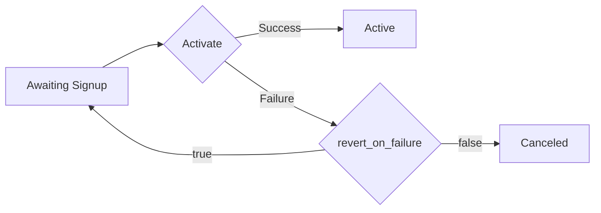

# Subscriptions.ActivateSubscription

_Controller: Subscriptions — from the Maxio SDK API reference._

<details>
<summary><code>Task&lt;SubscriptionResponse&gt; ActivateSubscription(int subscriptionId, ActivateSubscriptionRequest? body, CancellationToken ct = default);</code></summary>

<dl>
<dd>

### Description

<dl>
<dd>

Activates awaiting signup and trialing subscriptions. This feature is only available on the Relationship Invoicing architecture. Subscriptions in a group may not be activated immediately.

For details on how the activation works, and how to activate subscriptions through the application, see [activation](#).

The `revert_on_failure` parameter controls the behavior upon activation failure.
- If set to `true` and something goes wrong i.e. payment fails, then Advanced Billing will not change the subscription's state. The subscription’s billing period will also remain the same.
- If set to `false` and something goes wrong i.e. payment fails, then Advanced Billing will continue through with the activation and enter an end of life state. For trialing subscriptions, that will either be trial ended (if the trial is no obligation), past due (if the trial has an obligation), or canceled (if the site has no dunning strategy, or has a strategy that says to cancel immediately). For awaiting signup subscriptions, that will always be canceled.

The default activation failure behavior can be configured per activation attempt, or you may set a default value under Config > Settings > Subscription Activation Settings.

## Activation Scenarios

### Activate Awaiting Signup subscription

- Given you have a product without trial
- Given you have a site without dunning strategy



- Given you have a product with trial
- Given you have a site with dunning strategy


### Activate Trialing subscription

You can read more about the behavior of trialing subscriptions [here](https://maxio.zendesk.com/hc/en-us/articles/24252155721869-Trialing-Subscriptions).
When the `revert_on_failure` parameter is set to `true`, the subscription's state will remain as Trialing, we will void the invoice from activation and return any prepayments and credits applied to the invoice back to the subscription.


</dd>
</dl>

### Usage

<dl>
<dd>

```csharp
try
{
    var response = await client.Subscriptions.ActivateSubscription(subscriptionId, body);
    // TODO: Handle 'response' of type SubscriptionResponse
}
catch (SdkException<ActivateSubscriptionError> ex)
{
    if (ex.Error.TryGetError(out var error))
    {
        // TODO: Handle 'error' of type ActivateSubscriptionError
    }
}
```

</dd>
</dl>

### Parameters

<dl>
<dd>

| Name | Type | Description |
| --- | --- | --- |
| <code>subscriptionId</code> | <code>int</code> | The Chargify id of the subscription. |
| <code>body</code> | <code>[ActivateSubscriptionRequest?](Models/ActivateSubscriptionRequest.cs)</code> | - |

</dd>
</dl>

### Response

<dl>
<dd>

**OnSuccess**: <code>[SubscriptionResponse](Models/SubscriptionResponse.cs)</code>

**OnError**: <code>[SdkException](Core/Exceptions/SdkException.cs)&lt;[ActivateSubscriptionError](Errors/ActivateSubscriptionError.cs)&gt;</code>

</dd>
</dl>

</dd>
</dl>

</details>
